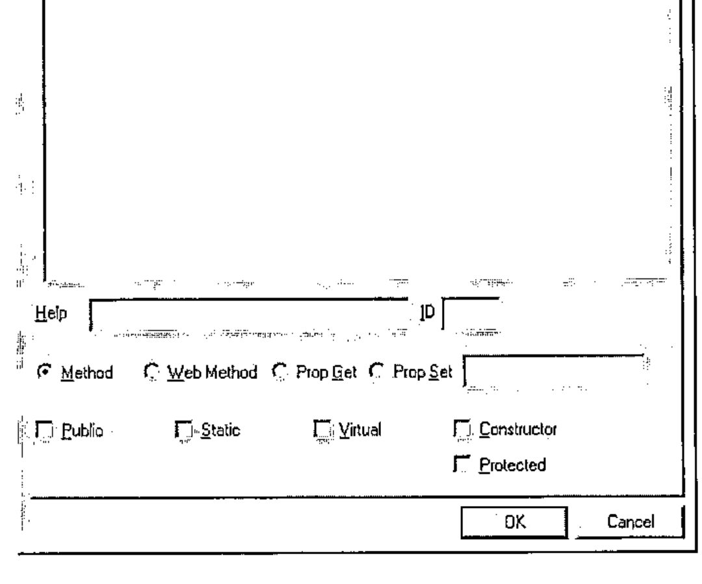

*a talk to Forests in Finland VII by Adrian Smith*
{ .byline }

## Author’s Note

The proposed talk was a fairly code-intensive walk-through of the potential for using Dyalog’s *APLScript* as a primary source for your .net applications, regardless of the current flavour of APL you were using. An initial show of hands showed that almost no-one in the audience really knew anything at all about .net (and APL’s relationship with it) so the talk rapidly grew a 20-minute introduction to the whole .net architecture, and the way Dyalog APL fits into it. This is (very approximately) reproduced as the first part of this report, and is followed by the stuff I was expecting to talk about.

## Background to the .NET Architecture

I suppose the first thing to say is that Microsoft got the name badly wrong – this has very little to do with the ‘net’ and everything to do with the Windows API. In fact they have sensibly renamed the next version of Windows NT as ‘Windows 2003 Server’, probably as the first stage of a rethink on the name.

I think it will quite quickly become the programmer’s tool of choice, not because of Microsoft’s marketing, but simply because it is a much better way to develop and deploy applications. Java established the principle of a *Virtual Machine* (the JVM) which permits the same compiled code to run on multiple platforms. Well actually, APL did it in 1979 with APL for the IBM System-7, and Paul Chapman did it again with DEGO for I-APL, but that’s another story. The snag is that the Java machine was specifically designed to run compiled *Java*, just as the APL IL runs interpreted *APL*. What Microsoft have done is define a virtual machine called the *Common Language Runtime* (CLR from now on) which is designed to be dead easy to write a compiler (or interpreter) for. In fact it is shipped with a demonstration Lisp interpreter, just to show you how to build one.

They then named 7 target languages, carefully chosen to span the known space of current language thinking. This was called *Project-7*, and (as I hope we all know) Dyalog APL was chosen as the APL guest at the party. The work Dyalog have done (which is the reason John Daintree got the BAA Outstanding Achievement Award last year) puts APL on exactly the same footing as all the other .net languages.

This is quite a new situation for us – just contrast it with the current position in some of the APL engines we have today:

- in APL2 I can call out with `⎕NA` (with a lot of technical expertise) and I can be run in batch mode via JCL. As of last week, I can call COBOL subroutines.
- in APL+Win I can call out with `⎕WCALL` (assuming they set the ADF file up correctly) and I can run the interpreter as a COM server. However there is no way a C++ programmer can be shown the details of the functions he/she has access to, or offered any ‘properties’.
- in Dyalog APL/W I can call out with `⎕NA` (with a lot of technical expertise) and (with a considerable amount of work) I can expose my application as a proper COM object with genuine Methods and properties.

With .net, all this ugly technical stuff goes straight out of the window. If I want to use a C# subroutine from Dyalog APL, I just (well duh) use it. If I want to use an APL function from C#, I just use it. Deployment is as simple as copying the files I need into my installation folder – gone is all that stuff with type libraries and OCX registration and all the things that could so easily fall apart when the user re-installed Windows and trashed the Registry.

Why is it all so easy? Basically because everything is compiled down to CLR, so to the .net engine, it all looks the same. If you open up a DLL that you made from APLScript in IL DASM (the Microsoft Disassembler, free with the .net framework) it is indistinguishable from a DLL that you compiled from C# using the (also free) command-line compiler. We are all playing with the same ball on the same playing field, for the first time that I can remember.

## OK, so how do I Kick the Ball?

What I want to do here is just to give a flavour of what is possible, so we will make a simple APLScript, compile it and call it from an equally simple C# application. As a slightly tougher exercise, I will show you how to wrap a typical ‘legacy’ application (the ASL Regression Library ASLGREG) as a .net component that can easily be called as a subroutine. The only tools you will need are your current flavour of APL, Notepad and the .net framework.

Why use *APLScript* rather than the Gui approach that Dyalog showed in their Madrid workshops? I will try to pick up the advantages as I go along, but basically it is because I have a hate-hate relationship with dialogue boxes like this:



… lifted from John Daintree’s article in Vector 19.1. This is fine for demos, but in *RainPro* I have about 60 Methods and 170 properties to work through. I would die of RSI before I got halfway down the list, and I would be sure to make some mistakes along the way. How would you set about globally changing "Int32" to "Float" across 60 functions when each one required about four mouse-clicks to open up the right dropdown? This was definitely not for me, so I cut the workshops and chatted to Dave Liebtag and Eke about control structures instead. Much more fun.

Then I read John’s next article in Vector 19.2, and the light dawned. With APLScript, a typical function looks like this:

```apl
 ∇ tv←Rotate tv
⍝ This should be pretty simple!
:Access Public
:ParameterList String
:Returns String
 tv←⌽tv
 ∇
```

What do you immediately notice about this function? Yes, that’s right – everything it needs to know about being a .net function is defined in *one place*, as easily accessible text. That means I can search for it in an editor, globally replace my systematic errors, and write some tools to help me out. Remember "there’s *always* time to sharpen your axe", and if you start with it sharp, so much the better.

The next reason I have for liking this is that I hate changing interpreters. My two main environments are Dyalog 8.2 and APL+Win 3.5, which do everything I need. I have the session how I want it, I like the way the editor behaves, I have Alt+EF hardwired into my brain for ‘Edit, ReFormat’, and so on. Clearly, I am unlikely to write much APL in Notepad, but I already have lots of APL in my favourite interpreters. Maybe I could just take the existing code, add a few simple comments, and create the script automatically? For example:

```apl
     ∇ tv←Rotate tv
[1]   ⍝ This should be pretty simple!
[2]   ⍝:Public
[3]   ⍝:Params  String
[4]   ⍝:Returns String
[5]    tv←⌽tv
     ∇
```

Spot the difference! Well, firstly the lines in the script that define the .net interface must be generated from comments in the original source function. It would be very sensible for Dyalog to permit `:ParameterList` as a valid control structure in normal code, but for the moment we must hide it from the interpreter. But hang on a moment – how many sharp-eyed APLers are there who noticed that it just says `⍝:Params` here? For that matter it just says `⍝:Public` instead of `⍝:Access Public` on line[2]. Yes, you guessed it – Adrian is a lazy typist and would rather write the bare minimum in the function comments. It all gets expanded nicely whan the script is written out.

Here is the fragment of C# which tests it:

```csharp
Sample sam = new Sample();
Console.WriteLine("*** String *** " + sam.Rotate("Hello,
world!"));

int[] myints = new int[] {1,2,3};
myints = sam.Rotate(myints);
```

Which brings us very nicely to the next big bonus point for scripts …

### Overloading

Suppose I wanted to be able to rotate numeric vectors in addition to strings? The way you do this in C# (and hence in the CLR) is to define a sibling function which offers the alternative argument type and is associated with the base function using the *Implements* keyword. APLScript follows along the same lines:

```apl
 ∇ tv←Rotate_ovl1 tv
:Access Public
:Returns Int32[]
:ParameterList Int32[]
:Implements Method Rotate
  tv←Rotate tv
 ∇
```

OK, a bad example, as this kind of structural function would probably just take and return *array*, which is the most general type there is. My problem is that functions like `ch.Bar` should be specific about their argument types, and they get rapidly out of hand – in the extreme case a barchart could take an integer scalar; typically it takes an array of either integers or floats, but it can happily accept matrices or vectors of numeric vectors (any flavour). You can clock up a dozen sibling functions here with no real effort, and you do not want these cluttering your workspace, let alone having to be defined with the afore-mentioned dialogue-box one by one! I hope you can see where this is leading:

```apl
     ∇ tv←Rotate tv
[1]   ⍝ This should be pretty simple!
[2]   ⍝ Note the paired argument and result types
[3]   ⍝:Public
[4]   ⍝:Params  String
[5]   ⍝:Returns String
[6]   ⍝:Params  Int[]
[7]   ⍝:Returns Int[]
[8]    tv←⌽tv
     ∇
```

Let’s just add another pair of comment lines, and have APL generate the siblings when it writes out the script. All the rats stay firmly in one trap, and it is easy to add more definitions as we need them. I am beginning to like this!

As you can see in the following expansion, if there are multiple sets of parameters and results, they will be paired up. Multiple parameters may also be used with a single result, but the C# compiler chooses the correct overload by matching up the parameter lists, so you cannot have a single parameter set, and multiple result types. At the moment, I can’t think of an example where I would ever want to do this, so I don’t think it is a major oversight.

```apl
 ∇ tv←Rotate tv
⍝ This should be pretty simple!
⍝ Note the paired argument and result types
:Access Public
:ParameterList String
:Returns String
 :Trap 0
    tv←⌽tv
 :Else
   (Exception.New ∊⎕AV[2+⎕IO],¨2↑⎕DM) ⎕SIGNAL 90
 :EndTrap
 ∇

 ∇ tv←Rotate_ovl1 tv
:Access Public
:ParameterList Int32[]
:Returns Int32[]
:Implements Method Rotate
  tv←Rotate tv
 ∇
```

You may also notice that I have wrapped a standard `:Trap` block around the body of the main function. At the moment, this is rather redundant, as it simply reproduces the normal Dyalog APL behaviour, however I felt that I might want more control here in future, so let’s put the code in now in case we need it later.

## Setting and Getting Properties

Again, it is all very simple. To be able to write C# code like this …

```csharp
grapl.Heading = "Share Price with Moving Averages";
grapl.Subhead = "Buy when Red crosses Cyan!";
```

… I need to define some properties in my script, in this case called *Heading* and *Subhead*, both of type String. In C# (and hence in APLScript) you implicitly define a property by including *Get* and *Set* functions for it. Readonly properties only have the *Get* half of the pair. Easy stuff, but RainPro has (as of today) 171 properties, nearly all read-write. Ug – that means over 300 one-line functions if I do it using the workspace approach. In this case, they all look remarkably similar:

```apl
:Property String:CaptionFont
 ∇ r←get
  r←##.ch.Query'CF'
 ∇
 ∇ set value
  r←##.ch.Fix 'CF' value
 ∇
:EndProperty
```

RainPro puts everything through the same pipe so it can keep tabs on what you are doing to it – so I can automatically generate the whole script block from `ch.∆chdefaults` without ever seeing any of these ‘getters’ and ‘setters’ in my workspace. In the more general case, you would probably make a simple character array to define the property names, types, and the get/set functions to be called. When I need this (for example for NewLeaf which does it this way) I will add in the code to parse it and output the appropriate calls in the script.

## Wrapping a Legacy Workspace

I thought a good example would be the Regression Shelf from the BAA Statistics Library project. This is quite old code, written mostly in APL\*PLUS/PC, so we really don’t want to tamper with it if at all possible. The idea would be to create some simple wrapper functions and then bury the entire legacy edifice in a namespace where the C# programmer need never see it. Here is what I needed to build to make this idea possible:

```apl
      ↑∆asl
;APLScript definition for ASLGreg.NET

:Namespace asl

⍝ ======== Classes ========
:Class greg
 ⎕IO←1 ⋄ ⎕ML←1
 InitASL
 !regfns.∆public
:EndClass

⍝ ======= Internal NS =======
 *regfns

:EndNamespace
```

This is an easy-to-edit text variable which is like the C-programmer’s ‘make’ file. It has a bit of basic control information, some comments and a few APL lines to be run by the Dyalog compiler at compile time. However ("heads up" as they say in cricket when an unexpected ball is coming your way) there is a small divergence between Dyalog’s use of the term *Namespace*, and the CLR meaning of the same term. The compiler hides the issue quite well, but it really can confuse you if you don’t follow the rules.

- in .net parlance, a Namespace is very like a DOS path setting. It is a convenient way of omitting the fully qualified part of a name from a function call.
- in Dyalog APL, a Namespace is much more like a C# Class, being an encapsulated collection of functions and data.

What the APLScript compiler does is to take the outer :Namespace blocks in the script and make them into CLR-style namespaces mirrored by APL namespaces – that is what `:Namespace ASL` does for you in the example. Any deeper-level `:Class xxx` blocks also become standard APL namespaces, but you cannot put a CLR namespace *inside* a class which is where the analogy breaks down. Now you can refer back 2 pages and see why I needed `##.ch.blaaah` in my Get/Set functions for RainPro. These are in a class called GraPL, so Dyalog has implicitly created an APL-style `GraPL` namespace for them. To see the stuff in the ‘real’ namespace `ch` I need to back up one level and look down again. Note that this uses `##.xx` rather than `#.xx` as I have absolutely no idea where I am in the namespace tree that they have built for me, but I am quite sure I am not a child of root. *Be careful* – you have been warned!

So here we are in our ASL namespace and we want to make a collection of functions which the C# programmer will see as a Class with Methods. These lines do the trick:

```apl
:Class greg
  ⎕IO←1 ⋄ ⎕ML←1
  InitASL
  !regfns.∆public
:EndClass
```

Anything in the ‘make’ variable that starts with a colon or comment, or contains an assignment, just passes straight through into the script. Anything that names a function gets the function thrown into the script, but carefully tidied up as described above. So in this case, I have an initialisation function which I want run at startup (when an instance of the class is created by the C# program) which looks like:

```apl
     ∇ InitASL
[1]   ⍝:Access Constructor
[2]    ##.regfns.START
     ∇
```

Because I buried all the real code in the APL namespace `regfns`, I need to walk back one level here. It is quite convenient that Dyalog tolerates this syntax in the ordinary development environment – here `InitASL` is actually in the root namespace but I can still run it quite successfully to test the code before I build it into a script as ## has nowhere to go but itself!

The next line in the make variable begins with `!` which has no logical meaning whatsoever, except that I am working slowly along the top row of the keyboard as I add in more possibilities here. What `!` does is to take a variable which defines the public functions, and builds the script entries for me. In this case it looks like:

```text
Public name:Function:Description:Parameters;Overloads:Returns
Diagnostics:Diagnostics:Useful tables:String cols:vtv
Display:Display:Results of analysis:String cols:vtv
Fit:Fit:Model to be fitted:String modeldefn:vtv
Set:Set:Set named data to value:String name, int[] value;
                                String name, num[] value:txt
Yvar:Yvar:Set Dependent variable:String YVarname:txt
Version:VERSION:What it says::vtv
```

Taking the last line as the simplest example, this will create a script entry:

```apl
 ∇ res←Version
⍝ What it says
:Access Public
:Returns String[]
 :Trap 0
   res←##.regfns.VERSION
 :Else
   (Exception.New ∊⎕AV[2+⎕IO],¨2↑⎕DM) ⎕SIGNAL 90
:EndTrap
 ∇
```

Where overloads are required, I can list multiple parameter sets separated by ‘;’ to have the matching set of generated functions written into the script. The return-type of ‘vtv’ is Causeway-speak for ‘vector of text vectors’ and translates to ‘array of strings’ in the generated script; return-type ‘txt’ is just a short form of ‘String’.

```apl
 ∇ res←Set arg
⍝ Set named data to value
:Access Public
:ParameterList String name,Int32[] value
:Returns String
 :Trap 0
   res←##.regfns.Set arg
 :Else
   (Exception.New ∊⎕AV[2+⎕IO],¨2↑⎕DM) ⎕SIGNAL 90
 :EndTrap
 ∇

 ∇ res←Set_ovl1 arg
:Access Public
:ParameterList String name,Double[] value
:Returns String
:Implements Method Set
  res←Set arg
 ∇
```

It is really a matter of taste whether you put this variable in root and have the second column qualify the names, or whether you put it in the namespace where the legacy code lives. Either way, you can conveniently use column-2 in the editor to drill-down to the real, underlying code from the public names.

Finally, we must include the legacy code itself!

```apl
⍝ ======= Internal NS =======
 *regfns
```

As you probably guessed, I used `*` as a marker to say ‘here comes an APL namespace’ so this just loops through and emits everything needed to rebuild the namespace (including any subnamespaces unto the nth generation). It is NOT within the :Class block so the C# programmer never sees any of it.

### A small enhancement request!

One annoying snag with this is that you can only put variables into the script by carefully creating the expression that (when executed) regenerates the variable. For a deeply nested array, this takes significant time, and for nested arrays with empty bits it is hard to reproduce exactly the array you started from. It would be really nice if (say) `qq←1 ⎕OR'Abstract'` returned the internal representation as a simple byte vector and `2 ⎕OR qq` reversed the situation. Then we could create a script from a namespace much more economically. It could be quite handy for interprocess communication via SOAP, which might encourage them to attempt something similar! I think Morten Kromberg has an interpreter-neutral format?

## Anyway, better test it!

We run the ‘make’ variable to write out the file in APLScript format:

```apl
'd:\tools\aplc\asl' UPut 'DLL' Make ∆asl
34738 bytes written to d:\tools\aplc\asl.apl
```

… and we compile it to a DLL with the Dyalog compiler:

```text
D:\Tools\aplc>aplc asl.apl /t:library /runtime /v
Dyalog APLScript compiler. Version 10.0
Copyright Dyadic Systems Ltd 2002
Got Startup Parameters
Reading asl.apl
Processing asl.apl
Processed asl.apl
Emitted File asl.dll
```

… and we hack together some C# code to test it:

```csharp
using System;
namespace asl

{
 class asltest
 {
  static void Main(string[] args) {
  greg test = new greg();
 // greg.VERSION Returns String[]
  foreach (String ss in test.Version()) Console.WriteLine(ss);
 // greg.Set covers data import returning String "xxx defined"
 // Accepts int[] and double[] here
  int[] age = {1, 2, 3, 5, 7, 8, 9};
  double[] wt = {1.4, 2.2, 3, 5.7, 7.1, 8.9, 10.2};
  Console.WriteLine(test.Set("Age",age));
  Console.WriteLine(test.Set("Wt",wt));
 // greg.Yvar names the variable to model
   Console.WriteLine(test.Yvar("Wt"));
 // greg.Fit fits a model and returns some info about it
     foreach (String ss in test.Fit("GM+Age")) Console.WriteLine(ss);
 // greg.Display tells us more about what went on
     foreach (String ss in test.Display("EST")) Console.WriteLine(ss);
 // greg.Diagnostics lists the data and fitted values
     foreach (String ss in test.Diagnostics("FRCL")) Console.WriteLine(ss);
  }
 }
}
```

We compile it (the C# compiler is free, just like all the other tools you need here):

```text
D:\Tools\aplc>csc /r:asl.dll tryasl.cs
Microsoft (R) Visual C# .NET Compiler version 7.00.9466
for Microsoft (R) .NET Framework version 1.0.3705
Copyright (C) Microsoft Corporation 2001. All rights reserved.
```

… and we can run it.

```text
D:\Tools\aplc>tryasl
Regression Volume 1 Version 1.1
A.M.Sykes, December 1991
Copyright(C) British APL Association 1991
Age defined
Wt defined

Y variable is Wt
Units set to 7


Source              ss          df      ms
------              --          --      --
Due to model        69.52       1       69.52
Residual             0.6784     5        0.1357
------------------------------------------------
Total Corrected     70.2        6       11.7

Percentage Variation Accounted for =  99.03
F-statistic =                        512.36
p-value =                              0.00
```

## Summary

"In the land of the blind, the one-eyed man is king". I can’t claim to be an expert on this stuff, but I think I have fallen into most of the Heffalump traps and have understood just enough to make it work. We have GraPL.net customers yelling for it, so I have every reason to make it work as soon as I possibly can.

Will it take over the world? Well it sure beats programming with COM, registering OCXs and all that garbage. I think it will hit the server world quite quickly, which is why I want to be out there with it. As for the desktop – Microsoft missed the boat by not including the runtime support with XP, so give it 5 years and have another look around to see if enough people have upgraded their copy of Office to make it safe to ship. That gives us lots of learning time – don’t waste it, because if this does go mainstream it is a real opportunity for APL to rejoin the party as ‘just another language’. Anyway, Dyalog deserve our support, don’t you think?
