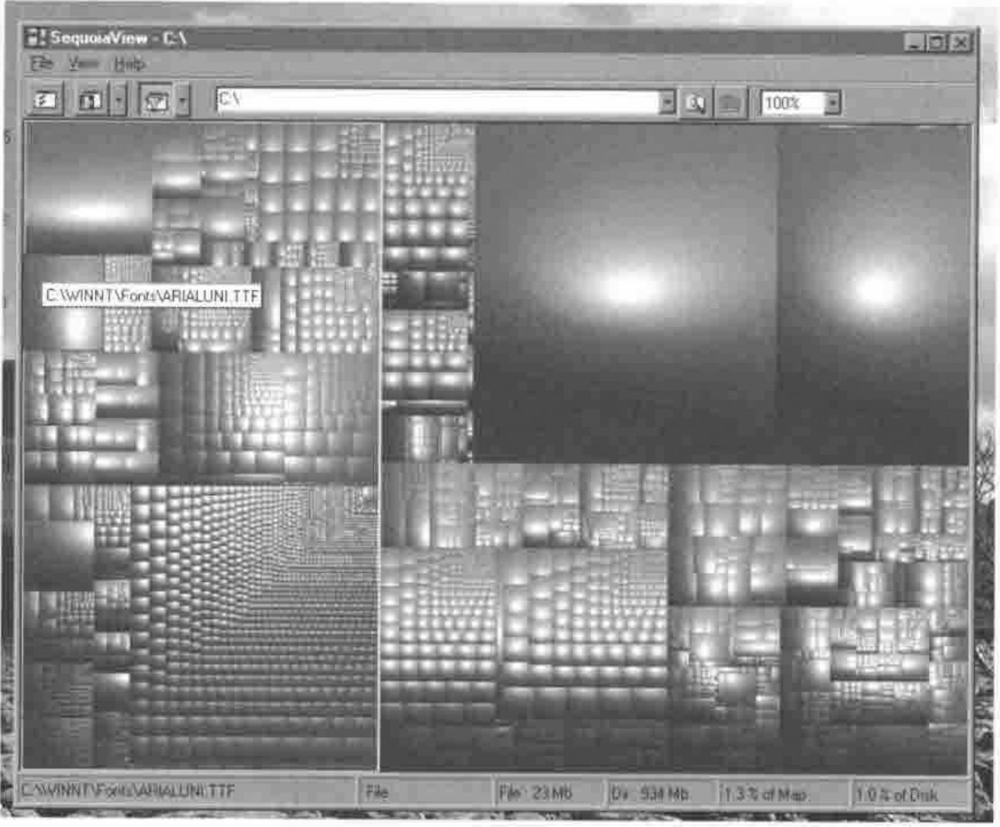

*by Adrian Smith*
{ .byline }

Treemaps are a wonderful way of showing lots of numbers in a small space – if you want to know more, just search Google for Treemap. Here is a map of my C: drive produced by a marvellous (free) program called *SequoiaView* (get it from *www.win.tue.nl/sequoiaview/*) which will do wonders for your free disk space:

The two socking great files in the top right are the pagefile and hibernation file. The one with the tip showing is the Arial Unicode font. At each level, files are sorted by size, and drawn ‘as square as possible’ proportional to the file size.

So the challenge is deceptively simple: given a vector of (downsorted) positive numbers and a bounding rectangle, return a matrix of rectangles which exactly occupy the bounding rectangle, and are proportional in area to the given vector. May the squarest man win! My solution will be in the next Vector.
