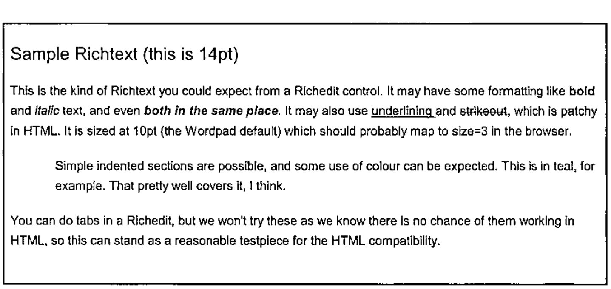

*by Adrian Smith*
{ .byline }

## The Challenge

Somewhere in your application, you might want to allow your user to type in some little notes, with basic bolding and italic. Easy stuff these days – just add a RichEdit control and save the *rtftext* property in a text variable.

The RichEdit even has a Print method, so the user can print it out. Great.

Now you want to create a nice web-report, with some headings, the user’s notes, and a table of relevant data – *all in one simple stream of HTML*. Does this RichEdit have anything useful like an HTML property? Of course not. So the challenge is quite simple – take the typical output from a RichEdit control (a simple text vector with rtf markup) and convert it to an equally simple text vector of HTML.

Well, RTF is a documented format. Let’s have a look at some, and see how we go.

## Some Simple RTF Explained

The next block of text was inserted from a file called simple.rtf, so you can see roughly how it might have looked to the user in the RichEdit:



This was actually typed into Wordpad, but the RTF output is very similar (but not quite the same, as you will see).

Here is what it looks like if we paste it in ‘native’ as plain text:

```text
{\rtf1\ansi\ansicpg1252\deff0\deflang1033{\fonttbl{\f0\fswiss\fcharset0
Arial;}{\f1\fswiss\fprq2\fcharset0 Arial;}}

{\colortbl ;\red0\green0\blue0;\red0\green128\blue128;}

\viewkind4\uc1\pard\f0\fs28 Sample Richtext (this is 14pt)\fs20\par
\par

This is the kind of Richtext you could expect from a Richedit control. It
may have some formatting like \b bold \b0 and \i italic \i0 text, and even
\b\i both in the same place\b0\i0 . It may also use \ul underlining \ulnone
and \cf1\strike\f1 strikeout\cf0\strike0\f0 , which is patchy in HTML. It is
sized at 10pt (the Wordpad default) which should probably map to size=3 in
the browser.\par
\par

\pard\li720\tx720\tx7920 Simple indented sections are possible, and some use
of colour can be expected. \cf2\f1 This is in teal, for example\cf0\f0 .
That pretty well covers it, I think.\par
\pard\par

You can do tabs in a Richedit, but we won't try these as we know there is no
chance of them working in HTML, so this can stand as a reasonable testpiece
for the HTML compatibility.\par
}
```

I added a couple of extra newlines for clarity, but this is pretty well what you will see if you save a document from WordPad and reopen it in Notepad.

So what can we deduce by simple inspection?

- there is some stuff at the top which tells us what fonts and colours to expect
- there is plenty of recognisable text, and markup is done with backslash characters (rather in the style of T<sub>E</sub>X, for those of you with long memories)
- those numbers look like twips, but what are the font sizes doing? They all seem to have doubled somehow??
- there are some odd inconsistencies. Clearly `\b` and `\b0` surround bold, but what is that `\ulnone` about?

Time to open the manual. Actually, the best manual is now well out of print, as what you want is a very old RTF specification, ideally one that was made about the time of WinWord2 or even DOSWord4. The problem with the recent documentation is that Word2000 puts so much fancy stuff into its RTF that it has become very hard to unpick. However dear old WordPad (and by association, the RichEdit) is using a nice, ancient RTF standard, and is reasonably easy to crack.

The other thing you realise is that there is no way to parse this other than walking along it one tag at a time, maintaining state information as you go. This was designed in the days of restricted memory, and is meant to be parsed end to end by a simple character-eating machine. The exact opposite of XML which is designed to be mapped into a tree structure in memory. So don’t expect things to be nicely paired up – they won’t be.

## Basic Grammar

There is a rudimentary block structure defined by pairs of braces. The outer level encloses the entire document, and inner levels enclose various lists. Also you can set and cancel elements by enclosing the setting in braces, for example `{\b this is bold}` is an alternative way to set a short phrase in bold. RichEdit doesn’t do it like this, but WordPad does, so we should probably handle it.

Anything following `\` is a control word of some sort, and does not appear in the output. The word is ended by the next space, `\` or `{` character. The control words often consist of an alpha part concatenated to a number. The numbers are always integers, but may be negative. There may be several ways to reverse a setting, for example you could cancel bold with `\b0` or `\plain` or by wrapping it in a pair of braces, as above.

Measurements are integer twips (1 twip = 1/1440 of an inch) and font sizes are integer half-points. Ever wonder why Word limits you to half-point font-sizes? Now you know.

Colours are expressed as 0-origin indices into a global table set up at the start of the document. Fonts are effectively indices, but `\f0` is reserved as ‘reset to default’ so your fonts number upwards from 1.

RTF is entirely written in 7-bit ASCII. Any characters above 128 appear as `\'xx` (where xx is the hex value) and Word has a habit of naming specials like `\endash` rather than using the hex code. Fortunately the Richedit just uses the `\'xxx` syntax so we don’t need to research the names for all these.

## Let’s Walk Through It

At this point, it is probably best just to present my parsing code with some brief commentary interspersed. This has been adapted from the MakeHTM workspace that comes with NewLeaf, but can be run stand-alone in this form. Hopefully the actual RTF-parsing part is kept separate enough that you could easily re-use it to generate any format you need.

### Setting up the state information

```apl
    ∇ htm←RTFParse rtf; ...
[1]   ⍝ Run vector of 'WordPad' richtext as HTML.
[2]   ⍝  <rtf> is an nl-delimited simple vector and <htm> is the same.
[3]
[4]    (nl lf)←⎕TCNL ⎕TCLF ⋄ htm←'' ⋄ →(0∊⍴rtf)↑0   ⍝ Quit if empty
[5]
[6]   ⍝ Initialise html state variables to default values
[7]    htm_tag←,⊂,'p' ⋄ htm_indents←3⍴0 ⋄ htm_bullet←0
        htm_last←0 ⋄ htm_level←''
```

Line-7 is the last mention of html for a while – the next part is very generic.

```apl
[9]   ⍝ Grab font and colour tables and then discard the rest of the header
[10]   ftbl←('{\fonttbl'⍷rtf)⍳1 ⋄ ftbl←(ftbl+8)↓rtf ⋄ ftbl←(('}}'⍷ftbl)⍳1)↑ftbl
[11]   ftbl←(1=+\(ftbl='{')-(ftbl='}'))/ftbl  ⍝ dump Panose etc (Word RTF)
[12]   ftbl←¯1↓(+\1,';'=ftbl)⊂';',ftbl
[13]   ftbl←(ftbl⍳¨' ')↓¨ftbl            ⍝ 1st blank delimits name
[14]
[15]  ⍝ Colours - just split at the semi-colons and convert to #FF style.
[16]   ctbl←('{\colortbl'⍷rtf)⍳1 ⋄ ctbl←(ctbl+9)↓rtf ⋄ ctbl←(¯2+ctbl⍳'}')↑ctbl
[17]   mm←ctbl∊'0123456789;' ⋄ ctbl←mm\mm/ctbl
[18]   ctbl←1↓¨(+\1,';'=ctbl)⊂';',ctbl
[19]   ((2>∊⍴¨ctbl)/ctbl)←⊂'0 0 0'  ⍝ WordPad sets a default first entry as null
[20]   ctbl←⊃⍎¨ctbl                ⍝ n by 3 matrix of RGB values
[21]   ctbl←(¯2↑1 1,⍴ctbl)⍴ctbl    ⍝ may be only one colour
[22]   ctbl←⊂[2]'#',((1↑⍴ctbl),6)⍴⍉'0123456789ABCDEF'[1+16 16⊤,ctbl] ⍝ HTML style
```

The assumption is that there could be all sorts of rubbish in here (have a look at a Word2000-generated RTF some day) so we will just look specifically for these tables, which will be in there somewhere. Here is what the tables look like:

```apl
      ctbl
#000000 #000000 #008080
      ftbl
Arial Arial
```

This has processed the colours into HTML format, but you could easily hold them as numbers here if that is what you needed later on.

```apl
[24]  ⍝ Top and tail the RTF content, ignoring stuff we can't handle
[25]  ⍝ Lose the tail, including the closing '}'
[26]   rtf←(-(⌽rtf)⍳'}')↓rtf
[27]  ⍝ Now clip the rest of the garbage down to the first paragraph
[28]   rtf←(4+('\pard'⍷rtf)⍳1)↓rtf ⋄ rtf←rtf~lf  ⍝ Safe to lose all these
[29]   state←'' ⋄ thispara←'' ⋄ biu←0 0 0
[30]   fcolour←1⊃ctbl ⋄ fsize←3 ⋄ font←1⊃ftbl
[31]   basefnt←(font fsize fcolour)
[32]  ⍝ Return APL symbols and other hibit things to their proper condition
[33]   hi←('\'''⍷rtf)/⍳⍴rtf
[34]   :If 0<⍴hi
[35]     nn←rtf[hi∘.+2 3] ⍝ hex digits (lower case)
[36]     rtf[hi]←'⍫'       ⍝ lose the \ (later, when we know we can)
[37]     rtf[hi+1]←htm∆hibit[¯127+16 16⊥¯1+⍉'0123456789abcdef'⍳tolower nn]
[38]     rtf←rtf[(⍳⍴rtf)~,hi∘.+2 3]
[39]   :End
[40]  ⍝ Maybe rescue \endash and so on here as string replacements
[41]  ⍝ Hide escaped \ for now - they get rescued later
[42]   rtf←rtf ∆ssr '\\' '⍙'
[43]   rtf←rtf ∆ssr '\{' '⍠' ⋄ rtf←rtf ∆ssr '\}' '⍞'
[44]
```

We now have all the state variables at their default values, and the only `\` characters left are ‘real’ ones which actually mark tags. The choice of APL symbols to act as placeholders is a little arbitrary, but you will notice that all these are ‘blots’ in the Arial font, so are most unlikely to show up in a real document.

### Processing the content

Now to eat the text, one tag at a time.

```apl
[45]  ⍝ Now we walk down the string - either process tag or place text
[46]   :While 0<⍴rtf
[47]     :If '\'=1↑rtf  ⍝ Handle next tag and drop it
[48]       rtf←1↓rtf ⋄ cut←¯1+⌊/rtf⍳' \{}⍫',nl
[49]       tag←cut↑rtf ⋄ rtf←cut↓rtf ⋄ rtf←((1↑rtf)∊' ',nl)↓rtf
[50]       cut←¯1+⌊/tag⍳'1234567890-' ⋄ arg←cut↓tag ⋄ tag←cut↑tag
[51]      ⍝ RTF only has integers (half-point fonts and twips)
[52]       :If 0<⍴arg
[53]       :AndIf ∧/arg∊'1234567890-'
[54]         arg←⍎arg
[55]       :End
[56]
```

This has split out the tag into the text token, and the argument as a number. Now we just take them as they come, starting with the paragraph formatters:

```apl
[57]       :Select tolower tag ⍝ should all qualify!
[58]       :Case ,'*'      ⍝ Forget it
[59]       :Case 'pard'    ⍝ Reset to all defaults
[60]         htm_tag←,⊂,'p' ⋄ htm_indents[]←0 ⋄ htm_bullet←0
[61]       :Case 'par'     ⍝ New para - flush all output
[62]         :if 0<⍴thispara
[63]           thispara←Flush thispara
[64]           htm←htm,thispara,nl ⋄ thispara←''
[65]         :end
[66]       :Case 'qc'      ⍝ Centered paragraph
[67]         (1⊃htm_tag)←(1⊃htm_tag),' align=center'
[68]       :Case 'qr'      ⍝ Right paragraph
[69]         (1⊃htm_tag)←(1⊃htm_tag),' align=center'
[70]       :Case 'li'      ⍝ Left indent in twips
[71]         htm_indents[1]←⌊arg÷20
[72]       :Case 'ri'      ⍝ Right indent (not used in basic HTML)
[73]         htm_indents[2]←⌊arg÷20
[74]       :Case 'fi'      ⍝ Firstline indent (also ignored)
[75]         htm_indents[3]←⌊arg÷20
```

I keep the indent information, although it is not currently interesting for basic HTML. With inline CSS styles, it could be used to get more detailed control if you thought it worth the effort. Indents are saved in points, but actually all we care about is stepping in and stepping out. We will come back to `Flush` shortly.

Now for the character formatters:

```apl
[76]       :Case ,'b'      ⍝ Bold on/off is b or b0
[77]         :If 0=1↑arg
[78]           thispara←thispara,'</b>' ⋄ biu[1]←0
[79]         :Else
[80]           biu[1]←1 ⋄ thispara←thispara,'<b>'
[81]         :End
[82]       :Case ,'i'      ⍝ Italic on/off
[83]         :If 0=1↑arg
[84]           thispara←thispara,'</i>' ⋄ biu[2]←0
[85]         :Else
[86]           biu[2]←1 ⋄ thispara←thispara,'<i>'
[87]         :End
[88]       :Case 'ul'      ⍝ underline on
[89]         biu[3]←1 ⋄ thispara←thispara,'<u>'
[90]       :Case 'ulnone' ⍝ underline off
[91]         biu[3]←0 ⋄ thispara←thispara,'</u>'
[92]       :Case 'strike' ⍝ strikethrough is ignored
[93]       :Case 'plain'  ⍝ cancel anything we set before
[94]         thispara←thispara,∊(⊂'</'),¨(biu/'biu'),¨'>' ⋄ biu[]←0
[95]       :Case 'tx'      ⍝ Tab settings are futile, so ignore
[96]       :Case 'tab'     ⍝ Skip to next tab stop (dummy also)
[97]         thispara←thispara,' ... '
[98]       :Case 'cf'      ⍝ Set the colour (as #FF style)
[99]         fcolour←(arg+1)⊃ctbl
[100]      :Case ,'f'      ⍝ Set the font with emphasis and size
[101]        font←(arg+1)⊃ftbl
[102]      :Case 'fs'      ⍝ Set the font size (relative 1-7)
[103]        arg←0.5×arg ⋄ fsize←1⌈7⌊arg+.≥6 8 10 14 24 32 44
```

The only tricky one is /plain which turns off any of bold, italic and underlined. The mapping from font sizes to internet sizes is very subjective – adjust the numbers to taste.

Finally a couple of oddballs – bulleted paragraphs in WordPad are marked with a specific tag which we process as a special case:

```apl
[104]      :Case 'pntxtb' ⍝ Use simple unordered list
[105]        rtf←(rtf⍳'}')↓rtf ⋄ htm_bullet←1
[106]      :Case 'pntext' ⍝ Ignore symbol bullets - use built-in capability
[107]        rtf←(rtf⍳'}')↓rtf
[108]      :CaseList 'pnlvlblt' 'pnindent' 'pn' 'pnf' 'lang'  ⍝ Ignore these
[109]      :Else
[110]        'unprocessed tag'tag arg
[111]      :EndSelect
```

Anything we missed just gets an echo to the session.

### Groups must push and pop a state stack

Now we deal with the groups (marked out by braces) and discard any spare carriage returns, which are just decoration in RTF:

```apl
[112]    :ElseIf '{'=1↑rtf ⍝ Push state
[113]      state←(⊂fsize biu),state
[114]      rtf←1↓rtf
[115]    :ElseIf '}'=1↑rtf ⍝ Pop state (cancel open tags)
[116]      (fsize biu)←1⊃state ⋄ state←1↓state
[117]      rtf←1↓rtf
[118]    :ElseIf (1↑rtf)∊nl,lf   ⍝ May be regarded as noise here!
[119]      rtf←1↓rtf
```

### Wrap it with font info if we need to

Finally, we are down to a block of text. The substituted escapees can be restored, and the placeholder for restored hi-bit text can be removed. If the font does not match the document default, we wrap it all in an HTML font setting, otherwise just add it to out current paragraph and move on.

```apl
[120]    :Else  ⍝ Buffer up plain text up to next tag
[121]      cut←¯1+(rtf='\')⍳1 ⋄ txt←cut↑rtf ⋄ rtf←cut↓rtf ⋄ txt←txt~lf,nl
[122]      ((txt='⍙')/txt)←'\' ⋄ ((txt='⍠')/txt)←'{' ⋄ ((txt='⍞')/txt)←'}'
[123]      txt←txt~'⍫'
[124]      :If ~(font fsize fcolour)≡basefnt ⍝ Throw out a font change
[125]        thispara←thispara,'<font'
[126]        thispara←thispara,(~font≡1⊃basefnt)/' face="',font,'"'
[127]        thispara←thispara,(~fsize≡2⊃basefnt)/' size=',⍕fsize
[128]        thispara←thispara,(~fcolour≡3⊃basefnt)/' color="',fcolour,'"'
[129]        thispara←thispara,'>',txt,'</font>'
[130]      :Else  ⍝ Just keep on truckin'
[131]        thispara←thispara,txt
[132]      :End
[133]    :End
[134]  :EndWhile
    ∇
```

Basically, this is just mind-numbingly tedious. You would expect it to be fairly slow, but actually it processes quite acceptably as long as the majority of the content is just plain text – it skips from tag to tag rather than checking character by character.

### Wrapping the completed paragraph

If you scan back a couple of pages, you will notice that in the processing block for `\par` we actually convert the accumulated paragraph to HTML, wrapped as required. For plain text this is easy enough, but various indent styles need careful handling as the HTML needs paired markers. Here are the functions to do this part:

```apl
    ∇ htm←Flush txt
[1]   ⍝ Generate a paragraph of HTML, noting various state variables
[2]   ⍝ These all preface htm_ and are maintained in the calling code.
[3]
[4]    htm←Makelist ⍝ Null unless we have some indents to handle
[5]
[6]    htm←htm,(,/'<',¨htm_tag,¨'>'),¨(⊂txt),¨,/'<',¨(⌽Backout¨htm_tag),¨'>'
[7]
[8]    htm←∊htm
    ∇

    ∇ r←Backout tag
[1]   ⍝ Reverse effect of any tag
[2]    r←'/',(¯1+tag⍳' ')↑tag
    ∇

    ∇ htm←Makelist;style;tag;nl
[1]   ⍝ Process list tags, comparing with previous indent
[2]   ⍝ Effect is to step in and out of <ul> etc
[3]
[4]    htm←'' ⋄ nl←⎕TCNL
[5]
[6]    :if htm_indents[1]>htm_last
[7]       :If htm_bullet
[8]          htm_tag←,⊂'li' ⋄ tag←'ul type=disc'
[9]       :else
[10]         tag←'blockquote'
[11]      :end
[12]      htm_level←htm_level,⊂(¯1+tag⍳' ')↑tag
[13]      htm←∊'<',tag,'>',nl
[14]      htm_last←htm_indents[1]
[15]      :return
[16]   :end
[17]
[18]   :if (htm_last>0)∧htm_indents[1]=0  ⍝ Reset to normal text
[19]      htm_last←0 ⋄ htm_tag←,⊂,'p'
[20]      htm←(∊(⊂'</'),¨(⌽htm_level),¨'>'),nl
[21]      htm_level←0⍴htm_level
[22]      :return
[23]   :end
[24]
[25]   :if htm_indents[1]<htm_last       ⍝ Back out one level
[26]      :if 0<⍴htm_level
[27]         htm←∊'</',(↑⌽htm_level),'>',nl
[28]      :end
[29]      htm_last←htm_indents[1] ⋄ htm_level←¯1↓htm_level
[30]      :if 0=⍴htm_level ⋄ htm_tag←,⊂,'p' ⋄ :end
[31]      :return
[32]   :end
    ∇
```

## The Proof of the Pudding

Is the html we get back from it …

```html
<p><font size=4>Sample Richtext (this is 14pt)</font></p>
<p>This is the kind of Richtext you could expect from a Richedit control. It
may have some formatting like <b>bold </b>and <i>italic </i>text, and even
<b><i>both in the same place</b></i>. It may also use <u>underlining </u>and
strikeout, which is patchy in HTML. It is sized at 10pt (the Wordpad
default) which should probably map to size=3 in the browser.</p>
<blockquote>
<p>Simple indented sections are possible, and some use of colour can be
expected. <font color="#008080">This is in teal, for example</font>. That
pretty well covers it, I think.</p>
</blockquote>
<p>You can do tabs in a Richedit, but we won't try these as we know there is
no chance of them working in HTML, so this can stand as a reasonable
testpiece for the HTML compatibility.</p>
```

Which looks fine in the browser. If you want to grab the workspace from the Vector resources page and test it with some tougher examples, please do. There are a few interesting possibilities for enhancements, for example you could implement tabs with HTML tables, or do rather more with the formatting using CSS capabilities. However the basic RTF chomper should not have to change at all to add more bells and whistles to the generated output.
