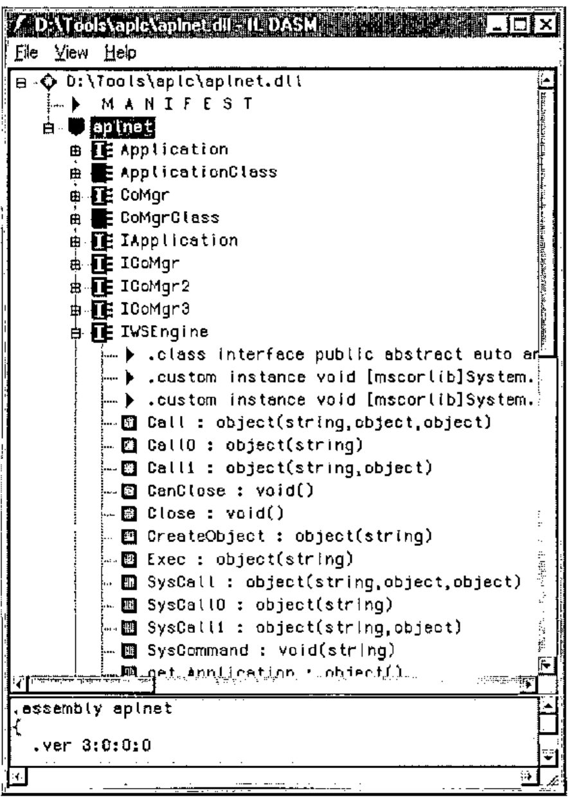
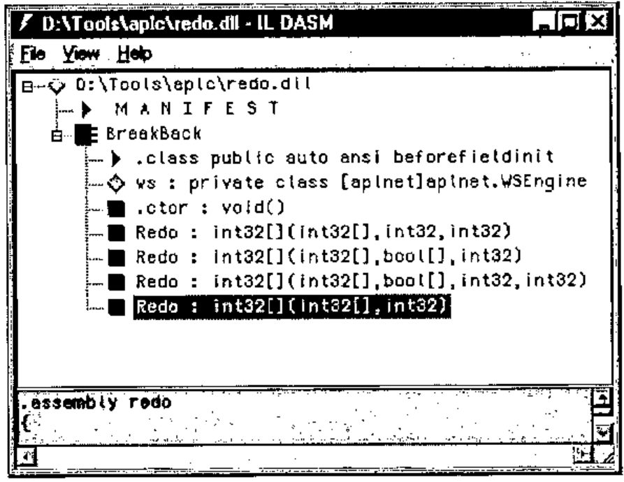

*by Adrian Smith*
{ .byline }

## Background to .NET

Was it all just hype, or is there some serious meat in there? If my experience is typical, there is a lot of meat, and you should sit up and take note of where the programming world is headed. My experience has been:

- our *GraPL* customers are voting with their feet. We now have 6 existing sites switching to ASP.NET and many more enquiring how long we are going to be. Virtually all new sales enquiries are wanting .NET. Almost no-one is buying COM servers any more.
- C# is the simplest, most productive development environment I know, after APL. Jonathan is a lifelong Delphi fan, and has switched allegiance to C# almost overnight. Richard has rewritten his little R reverse polish language in C# from Java and greatly prefers it. This thing is happening faster than even Microsoft could have hoped.
- most of the best tools are free. *SharpDevelop* is a nice C# IDE and is open-source. The Microsoft compiler is free, so all you need to get going is the language spec (C# is an ECMA standard) and Notepad. Honest.

So in as few words as I can manage, what is it about .Net that has grabbed the world’s programmers by the throat. Here are some thoughts:

- **The Common Type System.** All .Net languages share a common set of basic data types. This allows you to build an application from a collection of code blocks written in a variety of different languages, and have them work smoothly together.
- **Simplicity.** There are no header files, no pre-processor macros, no linker. You just compile your code, mentioning all the other modules you need on the command line. This has the huge benefit that if you make a mistake in calling someone else’s code, you get to know at compile time.
- **System utilities.** All the basic stuff is there for the asking. String-handling, date-manipulation, whatever. Imagine the contents of all the best utility libraries you know properly catalogued and made available to everyone, all the time.
- **Easy deployment.** Just copy a bunch of files. No messing with OLE registrations or other nasty stuff. Because everything uses the .Net runtime classes, your application can be *REALLY* small. Just like the old days.

Enough. I think this is going to take over the development world very fast indeed, and I want to be part of this game with my APL stuff. There is a way to do it now, with nothing beyond APL 3.5 and a little ingenuity. I am sure that in the future it will get better, but let’s see how far we can get with what we have today.

## COM InterOp Here we Come

There is just one small piece of administration to be done before we can get to the +Win COM server from C#. We need to run a command-line utility called *tlbimp* from the framework SDK to make a .Net cover for the APL+ COM server. On my machine this looks like:

```text
D:\Tools\aplc>d:\tools\microsoft.net\frameworksdk\bin\tlbimp
      d:\apl\win35\aplwco.dll
```

Which automatically creates a .Net DLL for us. In the examples that follow, I additionally specified `/out:aplnet.dll` as another parameter, so all my tests are run against a mapped COM server called *aplnet*. Of course there is the usual irritation that if you have registered the RUNTIME engine you can only load a runtimed workspace, and vice versa. I would recommend registering a development interpreter if you want to play with the examples. Then you can leave APL open in one window, hit )save and rerun your C# example with no problems.

So what can we do with it? Well let’s open up a Notepad and type a bit of C# to see what happens. Here is `runapl.cs` which does a few basics:

```csharp
using aplnet;
using System;

class TestApp
{
  public static void Main()
  {
    WSEngine ws = new WSEngine();
    Console.WriteLine("Hello World using C#!");
   // Just play with expressions - limited usefulness
    Console.WriteLine(ws.Exec("2*3").ToString());
   // Note that there is NO mapping here to []AV characters
    Console.WriteLine(ws.Exec("ô3+4 7"));
    Console.WriteLine(ws.Exec("'Hello from APL',ô1000'2"));
    Console.WriteLine(ws.Exec("ô•FI'23 34 45'"));

   // Get some prebuilt stuff (remember to flag as runtimed)
    ws.SysCommand("load c:\\data\\W3\\demo");

    object result = ws.Call0("HelloWorld");  // Call with no arguments
    Console.WriteLine(result);

  }
}
```

Probably best to compile and run it, then stop and explain what is going on. Here we use `csc` (the Microsoft compiler is free with the .Net framework) mentioning that we need the resource `aplnet.dll` in our source code. It creates `runapl.exe` which I can try out from the command line to see the effect.

```text
D:\Tools\aplc>csc /r:aplnet.dll runapl.cs
Microsoft (R) Visual C# .NET Compiler version 7.00.9466
for Microsoft (R) .NET Framework version 1.0.3705
Copyright (C) Microsoft Corporation 2001. All rights reserved.


D:\Tools\aplc>runapl
Hello World using C#!
8
7 10
Hello from APL2000
23 34 45
Hello, world from APL
```

Well, it seems to work, so let’s take it apart a line at a time.

```csharp
using aplnet;
using System;
```

This just saves me some typing – effectively it sets the compiler’s search path to include the *aplnet* and *System* namespaces. Otherwise I would have to type `System.Console.xxx` every time, and that gets tedious.

```csharp
class TestApp
{
  public static void Main()
  {
```

In C# everything is a class, even the most basic `HelloWorld` program. A command line application needs a *Main* method so it knows what to run. Now it gets interesting.

```csharp
    WSEngine ws = new WSEngine();
    Console.WriteLine("Hello World using C#!");
   // Just play with expressions - limited usefulness
    Console.WriteLine(ws.Exec("2*3").ToString());
```

The APL com server exposes a few well-known methods to allow external applications to run expressions, load workspaces and so on. Here, we create an instance of the *WSEngine* class, called *ws*, mainly so I can paste code from the APL2000 help files! We can have APL raise 2 to the power 3, and return a result (which will be of type object). Anything of type object will have a basic formatting capability built in, so I can use it here to get my number made into text. Then I write it to the console. Look back a few lines and notice the 8 that was displayed. OK, it’s a start.

```csharp
   // Note that there is NO mapping here to []AV characters
    Console.WriteLine(ws.Exec("ô3+4 7"));
    Console.WriteLine(ws.Exec("'Hello from APL',ô1000'2"));
    Console.WriteLine(ws.Exec("ô•FI'23 34 45'"));
```

This took a bit more work. Those funny squiggles are the characters which occur in the Courier font at the same positions as the APL symbols occur in `⎕av`. So (for example) ô is the 244th character, and if you try `⎕av⍳'⍕'` you will get 245 back. Remember to take one off! Really, this is just fooling around, what we really want to do is to load a workspace and have our C# run some real code.

```csharp
 // Get some prebuilt stuff (remember to flag as runtimed)
    ws.SysCommand("load c:\\data\\W3\\demo");

    object result = ws.Call0("HelloWorld");  // Call with no arguments
    Console.WriteLine(result);
```

So far so good. As long as we have the right workspace name, this will go ahead and load it for us. Now, the next line deserves some more explanation. `HelloWorld` is a niladic function which returns the obvious string as a result. If I try to use `ws.Call(...)` here, it refuses to compile:

```text
runapl.cs(20,18): error CS1501: No overload for method 'Call'
takes '1' arguments
```

The reason? Unlike the COM interface, .Net has no concept of optional arguments, and the `tlbimp` utility has had to cope. The way C# works is actually rather more flexible, but quite hard for an APLer to get used to. Imagine that you can have lots of different versions of `foo` in the same workspace at the same time! One might be defined as `res←foo arg` (monadic, result-returning) while another could be `res←larg foo rarg` and so on. Of course one might call another, having done something like set a default for the left argument. Or it might do something *completely* different (think `⍳`). This is how C# works, and it is called *overloading*. You can have as many copies of a function as you like, as long as they all have different signatures. Useful, and flexible.



So this is what I expected `tlbimp` to do, but oddly it has made a set of functions with suffixed names that map to the various possible syntaxes for the *Call* method. To find out exactly what is available, we use another handy utility called `ildasm`, which is the ultimate Swiss Army knife of the .Net developer. Put a shortcut to it on you desktop, then drop `aplnet.dll` on to it, and all will be revealed

Now what have we here? There is *Call*, as expected, but we also have *Call0* and *Call1* for the niladic and monadic cases. For our `HelloWorld` function, we maybe could try *Call0*, instead of Call:

```csharp
object result = ws.Call0("HelloWorld");
Console.WriteLine(result);
```

Works fine. It compiles, and completes our test by writing the result of the function to the console.

Now we have all the tools we need to move ahead. We can load a workspace, call code in it, execute arbitrary expressions, and get results back that our C# application can use. Let’s move on to make something that might actually be useful.

## Making a Function into a Method

Clearly, we want the C# programmer to see our function (and only our function) with a clearly specified set of argument types and possible results. Because APL has no need of all this ‘type’ information, we will need to add it in somewhere. I have chosen to do it with comments, but there are plenty of possibilities. Use whatever suits you best.

### Let’s do Breakback!

A little function I showed at APL Berlin 2000 will do nicely, as it can be called in several different ways, and actually does something mildly useful and array-ish.

```apl
    ∇ new←larg Redo ttl;holds;old;cum;held;lot
[1]   ⍝ Integer vector redistribution with optional held items.
[2]   ⍝ Result is 'integer' at the specified lotsize
[3]
[4]    :If 1<≡larg
[5]      (old holds lot)←3↑larg,1
[6]    :Else
[7]      (old holds lot)←larg 0 1
[8]    :End
[9]
[10]   :If 0∊holds  ⍝ we can proceed
[11]     held←holds×old
[12]     cum←+\((~holds)×old)÷lot
[13]    ⍝ End-stop required if the only unheld cell is zero!
[14]     :If 0=¯1↑cum ⋄ new←old ⋄ :Return ⋄ :End
[15]     new←¯2-/0,⌊0.5+cum×((ttl-+/held)÷lot)÷¯1↑cum
[16]     new←held+lot×new
[17]   :Else  ⍝ all cells locked in
[18]     new←old
[19]   :End
    ∇

      vv
4 3 2 5
      +/vv
14
      vv Redo 17
5 4 2 6
      +/vv Redo 17
17
```

The basic call simply reworks the vector to sum to a new total. It can also take a matching vector of ‘held’ elements, and a final option is to set the ‘lot size’ of the result, forcing all the numbers to be integral multiples of this value. That is 4 C# overloads to make, each of which will just call our base function with suitable defaults. Let’s add in some comment lines:

```apl
⍝:Public int[] Redo (int[] old, int newtotal)
⍝:Public int[] Redo (int[] old, int lotsize, int newtotal)
⍝:Public int[] Redo (int[] old, bool[] heldcells, int newtotal)
⍝:Public int[] Redo (int[] old, bool[] heldcells, int lotsize, int newtotal)
```

These could have any syntax you like, but the lazy choice seems to be to make the function signatures look just like the C# we are about to generate! Note that this is not limited to the cases with 1,2,3 arguments (as the APL was) as we can make overloads for any reasonable combinations. So, what should this look like in C#? Here is a hand-cut version to show the general idea

```csharp
using aplnet;
using System;

public class BreakBack
{
  WSEngine ws;

  public BreakBack() {  // constructor
    ws = new WSEngine();
    ws.SysCommand("load c:\\data\\W3\\demo");
  }

  public int[] Redo(int[] old, int newtotal)
  {
    object result = ws.Call("Redo",newtotal,old);
    return (int[]) result;
  }

  public int[] Redo (int[] old, int lotsize, int newtotal)
  {
    object result = ws.Call("Redo",newtotal,new object[] {old,0,lotsize});
    return (int[]) result;
  }

  public int[] Redo (int[] old, bool[] heldcells, int newtotal)
  {
    object result = ws.Call("Redo",newtotal,new object[] {old,heldcells,1});
    return (int[]) result;
  }

  public int[] Redo (int[] old, bool[] heldcells, int lotsize, int newtotal)
  {
    object result = ws.Call("Redo",newtotal,new object[] {old,heldcells,lotsize});
    return (int[]) result;
  }
}
```

The only tricky part is to get the arguments swapped around! The Call method on the COM server takes them in the order `Rarg, Larg`, which is why `newtotal` always comes first. Apart from that, we can start to contemplate creating all this completely mechanically from the original function and a few extra comments. How does it look from the outside world? Well, lets compile it to a DLL and have a look.

```text
D:\Tools\aplc>csc /r:aplnet.dll /t:library redo.cs
```

The only small addition is that we specify a library here, rather than getting the compiler to make an EXE. Hence the lack of a `Main()` function in the listing above. Now to try it out:

```csharp
BreakBack bbk = new BreakBack();
int[] data = {4,3,2,5};
int[] res;
Console.WriteLine("Simple call to retotal to 17");
res = bbk.Redo(data,17);
foreach (int i in res) { Console.Write(i+" "); }
Console.WriteLine("");
```

And so on, for the 4 possibilities. This time we compile our code with the extra DLL mentioned on the command line, and then we can test it straight away:

```text
D:\Tools\aplc>csc /r:aplnet.dll,redo.dll runapl.cs
D:\Tools\aplc>runapl
Simple call to retotal to 17
5 4 2 6
Retotal to 18 and lotsize in 2s
6 4 2 6
Retotal to 24 and hold first value
4 6 4 10
Retotal to 27 hold first value and lotsize in 3s
4 6 6 12
```

So, to recap. We can take a bunch of functions in a conventional APL +Win 3.5 workspace, add a few declarative comments, and with a bit of work create the C# source code which uses the APLW COM server (via COM InterOp) to make a completely standard .Net ‘assembly’ that any C# programmer will be happy to work with.



For comparison, here is the dis-assembly that the C# developer would be looking at. It is simple, and easy to work with. The redo DLL is all of 4kb in size, and even the aplnet dll is a mere 13kb. As I said at the beginning, this stuff is lean and mean and really easy to deploy. It will work with any of the many .Net languages and can be used in a web-page created on the fly with ASP.Net.

## Where Next?

That is easy to answer. What we need is for APL2000 to make the InterOp step redundant by bridging directly to the interpreter from C#. This allows the APL developer to play on a totally level field, along with the C# guys and anyone else who comes along. That legacy code could still be running in 20 years time, rebadged as .Net assemblies and fully accepted by the IT management as a good citizen of the brave new Microsoft world.

For now, we will have to fudge it, but as workarounds go, it is not too unpleasant.
