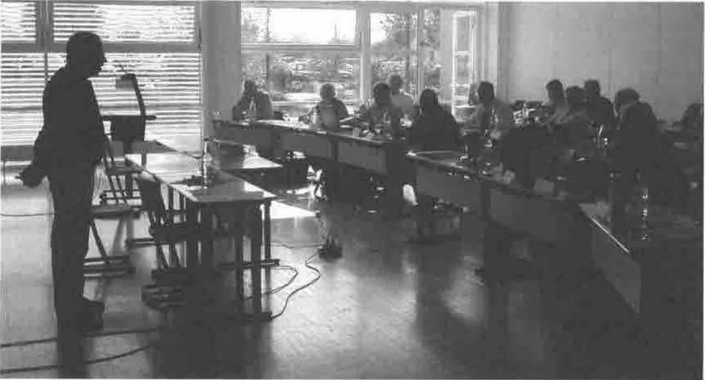
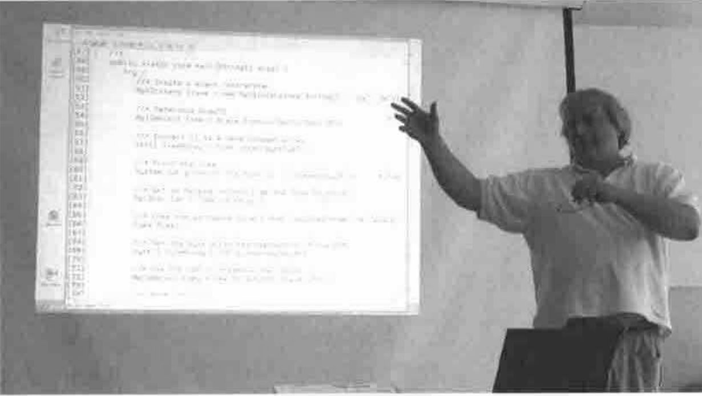
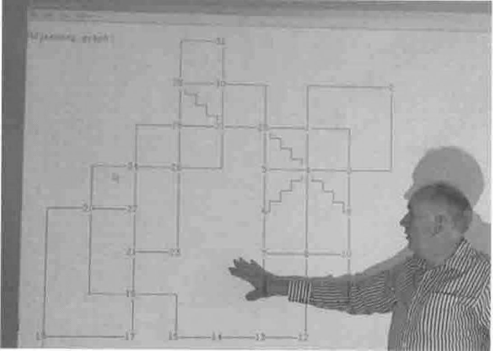
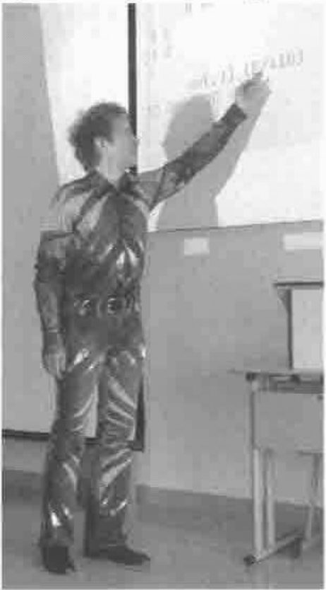

*reported by Adrian Smith*
{ .byline }

## Acknowledgement

Thanks again to Dieter Lattermann and the rest of the German group for the invitation. Bingen is a really easy trip from the UK (Frankfurt + 50 mins on the train gets you 100m from the hotel), so for once the travel was very simple. On the return leg, we were greeted at the departure gate by a very sheepish pilot – the tail skid on the 767 had stuck ‘out’ so they could fly OK, but could not discharge any water from the rear of the plane for fear of it freezing on. So we were all sent off to the bathroom before boarding!

## The Meeting

As usual, this was the second part of a 2-day meeting (day-1 was the formal GSE session with IBM) and opened with a short AGM before moving on to a good selection of presentations.

**Dieter Lattermann opening the meeting**

Around 60 people attended the 2 days, although a few did escape after the (most interesting) winery trip on the first evening. David Liebtag was the first main speaker, and summarised the new features in APL2 CSD4 which allow for a very clean interface from APL2 to Java (and from Java to APL2). He has provided a very thorough introduction to the Java API (which you can read on page 101) but here is my impression of the key points.

### Working with Java and APL2 *by David Leibtag*

Here is David, and here is some Java code calling APL2. That more-or-less summarises what IBM have done – made APL2 callable easily from other programming environments. They have designed a specific API for Java and a general-purpose API for C which should be usable from any language. The APL that you connect to is very similar to the runtime environment, so there are no system commands, just raw code and user-defined functions. To make this readily shareable, the interpreter is now a very small .EXE file, with a much larger (shared) DLL portion to allow multiple instances to start quickly.

David also showed APL2 calling Java via a new Associated Processor AP14 which creates an instance of a Java class, and gives you back a handle, which allows ready access to any public methods or instance data. He emphasised the need for good housekeeping here – if you fail to free the instances your application will gently leak memory until )OFF recovers it for you. He pointed out that this allows you to use all the threading capabilities of Java to launch background tasks which run in asynchronously in independent threads, and exploit multi-processor architectures where available. It all looks very solid, very useful, and (probably the primary motivation) it allows APL2 applications to integrate seamlessly with IBM’s mainstream *WebSphere* developments.

### *John Scholes* in Dogger and South Utsire

Not his real title, but he made the mistake of using the shipping forecast in one of the examples. Basically, this talk was about graphs (the mathematical kind when you have vertices and edges) and here is John explaining the knotty problem of locating Britain given only the connections between the sea areas listed in the daily weather forecast:

It all turns out to be a matter of finding chord-free regions in the map – the latest code is available on the DFns page at *www.dyalog.com* if you want to know more.

Once you have your graph, you can choose many ways to represent it, typically a boolean matrix (if most points link to most other points) or a nested vector of connections. Again, John has provided the full text of his talk (see page 55) so I will stick to a few highlights here.

He showed us the little DFns application to find the most efficient route across London using the classic Tube-map represented as a network. This uses the highly iterative approach of the original algorithm, but in APL you can improve by a factor of 4 by pushing a ‘wave-front’ through the network in parallel. I would very much like to have a go at compiling this one – I suspect that the ‘simplistic’ APL would probably be a better option when generated to raw C#, as simple scalar code runs very quickly indeed when compiled. See next-but-one talk!

### New possibilities in Dyalog Version-10 *by Peter-Michael Hager*

This was an interesting exploration of the potential of un-named objects in Dyalog APL, Version-10. Peter-Michael showed the benefits of working with un-named Gui objects, TCP sockets and so on.

In Dyalog-9 there were many problems with the implementation, and much of what he showed required V10 to work correctly. You can read his notes in full on page 98.

For now, readers will have to content themselves with this black-and-white rendition of his splendid outfit. It is well worth a trip to the Vector website to experience it in all its colourful glory.

### Adrian Smith on translation into C#

Fortunately, most of the delegates had read the PDF of the presentation beforehand, so I could use nearly all of the available time in showing examples of original APL code and the kind of C# that one can generate from it. This work is very firmly rooted in Tilman Otto’s APL2C generator, but is entirely new code to target the .Net platform quite specifically. Several people were concerned that we were being too narrow in targeting C#, but I am still fairly relaxed about this, as (a) the *Mono* project already has the .Net Framework running on many Unix builds, and (b) it would be fairly easy to target Java instead of C#.

Although the prime motivation behind this project is ease of deployment, the thing that most caught the audience’s attention was the potential to speed up existing APL algorithms by up to 30 times (for very iterative APL) or at least a factor of 5 (for typical commercial APL). You can read my detailed notes on this project on page 113, but hopefully it sparked enough interest that someone is now thinking of sitting down to write a bare-bones APL engine for .Net that is designed from the beginning to be readily compiled.
