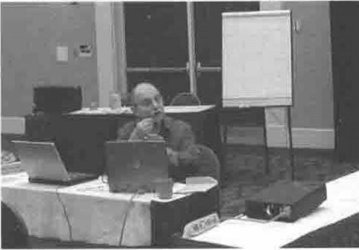
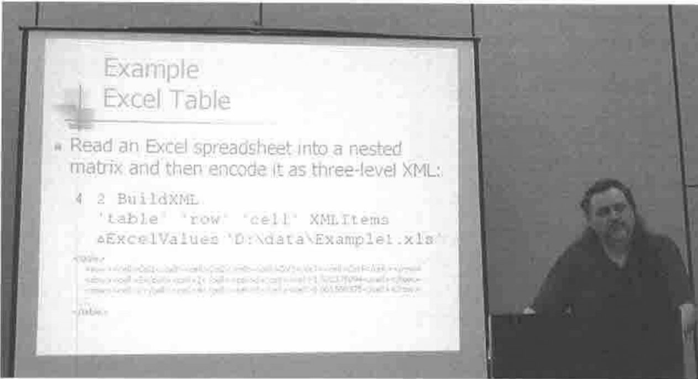
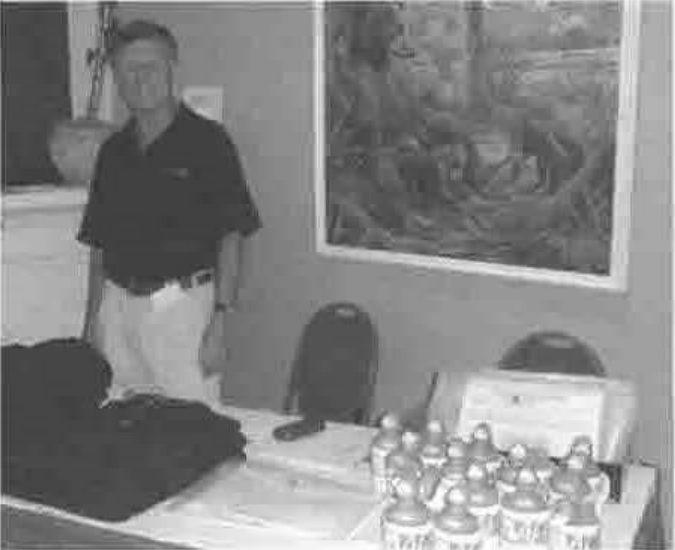
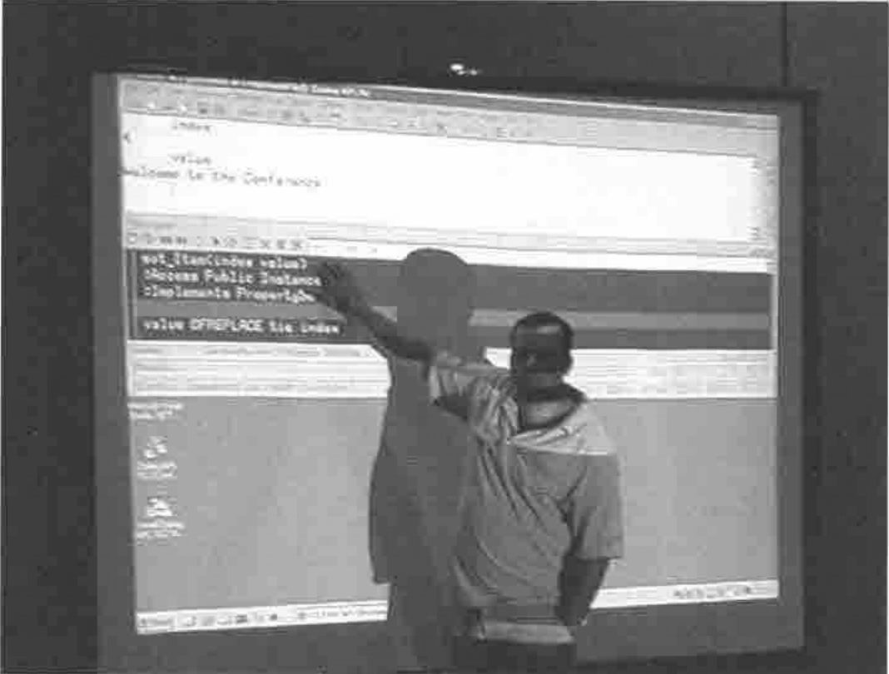
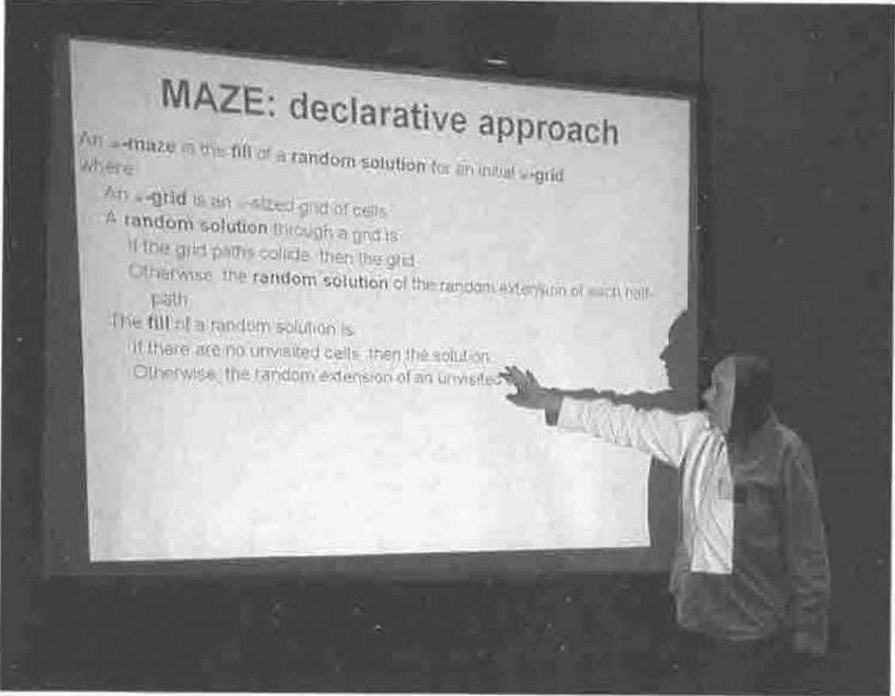

*notes by Adrian Smith*
{ .byline }

## Background

This was meant to be the last time APL2000 came to the Naples Beach, but the weather was great and the company was good, so they may well be back again next year. I assume Dyalog will be returning to Europe next time around, but as a one-off, the back-to-back meetings worked quite well. Maybe more of the APL2000 users would have stuck around for the extra days if they had realised in time what was planned, but the Dyalog numbers were well up to expectations so in the end this wasn’t a problem.

One of the great things about Florida is that all the beach is public land, so a morning walk (in my case) or run (Reima and Jouko) was always a welcome start to the day.


**Beach with Running Finns**

Hurricane Alex had made landfall about 50 miles north of here, where the destruction was clear to see. All Naples lost was about 50 yards of sand, and I guess the winter storms will rapidly pile it back. So if you can talk the company into paying your way back here next year, it will probably be your last chance.

## APL 2000: Conference Report

This is a hard one for me to report, as the emphasis was heavily on all the amazing things you can do with APL2000 WebServices (which I have never used, so know little about) and on the fun Fred and Jairo have been having with something called *Santa Fé* (which was remarkably hard to pin down). This leaves some really solid user-presentations and Bill Rutiser’s slow and steady approach to ‘objects’ as the only things I am really able to report properly. If someone else wants to set the record straight, please do.

### What is this thing called *Santa Fé*?

I *think* it is a lightweight array language wrapped on top of a C# library of APL-like primitive functions. The snippets of syntax we saw look more like VB.net than APL, and I have no real idea where its limitations are. I suspect it is a quick rework of the JScript engine into C# with an interface thrown over it so you can type expressions and assign variables. It is obviously not APL, and I don’t believe anything except the most basic code snippets would be automatically translatable into it (see my notes on Joe Blaze’s talk for the limitations of JScript). Is it the interpreter of the future, or it is just a quick Fred Waid lash-up, hastily polished as a conference demo? We will have to wait another year to know.

### Larry Mysz and his Immunology Machine



I greatly enjoyed this talk, for all the wrong reasons! I suppose the point was to tell us about the APL content, but it really turned out to be an excellent immunology primer, and a nice summary of a typical system history. To summarize: testing blood samples for immune responses is a mindlessly tedious job involving matrices of sample plates; APLer hacks out a handy analysis tool which talks down the serial cable to the machine that tests the responses; 10 years later the same APLer has a handy little business working with the machine manufacturers supplying ‘embedded’ software.

Maybe one day someone will rewrite the whole thing in a ‘real’ computer language, but in the meantime it ain’t broke so why fix it?

### Joe Blaze on Year-3 of APL web-based systems

To summarize Joe’s talk from 2003: IIS errors cost BlazeSSI money. Up to 20% of the 10,000 hits per day were giving 404 responses, triggering clawback credit clauses from web-based clients. They can fix the response problem (and cut the number of servers) by handing off from IIS to an APL2000 WebService. This year’s talk was a progress update, and a summary of the issues encountered.

First, some advice on an approach to the project:

- divide applications into pure UI and application logic. Some things absolutely have to be run server-side.
- hit the systems with the highest user-count first (10,000 users of a relatively small system). In Joe’s case the analysis took around 2 months.
- give each ‘core service’ (such as arithmetic calculations) a workspace and a port number so any other service can call it.
- keep the user interface to a thin client (IE 5.5 or higher and Acrobat Reader 5).

Joe followed the approach of using ASP developed initially in `⎕WI` format and exporting it via JSave to make runnable forms. However he quickly found that you couldn’t convert directly because of the JScript restrictions, so was back to line-by-line reworking of forms.

However, given the choice between writing APL that writes JScript (however flawed) and respecifing the application in JScript, he still preferred the option of sticking with the APL and having the programmers learn to code ‘in the box’.

> “You have to read every detail that Fred and Jairo tell you. Appreciate the restrictions of JScript”.

The convertor works great for ‘Fred’ code, and the generated JScript assumes VisualStudio coding habits. Eventually the APL team learns the APL habits which make it work smoothly “… over time it has improved”. Some other design advice:

- RunAtServer – don’t build a large data array and send it all at once. Do it field by field with little packets of homogeneous data. This is then very reliable.
- just RunAtServer ‘foo’ arg returning a simple code which the JScript interprets and displays. Complex results add a large overhead in time (to wrap and unwrap the data) and in transmission cost.
- use overlaid frames with ‘breadcrumbs’ to show users where they are in the system. This deprives the user of the temptation to use ‘Back’ to revert to a prior step. Instead they have a clear ‘Step1>>Step2>>This panel’ chain to guide them through the system and make sure they back up in a controlled way.
- output formatting and content has to be consistent, so PDF is used everywhere to show completed forms. This also means there are no concerns about how the results will print. The server uses Causeway *NewLeaf* to generate the PDF and return it to be displayed directly in the browser (Acrobat Viewer works fine as a browser plug-in). This eliminated all printing hassles. Causeway helped by adding code to the NewLeaf PDF engine to take a collection of small reports and merge these up into a single consolidated document for the user to see in the browser.
- it is good to save common APL routines out to JScript as stand-alone .js files, which are referenced from the pages. This way they get cached by the browser, and the loading speed improves greatly after the first hit.

Joe’s final advice was to include a ‘Sunset’ date to ensure obsolescence of old versions. When an application is split up and distributed in this way, it is crucial to have everyone using the same version of all the components.

### Eric Lescasse on a pioneer WebServices application

Actually, this came before Joe’s talk in the conference, but it makes much more sense to report it afterwards as it illustrated perfectly the perils of leaping into a big webservice conversion of a complex application.

Eric has been helping with the conversion of a questionnaire-analysis application for Renault, which must handle 90,000 responses to help analyse the effectiveness of training sessions. He had begun the project on the assumption that the JScript engine would be able to convert the vast majority of the existing code, but had quickly found himself on the phone to Fred or Jairo to help him discover ways around its limitations. Eric drew a decent veil over exactly what his over-run had been, but I think he had underestimated the work by at least a factor of 2, and for a careful professional like Eric, this is most unusual. Enough said.

### Bill Rutiser on new core language features

Bill is a cautious engineer – he starts by looking at the technical implementation, and then adds new language features being careful all the way not to break existing code. This paper was a set of design ideas based around `⎕MOM` which is a proposed new system function to allow objects to be defined as recognised data types in the workspace. This is designed to be very non-specific, and will allow entirely new language capabilities as well as access to external libraries such as the .Net framework.

> “Remember, this is experimental work in progress. Everything is subject to change or abandonment.”

So you know where you stand with Bill! The main proposed addition to the interpreter is support for a new data-type, the *object reference*. This can be assigned to a variable, passed to a function, or returned like any other scalar value. It is possible to have several references to the same object (see *namespace references* in Dyalog) using ordinary assignment. The only structural primitive available to date is *match* – you cannot yet have arrays of references. References have no implicit output format (yet).

This leads to the obvious required syntax extension – the use of a dot to separate a reference from some content within it (again as for Dyalog APL and most object-based languages). The only way to create a reference (for now) is with `⎕MOM` which takes the specification of the object content, and returns a reference to it.

So far, the only object we have is a kind of package called a ‘sack’ which is really just a demonstration of the technology. You can put a bunch of names into a sack with:

```apl
myref←⎕MOM mynamelist
mylist←myref.⎕NL 3
```

… and any of these internal names can use `⎕MSELF` to call other functions (or reference variables) in the same object.

That is about all it can do for now, but you can see the potential. Let me state a personal interest – having finished re-implementing *RainPro* as a .Net library I would love to stop shipping 3 slightly different versions. If I could let all my +Win customers update to the .Net version, they would have a faster, lighter engine, no extraneous code in their workspace, and I could permanently archive one of the 3 sets of APL source. Wonderful.

### Davin Church with some array-friendly XML tools

Davin is one of those useful guys who keeps generating well-structured utility libraries which he tests thoroughly and even takes the time to document. As XML gets to be the pervasive language of the internet, applications will increasingly need to use it for data exchange. This means that you must be able to take data and wrap it with valid XML tags (simple but mighty tedious), or alternatively take some valid XML from elsewhere and dig out the data from it.

Davin’s paper deserves a full run in a future Vector (editor please note), but I was very impressed by his approach and I can already see where I might be able to use his toolkit.



I know there are Microsoft tools out there, but they are totally scalar oriented and hard to use effectively from APL. I looked at the .Net XMLFormatter object when we were first scoping the conversion of the RainPro SVG engine (SVG is a pure XML format) and in the end it was just going to pervert the application logic to the point where I would no longer recognise my own code. We have already defined an XML format for a RainPro ‘chart specification’ and I have a very basic toolkit which will read and interpret this to rebuild the data and call the appropriate functions. Davin’s code may well be a lot solider, and might just come in really useful here.

### Summary (and sunset)


Yes, of course it was worth going, and no it wasn’t just a nice chance to loaf on the beach. Meeting customers is always a necessity, and trying to get a feel for where the major vendors are headed is a crucial part of planning my own future.

On this last point, I have to report that I really don’t know. You can see where Bill is headed, but whether objects will actually make it into the mainstream I don’t know. Does anyone apart from Fred know where Fred and Jairo are headed? If so, I would love to hear.

## Dyalog APL: Conference Report

My notes are limited to the first day, as I had already agreed to talk to the German APL group in Ingolstadt on the following Monday, which left me running for home on the Friday afternoon. Never mind, I picked up John Daintree on the latest enhancements to Dyalog 10.2 and John Scholes on “how to write computer programs” so there was enough to enjoy, even without the duck-in-the-mug being offered on the registration desk.



I suppose the Dyalog interpreter is a bit like my hard-drive. I don’t think I have ever deleted anything except temporary ‘gash’ versions of things. The drive gradually fills up, and then I buy a new computer with a drive 10 times bigger. Invariably, this ends up with a folder called ‘oldDdrive’ containing the entire data-drive of the previous machine. Somewhere in here is a folder called oldDdrive, containing the entire data drive of the previous machine. Somewhere in here …. and so on. So maybe Dyalog can just keep adding stuff, and the hardware will keep leaping ahead to the point where having a 3Mb interpreter is actually less overhead on your application than having a 620K interpreter (which is about the size of Dyalog 6.1, the first Windows build) was in 1993.

Anyway, I can hardly complain, as most of the new stuff is exactly what I felt was most needed to finish the job on object-orientation that they began last year.

### John Daintree on Dyalog 10.2

I don’t know if this got the biggest cheer of the entire conference, but it certainly deserved it. John is a truly ‘modern’ programmer who actually lives and breathes this object-oriented C# stuff, so when he adds these capabilities into the interpreter, he does it how a C# programmer would do it.

Of course, you can fake your way around the limitations of namespaces with your own implementation of `new` (mine is so ugly I really can’t face quoting it here) and lots of careful naming conventions and special comments. The problem with anything like this is that it is like `⎕FHOLD` – it only works if all the calling code knows the rules and abides by them. You can insist that the only functions available outside your namespace are the ones with `⍝:Public` in the leading comments, but if it is late on a Friday and you have a customer yelling for a fix, you will soon choose to leap the barrier and go calling things you really shouldn’t.

Which is where John Daintree comes in …



**John Daintree with Dyalog 10.2 in action**

What a lot of new control words we have today! Just in case you can’t read the screenshot, the important bit is:

```apl
:Access Public Instance
:Implements PropertySet Item
```

We have some new system functions too:

```apl
myduck←⎕NEW Duck
```

At last! This creates a proper lightweight copy of a namespace, leaving the code where it was, and noting the ‘Get’ and ‘Set’ functions for properties. This allows the calling application to refer to properties as if they were variables:

```apl
myduck.species←'Mallard'
```

… but have the interpreter look up the appropriate *PropertySet* function and automatically call it, passing the assigned value as argument. The same applies in reverse if you reference a property, and of course only functions declared to be public show up in the instance.

There is still some stuff for John to do here (autocomplete in the editor does not yet notice instances) but the basic idea looks completely sound, and gets APL a lot closer to the kind of modern environment that many of Dyalog’s users are shouting for.

I think there was only one thing bothering me as I came away from the talk. In the current implementation, instances have the same nameclass as namespaces (being basically references with some stuff added). Surely, they are more special than that? If I have been testing stuff, I am likely to have a load of gash instances lying around in my workspace – it would be so nice to clean them up with a swift `⎕EX ⎕NL 11` or whatever. I can’t see that you would ever want a saved workspace with any instances in it, apart from the usual `)continue lunch` scenario.

### John Scholes on the art of Izzy programming

I hope John’s deadpan humour works as well in Florida as it does back home – I think our US colleagues picked up the jokes and asides, but one can never be quite sure. This is another paper that deserves to be published in full, as much of the material was by no means as lightweight as John made out.

Basically, it was a plea for a more declarative approach to program design, typified by the phrase:

> “Describe the result in terms of the arguments,<br>
> using only the present tense of the verb ‘to be’.”

So rather than telling the computer how to make the result, we just tell it what the result is. John gave the simple example of the definition of mean:

```apl
{(+/⍵)÷⍴⍵}
```

> “The **mean** is the quotient of the **sum** and the **number** of items”

Which leads to the second nostrum …

> “You may use conditional **if** clauses and<br>
> supplementary **where** clauses to define terms”

In this example, the supplementary clauses are too obvious to need further elucidation, but in John’s final example (a very procedural maze-solving algorithm) you quickly get to see that this really is a new way of thinking.

Here he is, with the algorithm specified in a pure declarative style. Suddenly, coding is the easy part.



**John Scholes with an example of Izzy programming**

### And finally …

How many of you knew that this works (and has worked for ages) …

```apl
)ed - a   ⍝ a is a new character matrix
)ed ∊ a   ⍝ a is a new vector of text vectors
)ed ∇ a   ⍝ a is a new function (default setting)
)ed → a   ⍝ a is a new character vector

)ed ∘ anyclass ⍝ will make a new class definition in 10.2
```

Maybe this is documented somewhere deep in the Dyalog User’s Guide, but I never knew it before John Daintree’s talk. I told you it was worth the air fare!
