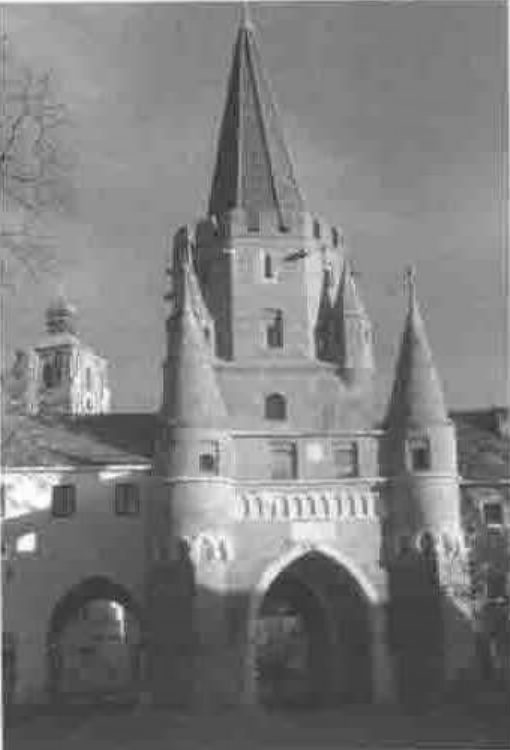

*reported by Adrian Smith*
{ .byline }

## Getting There

Ingolstadt is a classic medieval town, still with many of its walls and gateways, nestling comfortably on the bank of the Danube, about an hour by train north of Munich. The Technical University is just outside this splendid 13th-century gateway, and the majority of the visitors stayed at a typically functional modern hotel a few streets away in the heart of the Altstadt.

Our host Prof Kuesters brought along several of his Economics students, who had been exposed only briefly to APL, but were keen and interested, and asked me plenty of searching questions. Several of the talks went clear over my head, and I am not entirely sure where the APL content lay in two of them, but I can report on Dave Liebtag’s review of recent APL2 enhancements, and on Romilly Cocking’s work with BNP Paribas doing reconciliation work with APL2 and SmartArrays. My own talk was mostly a rehash of John Scholes’ excellent summary of the art of Izzy programming, with a few asides on C# conversion thrown in. It probably went straight past the (mostly APL2) audience, but I was very encouraged at the keen interest I got from the students. I still think that if someone out there makes a lightweight, affordable D engine, it will get APL back into education faster than you can say ‘Gimme Arrays’.

## What’s New in APL2

*Dave Liebtag (IBM)*

Dave was his usual avuncular self, and worked through a number of enhancements to the APL2 engine, mostly to do with interface and DB2 access. He very proudly showed us the PDF of an 80-page book “APL2 Programming with Websphere” which he suggested was at least a 2-day read, and contains everything Dave knows about the Java interface.

As you can see, he has been quietly fixing up the APL2 Windows offering, with better Unicode support as well as lots of small interface improvements.

## Using SmartArrays in a Banking Application

*Romilly Cocking*

Reconciliation of (say) 2 million records in your accounting system versus another 2 million entries on your bank statement takes a lot of processor time (typically 4 hours on an RS6000 at BNP Paribas). Romilly has been working on a flexible reconciliation engine in APL2, then compiling it down to C++ using Jim Brown’s SmartArrays technology. The benefits are flexibility, reliability and (once compiled) performance.

I can certainly relate to the problem – even with the tiny number of transactions Causeway has to cope with, matching an entry on the bank statement (suppose we sell a GraPL for $72 and a RainPro for €400 on the same day – the VISA people convert the currency and group the transactions) with the automated emails, is no fun at all.

So I enjoyed this talk, as well as meeting Romilly again for the first time in years. He also gives me hope that one day I might do something similar with our C# conversion kit, but that can wait for another day.
