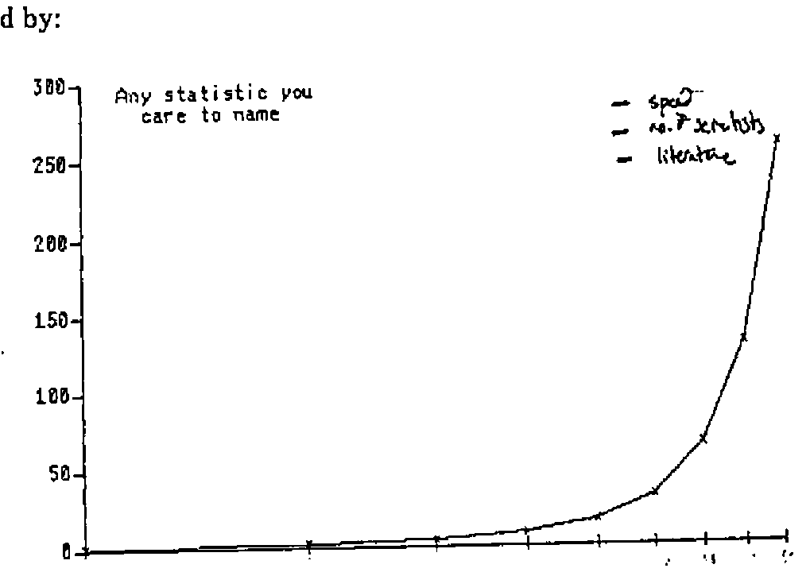
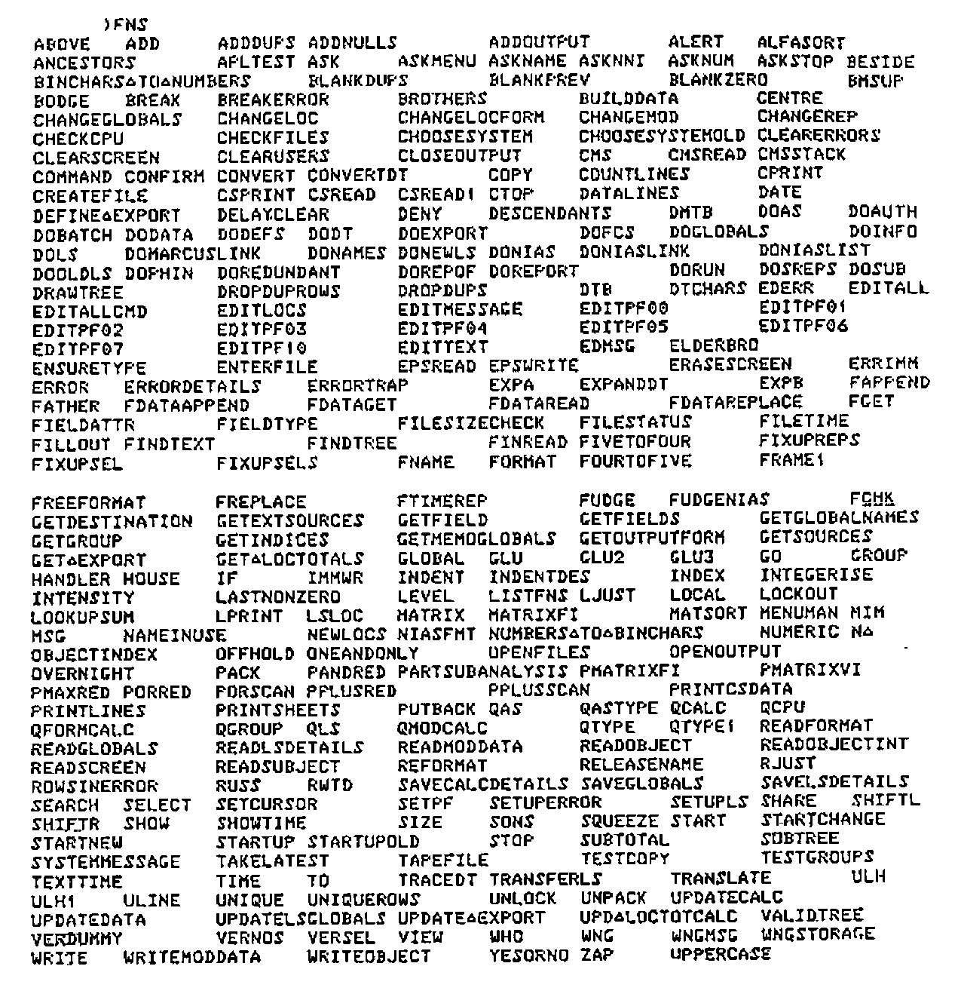

*Talk by Paul Smith, notes by Adrian Smith*
{ .byline }

## Introduction

Paul is OR Project Manager with British Gas plc (South Eastern), formerly British Gas South Eastern, formerly SEGAS, originally the South Eastern Gas board! He told us all this at the beginning, partly to see who still thinks of them as ‘the Gas Board’, but mainly to make the point that the ground under any system keeps changing. Company names are only part of the problem.

Thanks anyway to Paul for passing on copies of his foils; the annotations are a mix of his own marginal notes, and my own recollection of his talk.

### FORMAT OF THE TALK

PCs – REASONS FOR INERTIA

- Prejudice
- Pre-occupation
- Problems

THE WAY FORWARD

- Resolution of problems
- Where PCs fit in

Firstly, why the prejudice? The accelerating rate of change of almost anything can be illustrated by:



… and the resulting generation gap is making it harder and harder to stay close to the ‘leading edge’.

### TECHNO-GENERATION GAP

Definition
: The smallest age difference between people who don’t understand each other

Size
: 5 years and dropping

In summary, Paul has one very good reason for inertia when it comes to moving away from mainframes to smaller machines: prejudice.

## A Short History of APL in BG(SE)

APL started its career with ‘a real wow’ back in 1980 when work was begun on 2 major systems:

### APL in BGSE – POTTED HISTORY

1979
: Acquired VSAPL, APL\*PLUS

1980
: Work starts on 2 major systems

1982
: 1st versions of both systems go live

1984
: 2nd Version of one system goes live

1986
: Work starts on 3rd system

In between all this there has been lots of hassle (not so terrific!) and much use of APL for statistics, general analytical work and suchlike small one-offs (much more effective). Lots of lessons have been learned …

### LESSONS WE HAVE LEARNED

- Large systems require special skills
- Large systems can require a lot of maintenance
- A ‘house-keeping’ system to store, organise and document functions is very useful
- A small number of full-screen utilities can go a long way

… but APL is still far from being the ‘wow’ it was in 1980. The kind of things that Paul finds are wrong with APL are illustrated by the following (hypothetical??) dialogues:

A
: (after a lot of muttering) …(expletive deleted)

B
: What’s up ?

A
: It’s taking ages to write this program – full-screen stuff. It’s horrible.

B
: What are you trying to do ?

A
: Oh, it’s …

B
: There’s a utility to do that, you know ?!

A
: Well, it’s not in my list !

B
: I expect it’s out of date

A
: Hasn’t been updated, more likely – typical!

The worst case on record involved the reinvention of dyadic iota! <<I should talk … I once wrote a very nice ‘membership’ function using or-reduce and jot-dot-equal … Ed.>>

Some other examples of the intrinsic hostility of APL when it comes to maintaining large systems …

### ANOTHER TYPICAL SCENE

A
: Is there any way to … ?

B
: Yes, I had a function to do that once – saved a lot of time

A
: Can I have a copy of it please ?

B
: Ah, well, I’m not sure which workspace it’s in – it was some time ago

    (after several unsuccessful attempts to )COPY) I know, ask Tony, I got it from him in the first place

A
: He’s on holiday

B
: Oh yes, sorry.

… or to finding your way round someone else’s workspace:

```text
)LOAD BODGEMARCUS
SAVED 15:37:58 10/06/87
DESCRIBE
VALUE ERROR
      DESCRIBE
      ^
```



In the light of this experience, it is hardly surprising that PCs are approached with some caution, and plenty of the aforementioned prejudice.

To begin with

### PCs ARE DIFFERENT

- Different editor
- Native files are nasty
- Full-screen utilities don’t work
- Slow
- Size problems

<u>Result</u> An alien environment

… and the last thing Paul wants to do is to multiply his current problems:

### CURRENT PROBLEMS

- Knowledge mostly confined to a few experienced people
- There is a wide range of abilities/experience
- Utilities are not readily accessible
- There are few standards for coding, documentation or specifications

… by including a new, untried environment in his APL systems.

## Proposed Way Forward

Paul concluded his talk with a set of foils outlining his proposed path towards a machine-independent environment. He made it clear that it is still early days, and that the strategy could be forced to change if any elements of the proposed approach cannot be implemented in practice.

### PROPOSED WAY FORWARD

A machine-independent APL development environment, featuring:

- Functions and panels on file
- Applications defined as grouped subsets of functions
- Utilities held on a single central file
- Ability to copy from other users’ libraries
- Panels maintained using panel design utlities
- Data files held in standard format, with useful info

### BENEFITS OF PROPOSED APPROACH

- Standardisation
- Applications structured
- Documentation
- Access to utilities (single version)
- Guidelines for new users
- No extra learning for PCs
- Portability
- Transferability

### DISADVANTAGES

- Does not support ‘flashy’ features of PCs
- Incompatible with PC packages
- Has to be very robust

### WHERE PCs FIT IN

INAPPROPRIATE for:

- Number-crunching
- Large volumes of mainframe data

APPROPRIATE when:

- The mainframe becomes unworkable
- Your end-user only has a PC
- You want to share applications with others
- You need interfaces to other PC-base software

## Summary

Paul summarized his talk by emphasising three points:

- APL is a powerful language for developing systems – on mainframe or on the PC.
- To maximize its usefulness, full advantage must be taken of utilities and standard methods
- Avoiding learning different methods for different machines outweighs the benefits of ‘nice to have’ features peculiar to one machine.

It was interesting that the comments from the floor fell neatly into two camps. Firstly there were the ‘old school’ mainframers who found it hard to see why anyone should want to move to a PC in the first place; secondly there were the ‘new wave’ who had never used anything but APL\*PLUS/PC, and failed to understand how anyone could possibly work on anything else.

My owm comment to Paul at the time was that Rowntrees had started the move to PCs about 2 years ago, with much the same stated aims. In particular we ensured that we had the same set of Full-screen and file utilities available on both sides of the divide so that we could move easily from one system to the other.

In reality the real ‘instant winners’ on the PC front have been systems which do take advantage of all those ‘PC-ish’ things like fast graphics and pop-ups; we have indeed moved some existing mainframe work down to the PC, but it is quite true that all you end up with is a slow, isolated ‘mainframe’ which gives the user little benefit other than free CPU time.
