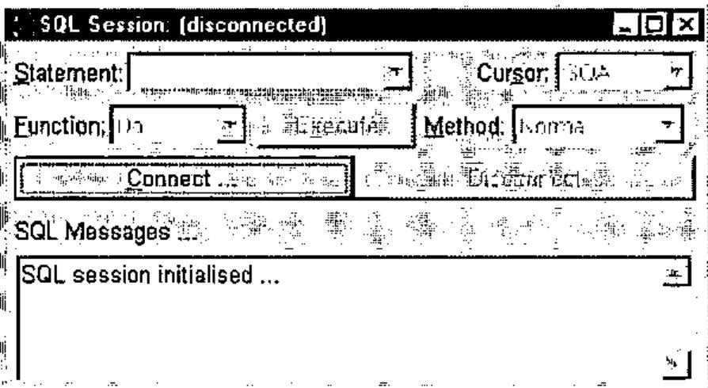
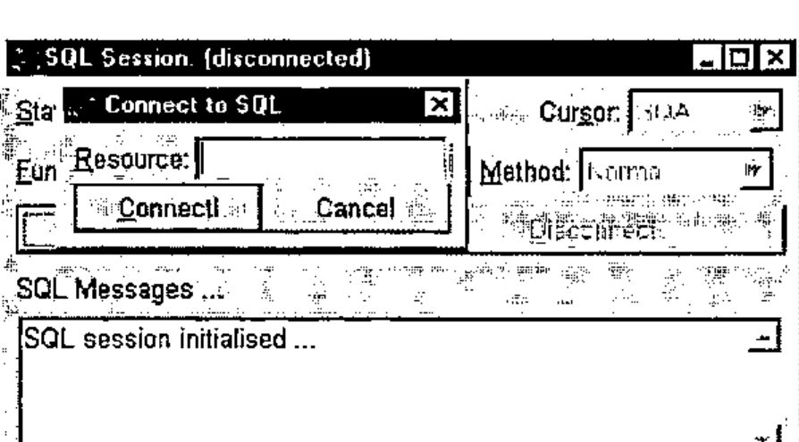
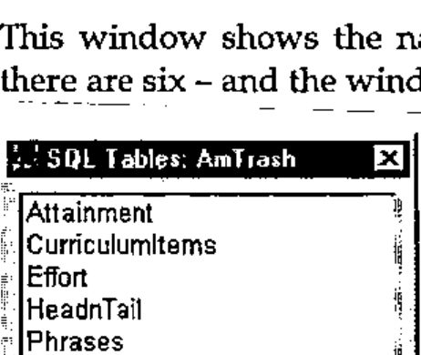
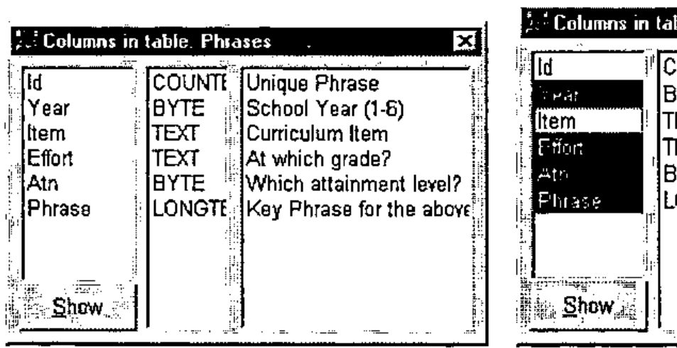
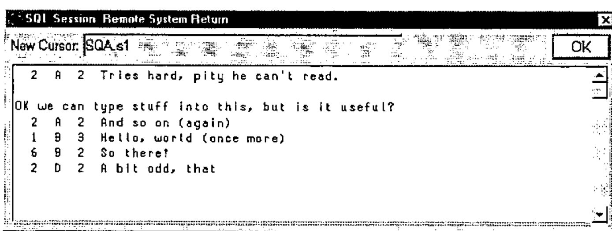
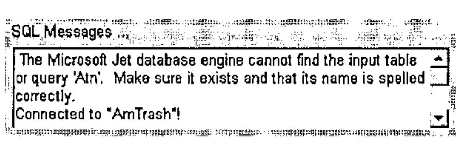
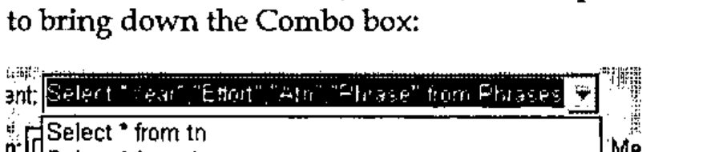

*by Richard Smith*
{ .byline }

## Introduction

Having not gone to Morten Kromberg’s workshop on ODBC at APL96, I decided that I would have a go at it in Toronto. As I was working through the workshop, I realised I was having to type in things like *SQAInit*, *SQADo* and *SQAClose* a lot of times. So I made a basic Windows form with a field and a "Go" button, which ran *SQADo* with whatever was in the field, and "Connect" and "Disconnect" buttons which ran *SQAConnect* and *SQAClose*; this meant I didn’t have to type it in each time.

As I continued through the workshop, it became more and more complicated. As each new function was introduced by itself, naturally I added new controls to the form for each one. This meant that my form had some fairly unorthodox behaviour - the dropdown on the left, defining which function to perform, controlled the items shown in the right-hand dropdown; both together controlled the actions of the "Execute" button. This led to a rather large ‘switch-case’ statement in working out what to do.

## Finishing it off

Annoyingly, near the end of the workshop my Dyalog interpreter crashed (the only time during the whole conference: what a surprise, just as I had a good program). However, this gave me the opportunity to rewrite the interface rather more sensibly. Using my father’s portable, I wrote a dummy version (he didn’t have ODBC installed), which let me play with graphic properties. Towards the end of the conference, I went back into the workshop room to write in the connections with Morten’s functions and to test it. At this stage, it was a working product and did not have some of the ‘fancy features’ of the one now, but it was taking on the look of it.

During the Christmas holidays, my father, Adrian, thought it would be a good idea if it had a dropedit Combo for the statements, as in web browsers such as Netscape and Internet Explorer. Having done this, I was then told that it would be better as a multi-line field, to allow longer statements; however, I wasn’t going to write that: come on Dyadic, let’s have "Multi-Line Combo Boxes"!

## The Final Design



After fiddling with the *attach* property and other such things, I came up with this as my main form. The icon is an interesting feature: it’s different every time! I make it using the APL expression `¯1+?32 32⍴16`, producing a random matrix of 16 colours. A useful point about the program is the way the focus moves at different times. At the start, it is on the "Connect" button. When this button is pressed, it brings up this window:



The focus is placed in the "Resource" field. Type in the name of the resource and press "Enter" or click "Connect!" to connect to the resource. If it connects successfully, the fields will be activated and the Tables window will be displayed.

This window shows the names of all the tables in the resource selected - here there are six - and the window can be resized to show any very long names.



By double-clicking on any of the table names, you can bring up the Columns window (see below). You can have as many of these windows open at one time as you like; double-clicking on a different table will bring up another Columns window. Double-clicking a name for which there is already a Columns window active will give the focus to that window.

Pressing "Enter" or clicking on "Show" will give the Return window for the table:



By selecting one or more column names and then pressing "Show", the Return window is shown for just those columns of the table.

This is done by the function *CreateQuery*:

```apl
    tab CreateQuery fields
[1] ⍝ Create an SQL call that shows the values of fields
[2] ⍝ <fields> in table <tab>.
[3] :If 0∊⍴fields
[4]  ('Do' 'Normal')Run('Select * from ',tab)
[5]  :Else
[6]  ('Do' 'Normal')Run('Select ',(¯1↓∊'"',¨fields,¨⊂'",'),'  from ',tab)
[7] :End
```

Line 3 checks to see if any fields have been selected. If not, it runs line 4, which selects all the columns from the selected table. Otherwise, it runs line 5, which shows just the columns given to the function in the variable *fields* (Year, Effort, Atn and Phrase in this example). *Run* puts the query in the list of statements and displays the result in the Return window:



The display here is a little confusing. The first column, Year, is 2 2 1 6 2; the second, Effort, is A A B B D; the third, Effort is 2 2 3 2 2. The text "OK we can type stuff into this, but is it useful?" is part of the Phrase column of the *first* entry.

## Extras

This mouse interface can’t do every database action: for instance, it can’t do cross-table queries. However, to do another action via SQL, type in the statement you want to run in the "Statement" field on the main form, then press "Enter" or click on "Execute" to run it. If you have typed it in correctly, the output will appear in the Result window; if not, the error message will appear in the "Messages" field on the main form:



To re-use a statement from earlier (including those made using the "Show" button on the Columns window), click on the drop-down button by the "Statement" field to bring down the Combo box:



This shows all the statements used since the program was started, the most recent at the top. If you re-use a statement, it will riffle to the top of this list. When a statement is selected, use the "Execute" button to run it.

Richard Smith

**Note:** The article and the workspace are available at my webpage at:

> www.apl-385.demon.co.uk/rcs/odbc.htm
