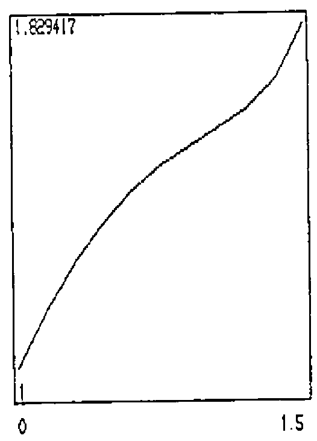
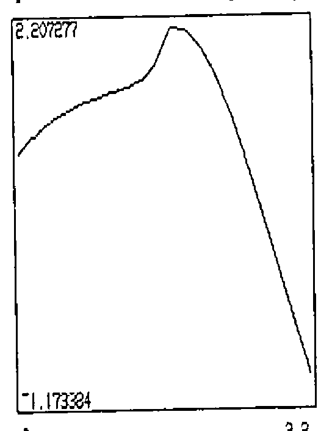

*by Walter G Spunde (Darling Downs Institute of Advanced Education, Queensland, Australia)*
{ .byline }

In engineering analysis, the shape of a function representing a continuous signal is deduced from values of the function recorded at a finite number of points. Fourier analysis and other advanced techniques may be involved to infer the general shape from a recorded sample. When students plot points in order to draw a graph, they are deducing, from *continuity* alone, the general shape of the functional relationship from a finite sample. This very simple exercise, apart from focussing on the concept of a function, can provide a contrast with the insight into a function’s behaviour obtained more quickly by the techniques of calculus, and it can also be a quite interesting exploration.

Usually the tedium of extensive calculation, however, exhausts any interest a student may have had in an arbitrarily given function long before the job of experimentation is complete. With the computing power now available to most high school students, this should no longer be the case. What is required is not (only) a graphing routine, where the emphasis is on producing a finished product but rather, a sampling routine, where the emphasis is on developing an adequate sample for the finished product. The ease with which this can be done by computer, may change our perceptions of the role of calculus in curve plotting.

The workspace `TABLES`, written in IAPL, was developed to meet the need for function sampling experience for engineering students at UCSQ. Students are introduced to IAPL in the first semester of their first year, and while they require very little training in APL to use it successfully in the linear algebra half of their course, it was thought desirable that they should have preprepared functions to handle sampling and plotting. The workspace `GRAPHS` draws full-screen graphs of the tabulated functions on a labelled grid. While it produces the final product, learning by observation takes place in executing `TABLES`.

A necessary pre-requisite to using `TABLES` is adequate exercise with function definition, and the evaluation of functions at a selection of points, so that students may fully understand what the computer is calculating. This program makes no allowances for singularities of functions and the graphing routine will join points on either side of a singularity. If points close enough to a singularity are chosen, then a vertical line will result at such a point. The possibility of `DOMAIN ERROR` cannot be avoided in IAPL, and actually it is not always desirable to shield students from encountering such an error - they may prove to be quite instructive. Students who have been frustrated in plotting points for log(x tan x) - where they will have no trouble finding points on the domain (-1,1) or even (-1.5,1.5) but domain errors on (-2,2), while nevertheless being able to calculate points in the domain (3.5,4.5), etc. will never again forget about the modulus sign when calculating logarithms - a thing which they mostly prefer to forget!

![The TABLES opening screen: “This workspace prepares tables of values for functions defined explicitly, in APL notation. A sample table for y = cos x is shown. Each table must be given a name, which should be unique. Several tables may be compiled at the one sitting. A list, containing the names of the tables, the definitions of the functions and the domain of the tabulations will be created and must also be given a name.” Beside it a table COSINE of x from ¯3.20 to 3.20 in steps of 0.80 with 2○X; below, LIST1: COSINE 2○X ¯3.2 ≤ X ≤ 3.2; SINE 1○X 0 ≤ X ≤ 6; CUBIC X POLY 1 ¯1 2 ¯3 ¯1 ≤ X ≤ 1](art10009260/tables.png)

`TABLES` compiles a table of sampled values and gives a plot of these points, together with maximum and minimum values attained, but without showing the position of the axes. Students may deduce the general shape and identify those regions in which more detailed sampling might be desirable, before copying the final tables over to `GRAPHS` for a ‘nice’ plot.

To illustrate the use of `TABLES`, two functions have been chosen. The first is the common y=tan x. The steepness of the function is not commonly noticed by students. Although it is well known that tan x becomes infinite at pi/2, its value at 1.5 is only 14.1 and the run into very large numbers (over 1000) only occurs between 1.57 and pi/2=1.57079.. Relative to the large increases in these small intervals around the singularities, the variation of the function between -1.5 and 1.5 is negligible.

The second function is drawn from a standard example used to illustrate the *variation in parameters* technique for solving differential equations.

A particular solution of the equation

> y″ + y = tan x

is obtained, using this method, as

> yp = cos x log|sec x + tan x|

Many students have no doubt found such a solution, but few, it seems, have any idea of the graph of this function. Most would believe that because both sec x and tan x become infinite at regular intervals, the logarithm of such a function (even multiplied by cos x) will be badly behaved. If they bother to apply L’Hospital’s Rule, they could disprove this, but they would probably not be stimulated to do so. A plot of the function running across the suspected singularities reveals that in fact no irregular behaviour occurs.

While the function is not even defined at the points pi/2 etc., it is nevertheless quite smooth and only a slight distortion of y= cos x.

For a slightly more interesting curve, the particular solution of

> y″ + y = tan x 
> with y(0) = y′(0) = 1

namely,

> y=2 sin x + cos x (1-log|sec x + tan x|)

has been tabulated and plotted.

## Some Comments on IAPL Development

Whilst the functions in these workspaces check some of the inputs, too much checking slows the execution on an XT to an unacceptable speed. As it is, the speed of the response is low enough to risk losing a student’s interest in the proceedings. For the same reason, more intricate menu programs had to be discarded. Space constraints dictated the tasks of tabulation and graphing be separated into two workspaces and that the functions remain uncommented.

File handling functions were developed to store and retrieve functions and tables in native files, but took up too much space and slowed execution too much to make it worth while keeping all operations in one workspace.

It was most annoying, incidentally, to have to reserve 2000 bytes, or 10% of the space we were allowing ourselves for functions and (text) variables, just to clear the screen. (Editorial comment - how about using `⎕AV[25⍴14]` or even `25 1⍴' '`?) The two-workspace structure means that students have to `)SAVE` and `)COPY` table lists which is unfortunately cumbersome.
