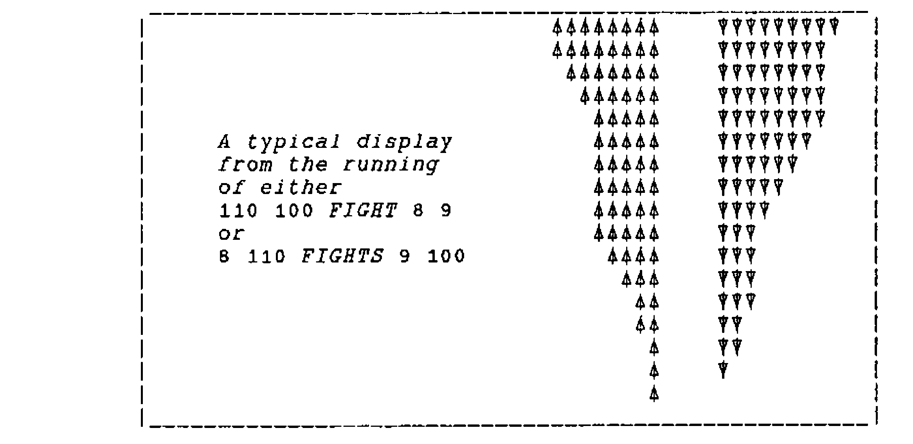

*by Walter G. Spunde, University of Southern Queensland*
{ .byline }

Teacher-prepared software for the mathematics classroom suffers by comparison with the sophisticated games software to which many children have become accustomed. There may be little prospect of competing with the commercial vendors, but animation and full screen colour scenes are only peripherals for attracting attention and stimulating mental activity. Creative power may be equally stimulating. The following sequence of microcomputer laboratory activities (using I-APL) has been run very effectively on several occasions with Grade 9 boys at a local Grammar school. The adventure game setting may not appeal to some teachers, but it certainly does appeal to those boys who enjoy playing computer fantasy games and who can therefore see the potential use for the material developed.

The problem presented is to produce strength bars tracing a battle between an adventurer and a goblin, or an orc, or some other monster.

In any APL activity, teachers must decide which functions (or vocabulary) to provide for students and there is no suggestion that the material given here should be introduced from scratch. Depending on the level of the students, many, or even all, of the functions described could be provided by the teacher, with students working only on improvements.

## Tracing the Battle

Let us assume that we have a function BAR which, given two numbers, (the combatants’ strengths) draws bars with lengths proportional to them, and a function RESULT which, given two numbers (the power or skill of the combatants) returns the result of a clash between them, `1` for a win to the HERO, `¯1` for a loss and `0` for a draw.

There are two distinct ways of tracing through the battle. One, which encourages thinking in terms of loops, involves a multi-line function (`FIGHTS`); the other a direct definition function (`FIGHT`) encourages recursive thinking.

Looping:

```apl
      Z←HERO FIGHTS ORC
[1] DRAW: BAR HERO[1],ORC[1]
[2]  →STOP IF 0 = HERO[1] × ORC[1]
[3]  SCORE ← RESULT HERO[2], ORC[2]
[4]  →(WIN, DRAW, LOSE) IF SCORE = 1 0 ¯1
[5] WIN: ORC[1] ← ORC[1] - 1
[6]  →DRAW
[7] LOSE: HERO[1] ← HERO[1] - 1
[8]  →DRAW ⍝ Run as e.g. 12 3 FIGHTS 15 4
[9] STOP: Z ← HERO[1],ORC[1]
```

Recursive:

```apl
      FIGHT: ⍺ FIGHT S AFTER ⎕←BAR S : 1∊(S←⍺ CLASH ⍵)=0 : BAR S
or    FIGHT: ⍺ CONTINUE S : 1∊(S←⍺ CLASH ⍵)=0 : CONCLUDE S
with  CONTINUE: ⍺ FIGHT ⍵ AFTER ⎕←BAR ⍵
      CONCLUDE: BAR ⍵
```

Here ⍺ are the powers and ⍵ the strengths of the players;

```apl
      CLASH: ⍵ - (¯1 1) ∊ RESULT ⍺
```

reduces the strengths as appropriate, and

```apl
      AFTER: ⍺
```

is simply a conjunction. Run as e.g. `3 4 FIGHT 12 15`.

The direct definition version requires that the vector of a player’s attributes (strength, power — and perhaps food, healing potions, etc.) must be split up to run `FIGHT`. This could be easily handled by a cover function such as `ENCOUNTERS: (⍺[2],⍵[2]) FIGHT ⍺[1],⍵[1]`. It is interesting to note that when students can see the need and significance of two, and more, numbers to describe the attributes of something, they have no trouble at all in working with higher dimension vectors.

## Drawing the Bars

Leaving 4 spaces between bars, with a maximum displayed length of 36, as in

```text
 ----------------------- ----- -----------------------
|          36           |  4  |          36           |
 ----------------------- ----- -----------------------
```

… we overwrite as many blanks on from 42 as the orc has strength with say the symbol ▼, and as many blanks back from 37 as the hero has strength with a different symbol:

![BAR: A AFTER A[38-⍳⍵[1]⌊36]←(hero symbol) AND A[41+⍳⍵[2]⌊36]←(orc symbol) AFTER A←77⍴' '](art10009280/bar.png)

For example, `BAR 12 15` gives


[For general purpose functions such as `AFTER`, `AND` and `IF`, see the appendix.]

## Modelling the Fight

In "fighting fantasies" the combat is simulated through the rolling of different coloured dice, i.e. producing two random numbers between 1 and 6 and comparing sizes. (Sometimes 12 or 20 sided dice are used.)

| | |
|---|---|
| We produce 2 random numbers with | `SCORES: ?⍵` |
| and calculate their differences with | `DIF: ⍵[1]-⍵[2]` |
| Determine the sign of a number with | `SIGN: ×⍵` |
| Find the result of an encounter with | `RESULT: SIGN DIF SCORES ⍵` |

Thus a "compiled" `CLASH` function could be given as:

```apl
      CLASH: ⍵-(¯1 1)∊×-/?⍺
```



Grade 9ers can get to the stage of writing their own `FIGHTS` function in less than an hour in the laboratory with no previous experience of the APL notation.

## Simple Extensions

A variety of minor extensions can be made to these functions. The simplest is to add a message to the end of the conflict. Using direct definition a simple solution might be

```apl
MESSAGE: 'Your adventure ends.' : 0<1↑⍵ : 'That''s one sorry orc.'
```

This could be executed at the `STOP:` line of `FIGHTS` as:

```apl
MESSAGE HERO[1]
```

or in the `CONCLUDE` function of `FIGHT` as

```apl
CONCLUDE: MESSAGE ⍵ AFTER ⎕←BAR ⍵
```

Students enjoy writing soul-destroying messages to the vanquished and the messages put up could be chosen at random from a matrix of message lines with `MAT[?N;]` where *N* is the number of lines in the matrix, *MAT*.

The number of refinements is limited only by enthusiasm. Each character may have a different symbol which is kept with the character information (strength, power, etc.) and then inserted in the left argument of *BAR*. The functions `FIGHT(S)` are symmetrical: there could be a modified one that gives an advantage to an attacker.

The hero’s strength could perhaps be recovered by healing potions or food. Functions `FIGHT(S)` could be modified so that they return not only values for the hero’s strength, but also perhaps increased skill. Perhaps superior equipment can be purchased, thereby increasing the power of a character. The vector of information stored about a character can become quite long.

The question of a player’s skill opens up several avenues of investigation. A player with a high power score could still score poorly in a clash. To reflect a level of skill, a player’s score might be given as `12+?7` rather than `?29`, giving a distribution with the same mean but different range. The teacher can provide functions to generate random numbers from any standard statistical distribution [see Anscombe, *"Computing in Statistical Science through APL"*, Springer-Verlag, 1981] without the student being aware of any of the intricacies involved in generating them; and of course students can try creating their own.

Delegating tasks to different student groups presents them with the need to write functions with inputs specified by others, and with outputs that another group will have to use.

## Re-modelling the Battle

The nature of the battle is, despite the above refinements, still a crude process of simply determining who scored the highest — like a simple game of cards. A more sophisticated battle might allow several choices of action, the success of which may well depend on the action chosen by the opponent. A popular game to model our battle on might be the age-old rock-paper-scissors, where any one of three strategies might win depending on the other’s choice. In a battle setting, the three options might be described as

1. to lunge with your sword
2. to block with your shield and parry
3. to cast a fireball spell.

With the same three options for the adversary, the payoff matrix for the "row player" is

```text
 0  ¯1   1
 1   0  ¯1
¯1   1   0
```

There is no reason why the two combatants should have the same set of three options available to them. All that is needed is a payoff matrix which determines the outcome for any pair of strategies. The positive entries could represent the number of strength points the HERO succeeds in deducting from his adversary for a win, and the negative entries the number he loses for a defeat. Students who have become excited by the activity have no problem in setting up and using larger payoff matrices (8×8 has been observed).

It is apparent that, in game theory terms, what we are dealing with here is not a zero-sum game. Both players can only lose strength, unless they decide not to fight at all, although they may gain in wealth and experience.

Developing a set of options and a payoff matrix is fun for children who enjoy "fighting fantasies", and may provide the opportunity to consider other types of games — zero sum games and games with saddle points. When it comes to determining optimal strategies to influence a skilful player’s choice, the level of mathematics involved soon goes beyond what Grade 9ers are usually exposed to. With a little bit of help 2×2 games can be solved graphically, but beyond that we must delve into linear programming for optimal solutions to *n* option games. If we allow more than two combatants, or non-zero sum games, where cooperation may be beneficial (unless double-crossed) then we approach the frontiers of mathematical research. The potential for extension is boundless.

## Setting up a Matrix Game

A set of functions that implement a matrix game could be used to investigate the possibility of optimal strategies through a sequence of simulations. One possible set of such functions is given below and may also demonstrate how one line of mathematics can become a heap of functions for the sake of displays — the great time-waster in using computers for mathematics.

In a matrix game, a decision in the encounter between the two combatants is obtained by simply looking up the entry in the corresponding position in the payoff matrix. If the choices of the protagonists are given in the left argument (⍺) and the current strengths in the right argument (⍵), revised strengths are returned by

```apl
      CLASH: ⍵ - ((-R≤0),(R≥0)) × R ← PAYOFF[⍺[1];⍺[2]]
```

where *PAYOFF* is assumed to be a defined global variable.

The choices for action in any particular encounter are delivered by a function *CHOICES* which may take different forms, but for speed of operation, we collect the player’s choice with a single key input and for convenience, we restrict the inputs to the numbers 1-9, thus limiting the dimensions of the *PAYOFF* matrix to 9×*n*. The input could be collected with the function

```apl
GETNUMBER: GETNUMBER: 1=(A≥48)∧(48+1↑⍴PAYOFF)≥A←INKEY : ⍎⎕AV[A+1]
```

(Functions such as *INKEY*, *AFTER*, etc. are listed in the Appendix.) The number of options for the opponent is not limited and a random choice of action is given by `?¯1↑⍴PAYOFF`. Thus

```apl
      CHOICES: GETNUMBER, ? ¯1↑⍴PAYOFF
```

The game is either continued or concluded, depending on whether either player’s strength has been reduced to zero or below:

```apl
      GAME: CONTINUE S : 1 ∊ (S ← CHOICES CLASH ⍵) ≤ 0 : CONCLUDE S
```

As before, continuation of the battle requires us to draw the strength bars and re-play the GAME:

```apl
      CONTINUE: CHOICES GAME ⍵ AFTER DRAWING ⍵
```

*DRAWING* the strength bars may be done simply as before, or we may decide to use the *PGRAPH* functions. It is when we make the decision to "improve the presentation" that we open the door to masses of details about layout, and to generating possibly messy code, of no mathematical interest, in large quantities. It is better to allow students to by-pass the definitions of these functions by providing them with the functions to fiddle around with if they choose to do so.

One possible solution to the problem of drawing the strength bars is to draw two bars at a given spot on the screen, and black out the ends of the bars as strength points are lost:

```apl
      SETUPBAR: 1 HBAR 300 300 + ⍵ AFTER ¯1 HBAR 300 300
```

where *HBAR* draws "points" of 200×20 pixels, in white when the left argument is `¯1` and in black when it is `1`:

```apl
      HBAR: (32767 250 ¯1,⍺,200 20 0 30 0 20) PGPLOT ((⍴⍵),1)⍴⍵
```

The x-coordinates of the bottom left corner of the "points" is given by the right argument, and the y-coordinate is set at 250. This, of course, may not be suitable for all screens or tastes.

The drawing function is, assuming the HERO’s strength is shown on the upper bar:

```apl
      DRAWING: 1 HBAR ⌊(300 300)+ ⌽⍵
```

To end the game, returning the final strength of the HERO as the result of the function, we define

```apl
      CONCLUDE: (0⌈1↑⍵) AND MESSAGE ⍵ AFTER DRAWING ⍵
```

where *MESSAGE* chooses some text to be displayed. For example, we could have

```apl
      MESSAGE: ⎕ ← (2 8⍴'Got him!Too bad!')[1+0≥1↑⍵;]
```

The game could be run by executing the function

```apl
      PLAY: CHOICES GAME ⍵ AFTER SETUPBAR ⍵
```

## Displaying the Game

Running this implementation of the game is a bit unsatisfactory, because, while we can see the strength bars changing in size, there is no indication of why. This sort of game demands that not only should the strength bars be displayed, but also the actions taken by each of the combatants. Ideally this would be in terms of the movements of graphical figures, but a simpler, although not entirely satisfactory, solution is to give a text description of the action.

In order to do this there must be lists describing each of the options available to the two players. Assuming these are held in the global variables *⍙HERO* and *⍙ORC*, the descriptions can be written at an appropriate spot on the screen with:

```apl
DISPLAY:⍵ AND(200,255)WRITE 10↑⍙HERO[⍵[1];]AND(350,255)WRITE ⍙ORC[⍵[2];]
```

The pixel coordinates (200,255) and (350,255) have again been chosen to suit a particular layout relative to the strength bars.

The display of the choices is handled by the function

```apl
      SHOWCHOICES: ,10 : 10≠1↑A←CHOICES : DISPLAY A AFTER CLEAR
```

where

```apl
      CLEAR: (3 55⍴' ') PUT 5 20
```

is used to clear the chosen writing space.

The controlling function is adjusted to

```apl
      PLAY: SHOWCHOICES GAME ⍵ AFTER SETUPBAR ⍵
```

and the continuation function to

```apl
      CONTINUE: SHOWCHOICES GAME ⍵ AFTER DRAWING ⍵
```

Another feature has been added to the game by allowing the player to Escape from the battle instead of continuing. This is done in modifying the *GETNUMBER* function to return a single number (10) if the Esc key is pressed. *SHOWCHOICES* also returns 10 in this case.

```apl
GETNUMBER: CHECK A : 1=(A≥48)∧57≥A←INKEY : (⍎⎕AV[A+1]) ANY 1↑⍴⍙PAYOFF
CHECK: GETNUMBER : ⍵=27 : 10
ANY: ⍺ : (⍺>⍵)∨⍺=0 : ?1↑⍵
```

Provision has also been made to return a random choice if a number outside the range of options is entered, through the function *ANY*.

The *CLASH* function must be modified to take note of the escape option:

```apl
CLASH: ⍵[1],¯10 : 2=⍴⍺ : ⍵-((-A≤0),(A≥0))×A←⍙PAYOFF[⍺[1];⍺[2]]
```

The appearance of the game can be made a little less bare by providing more information on the screen. The function

```apl
SCREEN: SETUP ⍵ AND SETUPBAR ⍺ AND 'Hero' SETUPWRITE 'ORC' AND CLS
```

calls a number of display functions listed in the Appendix, and replaces *SETUPBAR* in the original *PLAY*:

```apl
PLAY: SHOWCHOICES GAME ⍵ AFTER A←CRS 15 0 AND ⍵ SCREEN ⍙HERO
```

Finally, to help set up a game, a separate *SETUPGAME* function may be defined. It is simplest to do this in a multi-line function such as the one listed in the Appendix below.

## APPENDIX: A Set of Functions for Matrix Games.

### 1. Control

```apl
PLAY: SHOWCHOICES GAME ⍵ AFTER A←CRS 15 0 AND ⍵ SCREEN ⍙HERO AND PGWHEEL 1+?16
GAME: CONTINUE S : 1∊(S←⍺ CLASH ⍵)≤0 : CONCLUDE S
CLASH: ⍵[1], ¯32767 : 2=⍴⍺ : ⍵-((-A≤0),(A≥0))×A←⍙PAYOFF[⍺[1];⍺[2]]
```

### 2. Input

```apl
CONTINUE: SHOWCHOICES GAME ⍵ AFTER DRAWING ⍵
SHOWCHOICES: ,10 : 10≠1↑A←GETNUMBER,?1↑⍴⍙PAYOFF : DISPLAY A AFTER CLEAR
GETNUMBER: CHECK A : 1=(A≥48)∧57≥A←INKEY : (⍎⎕AV[A+1]) ANY 1↑⍴⍙PAYOFF
CHECK: GETNUMBER : ⍵=27 : 10
ANY: ⍺ : (⍺>⍵)∨⍺=0 : ?⍵
DRAWING: 1 HBAR⌊(300 300)+⌽⍵
DISPLAY: ⍵ AND (200,255) WRITE 10↑⍙HERO[⍵[1];] AND (350,255) WRITE ⍙ORC[⍵[2];]
CLEAR: (3 55⍴' ') PUT 5 20 AND PGWHEEL?16
```

### 3. Output

```apl
CONCLUDE: (0⌈1↑⍵) AND MESSAGE ⍵ AFTER DRAWING ⍵
MESSAGE: ⎕←'The end of your adventure' : 0<1↑⍵ : RUNAWAY ⍵
RUNAWAY: ⎕←'OK, run!' : ¯32767≠¯1↑⍵ : ⎕←'That''s one sad and sorry orc.'
```

### 4. Screen

```apl
SCREEN: SETUP ⍵ AND SETUPBAR ⍺ AND 'Hero' SETUPWRITE 'ORC' AFTER CLS
SETUP: ⎕←'Enter you choices:',⎕AV[14],'   (0 for random)' AND SETUPSKILLS ⍵
SETUPSKILLS: 1 2 SHOW '∨-∧-' BORDER NUMBER ⍵
SHOW: ((' '⍪' ',⍵,' ')⍪' ') PUT ⍺
BORDER: (⍺[1]⍪(⍺[4],' ',⍵,' '),⍺[2])⍪⍺[3]
NUMBER: (⍕(N,1)⍴⍳N←1↑⍴⍵),' ',⍵
SETUPBAR: 1 HBAR 300 300+⌽⍵ AND ¯1 HBAR 300 300
SETUPWRITE: ((290-16×⍴⍵),285) WRITE ⍵ AND ((290-16×⍴⍺),315) WRITE ⍺
```

### 5. Setup

```apl
 SETUPGAME;⍙Options
l1:⍙PAYOFF←ASK 'Name of PAYOFF matrix '
 →Error1 IF 2≠⎕NC ⍙PAYOFF
 →Error2 IF~NUMERIC ⍙PAYOFF←⍎⍙PAYOFF
 →Error3 IF 2≠⍴⍴⍙PAYOFF
l2:⍙Options←ASK 'Name of OPTIONS list '
 →Error4 IF 2≠⎕NC ⍙Options
 →Error5 IF NUMERIC ⍙Options←⍎⍙Options
 →Error6 IF (1↑⍴⍙Options)≠+/⍴⍙PAYOFF
 →Complete
Error1:→(l1,0)[ESC] AND ⎕←'Not a defined matrix.'
Error2:→(l1,0)[ESC] AND ⎕←'Not a numeric matrix.'
Error3:→(l1,0)[ESC] AND ⎕←'This is a higher dimensional array.'
Error4:→(l2,0)[ESC] AND ⎕←'Not a defined list.'
Error5:→(l2,0)[ESC] AND ⎕←'List of options for two players required.'
Error6:→(l2,0)[ESC] AND ⎕←'No. of options doesn''t match PAYOFF.'
Complete:⍙HERO←⍙Options[⍳1↑⍴⍙PAYOFF;] AND ⍙ORC←((1↑⍴⍙PAYOFF),0)↓⍙Options
 '-- Global variables ⍙PAYOFF, ⍙HERO and ⍙ORC have been defined.'
```

### 6. General

```apl
AND: ⍺
AFTER: ⍺
CRS: : ×⍴⍴(T←204,2↑⍵,¯1 ¯1) Do '' : 1↓T
CLS: (' ' Fil 0 0 25 80) : 2<1↑⍴A←CRS 0 0 : CLS
HBAR: (32767 250 ¯1,⍺,200 20 0 30 0 20) PGPLOT ((⍴⍵),1)⍴⍵
WRITE: (⍺,0 240 1 1 1) PGTEXT ⍵
PUT: (201,⍵) Do ⍺
INKEY: (T,,11519 ⎕MC 2 1⍴'TT',0⍴T←11 0)[⎕IO+1]
PGPLOT: 101 Do ⍵ : ×⎕NC '⍺' : (101,⍺) Do ⍵
PGTEXT: (105,⍺) Do ⍵
PGWHEEL: 103 Do ⍵
Do: ⍺←11519 ⎕MC 1 2 1⍴'⍺⍵'
Fil: (203,⍵) Do ⍺
ASK: ⍵ : 0≠⍴Z←(⍴P)↓⍞ AND ⍞←P←⍵,':' : Z
NUMERIC: 0=0\0⍴⍵
IF: ⍵/⍺
ESC: 1+27=INKEY AFTER ⎕←(20⍴' '),'-- Tap any key to continue; Esc to quit.'
```
