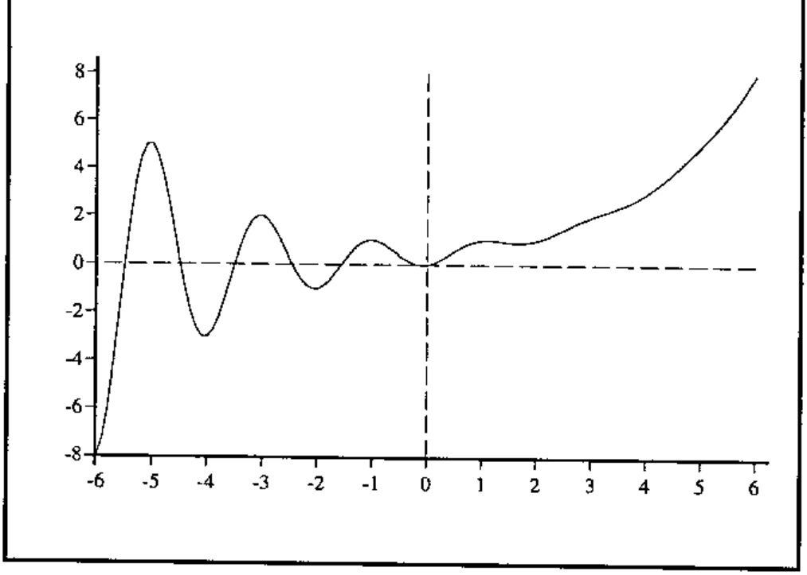
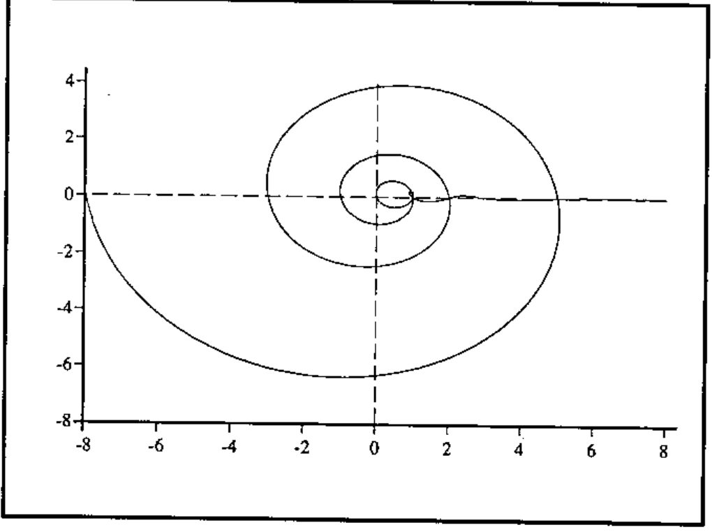
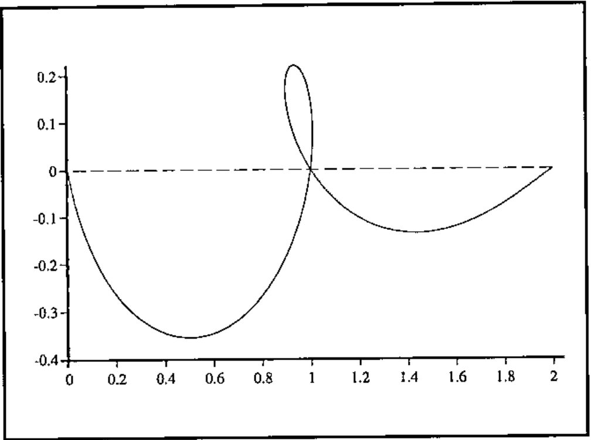

*by John Sullivan*
{ .byline }

Joseph De Kerf returns to the subject of Fibonacci’s sequence in Vol.15 No.3[1]. In his article he gives a function for the calculation of the terms of the Fibonacci sequence which only uses the first term of the golden section formula and rounds off:

```apl
    ∇ F←FIB1 N;R
[1]   F←⌊0.5+(÷R)×(0.5×1+R←5×0.5)*N
    ∇
```

The Fibonacci sequence, like others defined by recurrence relations, is normally defined for positive integers only

> *F*<sub>*n*</sub> = 1  if *n* = 1 or 2<br>
> *F*<sub>*n*</sub> = *F*<sub>*n*−2</sub> + *F*<sub>*n*−1</sub>  if *n* > 2

or for non-negative integers

> *F*<sub>*n*</sub> = *n*  if *n* = 0 or 1<br>
> *F*<sub>*n*</sub> = *F*<sub>*n*−2</sub> + *F*<sub>*n*−1</sub>  if *n* > 1

depending on whose textbook you read, but I prefer to define it as the second way with "if *n* > 1" replaced by "otherwise", which, of course, allows negative values. The values for negative *n* are the same in absolute value as those for positive *n*, but the signs alternate. In order to generate values for negative *n* as well as positive *n* you will need both terms of the golden section formula:

```apl
    ∇ F←FIB2 N;R
[1]   F←⌊0.5+(÷R)×((0.5×1+R)*N)-(0.5×1-R←5*0.5)*N
    ∇
```

We can see the difference between these two functions as follows:

```apl
      FIB1 ¯4 ¯3 ¯2 ¯1 0 1 2 3 4
0 0 0 0 0 1 1 2 3
      FIB2 ¯4 ¯3 ¯2 ¯1 0 1 2 3 4
¯3 2 ¯1 1 0 1 1 2 3
```

## What Now?

Having extended the "normal" domain of the Fibonacci sequence to the negative integers, the most natural follow-up question is "Can we extend the Fibonacci sequence to the real or complex numbers?" and, unsurprisingly, the answer is "yes". What we are after is a function *f*(*x*) with *x* ∈ ℝ or *x* ∈ ℂ, such that *f*(*x*) takes the Fibonacci values when *x* is a real integer, and *f*(*x*) = *f*(*x* − 2) + *f*(*x* − 1) for all *x*. There are one or two mathematical considerations to be overcome in converting the golden section formula into a function of a continuous variable, but the process is straightforward. The main points are as follows.

### A real function

Before we can turn integer *n* into real *x*, we need to get rid of the negative term in the *n*th term formula. We can do the following:

> (1 − √5)/2 = (1 − √5)(1 + √5) / 2(1 + √5) = −4 / 2(1 + √5) = − 2 / (1 + √5)

so, if we let *a* = ½(1 + √5) we obtain *F*<sub>*n*</sub> = (1/√5)(*a*<sup>*n*</sup> − (−*a*)<sup>−*n*</sup>).

Since *n* is an integer, (−*a*)<sup>−*n*</sup> = (−1)<sup>*n*</sup>*a*<sup>−*n*</sup>, and we note that (−1)<sup>*n*</sup> has the same values as cos *n*π for all *n*. Now we can replace integer *n* with real *x*, define *a*<sup>*x*</sup> = *e*<sup>*x* log *a*</sup>, and obtain a continuous real function: *f*(*x*) = (1/√5)(*a*<sup>*x*</sup> − *a*<sup>−*x*</sup> cos π*x*).

The real-valued Fibonacci function in APL is very easy:

```apl
    ∇ z←Fibfn x;s
[1]   z←0.5×1+s←5*0.5
[2]   z←((z*x)-(2○○x)×z*-x)÷s
    ∇
```

### The complex case

The complex case is a bit easier, because we can use the golden section formula direct. In order to write an APL function for the complex case, we need a suite of appropriate complex arithmetic functions. I decided to amend a suite published by Prof. A Hawkes [2], rather than write my own. The complex Fibonacci function looks like this:

```apl
    ∇ z←FibfnC x;s;ns
[1]   x←COMPLEX x
[2]   z←COMPLEX 0.5×1+s←5*0.5
[3]   z←((z EXP x)-(-z)EXP-x)DIV COMPLEX s
    ∇
```

## What do they look like?

Here is a graph of the real function. Note that the curve to the left of the origin is a quite interesting variant on the damped sine wave, as the following extract showing *f*(*x*) against *x* between *x* = ±6 shows.



For the complex function we can plot the imaginary part against the real part for real *x* between ±6:



As it is a bit difficult to see what is going on when *x* = 1, here is an enlargement of the part where 0 ≤ *x* ≤ 3



## References and Acknowledgements

1. J. De Kerf, *From Fibonacci to Horadam*, *Vector*, Vol.15 No.3, p.122.
2. Alan G. Hawkes, *Complex Numbers in APL*, *Vector*, Vol.1, No.1, pp.107–120.

All the graphs were drawn with *Rain* publication graphics for APL, available from Causeway Graphical Systems Ltd.
