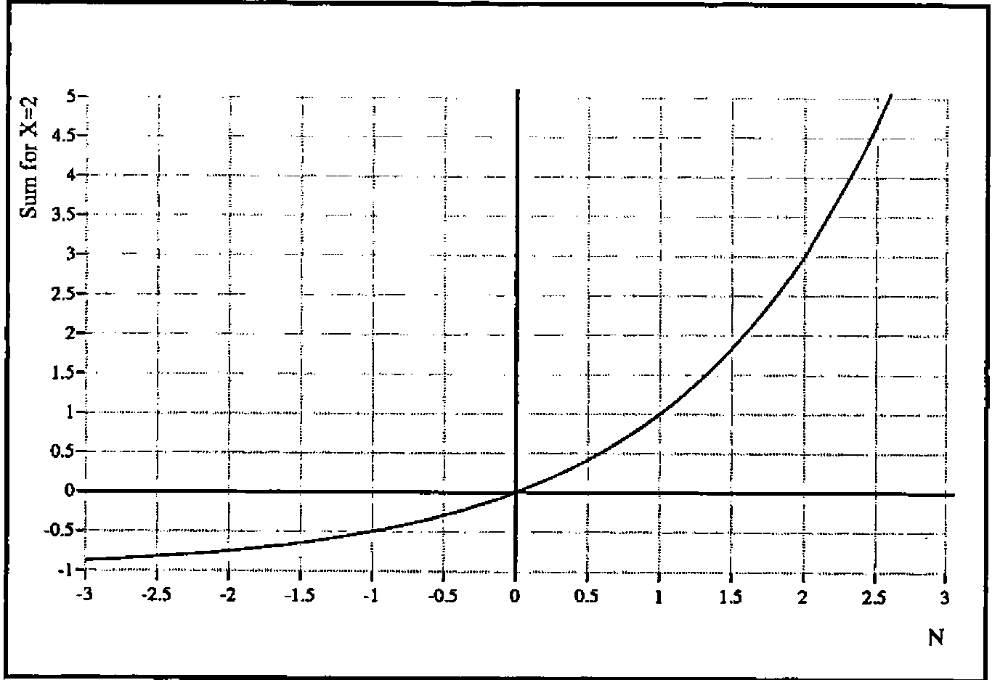

*by J.R. Sutton*
{ .byline }

In Jot-Dot-Floor (Education Vector 11.1, pp. 31–35) the author refers to the series:

<p>Σ<sub><i>n</i>=0</sub><sup><i>N</i>−1</sup> X<sup><i>n</i></sup> = (X<sup><i>N</i></sup> − 1)/(X − 1) &nbsp;&nbsp;&nbsp;&nbsp;(1)</p>

and asks why it doesn’t work for fractional N. Start with the case X=1:

<p>Σ1<sup><i>n</i></sup> = 0/0</p>

but the RHS can be evaluated by taking the limit X=1+delta as delta approaches zero. So

<p>1 + 1 + 1 + … = N</p>

which is just the count of the terms in the sum. It looks reasonable that a fractional number of terms will count to the fraction. (Much as N=0 counts the empty series.)

In the general case the RHS of equation 1 can be evaluated just as easily for fractional (or irrational or transcendental) N as for integers so, whatever the fractional series means, we can define its sum as whatever the RHS evaluates to. For example with X=4 and N=2.5 the sum is 31/3. Staying with X=4 and various N we have:

| N | Sum | N | Sum |
|--:|--:|--:|--:|
| 1 | 1 | 1.5 | 2.333.. |
| 2 | 5 | 2.5 | 10.333.. |
| 3 | 21 | 3.5 | 42.333.. |
| 4 | 85 | 4.5 | 170.333.. |

Negative values of N are not a problem. For N=−1

<p>(X<sup>−1</sup> − 1)/(X − 1)</p>

evaluates to −1/X and for the general case of negative integer N to

<p>−1/X − 1/X<sup>2</sup> − 1/X<sup>3</sup> …</p>

This can be understood as follows. To go from N=2 to N=1 take away the term with n=1. To go from N=0 to N=−1 take away the term with n=−1. Fractional negative N just combines this concept for negative N with that for fractional N.

The graph shows the sum for X=2 and a continuous range of N from −3 to 2.6 as an example. The shape of the curve is, of course, exponential.

```apl
      )load rain
      xx← ¯3+0.1×0,⍳56

chset ('style' 'boxed,xyplot,nomark,grid')
chset ('yint' 0)('xint' 0)('xcap' 'N')('ycap' 'Sum for X=2')
chset ('nib' 'medium')
chplot  xx,[1.5] ¯1+2*xx
View chclose
```



Dr J R Sutton
