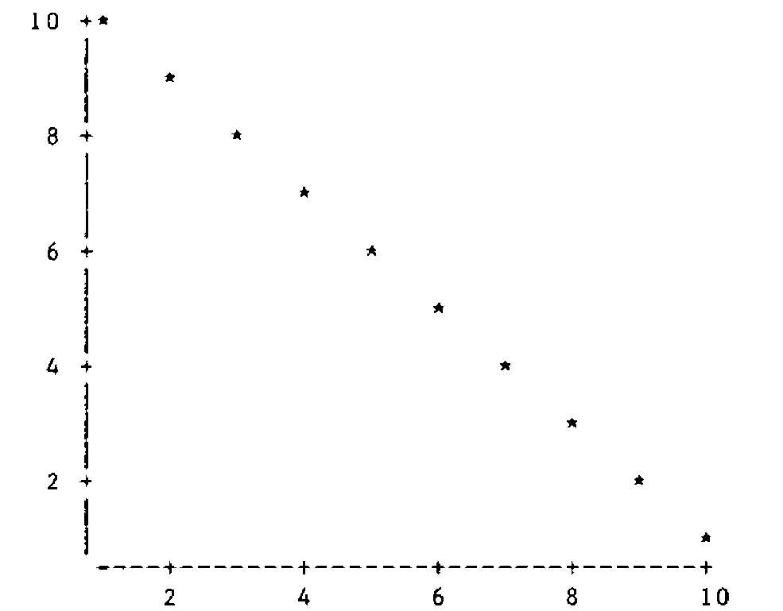
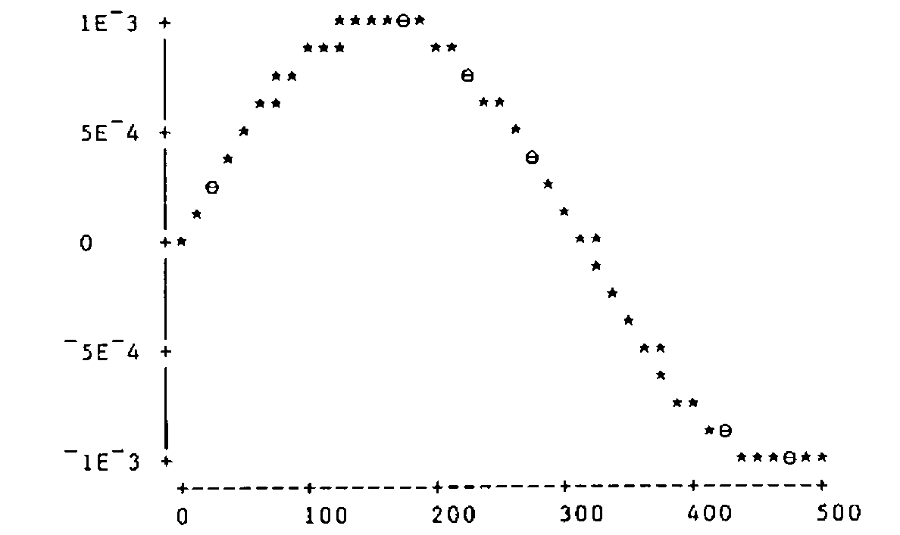
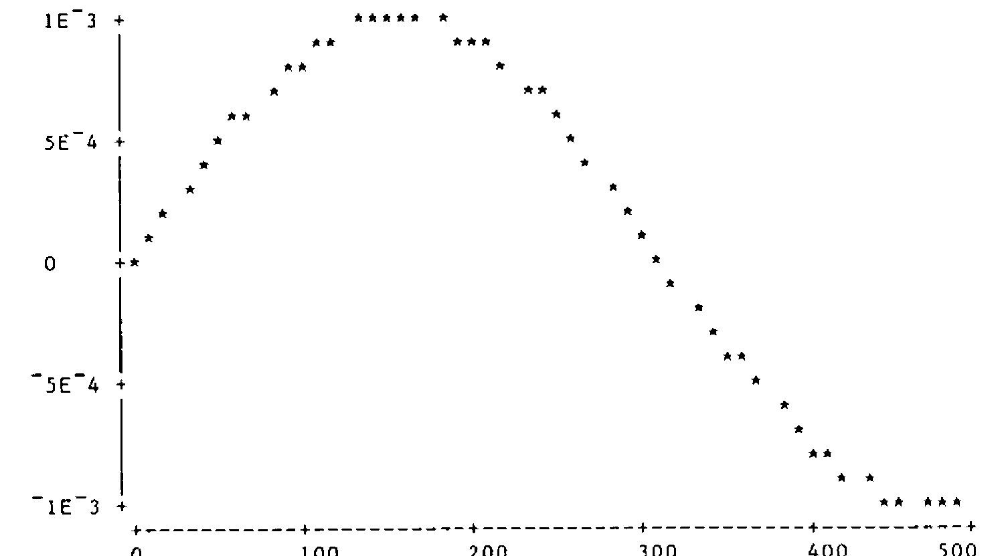

by Alan Sykes
{ .byline }

## Introduction

As some readers will know, the department of Management Science and Statistics at Swansea uses APL extensively in its teaching of Statistics. Most of our students use DEC APL on a micro-vax and although we have a comprehensive APL graphics workspace with output to a Hewlett-Packard graph plotter, nevertheless it is useful to have a character-graphics scatterplot which will work on any APL machine/terminal combination!

For too long our scatterplot program had rudimentary information on the axes. A bout of influenza gave me a chance to stay at home and use an IBM PC to produce a scatterplot that looks as good as it can when limited to using characters only. Scatterplots in the APL literature seem to stop short of a full-blown version with automatic choice of sensible tic-values and so the following program may find a use for someone somewhere.

## Requirements

What was needed was a generally useful scatterplot representation of x-y data using characters only. Axes with tic-marks and tic-values were required.

## High-level Design

After looking at a number of scatterplot diagrams in books, together with output from stats packages such as GLIM and MINITAB, I decided on the following design criteria:

**Size.** The overall size of the plot was to be variable. This was advantageous in allowing flexibility of proportions on the screen and also to allow a large plot to be sent to the printer. (One of tbe problems with character plots on the screen is that non-equal x or y values can become equal when printed, leading to possible distortion of underlying curves. When there are many data points this effect can be very noticeable and potentially misleading.)

**Multiple points.** Genuine or non-genuine multiple points should be denoted by different characters, so I decided on the convention of using three different characters, one for a single point, one for a double point, and one for three or more points.

**Tic-marks and axes.** The axes were to be represented by horizontal and vertical dashes interspersed at regular intervals with a ‘+’ sign.

**Tic-values.** These should be chosen to be appropriate multiples of powers of 2,5 or 10 to give neat-looking numbers. The values should be printed adjacent to the tic-marks and (where appropriate) to left-justify them. The number of such tic- marks should be under user control as far as possible, though default settings should normally produce non-overlapping labels.

## Further Design Details

Global variables …

`∆CHARPLOT`
:   a four element character vector giving the plotting characters. The default setting is `' ⋆⊖⍟'`

`∆NCHAR`
:   a two element vector denoting the target size of the actual plotting matrix. For a conventional 80 by 25 screen, the recommended default value for `∆NCHAR` is 60 18.

`∆NTIC`
:   a two element vector denoting the target number of tic marks on each axis. It is not possible to specify `∆NTIC` completely if sensible tic-values are to be chosen automatically. The actual number is usually at least that specified and values of 2 2 or 4 4 work well most of the time.

APL functions …

```
PLOT (R←yvar PLOT xvar)     ... the end product

∆CHOOSETIC (PAR←axis_number ∆CHOOSETIC min_val max_val)
```

This is an adaptation of an equivalent program for high-resolution graphics plotting. The left argument is 1 for the x axis and 2 for the y axis. The right argument is a two element vector denoting the range of the data on that axis.

The result `PAR` is an eight element vector of parameters defining the axis details as follows:

```
PAR[1] overall length of axis in characters;
PAR[2] tic-length in characters;
PAR[3] number of characters before the first tic-mark;
PAR[4] number of characters after the last tic-mark;
PAR[5] tic-length in mathematical units;
PAR[6] the value of the first tic-mark;
PAR[7] the value of the last tic-mark;
PAR[8] the number of complete intervals.
```

The motivation for `PAR[3 4]` is that one does not want to waste the use of valuable space on the screen by extending the axes to the next tic-marks beyond the range of actual values (as one might in a high-resolution graphics package).

```
∆CONV (T←par ∆CONV data)
```

The left argument `PAR` contains the parameters of the axis, the right argument contains the data for that axis, and the result is an integer representation of the data vector compatible with the choice of tic-marks and axis specification. There are a number of ways that the raw data can be converted to integer values, but care must be taken so that recorded values equal to tic-values are actually represented accordingly.

## Function Listings:

```apl
     ∇ R←Y PLOT X;MIX;MAX;MIY;MAY;PARX;PARY;T;⎕IO;C;D;MU;F;I
[1]    ⎕IO←1 ⋄ 2 1 ⍴' '
[2]    →(0≠⍴R←(33×(⍴X)≠⍴Y)⍴'ARGUMENTS HAVE UNEQUAL DIMENSIONS')/0
[3]    MIX←⌊/X ⋄ MAX←⌈/X ⋄ MIY←⌊/Y ⋄ MAY←⌈/Y
[4]    →(0≠⍴R←(16×1=(MIY=MAY)∨MAX=MIX)⍴'DEGENERATE RANGE')/0

[5]  ⍝ CALCULATE PARAMETERS FOR X AND Y AXIS

[6]    PARX←1 ∆CHOOSETIC MIX,MAX ⋄ PARY←2 ∆CHOOSETIC MIY,MAY
[7]    R←'TOO MANY TIC MARKS REQUESTED - CHANGE ∆NTIC' ⋄
       →((0=PARX[2])∨0=PARY[2])/0

[8]  ⍝ TRANSFORM THE DATA

[9]    D←(PARY ∆CONV Y),[1.5]PARX ∆CONV X ⋄ C←PARY[1],PARX[1]
[10]   R←(×/C)⍴0 ⍝ CALCULATE FREQUENCIES FOR EACH POINT OF X-Y PLOT
[11]   I←∨/D≠1⊖D←D[⍋D;] ⋄ I[⍴I]←1 ⋄ MU←I⌿D ⋄ F←(1↓I)-¯1↓I←0,⍳/⍳
[12]   R[(C⊥⍉MU)-C[2]]←F ⋄ R←⊖C⍴R
[13]   R←∆CHARPLOT[4⌊1+R]

[14] ⍝ ADD Y AXIS

[15]   Y←(1↑⍴R)⍴'|'
[16]   Y[(1+PARY[3])+PARY[2]×0,⍳PARY[8]]←'+'
[17]   R←(⊖Y),R

[18] ⍝ ADD  X AXIS

[19]   X←(¯1+¯1↑⍴R)⍴'-'
[20]   X[(1+PARX[3])+PARX[2]×0,⍳PARX[8]]←'+'
[21]   R←R,[1]' ',X
[22]   R←' ',R

[23] ⍝ CALCULATE AND ADD Y TIC VALUES

[24]   Y←⍕((⍴Y),1)⍴Y←PARY[6]+PARY[5]×0,⍳⌊(-/PARY[7 6])÷PARY[5]
[25]   X←PARY[1]⍴0 ⋄ X[(1+PARY[3])+PARY[2]×0,⍳PARY[8]]←1
[26]   Y←X\[1]Y ⋄ R←((⊖Y),[1]' '),R

[27] ⍝ CALCULATE X TIC VALUES AND CHECK FOR SUFFICIENT SPACE

[28]   X←⍕((⍴X),1)⍴X←PARX[6]+PARX[5]×0,⍳⌊(-/PARX[7 6])÷PARX[5]
[29]   X←(0⌈+/∧\X=' ')⌽X
[30]   T←PARX[2]-¯1↑⍴X ⋄ →(T<0)/ER

[31] ⍝ ADD X TIC VALUES

[32]   X←((2+(¯1↑⍴Y)+PARX[3])⍴' '),,(-T)↑,X,((1↑⍴X),T)⍴' '
[33]   T←(¯1↑⍴R)-⍴X ⋄ X←X,(0⌈T)⍴' '
[34]   R←R,((1↑⍴R),0⌈-T)⍴' ' ⋄ R←R,[1]X ⋄ →0
[35] ER:'INSUFFICIENT SPACE FOR TIC MARK LABELS ON THE X AXIS'
[36]   'MISSING LABELS ARE ',,X
     ∇
```

```apl
     ∇ P←N ∆CHOOSETIC X;RA;A;C;B;R;I
[1]    RA←--/X ⋄ P←8⍴0

[2]  ⍝ RA IS THE RANGE: CALCULATE SUITABLE BASE FOR TIC VALUES

[3]    A←10*⌊10⍟C←RA÷∆NTIC[N] ⋄ B←C÷A
[4]    B← 1 2 5 10 [1++/B> 1.4 3.2 7.1]

[5]  ⍝ FIND R=P[1]=NUMBER OF CHARACTERS FOR RANGE OF AXIS
[6]  ⍝P[5]= MATHEMATICAL TIC-LENGTH P[6]= VALUE OF FIRST TIC MARK

[7]    P[5]←R←B×A ⋄ P[6]←R×⌈X[1]÷R ⋄ P[7]←R×⌊X[2]÷R

[8]  ⍝ P[8]= NUMBER OF COMPLETE INTERVALS P[2]= TIC-LENGTH IN
       CHARACTERS

[9]    P[8]←(-/P[7 6])÷P[5] ⋄ P[2]←⌊∆NCHAR[N]×R÷RA

[10] ⍝ P[3 4]= NUMBER OF TIC CHARACTERS BEFORE (AFTER) FIRST
       (LAST) TIC-MARK

[11]   P[3 4]←⌊0.5+(1 ¯1)×(P[6 7]-X[1 2])×P[2]÷P[5]
[12]   P[1]←1+P[3]+P[4]+P[8]×P[2]

[13] ⍝ AMEND ACCORDING TO WHETHER P[3 4] EQUAL TIC-LENGTH IN CHARS

[14]   P[3 4]←P[3 4]×~I←P[2]=P[3 4]
[15]   P[6 7]←P[6 7]+(¯1 1)×I×P[5]
[16]   P[8]←P[8]++/I
     ∇
```

```apl
     ∇ R←P ∆CONV X;D
[1]  ⍝ CONVERTS RAW DATA TO INTEGER DATA ACCORDING TO
       SPECIFICATION FROM P

[2]    D←⌊X÷P[5] ⋄ R←X-D←D×P[5]
[3]    D←(D-P[6])÷P[5]
[4]    R←P[1]⌊1+(D×P[2])+P[3]+⌊0.5+R×P[2]÷P[5]
     ∇
```

## Some Examples

Set `∆NCHAR` to 40 18 and `∆NTIC` to 4 4. (These are quite good default values for general usage. To test the accuracy of the plot try:

```apl
      (11-⍳10) PLOT ⍳10
```



Varying values of `∆NTIC` (whose components do not have to be equal of course) alter the choice of the interval widths. For this graph, a value of 1 in `∆NTIC` results in an interval of width 10, 2 gives interval width 5, 3 4 5 and 6 all give width 2, 7 8 9 and 10 all give width 1. Ultimately you run out of space and may either get no plot at all, or perhaps , one without tic-values on the X-axis.

To consider the effect of differing sizes of diagrams, consider a plot of `Y←.001×1○.01×X` against `X←10×0,⍳50`:



and the effect of crowding is apparent. Changing `∆NCHAR` to 60 20 gives:



which is a little smoother. Note that the actual size of this is 70 by 23 and not 60 by 20. So the programs appear to produce sensible plots with good choices of tic-values, but we have to pay for this facility by not having complete control over the number of tic-marks and the total size of the plot.

## Efficiency

`PLOT` does not produce instantaneous results as there are many involved calculations necessary. (I hope there are no unnecessary ones!) Where efficiency considerations are important is in the calculation of the frequencies to be attached to each point of the plotting region. The obvious APL one-liner (which could replace lines 10, 11 and 12 of `PLOT`)

```apl
R←((PARY[1]+1-⍳PARY[1])∘.=Y)+.×X∘.=⍳PARX[1]
```

…is rather slow, as it creates two potentially large boolean matrices and then multiplies them together. David Ziemann’s recent talk on efficiency (see VECTOR 4.4, April 1988) points to more efficient methods. Lines 10, 11 and 12 of `PLOT` calculate unique pairs of X,Y values by using ⍋ on a matrix, hence finding their associated frequencies, assigning these to appropriate values of a vector (initially of zeros) and then reshaping. This technique works well for producing two-way frequency tables when working with character data from a database. But that’s another story.

## Editor’s Note

I have used Alan’s approach very successfully in designing simple barcharts which can be ‘popped up’ in text windows. A handy feature of the PC character set is the presence of half-width and half-height bars, so with a simple modification to his code you can get a screen resolution of 50 by 160, and yet still be in text mode.
