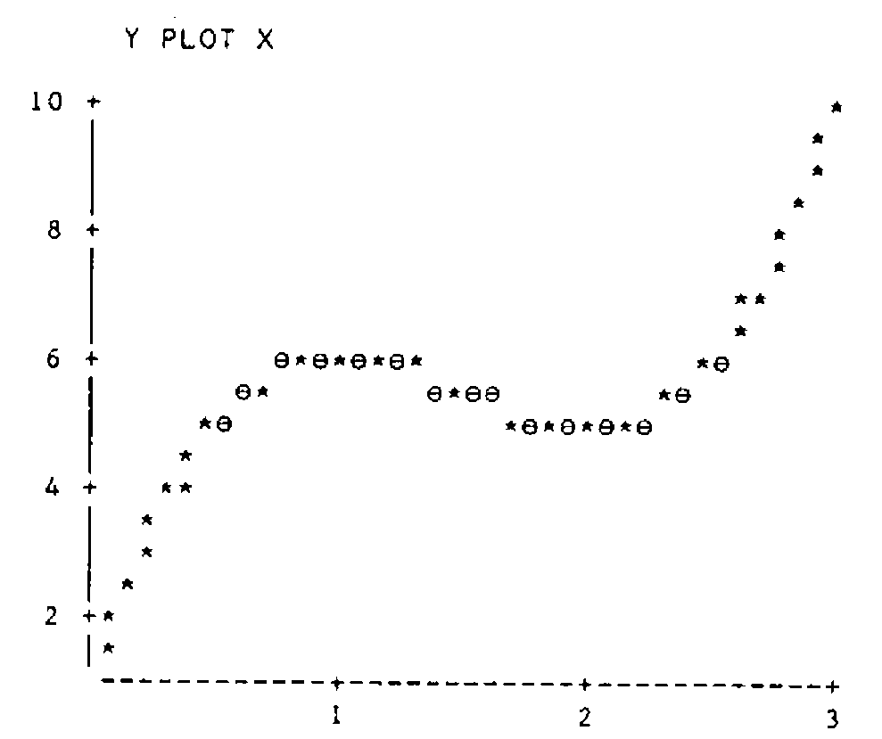

by Alan Sykes
{ .byline }

## Introduction

The vast majority of numeric procedures on a computer are done using numbers to the base 10. There are however occasions where one needs to represent numbers to different bases. APL offers facilities to change numbers from base 10 to other bases and vice versa. Although I have used APL for about six years, only recently have I become aware of how useful these facilities are. So this article attempts to explore numbers and bases and presents one or two unexpected applications.

## Decode and Encode

Somewhere(!) on your APL keyboard you will find the two symbols `⊥` and `⊤`, called decode and encode respectively. Basically decode is used to decode a vector representing the digits of a representation to its conventional representation in base 10. Encode does the reverse operation. Here are a few examples to introduce them to you. First of all let’s use encode.

Typing `16 16⊤53` returns the answer `3 5`, corresponding to the fact that 53 to the base 16 equals `(3×16)+5`. (I picked on this number quite randomly without realizing that the digits become reversed - more about that later.) There are a few slightly odd facts about encode - first note that `16⊤53` would return only the digit 5 - the other digit being lost. Alternatively one can type `0 16⊤53` and that would have returned the vector `3 5`. As another example, `16 16 16⊤500` returns the vector `1 15 4`, since 500 equals `(1×16×16)+(15×16)+4`, whereas `0 16⊤500` gives `31 4`. So with encode you have to be a little careful how many numbers occur in the left argument.

Encode may also be used to convert numbers to multiple base systems. For example seconds can be converted into days, hours, minutes and seconds. Since 1 day 2 hours 21 minutes and 3 seconds equals 94863 seconds, the expression `0 24 60 60⊤94863` gives the vector `1 2 21 3`. Here the use of 0 as the first value of the left argument may be used if no other unit of days (e.g. years) is required.

Encode can be used with a vector right argument - it returns a matrix with as many columns as elements in the vector, such that each column gives the base representation required. For example `16 16⊤⍳16` gives the 2 by 16 matrix:

```
0 0 0 0 0 0 0 0 0  0  0  0  0  0  0 1
1 2 3 4 5 6 7 8 9 10 11 12 13 14 15 0
```

If you require the usual hexadecimal representation for such numbers then index the vector '0123456789ABCDEF' on 1 plus the above matrix. If you prefer, you can transpose the resulting character matrix as follows:

```apl
      ⍉'0123456789ABCDEF'[1+16 16⊤⍳16]
01
02
03
04
05
06
07
08
09
0A
0B
0C
0D
0E
0F
10
```

So much for encode - experimentation is all you need to consolidate and that’s where APL is on its own - it’s so easy to experiment without actually writing programs.

What about the reverse procedure - decode. All you need to do is try similar examples but with arguments reversed. For example `16⊥3 5` gives the answer `53` as expected. The left argument of decode must be either one element or a vector of the same length as the right argument. Thus for the time example, we must type something like `0 24 60 60⊥1 2 21 3` to get the value `94863`. (Instead of 0 here, we could have put anything.)

If you wish to use decode with more than one set of values, then recalling that encode on a vector gave the results required in columns, it is not surprising that the sets of values required for decoding must be in columns.

For example, if we make a two column matrix of the values `1 2 21 3` using `M←⍉2 4⍴1 2 21 3` then `0 24 60 60⊥M` returns the two-element vector `94853 94863`.

Encode and Decode have a number of surprising uses in areas which seem divorced from numbers and bases. We discuss some of these in the following sections. If there are applications which you have found useful which I do not mention - please write and tell me.

## Evaluating Polynomials

Suppose that you wish to evaluate a quadratic or cubic expression in a variable `X`. Let’s assume that values of `(2×X*3)+(¯9×X*2)+(12×X)+1` are required. Then the expression `0⊥2 ¯9 12 1` evaluates the cubic at the point `X` equal to `0` giving the answer `1`. Replacing 0 by 1, 2 or 3 gives values 6, 5 and 10 respectively.

If you wish to perform this operation for more than one `X` value at the same time, then the values must be supplied to the decode function as a one-column matrix. Take `X` values from .05 to 3 in intervals of length .05 by assigning `X←.05×⍳60`. Now convert `X` into a 60 by 1 matrix and use with `⊥`, assigning the values to `Y`:

```apl
    Y←(60 1⍴X)⊥2 ¯9 12 1
```

Using a suitable `PLOT` function, we can plot the resulting curve.

```apl
      Y PLOT X
```



… and the cubic (with turning points at 1 and 2) is sketched.

## Searching For Values in a Matrix

APL provides the ability to locate a particular value in a vector using the iota symbol `⍳`. For example `1 10 3⍳10` gives the answer `2` as `10` is the second element of `1 10 3`. (Note that when the vector does not contain the target value, the value returned is one more than the length of the vector - for example `1 10 3⍳11` returns `4`.

However iota cannot be used when the left argument is a matrix. So the way to proceed is to ravel the matrix into a vector, locate the position of the element as above, and then re-interpret the result in terms of rows and columns. Thus, suppose:

```apl
      M←3 3⍴1 2 3 1 2 10 1 2 3
      M
1 2  3
1 2 10
1 2  3
```

Using encode, we can find that `10` occurs in the second row and the third column as follows:

```apl
      1 1+3 3⊤¯1+(,M)⍳10
1 3
```

## Generating All Possible Outcomes

This is an application useful in elementary probability. Suppose that you toss a coin four times and require to describe the set of all possible outcomes of this experiment. Denoting ‘heads’ by `1` and ‘tails’ by `0`, the set of sixteen possibilities is represented by the columns of the matrix resulting from:

```apl
      M←2 2 2 2⊤0,⍳15
      M
0 0 0 0 0 0 0 0 1 1 1 1 1 1 1 1
0 0 0 0 1 1 1 1 0 0 0 0 1 1 1 1
0 0 1 1 0 0 1 1 0 0 1 1 0 0 1 1
0 1 0 1 0 1 0 1 0 1 0 1 0 1 0 1
```

(I should point out at this stage that this is one of the formulas that is simplified by changing the ‘index origin’ to zero, which can be done with the expression `⎕IO←0`. Then the equivalent expression is `2 2 2 2⊤⍳16`.)

Looking at the columns of the matrix, the first column represents the outcome that all tosses are tails, the second column where all are tails except the fourth toss, and so on. If we wanted to know how many outcomes produced two heads, then we have to sum the columns of the matrix (`+⌿M`) and equate to `2`.

```apl
      2=+⌿M
0 0 0 1 0 1 1 0 0 1 1 0 1 0 0 0
```

Hence:

```apl
      +/2=+⌿M
6
```

or even better

```apl
      +/0 1 2 3 4∘.=+⌿M
1 4 6 4 1
```

The values returned are of course the binomial coefficients representing the number of ways of choosing r objects (r=0 1 2 3 4) out of 4 without replacement. These can be generated directly from the keyboard:

```apl
      0 1 2 3 4!4
1 4 6 4 1
```

which is one line in Pascal’s triangle which can also be generated as follows:

```apl
      0 1 2 3 4 5 6 7 8∘.!0 1 2 3 4 5 6 7 8

1 1 1 1 1  1  1  1  1
0 1 2 3 4  5  6  7  8
0 0 1 3 6 10 15 21 28
0 0 0 1 4 10 20 35 56
0 0 0 0 1  5 15 35 70
0 0 0 0 0  1  6 21 56
0 0 0 0 0  0  1  7 28
0 0 0 0 0  0  0  1  8
0 0 0 0 0  0  0  0  1
```

(Of course I could write `X∘.!X←0,⍳8`, which would be more efficient but less obvious.) There are all sorts of investigations that can be done with constructions of this type and the interested reader is referred to Linda Alvord’s excellent book entitled ‘Probability in APL’.

## Cartesian Product

This is just the mathematician’s name for what happens when one creates a new set of objects from two (or more) sets, by taking all possible pairs of objects, one from one set, and one from another. It plays a fundamental role in advanced Mathematics, and as we shall see, has its uses in computing as well. Suppose that the first set consists of the numbers 1 2 and the second set has the numbers 1 2 3. Then the possible pairs are (1 1) (1 2) (1 3) (2 1) (2 2) (2 3). These objects fall out neatly as columns of a matrix using encode as in the previous section.

```apl
      1+2 3⊤0 1 2 3 4 5
1 1 1 2 2 2
1 2 3 1 2 3
```

So we can write a cartesian product function `CP` as follows:

```apl
      ∇ R←CP N;⎕IO
[1]     ⎕IO←0
[2]     R←1+N⊤⍳×/N
      ∇
```

(I have made the formula simple by changing the index origin to zero. However, since I personally prefer to always work with index origin 1, I have made `⎕IO` a local variable - so work carried out at the keyboard external to `CP` can still uses index origin 1.)

As an illustration, let’s take the cartesian product of three sets having 2, 3 and 4 elements respectively.

```apl
      CP 2 3 4

1 1 1 1 1 1 1 1 1 1 1 1 2 2 2 2 2 2 2 2 2 2 2 2
1 1 1 1 2 2 2 2 3 3 3 3 1 1 1 1 2 2 2 2 3 3 3 3
1 2 3 4 1 2 3 4 1 2 3 4 1 2 3 4 1 2 3 4 1 2 3 4
```

## Applications of the Cartesian Product Function - Two Way Tables

I have recently made use of `CP` in a variety of different contexts, from designing experiments to constructing two-way tables and, to bring the discussion full circle, investigating properties of numbers to different bases! In the rest of the article I demonstrate some of these applications.

First of all it’s back to the theme of my first two articles - that of counting. We have looked at deriving frequency tables of individual data vectors. What happens when we have two related variables and we wish to derive a two-way table? A simple example is sufficient to illustrate the argument.

Say `X←1 2 1 1 2 1` and `Y←1 3 3 2 2 1`.

In a practical situation `X` might be the coded vector corresponding to individuals’ heights and `Y` the coded vector for their weights. We wish to derive a two-way frequency table which tells us how many people have height coded to 1 and weight coded to 1 etc.

The two-way frequency table (a 2 by 3 table) corresponding to `X` and `Y` can be generated easily as follows. First of all, we need the cartesian product `CP 2 3` equal to:

```
1 1 1 2 2 2
1 2 3 1 2 3
```

If we create a 6 by 2 matrix with `X` and `Y` as its columns:

```apl
      M←X,[1.5]Y
      M
1 1
2 3
1 3
1 2
2 2
1 1
```

Then we use something that looks like matrix multiplication but isn’t. In APL we call it an inner product.

```apl
      M∧.=CP 2 3
1 0 0 0 0 0
0 0 0 0 0 1
0 0 1 0 0 0
0 1 0 0 0 0
0 0 0 0 1 0
1 0 0 0 0 0
```

The expression `∧.=` (‘and dot equals’) works like matrix multiplication so that each row of M is paired with a column of `CP 2 3`, then ‘equals’ is applied to all the column and row pairs, followed by a reduction using ‘and’. Thus a 1 appears in column i and row j of the resulting matrix if row i of M equals column j of `CP 2 3`. Hence the columns of the result count the frequency of occurence of each possible pair of `X` and `Y` values.

All that is necessary now is to sum the columns of the binary matrix, and then re-shape the result as a 2 by 3 table:

```apl
      2 3⍴+⌿M∧.=CP 2 3
2 1 1
0 1 1
```

With a little more coding, this approach can be made to produce a fully documented two-way table with headings - any offers? It also easily extends to producing three-way tables!

## A Mathematical Investigation

My second example of using `CP` returns back to numbers to different bases and to my chance choice of `53` which when converted to base 16 results in the digits `3 5`. So the question arises of how often this reversal of digits occurs when changing bases. I shall limit myself to considering only digits which are non-zero. How can we check systematically whether there are any more two digit numbers that behave like this. And what about three digit numbers?

If we denote the number to the base sixteen by ab, then a and b must be integers from 1 to 9 satisfying the equation 16a+b=10b+a or 15a-9b=0. To find all possible numbers, use `CP 9 9` to generate all possible pairs of digits, evaluate 15a-9b, and search for zero values. The expression:

```apl
      15 ¯9+.×CP 9 9

6 ¯3 ¯12 ¯21 ¯30 ¯39 ¯48 ¯57 ¯66 21 12 3 ¯6 ¯15 ¯24 ¯33 ¯42 ¯51 36
      27 18 9 0 ¯9 ¯18 ¯27 ¯36 51 42 33 24 15 6 ¯3 ¯12 ¯21 66 57 48
      39 30 21 12 3 ¯6 81 72 63 54 45 36 27 18 9 96 87 78 69 60 51
      42 33 24 111 102 93 84 75 66 57 48 39 126 117 108 99 90 81 72
      63 54
```

yields a vector with only one zero result which occurs in the 23rd place. The 23rd column of `CP 9 9` contains the digits `3 5` and hence we have solved the two-digit problem.

What about the three-digit problem? This can be tackled in a similar way by looking for integer solutions to an equation, and supplying all possible combinations of a,b,and c using `CP 9 9 9`. This time the equation is 255a+6b-99c=0. Hence the solutions, if any, are given by:

```apl
      Y←CP 9 9 9
      Y[;(0=255 6 ¯99+.×Y)/⍳9*3]
1
7
3
```

Thus the only three digit number with the desired property is 371 (base 10) or 173 (base 16). It is interesting that 371 equals `7×53` but this does not help to find the four-digit number. Not to spoil your fun, let me throw open a challenge for readers to show me how they derived the four digit number with the required property of being, shall we say ‘reversible’. Incidentally, despite my mathematics being somewhat rusty, I can prove that there are no ‘reversible’ numbers with five or more non-zero digits.

Such is mathematics, that once started on an investigation, you can’t stop. All sorts of questions spring to mind. Have I destroyed possible patterns by excluding zero? What happens with different bases and so on? So here’s my final challenge to the reader for this issue. For what bases (between 10 and 100 inclusive) are there two digit numbers whose digits are reversed when converted to base 16? The answer according to me is a good illustration of the innate stupidity of questions such as the following:

> ‘What number comes next? 1,4,7,11,14,17 …’

(Answer 21? No, 41 of course. Why 41? Because it is the next number which can be drawn using only straight lines!)
