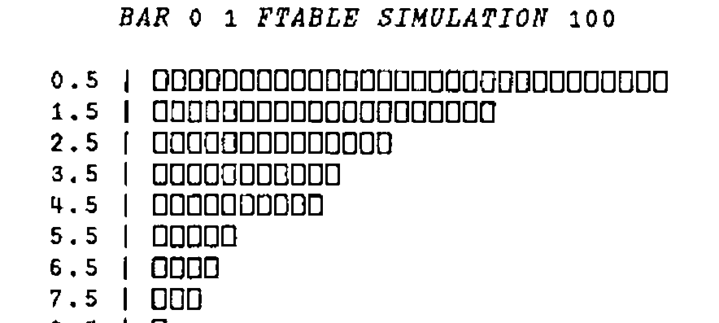

*by Alan Sykes*
{ .byline }

In this article, we take another random walk that starts from simple counting and coin-tossing and ends with a model for rainfall! Consider the following set of data:

```
      STATES

2 2 2 2 1 1 1 1 1 1 1 2 2 1 2 2 1 1 1 1 1 2 2 2 2 2 2 1 2 1 1
      1 2 2 1 2 2 2 2 2 2 2 2 1 2 2 2 2 2 1 1 2 2 2 2 2 2 2 2
      1 2 2 2 1 2 2 2 1 1 2 2 2 2 1 1 1 2 2 2 2 1 1 1 1 1 1 1
      2 2 2 2 2 2 2 2 2 2
```

If we interpret 1 as ‘heads’ and 2 as ‘tails’ we could have a sequence of heads and tails. As such, the first thing we might do is to count how many heads and tails there are:

```apl
      1 2 COUNT STATES
36 64
```

So the first observation is that if the data did come from tossing a coin then it would appear to be a biased coin with something like a chance of 1 in 3 of giving a heads. If you look closely at the data however, you may notice that there appears to be tendency for a head to follow a head and a tail to follow a tail - rather more so than one might expect if the data had come from tossing a coin. How might we investigate whether this is indeed the case?

One way is to count in more detail - instead of counting just the number of heads and tails, we count the number of times a heads is followed by a heads, and similarly for the other three possibilities. We call this counting the transitions from states heads/tails to states heads/tails. How do we do this in APL?

First we construct a 2 by 99 matrix of all the transition pairs - each column of the matrix denoting a transition. This is done by rotating `STATES` one place to the left, using `1⌽STATES`, forming the matrix, and dropping off the last column. Here are the steps illustrated with `S←1 2 2 1 2`

```apl
      1⌽S
2 2 1 2 1

      S,[0.5]1⌽S
1 2 2 1 2
2 2 1 2 1

      0 ¯1↓S,[0.5]1⌽S
1 2 2 1
2 2 1 2
```

Now all we need to do is to compare each column with the possible transitions 1 1, 1 2, 2 1, 2 2. To do this we form a 4 by 2 matrix:

```apl
      M←4 2⍴1 1 1 2 2 1 2 2
```

and use the inner product (think of matrix multiplication) constructed by comparing a row and column with ‘=’ and then using ‘∧’ or ‘and’:

```apl
      M∧.=0 ¯1↓S,[0.5]1⌽S
0 0 0 0
1 0 0 1
0 0 1 0
0 1 0 0
```

The resulting matrix is then easy to interpret. The second row, for example, is 1 0 0 1 because the first and last transitions are from state 1 to 2. Hence the appropriate transition count function can be derived by summing the rows of the boolean matrix, and re-shaping as a 2 by 2 matrix so that the (i,j)th element represents the number of transitions from state i to state j.

Hence we have derived the function `TRANCOUNT`.

```apl
      ∇ R←TRANCOUNT S
[1]     S← 0 ¯1 ↓S,[0.5]1⌽S
[2]     R← 2 2 ⍴+/(4 2 ⍴ 1 1 1 2 2 1 2 2)∧.=S
      ∇
```

Applying `TRANCOUNT` to the original data set:

```apl
      TRANCOUNT STATES
23 13
13 50
```

And as we expected, from a mere glance at the data, the diagonal frequencies predominate, corresponding to transitions from state to the same state. Of course, we do not have any firm foundation as yet as to whether such a frequency transition matrix is so different from the sort of matrix we could have achieved using (biased) coin tossing that we really are forced to reject our coin tossing model for something more general.

So the next stage is to define some procedure that measures deviations of observed counts/frequencies from expected frequencies. This is the function of the famous (infamous?) chi-square statistic, that takes observed frequencies `O`, and expected frequencies `E`, calculates `(O-E)×(O-E)÷E`, and sums the result.

What do we take as our expected frequencies for the 2 by 2 matrix of transition counts, assuming that the coin-tossing model is appropriate? Well, 36% of the states were heads and so we would estimate the probability of heads as .36 - call this `p`. If the coin-tossing model is appropriate, then out of 99 transitions, we would expect `99×p×p` to be heads followed by heads, because the probability of heads followed by heads is just `p×p`. (The result of one toss is independent of the result of another toss and so the probability of the joint result is the product of the probabilities.) Similarly for the other possibilities, the expected frequencies are `99×p×(1-p)`, `99×(1-p)×p`, and `99×(1-p)×(1-p)`. These values are equal to 12.83 22.81 22.81 and 40.55 respectively. Using the function `CHISQSTAT`:

```apl
      ∇ R←E CHISQSTAT O
[1]     R←+/,((O-E)*2)÷E
      ∇

      P←.36
      E←2 2⍴99×(P×P),(P×1-P),(P×1-P),(1-P)×1-P
      E CHISQSTAT TRANCOUNT STATES
21.1
```

As always with Statistics, solving one problem only leads to another. The value 21.1 measures how far the observed transition frequencies differ from what we would expect if the data had been generated by coin tossing. The bigger that value, the more the frequencies deviate from those expected. But what is the critical value such that values above would allow us to reject safely the coin-tossing model? The answer to this question either comes from a lot of quite sophisticated mathematics that result in tables of the chi-square distribution, or a modern alternative is to use simulation. We use the latter here as it illustrates further methods of using APL and also because being less technical, it may help readers who are baffled by statistical tables and the ‘magic’ that surrounds them!

What is required of the simulation is to simulate coin-tossing, producing repeatedly, 100 tosses of a coin with probability of heads equal to 0.36, calculating for each set of 100 tosses, the 2 by 2 frequency transition matrix and its chi-square statistic. We then compare our observed value of 21.1 with the set of simulated values. We are then able to judge how atypical the value of 21.1 is.

The program to do this is called `SIMULATION`. The hard work of the program is already done for us - all we need is a loop to repeat the simulation of 100 tosses the required number of times. The actual simulation can be achieved by constructing a vector `S` of 36 1’s and 64 2’s, and then indexing this vector using `?100⍴100` (see my article on simulation in Education Vector April 1989).

```apl
      ∇ R←SIMULATION N;C;P;E;S
[1]     R←N⍴0 ⋄ C←1 ⋄ P←0.36 ⍝P=probability of heads
[2]    ⍝ Calculate expected frequencies given p
[3]     E← 2 2 ⍴99×(P×P),(P×1-P),(P×1-P),(1-P)×1-P
[4]    ⍝ Calculate a vector of 36 1's and 64 2's
[5]     S←(36⍴1),64⍴2
[6]    ⍝ Now loop, assigning each answer into R
[7]    lp:R[C]←E CHISQSTAT TRANCOUNT S[?100⍴100]
[8]     →(N≥C←C+1)/lp
      ∇
```

If you have a reasonably fast machine, then it is not too time-consuming to do say, 100 simulations and store the result ready for display using a histogram. Even a small number of values gives you some idea as to the expected value of the chi-square statistic (which is about 2). Here are 10 typical results.

```apl
      5 2⍕SIMULATION 10
```

(The expression ‘5 2⍕’ formats the results as real numbers using 5 characters with 2 decimal places)

```
 5.41  .06  .59 7.84 2.37 3.20 1.17 2.62 1.43 1.85
```

If you have patience with your machine to do 100 simulations and plot the results as a histogram then your results should look something like mine:

```apl
      BAR 0 1 FTABLE SIMULATION 100
```



As you can see, the distribution is very ‘J-shaped’ with the chance of getting high values rapidly diminishing, and with something like a 1 in 100 chance of getting values in excess of 10. This is sufficient to confirm our suspicions that our observed value of 21.1 is quite ridiculously large for it to have come from a coin-tossing model.

What kind of random process might it have come from? Well, the simplest model that might be applicable is what is called a two-state Markov Chain model, where the probability of the next observation being 1 or 2 depends only on whether the current state is 1 or 2. The probabilities may be represented by a 2 by 2 probability transition matrix where the 1 1 element represents the probability of 1 following 1, the 1 2 element representing the probability of 2 following 1, and so on. Take for example the 2 by 2 matrix given by:

```apl
      P←2 2⍴.2 .8 .6 .4
      P
.2 .8
.6 .4
```

Then, with this transition matrix, the probability that a 1 follows a 1 is .2, whilst the probability that a 1 follows a 2 is .6 . (The other probabilities are of course 1 minus these quantities.) These probabilities are called one-step transition probabilities. What about the two-step transition probabilities - i.e. the probabilities of a 1 occuring as the next but one state given current starting state of 1, and so on? One way of this happening is that the middle state is 1, which occurs if we have two transitions `1→1→1`. This has probability `.2×.2`. This and the other possibilities is set out in the table below:

```
                                          Two-step
Two-step transitions   Probabilities      Transition Probs
     1→1→1                .2×.2       \
                                       ------(.2×.2)+(.8×.6)
     1→2→1                .8×.6       /

     1→1→2                .2×.8       \
                                       ------(.2×.8)×(.8×.4)
     1→2→2                .8×.4       /

     2→1→1                .6×.2       \
                                       ------(.6×.2)×(.4×.6)
     2→2→1                .4×.6       /

     2→1→2                .6×.8       \
                                       ------(.6×.8)×(.4×.4)
     2→2→2                .4×.4       /
```

The computations in the right-hand column are precisely the four calculations done in multiplying `P` by itself, hence the two-step transition probabilities are given by `P+.×P`. Similarly, the three- step transition matrix is given by `P` raised to the power 3 or `P+.×P+.×P`.

It is very interesting to see what happens when you raise `P` to successive powers. This is easily done as indicated above or as follows:

```apl
      P2←P+.×P
      P4←P2+.×P2
      P8←P4+.×P4
      P16←P8+.×P8

      P2
0.52 0.48
0.36 0.64

      P4
0.4432 0.5568
0.4176 0.5824

      P8
0.42894592 0.57105408
0.42829056 0.57170944

      P16
0.428571674  0.571428326
0.4285712445 0.5714287555
```

As you can see, the rows of powers of `P` rapidly become equal as the power increases. This is of course means that the probability of jumping to the states 1 or 2 in a large number of jumps depends very little on the starting state. This loss of memory, shows that not all the properties of coin tossing have been lost in proposing a more complicated model - there is still a long-run chance of state 1 occurring, given in this case by .42857 or more correctly `.6÷(.6+.8)`. Of course the long-run chance of state 2 is 1 minus this or `.8÷(.6+.8)`.

It turns out that these long-run probabilities as a vector can be calculated very easily in APL for transition matrices `P`. (Basically a transition matrix is a square matrix, each of whose elements are non-negative and whose row-sums are 1.) I offer the function here with no explanation whatsoever and as a one-liner. (It comes from a paper by myself and Alan Hawkes recently submitted to Transactions in Reliability IEEE). I hesitate to guess how many lines of Fortran code would be necessary to do this!

```apl
      ∇ R←LONGRUNPROP P
[1]     R←((T⍴0),1)⌹(⍉P-(⍴P)⍴1,(T←1↑⍴P)⍴0),[1]1
      ∇
```

Applying this function to the probability transition matrix `P` of a 3 state Markov chain given by:

```
0.19 0.75 0.05
0.17 0.18 0.65
0.13 0.11 0.76
```

```apl
      5 3⍕LONGRUNPROP P
0.148 0.221 0.631
```

So we are able to deduce that for example, the long-run probability of state 3 occurring is .63.

By now you are perhaps wondering (or more likely have given up wondering) just what all this has to do with the weather. Needless to say, the model that I have illustrated has many applications in real-life. The meteorological application I had in mind was the pattern of successive days where 1 indicates rain occurs, and 2 indicates rain did not occur. In real life, this is an over-simplification but nevertheless is quite successful in modelling the occurrence or non-occurrence of rain at a particular place, at least for a relatively short time period. Of course there’s always the possibility of snow! And on that note, I bring this article to a rapid close.
