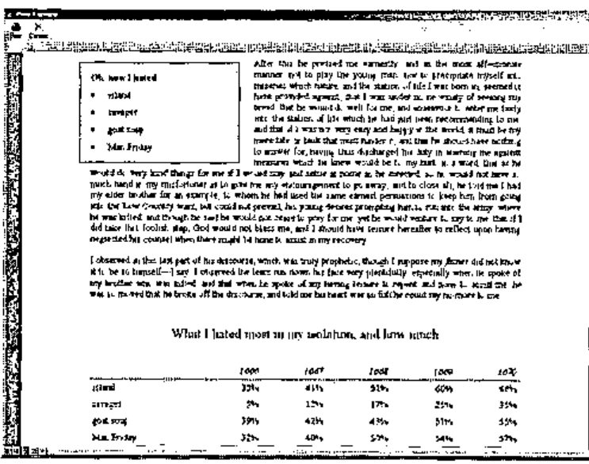
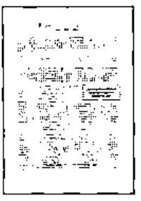
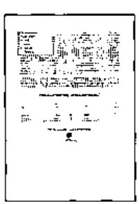
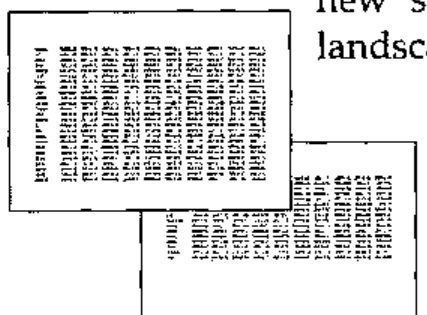
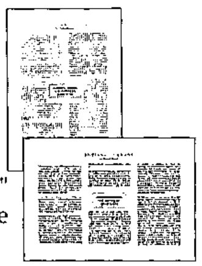
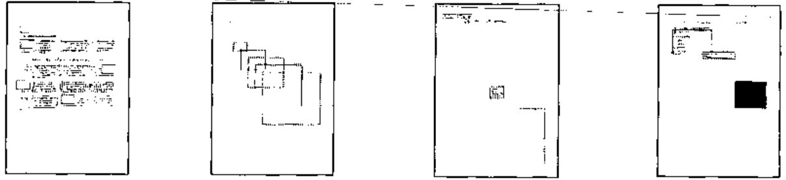
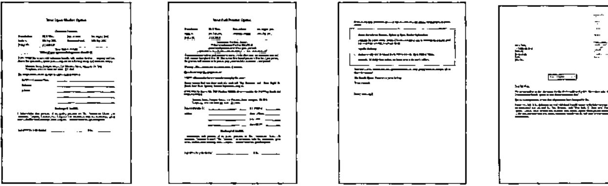

*by Stephen Taylor*
{ .byline }

## Abstract

APL.RTF creates, previews and prints Windows documents of arbitrary length to the standard of an advanced Microsoft Word user. The resulting files can be opened, edited or printed from Microsoft Word, and can also be attached to email messages. The APL application-level code required to use this is terse, with large-scale mapping from APL nested lists and tables to document paragraphs and tables. Execution is fast, and the APL footprint is small.

A workspace containing much of what is described in this article has been posted on the *Vector* web site. You might find this article interesting for the way in which object-oriented and functional programming layers have been combined, inspired by something seen in a J programming lab. Or you might want to use APL.RTF, in which case contact the author.

## Background

Once our clients were content for letters and other documents to look like a computer had printed them. Those days are gone. Now they want their documents to look as good as if produced by a competent secretary with a word processor.

Printing through standard RTF tools gets some control over fonts, alignment and so on. But it doesn’t meet the ‘competent secretary’ standard. We needed to produce letters and forms with tables, frames, boxes, shaded areas, hairlines, arbitrarily positioned text, switches between portrait and landscape orientations and so on.

From one point of view, a solution is available without any programming at all. We can call Microsoft Word from within APL and do anything Microsoft Word can do. This works but has two serious drawbacks. The first is that it runs slowly. The second is that, while one gets all of Word’s awesome abilities, including searching and replacing, the APL application code has too much to do in managing Word.

If we could keep most of Word’s *presentation* controls, we would sacrifice most of its *editing* abilities and just append content sequentially to a document. In particular, we should like our application code to map straight from large-scale APL data structures, such as nested tables and lists of text strings, to tables and paragraphs in a document, without stopping to specify every detail of presentation and to hide any encoding or markup done to achieve this.

We did it. APL.RTF is a printing subsystem with a modest footprint (135Kb in Dyalog APL 9 under Windows 98SE) that fits cleanly into an application. It enables the application to produce RTF (Rich Text Format) documents of arbitrary length that can be printed or edited by Word, or sent as email attachments. It runs fast, exploiting the Microsoft type libraries to do the hard work. We believe it could be ported to J or K fairly easily. It supports more presentation features than most Word users know how to employ, and enables our applications to meet or surpass the ‘competent secretary’ criterion.

## Word-processing presentation features supported

The interface supports control of the following features:

### Character properties

- font family
- bold and italic styles
- type size
- type colour
- *kerning* (inter-character spacing)
- special characters: checkboxes, current date, left & right quotes, line break, page break, page number, tab

### Paragraph properties

- left, right, centered or justified alignment
- paragraph and first-line indentation
- *leading* (spacing before and after paragraphs)
- *keep* to discourage Word from breaking a paragraph across a page boundary
- *keep-with-next* to discourage Word from separating two paragraphs with a page boundary
- page breaks
- bulleted lists
- tab stops: left, right, centred and decimal; with various leads

### Tables

- column heading rows that repeat when the table crosses a page boundary
- row-level control of *keep* and *keep-with-next* properties
- column- or cell-level control of cell width
- cell-level control of alignment
- cell-level control of *leading* before and after
- cell-level control of shading
- cell-level control of top, left, bottom & right border widths and colours
- horizontal merging of adjacent cells

### Pictures

- bitmap picture files

### Inline styling

- bold and italic
- expanded inter-character spacing
- tab stops
- arbitrary positioning of frames
- frame size
- frame position and alignment, choice of reference frame
- text wrapping and separation, overlays
- overlapping frames
- border width, colour and padding
- background shading

### Section properties

- US letter or A4 paper size
- portrait or landscape orientation
- multiple columns
- margin sizes
- page header and footer text, with distinct headers and footers for the first page of each section
- header and footer offsets

## A quick tour

### Creating, writing to and printing a document

Writing a document from APL.RTF is a lot like writing a Microsoft Word document. You start by creating a new blank document from a template. You add paragraphs, assigning them styles from the template’s style sheet. The style sheet specifies different named paragraph styles in terms of such things as alignment, indents, fonts, colours and leading. You also add lists, again giving them styles from the style sheet.

You add tables, with exact control of their appearance: alignment, column widths, hairlines, text styles, shading, merged cells.

Just as in Microsoft Word, you control page layout: paper size, orientation, margins and the offsets of the headers and footers from the page edge. Your document can have multiple sections with different page layouts, including switching between orientations and multiple columns.

You can also use absolute positioning to place text or pictures precisely where you want them on the page, floating it above the other text or having the main text wrap around it. Your text boxes can have background shading or borders.

When you’ve finished your document, tell it to print itself, or show you a print preview. Or tell it to close itself and return the name of an RTF file you can print or attach to an email.

This is particularly valuable when developing an application. Start with a template document similar to what you want, write output to it, and immediately preview it onscreen. Then you can fine-tune appearance and positioning by editing either the application script or the template’s style sheet, or both.

### The Document class

The core of APL.RTF is its Document class, represented by the `Document` namespace. It contains further namespaces, which correspond to Microsoft Word template documents for different purposes. As with Microsoft Word, the default template is called Normal.

The `Document` class contains its own methods (functions), and a constructor method (`New`) for creating instances of itself. The `New` method returns a copy of the template into which has been copied all the `Document` methods not already defined in the template. In this way, the templates inherit methods from the `Document` class.

This is not so for properties: new instances do not inherit property values (variables) from `Document`. Instead they are created by the `Initialise` function. When `New` has created an instance, it invokes `Initialise`, which was inherited either from the template or from the `Document` class.

`Initialise` sets the new document’s properties. Some of these are private to the document and are not intended for reference by the programmer. Others control key aspects of presentation. Chief of these are the page layout, font table and style sheet.

The *font table* is a list of font family/name pairs, eg ‘swiss Arial’ or ‘roman Times New Roman’.

The *style sheet* is a table of RTF style definitions used to assign styles to paragraphs. The `Document` method `makeStyleSheet` creates a default style sheet, for the `Normal` template. It adapts from the `RTF.STYLEMACROS` namespace a specialist vocabulary for defining style sheets. You can adapt `Document`’s `makeStyleSheet` function for new document templates for your applications.

The *page layout* is a list of name-value pairs that corresponds to the key features controlled by Microsoft Word’s File/Page Setup dialogue, eg paper size and orientation, and margin sizes.

Paragraphs, lists and tables are added to the document using its methods `AddPara`, `AddList` and `AddTable`. The method `AddBox` sets paragraphs and lists on the page using ‘absolute positioning’. Absolute positioning is very powerful and allows you to place a frame of text or graphics anywhere on the page, with optional borders or background shading, and to determine whether the background text will flow around it or lie underneath it.

The style of paragraphs, lists and tables is controlled by references to the style sheet. These references apply defined styles to entire paragraphs, list items or table cells. APL.RTF also supports ‘inline styling’, in which part of a string of text can be assigned bold, italic or expanded-text style, or some combination of them. This is provided by document methods `EMBOLDEN`, `ITALICISE` and `EXPAND`.

The document method `Print` sends the document to Microsoft Word for printing.

The document method `Close` acts like `Print`, but returns the name of the RTF file instead of sending it for printing. This file is then available for use as, say, an email attachment.

### Print Previews



The `UTILS` namespace contains a function `preview`, which will display an RTF file in a browser, exactly as it would look in Microsoft Word. (It uses Microsoft Web Browser, the same OCX control that Internet Explorer uses.) If the user confirms, the document is printed; else destroyed.

In fact, the `Print` method also tests whether it is in runtime mode. If not, it passes `PrintPreview` a snapshot copy of the document’s current state. Developers always get a preview, but the active document is untouched. This allows developers to add to a document and immediately see the effect without destroying the document.

### The SCRIPTS namespace

The `SCRIPTS` namespace contains the application-level code. In this context, a script is an APL function that adds content to a document, specifying its presentation attributes as it does so.

Four scripts are called by the `Examples` function in the workspace root: these demonstrate different capabilities of APL.RTF. Three scripts are called by the `SVQ` function in the workspace root: these demonstrate some documents created for a commercial application.

```apl
  ∇  Examples scripts;doc;script
[1] ⍝ scripts is a list of numbers in range 1-4; see below
[2] ⍝ Printer is name of a Windows printer
[3]
[4] doc←#.Document.(New Example)
[5]
[6] doc.Started←0 ⍝ 1st script not to start new section
[7]
[8] :For script :In scripts
[9]:Select script
[10]    :Case 1 ⋄ #.SCRIPTS.GENERAL.Script doc   ⍝ general
[11]    :Case 2 ⋄ #.SCRIPTS.MULTI.Script doc     ⍝ multi cols
[12]    :Case 3 ⋄ #.SCRIPTS.ORIENT.Script doc    ⍝ 2 orientns
[13]    :Case 4 ⋄ #.SCRIPTS.POSN.Script doc      ⍝ abs posn
[14]    :EndSelect
[15] :EndFor
[16]
[17] doc.Print Printer 1
  ∇
```

You can see from `Examples` and `SVQ` that the scripts are passed a reference to a document object, to which they add their output. They can be called in any order: compare

```apl
Examples 1 2 3 4
Examples 4 3 2 1
```

### The RTF namespace

> "[Object Oriented Programming] is effective. Unfortunately, some people think that if some OOP is good, then more is better. It is a mistake to think of OOP as an alternative to FP (functional programming); all languages, at the low level, have FP, and at a higher level, have OOP."
>
> *Object Oriented Programming lab in J*

The RTF namespace contains the functional programming layer used by the Document class. It is mostly concerned with the encoding of RTF control words. (Enthusiasts might appreciate the very fast D functions used by `TABULATE` to convert nested tables into RTF code strings.) Application programmers should never need to refer to it.

### The Microsoft type libraries

APL.RTF delegates much processing to the Microsoft type libraries. The application programmer need do nothing to obtain or invoke these but ensure that users have Microsoft Word installed on their PCs.

Five type libraries are used: Microsoft HTML Object Library, Microsoft Internet Controls, Microsoft Word Object Library, Microsoft Office Object Library and Visual Basic for Applications Extensibility.

The APL.RTF workspace is distributed with these libraries unloaded. Dyalog APL will load them on first use; they occupy nearly 1Mb of the workspace. Since loading the libraries causes a noticeable delay, applications are best saved with the libraries already loaded.

### Creating a new document template

APL.RTF Document templates correspond exactly to Microsoft Word template documents. That is, a template is used to create various documents that share a common look.

This common look is embodied in the document’s style sheet, which names, numbers and describes a list of paragraph styles. Paragraph styles are described in such terms as the font family and size used, bold or italic style, leading before or after the paragraph, alignment and indentation.

Many users of Microsoft Word find it convenient to set the presentation attributes of their document’s paragraphs on an ad-hoc basis. Not so the APL.RTF application programmer, who wishes to keep this detail out of the application’s script. Rather than specify presentation attributes ‘in line’ in his script, he lists them in the document template’s style sheet.

There are a handful of exceptions to this. The document’s `EMBOLDEN`, `ITALICISE` and `EXPAND` methods can be used to apply this ‘in line’ styling to words and phrases. Also, the position and leads for tab stops can be set in the script. See the `SVQ` scripts for examples where tab stops with underlined leads are used to create places to write on a form.

As in Microsoft Word, the default document template is called Normal. It is represented by an empty namespace, `Normal`. Because it is empty, it inherits all its methods from its parent class/namespace, `Document`. One of these methods, `Initialise`, sets its properties.

`Initialise` calls two functions of interest to the application programmer: `makeStyles` and `makeLayout`. The former creates the document’s style sheet, and font- and colour tables. The latter specifies the document’s page layout, corresponding roughly to the attributes controlled in Microsoft Word by the File/Page Setup dialogue.

To create a new document template, create a new namespace within `Document` and copy into it either or both of `makeStyles` and `makeLayout`. Edit those functions to suit your application.

Your new template needs in it only what is to differ from `Normal`. It inherits everything else from its parent, `Document`.

## Samples and examples



The `GENERAL` script shows various APL.RTF features. The `AddPara` appends paragraphs of text; wrapping and justification are managed by APL.RTF.

```apl
AddPara'Sched Title' 'Robinson Crusoe'
AddPara'Subtitle' 'by Daniel Defoe'
AddPara('Body Text')(#.DATA.texts.(p1 p2 p3))
```



A couple of pull quotes are hung in boxes against the margins, the body text wraps easily around them. A table and logo are shown. A new section opens, and the orientation switches to landscape.



A large table is appended. Overflowing its first page, its header rows are repeated automatically on continuation pages.



The `MULTI` script shows the same story in a 2-column format, complete with a centred pull quote. The `ORIENT` script does the same again in the form of a ‘scriptlet’, then switches the page orientation to landscape and executes the scriptlet again with 3 columns specified. The scriptlet’s output appears correctly in the landscape orientation. Even the page number, set by tab at ½" outside the right, adjusts to the changed page width. Here is the application code: script and scriptlet.

```apl
  ∇  Script doc
[1] ⍝ The scriptlet is independent of page orientation
[2]
[3]  doc.PageSetup'Orientation' 'Portrait'
[4]  doc Scriptlet 2 ⍝ cols
[5]
[6]  doc.NewSection'D'
[7]  doc.PageSetup'Orientation' 'Landscape'
[8]  doc Scriptlet 3 ⍝ cols
  ∇

  ∇  doc Scriptlet cols;⎕PATH;pq;rtf;styles;tabstops
[1]  ⎕PATH←'#.SCRIPTS.MULTI #.UTILS'
[2]
[3]  :With 'doc'
[4]   ⍝ set R-aligned tab stop 1/2" beyond R margin
[5]tabstops←⊂(0.5+PageWidth)('R')
[6]SetFooter('Footer')(TAB,'Page ',PAGENO)(tabstops)
[7]
[8]   ⍝ title and first paras
[9]AddPara'Sched Title' 'Robinson Crusoe'
[10]    AddPara'Subtitle' 'by Daniel Defoe'
[11]
[12]   ⍝ section break and new layout
[13]    NewSection'N'
[14]    PageSetup('Columns')(cols)
[15]
[16]    pq←'I would be satisfied with nothing but going to sea'
[17]    AddBox(PqPosnC)(ComposePara'Pull Quote'pq)
[18]    AddPara('Body Text')(#.DATA.texts.(p1 p2 p3 p4 p5 p6))
[19]
[20] :EndWith
  ∇
```

APL.RTF has a powerful ability to place text at arbitrary positions on the page, with or without borders (‘boxes’) or background shading. Body text can wrap around these or not. The fourth example script demonstrates this.



Finally the scripts called by `SVQ` demonstrate these features used in a commercial application to produce correspondence.



## Key features

`Document` methods are monadic or niladic, like those of Microsoft’s Common Object Models. Like them, some have *overloads* defined; that is, they accept arguments in varying forms. See the scripts for illustrations.

### Paragraphs

The `AddPara` method adds one or more paragraphs to the document, specifying a style from the style sheet, and optionally specifying tab stops. `AddPara` discards empty paragraphs.

```apl
AddPara'Sched Title' 'Robinson Crusoe'
AddPara'Subtitle' 'by Daniel Defoe'
AddPara('Body Text')(#.DATA.texts.(p1 p2 p3))
```

### Tab stops

Tab stops can be specified simply as scalars—a horizontal offset in inches from the paragraph start—or as enclosed pairs or triples. As pairs: the offset and the alignment of text to the tab stop: left, centred, right or decimal. As triples: the offset, alignment and lead to the tab stop: dot, middle dot, hyphen, underline, thick, equal. Tab stops with underline leads are used to mark places for handwriting in the `SVQ` documents on this page.

```apl
stops←0.25 2.5(PageWidth'L' 'Ul')
entab←{TAB,⍵,TAB,TAB}
AddPara('Left Flush')(entab'Insurance Company Name')(stops)
AddPara('Left Flush')(entab'Reference')(stops)
AddPara('Left Flush')(entab'Address')(stops)
AddPara('Left Flush')(entab'')(stops)
AddPara('Left Flush')(entab'')(stops)
```

### Special characters

The document has niladic methods for special characters like `TAB` and `PAGENO`.

It also has a dyadic function `LINE`, which joins its arguments with a new-line character. So

```apl
⊃LINE/a b c
```

joins text strings `a b c` into a single paragraph with embedded new-line characters.

### Bitmaps

The `BITMAP` method takes two arguments: a scaling factor and a file name, which should have a .BMP extension. In principle it should be possible to calculate the scaling factor to produce an image of a desired size from a bitmap file. In practice, it is far simpler to take a guess, preview the result, and converge on a suitable factor.

### Lists

Microsoft Word supports a wide variety of auto-numbered lists; APL.RTF none. Auto-numbering of lists is useful for editing documents with a word processor but is of little use for our purposes.

APL.RTF supports bulleted lists through the `AddList` method. Its syntax mirrors that of `AddPara`. Paragraphs composed with `AddList` are given bullet points.

### Tables

APL applications easily compose information in the form of tables. APL.RTF easily maps APL tables to document tables.

The `AddTable` method takes a 2-element argument. The second is a nested table (rank-2 array) of character strings. These character strings may include RTF control words embedded by the in-line styling methods `EMBOLDEN`, `ITALICISE` and `EXPAND`, but otherwise need no presentation information.

Presentation instructions are embedded in the first argument element, the format array. This is a rank-3 array of 18 planes of the same shape as the data table. Each plane controls a different attribute of the table’s presentation. See the function `FmtBigTbl` in the `SCRIPTS.GENERAL` namespace for an example.

### Sections

For short documents a single page layout suffices. Longer documents might need a section in landscape orientation, for example, or to restart page numbering. The `NewSection` method takes one of the following arguments:

| | |
|---|---|
| `⍬` | new section, retaining current layout |
| `'D'` | new section, restoring the document’s default layout |
| `'N'` | new section, without a page break |

### Boxes

The ability to place a text box at an arbitrary position on the page is one of APL.RTF’s most powerful features. The box may be set with or without a border, so the result may appear simply as text placed at an arbitrary position. See for example, the script in `SCRIPTS.Q226`, which uses `AddBox` to write an address exactly where it will show through an envelope window.

`AddBox`, like `AddTable`, takes a 2-element argument.

The first element is a list of 18 numbers. To keep track of the semantics of this, the namespace `RTF.BOX` contains a default set and a vocabulary in which to specify them. See particularly how the script in `SCRIPTS.POSN` takes a copy of this object, resets some values to produce a default set for the script, then uses a series of ‘Box’ functions to produce slight variations, specifying only the changes from these defaults.

```apl
bpd←BoxPosDef #.RTF.BOX             ⍝ box posn defaults

  ∇  bpd←BoxPosDef boxposnobj
[1] ⍝ box position default values for this application
[2] ⍝ object contains vocabulary for setting parameters
[3]
[4]  'bpd'⎕NS boxposnobj
[5]
[6]  :With 'bpd'
[7]      Hposn←column aligned left
[8]      Vposn←para aligned inline
[9]      Size←0.75 0.75 ⍝ width & height in inches
[10]Wrap Overlay Absnooverlp←do dont dont ⍝ wrapping
[11]Separation←10 10 ⍝ h and v, in pts
[12]Pen Colour←0.5 0 ⍝ 1/2pt black border
[13]Pad Shade←5 0 ⍝ 5pt padding, no background shading
[14] :EndWith
  ∇

d.AddBox(Box10 bpd)(empty) ⍝ adds one box in the document

  ∇  r←Box10 bpd;b
[1]  'b'⎕NS bpd              ⍝ copy default BOXPOSN values
[2]  b.(Wrap←dont)           ⍝ wrapping
[3]  b.Separation←0 0        ⍝ h and v, in pts
[4]  r←b.Parameters
  ∇
```

The second element is, for once, not ‘raw’ APL character strings or tables, but a marked-up RTF string. This must be so, because a box can contain paragraphs or lists, which themselves need to be composed against the document’s style sheet. `AddBox` can place them on the page, but does not know how to compose them.

The `ComposePara` and `ComposeList` methods have the same syntax as `AddPara` and `AddList`, but return marked-up RTF strings instead of adding the paragraphs or list to the document. These strings can be concatenated and the result used as the second element of the `AddBox` argument.

## Conclusion

With APL.RTF we are able to map APL data arrays to well-presented documents with minimal application code. We quickly adapt existing templates to new applications, and can mockup a handful of new document designs in a morning. We use well-proven Microsoft code to participate in the device independence that Windows applications commonly enjoy; the documents we produce live in the same world of PCs and email that our users do. They like this and so do we.
