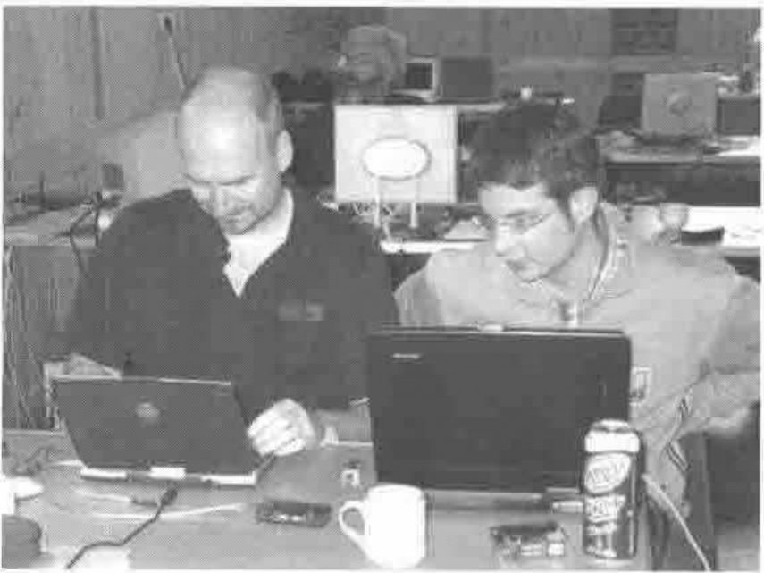
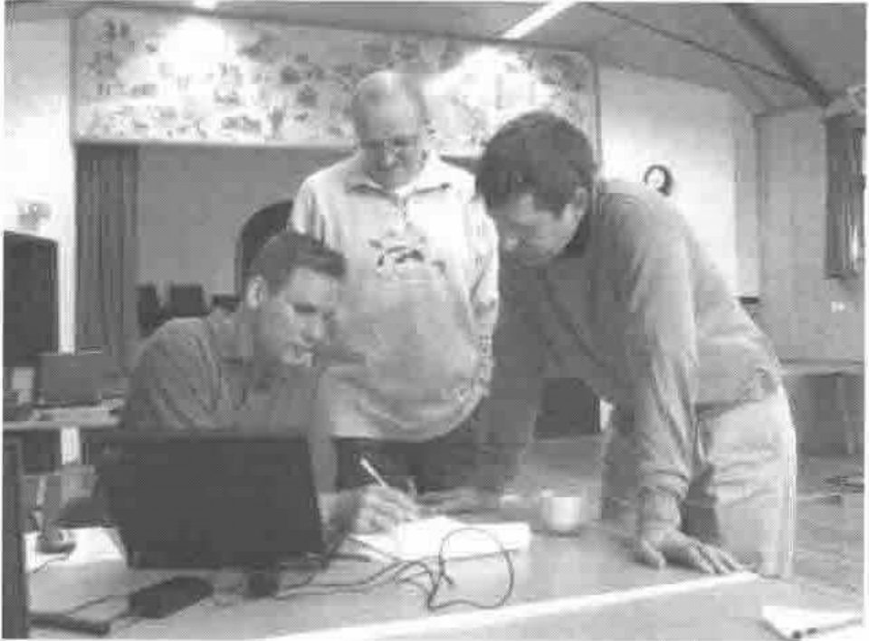
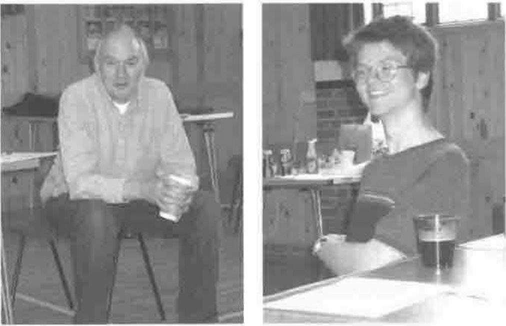
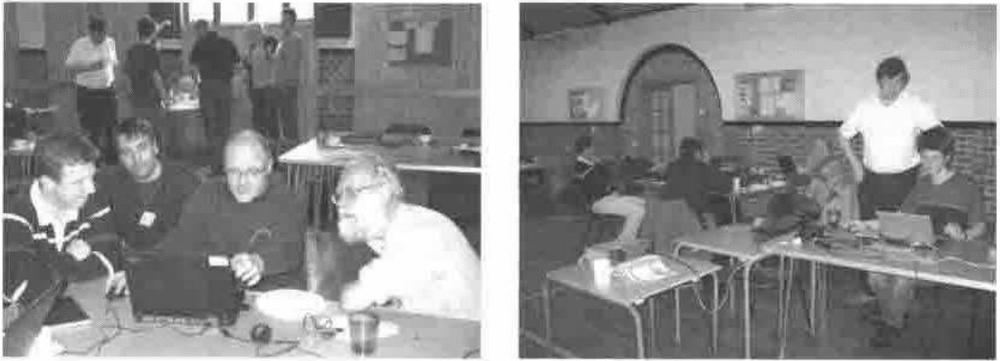

*notes by Stephen Taylor*
{ .byline }

Twenty-one Vector programmers met in the Village Hall in Great Hallingbury for the first APL-moot.

We brought computers, frisbees, network hubs, wine, an espresso machine and a bread maker, a data projector, sleeping bags and the first series of Farscape.

Ray Cannon produced greasy fried breakfasts every morning; Stephen Taylor, life-endangering coffee; and Optima Systems treated us to wine and pizza on the Friday.

**Paul Mansour with Veli-Matti and Morten**

We limited the plenary sessions to provide time for ‘birds of a feather’ huddles. If you weren’t there, this is what you missed!

- Paul Mansour demonstrated fast GUI development
- Morten Kromberg showed us VectorLib
- Ray Cannon helped us install and review his User Commands
- Brooke Allen had us playing his Behavioral Finance Game on our network
- John Scholes puzzled with Euler over the bridges of Königsberg
- Richard Smith left his studies at Cambridge to show us his languages R and Rowan, developed using APL concepts and .NET components

**John Scholes and Richard Smith (relaxing)**

Most people had brought either software and ideas to share, or questions to discuss. So we spent a good deal of our time in (poster-free) birds-of-a-feather sessions:

- Paul Mansour: namespace programming techniques and documenting OOP objects
- Morten Kromberg: Embedded Terminal Services
- Christian Langreiter: the K language and numeric arrays
- Michael Baas: Dyalog & Outlook and Adapta DLS
- Ray Cannon: Pocket APL and Quad-NA calls
- Veli-Matti: processing very large (6Gb) text files
- Eke von Batenburg: control structures; porting between APL2000 and APLX; and APL2C
- Graeme Robertson demonstrated his array explorer
- Peter-Michael Hager: cryptography and anonymous objects
- Stephen Taylor: Mailtrain (spooling Word documents from APL) and functional programming style
- Ian Clark: developing online APL tutorials

Dick Bowman and John Daintree of Dyalog joined us for Saturday. Paul Grosvenor managed us through a rapid clean up, and we finished with a long Sunday lunch at the village pub.

### What worked, what didn't

The concept of the moot worked very well, with people flying in from Germany, Austria, Finland, Denmark, Holland and the United States. The hall suited us, though the rainy hike to the pub didn’t. Stansted was conveniently if noisily close, but most flyers travelled via Heathrow!

We appreciated the ample time available for us to work in small groups, and agreed we might skew the balance of time even further in future. Paul Mansour and Brooke are contemplating a moot in the eastern United States; Ray another one in late summer.
