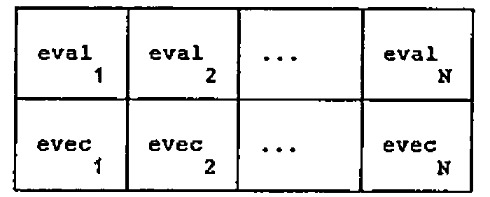
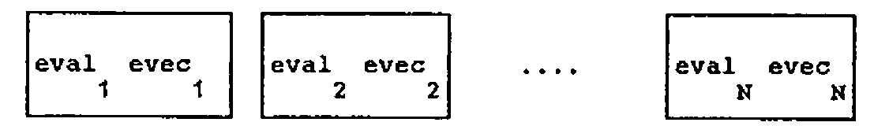
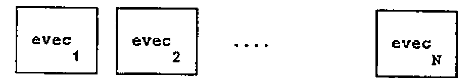

by Norman Thomson
{ .byline }

The ‘brave new world’ of second generation APLs (such as IBM’s APL2 on which this article is based) is dominated by two ideas — nested arrays and operator extension. Nested arrays are in principle such a simple idea that only a few minutes are needed for a practised APL user to read and absorb the technical specifications of the enclose function, the disclose function and the each operator which together embody most of the essence of nested arrays. Yet the practice needed to acquire fluency in application defies all initial belief. How long does it take to become an effective and accomplished user of nested arrays? 1 year? 2 years? 5 years? The path of the typical APL user presented with a second generation APL is an initial spell of rapturous excitement over the potential power of the new language, followed by a period of increasing insecurity in which full mastery begins to recede like an unattainable goal.

Why does it take so long to feel comfortable with nested arrays? Partly — perhaps mainly — because having to think *in* depth *about* depth adds an additional dimension to programming, analogous to the mental leap needed in geometry to move from thinking in 2 dimensions to thinking in 3. To know the shape of an object in APL1 (hereafter used to refer to first generation APLs) is to know its all. In APL2 one has to know both shape and depth. (Rank, being shape of shape, is subsumed in shape.) So it makes sense to have in every APL2 workspace a function DR (Depth-Rho).

```apl
DR: (≡R),⍴R
```

which can be used as an interactive check on the structure of APL2 objects. Since depth is always an integer scalar the result is never ambiguous. If DR returns a single integer, then the shape vector is iota zero.

For example, define:

```apl
W←5 3⍴'ANDBOYCANDADEAT'

DR W   is  1 5 3    and

DR ⊂W  is  2
```

(or more accurately 2 followed by an invisible iota zero.)

W and its enclose are thus enormously different although when printed they look practically identical.

A major problem with using nested arrays is that a tiny difference in code can make a large difference in structure, and consequently an important step in acquiring accomplishment in handling nested arrays is the recognition of differences between similar expressions, some sequences of which will form the main basis of this article.

Learning APL2 is in my experience associated with the evolution of a personalised informal vocabulary supplementing the formal vocabulary of concepts. As an example, the “each” operator will be described as a tool for “loop-avoidance” on the one hand, and for “shell-penetration” on the other. Developing one’s informal vocabulary is all part of the APL2 learning process!

## Motivation for using nested arrays

The appeal of nested arrays is the periodic realisation that you can say what you really wanted to say instead of fumbling for contrivances around the limitations of APL1.

Such moments of revelation seem to arise mainly in two areas — mathematics and text. The application of nested arrays in the data-base context — e.g the realisation that a bibliography, say, or a personnel file is conceptually nothing other than a nested array — is I think sufficiently well-known to require no further exposition. An example of mathematical context is however worth giving.

Suppose that we have an excellent eigenanalysis algorithm such as is supplied by IBM in the MATHFNS workspace distributed with APL2, and that this returns an (N + 1)xN matrix whose first row is the N eigenvalues, and whose columns (excluding the first row element) are the N eigenvectors.

Thinking *mathematically*, if M is a square matrix

```apl
E←EIGEN M
```

is conceived as a 2xN matrix:



(Index origin 1 is assumed throughout)

It is natural to enclose *rows* so that columns retain their identity.

```apl
⊂[1]E
```

is thus a DR = 2,N structure of the eigen-pairs:



```apl
⊂[1]1↓[1]E
```

or equivalently

```apl
1↓¨⊂[1]E
```

is the vector of N eigenvectors:



The second of the above expressions shows “each” in its “loop-avoidance” role.

Suppose on the other hand we wish to obtain the value of the determinant of M by multiplying together the eigenvalues, the natural way to think about this is first to enclose *columns*, so that rows retain their identity:

```apl
⊂[2]E
```

Of course only the first element in this (N + 1)-element vector is of any interest, and at first sight it might seem that

```apl
×/1↑⊂[2]E
```

defines the value of the determinant. But think — the arguments of “times reduce” is a one-element vector, and so its value remains unchanged as per APL1. What we have to do is to penetrate the shell of enclosure and “times reduce” the *contents* of the right argument:

```apl
×/¨1↑⊂[2]E
```

which is indeed the determinant idiom. Of course

```apl
1↑×/E
```

has the same effect without any resource to APL2, however this involves, both conceptually and in fact, carrying out the meaningless multiplications of the 1st., 2nd, etc. eigenvector components. Arguably the APL2 expression gives a more natural expression to the underlying mathematical idea.

Notice how in the APL2 expression the “each” is not a way of “loop avoidance” (the loop is of size 1), but of “shell-penetration”. I am not suggesting that the each operator has two different meanings — rather that the same underlying semantics have different significance in different contexts, in much the same way as the early users of APL1 discovered that in the right context “times iota” means “IF”. It is worth spending a moment or two considering the common underlying semantics. The definition of “F-each” R is that its Ith element is

```apl
⊂F⊃ R[I]
```

— note the pleasing symmetry of the enclose and disclose symbols.

In the first example of “each” given above, F stands for “one drop”. First the right argument is disclosed one element at a time, then F is applied to each element and finally all the elements are sewn up again with the enclose. The technique of opening up, applying F and then sewing together again is exactly the same in the second case with the F now representing “times reduce”, but now there is only one element, and “each” is the mechanism for doing work inside the shell.

The effect of partial enclosure on shape is worth considering. Recall that

```apl
⍴E      is (N+1),N.

⍴⊂[1]E  is  N  and each element has shape N+1;
⍴⊂[2]E  is N+1 and each element has shape  N,
```

which demonstrates the rule that whatever the axis of enclosure, the corresponding element is deleted from the shape vector to obtain the shape of the result, and reappears as the shape of the enclosed elements.

More generally, and more informally whatever the axis *vector* of enclosure, the corresponding elements of the shape vector are deleted from the *external* shape, and conveyed to the *internal* structure, which is available incidentally as the “each” of DR.

## Some practice in basics

At this stage it is appropriate to introduce some elementary exercises with enclose and “each”.

Define

```apl
V←4 5 6
```

What are the following:

```apl
(a)  2 3⍴¨V   ?

(b)  2 3⍴⊂V   ?

(c)  2 3⍴¨⊂V  ?

(d)  2 3⍴⊂¨V  ?
```

(A thought — why not quickly cover up the immediately following lines, so that you *think* the answers out before either reading them or tapping out on your APL2 system.)

(a) introduces a new addition to the “each” theme, namely a non-scalar left argument. To accommodate this the definition expands to give the Ith element of L (F-each) R as

```apl
⊂(⊃L[I]) F ⊃R[I]
```

that is, *both* left and right arguments are opened up, a loop through the element-by-element function applications takes place, and then every element is sewn up as before.

In the present instance there are 2 elements on the left, 3 on the right so the result is LENGTH ERROR.

In (b) and (c) the right argument is a scalar and so scalar expansion as per APL1 guarantees that no such problems arise. For (b) the result is

```
┌─────┐ ┌─────┐ ┌─────┐
│4 5 6│ │4 5 6│ │4 5 6│
└─────┘ └─────┘ └─────┘
┌─────┐ ┌─────┐ ┌─────┐
│4 5 6│ │4 5 6│ │4 5 6│
└─────┘ └─────┘ └─────┘
```

(c) means loop through two separate applications of “reshape”:

```
┌───┐ ┌─────┐
│4 5│ │4 5 6│
└───┘ └─────┘
```

(Note at this point that the number of box boundaries that must be crossed in diagrams such as the above in order to get to the “core” is one less than the depth — if you use the DISPLAY function of APL2 there is a further outer box, so that the number of crossings is exactly equal to the depth. The final crossing corresponds to the contribution of 1 to depth arising from “non-scalarness”.)

In (d) the effects of enclose and “each” cancel each other out, since enclose means “make-a-scalar-of” whereas each element of V is a scalar anyway. Hence this is just the same as “2 3 reshape V”:

```
4 5 6
4 5 6
```

Now try

```apl
(e)  (⊂2 3)⍴V

(f)  (⊂2 3)⍴⊂V

(g)  (⊂2 3)⍴¨V

(h)  (⊂2 3)⍴¨⊂V
```

Note that “reshape” (as opposed to the *derived function* “reshape-each” must have a *simple* (i.e. non-nested) left argument, and so both (e) and (f) are DOMAIN ERRORS. The distinction between a function and the derived function obtained by application of an operator is crucial to understanding APL2 expressions.

In (g) the derived function has a scalar left argument and a vector right argument, so the former is scalar-expanded as in APL1 and element by element execution gives a 3-element vector:

```
┌─────┐ ┌─────┐ ┌─────┐
│4 4 4│ │5 5 5│ │6 6 6│
│4 4 4│ │5 5 5│ │6 6 6│
└─────┘ └─────┘ └─────┘
```

In (h) “reshape-each” has 2 scalar arguments — both are opened up for function application and then sewn together again to give

```
┌─────┐
│4 5 6│
│4 5 6│
└─────┘
```

that is, an object with DR = 2.

## Partial enclosure and disclosure

Here is another set of simple exercises to clarify partial enclose and disclose. Suppose

```apl
M←2 3⍴⍳6
```

What are

```apl
(a)  V1←⌽¨⊂[1]M ?

(b)  V2←⌽¨⊂[2]M ?
```

(a) Rows lose their identity so the meaning is “rotate-each” a 3-element vector of columns:

```
      ┌───┐ ┌───┐ ┌───┐
V1:   │4 1│ │5 2│ │6 3│       DR = 2 3
      └───┘ └───┘ └───┘
```

(b) Right argument of “rotate-each” is a 2-element vector of columns and so we have

```
      ┌─────┐ ┌─────┐
V2:   │3 2 1│ │6 5 4│       DR = 2 2
      └─────┘ └─────┘
```

A short digression is appropriate here to consider the important function attributes: *depth-increasing* and *depth-decreasing*.

```apl
For example:   ↑V1  is 4 1          DR = 1 2

               ↑¨V1 is 4 5 6        DR = 1 3
```

Note that the monadic form of “take” is called “first” and that both it and its derived function “first-each” are depth-decreasing.

```apl
Similarly      2⊃V1 is 5 2          DR = 1 2

               2 2⊃5 2 is 2         DR = 0 .
```

Observe that the dyadic form of disclose is called “pick”, so that the first of these expressions is read “2 disclose V1”. Then notice how pick is not merely a depth-decreasing function, but can be a multiply depth-decreasing function when its left argument, as in the second example, is a *path*.

Just as enclose is a depth-increasing function, so disclose is a depth-decreasing function. Disclosing along an axis (partial disclosure) means taking elements from the internal structure and placing them in the shape vector of the external structure — where to place them is determined by the axis specification. Thus

```apl
⊃[1]V1
```

takes the internal structure (2) and places it in the first position of the shape of the external structure, resulting in

```apl
⌽[1]M,
```

which demonstrates that enclose and disclose along the same axis are inverse functions.

```apl
⊃[2]V1
```

on the other hand places the 2 second in the shape vector of the external structure resulting in:

```apl
⍉⌽[1]M.
```

Similar considerations show that:

```apl
    ⊃[2]V2 ←→ ⌽[2]M
and ⊃[1]V2 ←→ ⍉⌽[2]M.
```

To summarise — partial enclosure, function application, then disclosure along the *same* axis is equivalent to function application along that axis; if the disclosure is along a different axis, the result is equivalent to a transposition.

## Practice with characters

The final set of exercises relate to a text example. The problem is to insert spaces into the matrix W defined at the start as

```
AND
BOY
CAN
DAD
EAT
```

A simple well-defined problem? — it may surprise you to know that there are at least 9 ways in which the little word “into” in the previous sentence can be interpreted. As before you might like to *think* through the exercises before reading the answers or keying in the questions. Writing down the DR of the answer is also recommended as a good discipline for getting the answer right first time!

```apl
(a)  1 0 1 0 1\W                    ?

(b)  1 0 1 0 1\⊂W                   ?

(c)  1 0 1 0 1\¨W                   ?

(d)  1 0 1 0 1\⊂[1]W                ?

(e)  1 0 1 0 1 0 1 0 1\⊂[2]W        ?

(f)  1 0 1 0 1 0 1 0 1\¨⊂[1]W       ?

(g)  1 0 1 0 1\¨⊂[2]W               ?

(h)  ⊃[2]1 0 1 0 1 0 1 0 1\¨⊂[1]W   ?

(i)  ⊃[1]1 0 1 0 1\¨⊂[2]W           ?
```

Technically “backslash” is an operator — a decision made to remove the ambiguity of this symbol in APL1. Operators may have either arrays or functions as *operands* (n.b. not arguments — these relate only to functions), and so the expand function of APL1 is now thought of as “backslash deriving expand”. However this distinction creates no problems in exercising enclose, disclose and each, since in all cases we are dealing with a derived function “1 0 … 1-expand”.

And now the answers with comments?

(a) No APL2 involved — inserts blanks between existing columns:

```
A N D                     DR = 1 5 5
B O Y
C A N
D A D
E A T
```

(b)

```
┌───┐ ┌───┐ ┌───┐ ┌───┐ ┌───┐      DR = 2 5
│AND│ │   │ │AND│ │   │ │AND│
│BOY│ │   │ │BOY│ │   │ │BOY│
│CAN│ │   │ │CAN│ │   │ │CAN│
│DAD│ │   │ │DAD│ │   │ │DAD│
│EAT│ │   │ │EAT│ │   │ │EAT│
└───┘ └───┘ └───┘ └───┘ └───┘
```

Alternate elements are 5x3 blocks of space.

(c)

```
┌─────┐ ┌─────┐ ┌─────┐      DR = 2 5 3
│A A A│ │N N N│ │D D D│
└─────┘ └─────┘ └─────┘
┌─────┐ ┌─────┐ ┌─────┐
│B B B│ │O O O│ │Y Y Y│
└─────┘ └─────┘ └─────┘
┌─────┐ ┌─────┐ ┌─────┐
│C C C│ │A A A│ │N N N│
└─────┘ └─────┘ └─────┘
┌─────┐ ┌─────┐ ┌─────┐
│D D D│ │A A A│ │D D D│
└─────┘ └─────┘ └─────┘
┌─────┐ ┌─────┐ ┌─────┐
│E E E│ │A A A│ │T T T│
└─────┘ └─────┘ └─────┘
```

“Each” causes the derived function to be applied to all 15 elements of W, and then sews the resulting 15 strings back into a 5x3 structure.

(d)

```
┌─────┐ ┌─────┐ ┌─────┐ ┌─────┐ ┌─────┐      DR = 2 5
│ABCDE│ │     │ │NOAAA│ │     │ │DYNDT│
└─────┘ └─────┘ └─────┘ └─────┘ └─────┘
```

First, rows lose their identify, i.e. spacing is applied to the vector of 3 columns.

(e)

```
┌───┐ ┌───┐ ┌───┐ ┌───┐ ┌───┐ ┌───┐ ┌───┐ ┌───┐ ┌───┐      DR = 2 9
│AND│ │   │ │BOY│ │   │ │CAN│ │   │ │DAD│ │   │ │EAT│
└───┘ └───┘ └───┘ └───┘ └───┘ └───┘ └───┘ └───┘ └───┘
```

This time columns lose their identity and spacing is applied to 5 rows of W.

(f)

```
┌─────────┐ ┌─────────┐ ┌─────────┐      DR = 2 3
│A B C D E│ │N O A A A│ │D Y N D T│
└─────────┘ └─────────┘ └─────────┘
```

As for (d) but now the spacing is applied internally to the columns.

(g)

```
┌─────┐ ┌─────┐ ┌─────┐ ┌─────┐ ┌─────┐      DR = 2 5
│A N D│ │B O Y│ │C A N│ │D A D│ │E A T│
└─────┘ └─────┘ └─────┘ └─────┘ └─────┘
```

As for (e) but spacing is applied *internally* to the columns.

(h)

```
A B C D E                 DR = 1 3 9
N O A A A
D Y N D T
```

Internal structure of (f) appears as last element of shape vector.

(i)

```
ABCDE                     DR = 1 5 5

NOAAA

DYNDT
```

Internal structure of (g) appears as first element of shape vector.

## Summary

The secret of mastering APL2 is to take things in easy stages and to enhance the formal vocabulary of concepts with one’s own informal vocabulary. In the preceding pages you will have seen examples of this applied to the basics of enclose, disclose and each. Given the indulgence of the editors of ‘VECTOR’, a later issue may provide a similar path through the (not so) arcane mysteries of operator extension!
