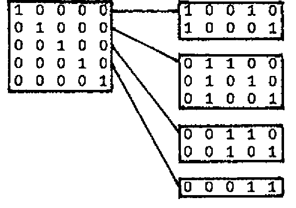
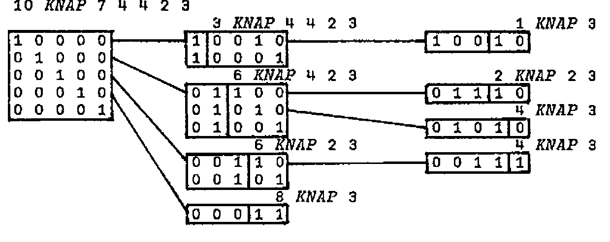

by Norman Thomson
{ .byline }

The knapsack problem is well known in Applied Mathematics and is capable of succint APL formulation. It thereby has inherent value in expounding to mathematical audiences the worth of APL in general and of inner products in particular.

Briefly the problem is that you are given a number of items from which you must choose some to pack in your knapsack, subject to a limit on the total weight. Each item has an associated <u>value</u> (relating presumably to its usefulness on the expedition), and the object is to choose the items in a way which maximises this total value.

First define a binary matrix of all possible binary selections with the help of a function ALLS :

(L and R stand for left and right argument in this and subsequent function definitions, and index origin is taken as 1.)

```apl
      ALLS : T⊤⍳×/T←R⍴2

      ALLS 3
0 0 0 1 1 1 1 0
0 1 1 0 0 1 1 0
1 0 1 0 1 0 1 0
```

Suppose also that the weights and values are defined as global vectors :

```apl
      W←7 4 4 2 3
      V←15 8 7 3 3
```

Now select those weight combinations which do not exceed the given weight limit R :

```apl
      U←(R≥W+.×U)/U←ALLS⍴W
```

From these select the selection which gives maximum value :

```apl
      U[;T⍳⌈/T←V+.×U]
0 1 1 1 0
```

These steps can be combined in a one-line function which gives all value-maximising selections and also prints the maximum value :

```apl
   KNAPSACK: U[;T INDEX ⎕←⌈/T←V+.×U←(R≥W+.×U)/U←ALLS ⍴W]

     INDEX: (L=R)/⍳⍴L

      KNAPSACK 10
18
1 0 0 1 0
1 0 0 0 1
0 1 1 1 0
```

As shown above KNAPSACK not only describes the problem but is also an executable solution. The trouble is that if the number of items is other than a small value, the space requirements are enormous, and this is surely not the way to encourage APL students to program!

We therefore seek other approaches. V and W above are arranged in order of decreasing V/W, a trivial matter to arrange in APL, but one on which the following algorithm depends.

At the first step find (as binary selection vectors) those solutions which involve just one item :

```text
1 0 0 0 0
0 1 0 0 0
0 0 1 0 0
0 0 0 1 0
0 0 0 0 1
```

For the first 4 consider solution vectors which include just one more item to the right and remain within the weight limit :



In each case the rightmost block is a subsidiary problem as indicated in the diagram below which also advances the process one step further :



Note that the last line in a block is always a stopper - this is where the V/W ordering comes in. The diagram suggests a recursive solution, and it seems sensible to make the (diminishing) weight vector the right argument R, and the limit weight the left argument L. Clearly the stopping condition occurs when R has just one item, so we can write the first few lines :

```apl
      ∇Z←L KNAP R
[1]    →(1<⍴R)/L1
[2]    Z←1 1⍴L≥R
[3]    →0
```

To write the recursive section it is useful to have a function which for a given weight limit L and weight vector R returns a matrix whose rows are solution vectors, and returns a single row of all zeros if none of the selections meets this criterion . This latter condition is expressed in the left hand part of VALID :

```apl
   VALID : (1 0⌈⍴T)↑T←(L≥R)⌿ID⍴R

      ID : (⍳R)∘.=⍳R
```

It is also necessary to have a function which joins a vector of the single (possibly repeated) lefthand blocks of the above diagram to the matrix right hand block :

```apl
   JOINEACH:(((1↑⍴R),⍴L)⍴L),R
```

KNAP can now be completed with the recursion occuring at line 8.

```apl
      ∇Z←L KNAP R;I;T;X;Y
[1]    →(1<⍴R)/L1
[2]    Z←1 1⍴L≥R
[3]    →0
[4]   L1:I←+/1↑⍴T←L VALID R
[5]    Z←(¯1,⍴R)↑T
[6]   L2:→(1>I←I-1)/0
[7]    X←T[I;]⍳1
[8]    Y←(X↑T[I;])JOINEACH(L-R[X])KNAP X↓R
[9]    Z←Y,[1]Z
[10]   →L2
      ∇

      10 KNAP W
1 0 0 1 0
1 0 0 0 1
0 1 1 1 0
0 1 0 1 1
0 1 0 0 1
0 0 1 1 1
0 0 1 0 1
0 0 0 1 1
0 0 0 0 1
```

and the solution is completed with an inner product with V as in KNAPSACK.

The set of 9 solutions immediately prior to multiplication by V is certainly an improvement on the 32 of KNAPSACK, and so for practical purposes we have a better algorithm.

We can make things better still by arranging that the multiplication by V happens within every step of the loop, i.e. by adding after line 9 :

```apl
      Z←(X=⌈/X←Z+.×(-¯1↑⍴Z)↑V)⌿Z

      10 KNAP W
1 0 0 1 0
1 0 0 0 1
0 1 1 1 0
```

and now the maximum number of extant selection vectors is never more than the number competing for a tie in first place which is 3 with the current data - the algorithm gets better and better as it lengthens!

In its final stage it is what is known as a ‘branch and bound’ solution to the problem, i.e. the V/W ordering ensures that a limit-exceeding partial vector and all its descendants are excluded from further consideration. Branch and bound is the name given to a powerful general technique, or rather family of techniques employed widely in Linear Programming and Operational Research.
