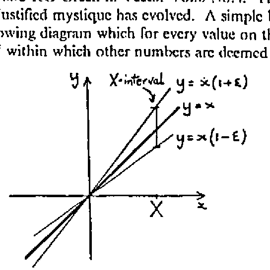
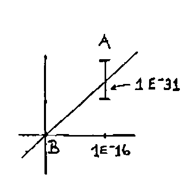
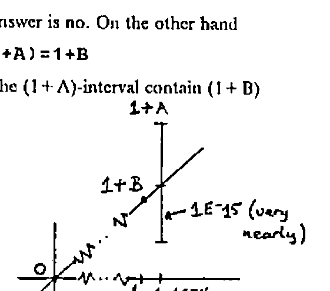
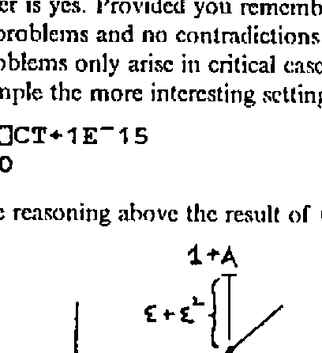
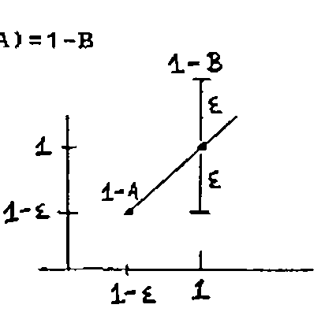

*by Norman Thomson*
{ .byline }

I should like to add some further comments to the note on Comparison Tolerance by RG Williams and RG Green in Vector Vol.6 No.4. This is a topic about which I consider an unjustified mystique has evolved. A simple but complete picture is given by the following diagram which for every value on the x-axis defines on the y-axis an interval within which other numbers are deemed equal to it.



For ease of reading `⎕CT` is written as ε on the diagram. The interpretation is that for some computational purposes X means not a number, but an *interval*, viz. [X(1−ε),X(1+ε)].

The above is the situation which pertains to a "perfect" computer, i.e. one which is not constrained by the bounds of finite arithmetic. Of course any real computer *is* so bounded, and thus quite separately from Comparison Tolerance there is for each type of computer a specific System Tolerance, *not* controllable by the user. In general the interval diagram describing System Tolerance has the same form as the Comparison Tolerance chart, but there is no necessity for it to do so, and the lines defining the bounds could in principle have completely arbitrary shapes. On machines with IBM type architectures the mantissa of a double precision floating point number is effectively represented by 53 bits. 2<sup>53</sup> is approximately 10<sup>16</sup> so System Tolerance is about `1E¯16`.

Returning to Comparison Tolerance, a complete understanding of `⎕CT` consists of appreciating that functions which involve comparisons are applied to *intervals* and not to numbers. Thus, to use Williams and Green’s example, set

```apl
A←1E¯16
B←0
⎕CT←1E¯15
```

Then

```apl
A=B
```

means does B lie in the A-interval where A is the number with the larger absolute value.



Clearly the answer is no. On the other hand

```apl
(1+A)=1+B
```

means does the (1 + A)-interval contain (1 + B)



and the answer is yes. Provided you remember that you are doing *interval arithmetic* there are no problems and no contradictions … or at least not on the perfect machine. Problems only arise in critical cases where System Tolerance interferes. Take for example the more interesting settings

```apl
A←⎕CT←1E¯15
B←0
```

Following the reasoning above the result of `(1+A)=1+B` can be predicted from the diagram



The answer on a perfect machine is undoubtedly yes. However once ε<sup>2</sup> comes into the area of System Tolerance, i.e. `⎕CT` is less than about `1E¯8`, the answer becomes unpredictable - on APL2/PC the answer is no. Setting `A←⎕CT←10*-N` we find that `(1+A)=(1+B)` is true for N = 5 to 8,13,14 and 16 and false for N = 9,10,11,12 and 15. On mainframe APL2 it is true in all cases.

A further question is whether the intervals are open or closed. This should be answered for individual implementations by asking the question

```apl
(1-A)=1-B
```



On APL2/PC `(1-A)=(1-B)` is true for N = 5,7,9,12,14 and 15 and false for N = 6,8,10,11,13 and 16. On mainframe APL2 it is true in all cases.

It should always be borne in mind that `⎕CT` applies only to functions that perform *comparisons* either implicitly or explicitly, and I thus question some of the functions in Williams and Green’s list. For example how is `⌹` affected by Comparison Tolerance? - it isn’t on IBM systems, neither is monadic `⍳` (wrongly called index) although *index of* (i.e. dyadic index) *does* involve comparisons and therefore *is* sensitive to `⎕CT`. The case for residue can be made either way - it appears to be sensitive to `⎕CT` on Dyalog but not on IBM.

Bracket indexing on the other hand should be added to the list for all systems since an index, e.g. 1 in `M[1]`, is in fact an *interval* which if it includes an integer identifies an item in an array. With `A←⎕CT←10*-N`, `M[1-A]` and `M[1+A]` both give DOMAIN ERRORs on APL2/PC for N = 5 to 14 and `M[1]` for N > 14. For mainframe the range giving DOMAIN ERRORs is N = 5 to 13.

If the list of functions sensitive to `⎕CT` is extended to IBM APL2 it will also include `⍷` (find), `≡` (match) and `⌷` (index).

As a final comment, I raise the question - how useful is `⎕CT` anyway? The popular response seems to be "not for me, but it’s great for numerical analysts." My experience however is that not even they find it to be of very great value, and I am inclined to view `⎕CT` as something of an outgrown residual from the early brainstorming days of APL development. I would nevertheless be pleased to hear of practical examples of its usefulness.

Norman Thomson,<br>
Mail Point 188,<br>
IBM UK Laboratories Ltd.<br>
Hursley Park,<br>
WINCHESTER,<br>
Hants SO21 2JN

Footnote: I should like to apologise for a minor error in my contribution to The Card Collecting Problem in Vector Vol.6 No. 4, namely the omission of the first ⍺ in the DRAW function which should begin `DRAW: ⍺DRAW …` and not `DRAW: DRAW …` as stated.
{ .note }
