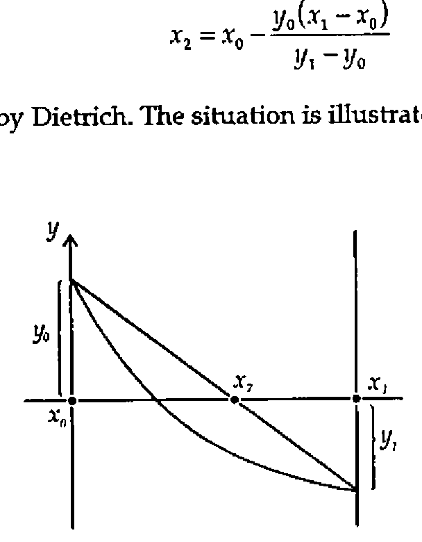
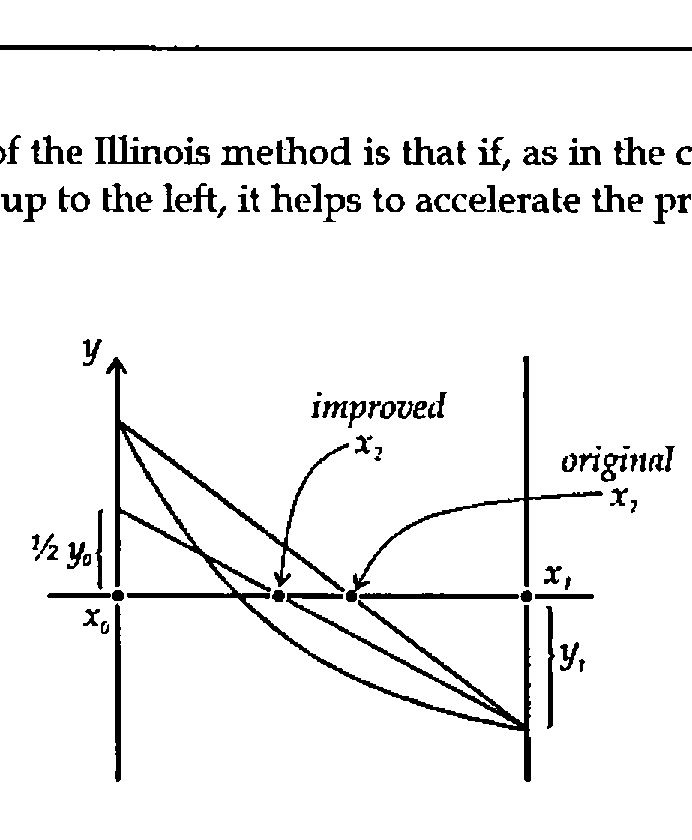

*by Norman Thomson*
{ .byline }

I begin this note by thanking Dietrich Trenkler for his contribution to the Random Vector in Vol.12 No.2, entitled *"Computing Clopper-Pearson Confidence Limits by the Illinois Method"* [1]. However I regretted that Dietrich did not exploit APL operators which greatly enhance the ease of the underlying programming problems, nor does his article make immediately clear the considerable application generality of the techniques he describes. These come under two quite separate headings of numerical analysis and statistics. Accordingly this note is an endeavour to rewrite, expand and clarify Dietrich’s material.

## Numerical Analysis

As Dietrich says, the Illinois Method is a refinement of Regula Falsi (sometimes called the Method of False Position), which in turn is a variant of the Secant Method, an operator-based algorithmic technique for which is described at length in *"APL2 in Depth"* [2]. All these methods are non-linear root-finding algorithms which have the objective of solving the equation *f(x)=0* given two start values *x*<sub>0</sub> and *x*<sub>1</sub>. All the methods use linear interpolation to obtain a further approximation *x*<sub>2</sub> based on the formula

> *x*<sub>2</sub> = *x*<sub>0</sub> − *y*<sub>0</sub>(*x*<sub>1</sub> − *x*<sub>0</sub>) / (*y*<sub>1</sub> − *y*<sub>0</sub>)

as quoted by Dietrich. The situation is illustrated graphically by



The basis of the Illinois method is that if, as in the case shown above, the graph of *f(x)* shoots up to the left, it helps to accelerate the process by using ½ *y*<sub>0</sub> at the next step, thus:



In programming terms an algorithm is required which processes a large range of functions, and this is one of the things which an APL operator provides. An operator should be thought of as a function generator. In the present instance an operator *ILL* takes a specific function, say *f(x)=cos(x) - x exp(x)* (this was the one chosen by Dietrich for his illustration), and generates an appropriate function *F ILL* to locate one of the roots of *F*. The calculation of *x*<sub>2</sub> shown above is fundamental, and this, following a small amount of elementary algebra, can be expressed as the cross-product function:

```apl
Z←X cp Y
Z←((⌽X)-.×Y)÷-/Y   ⍝ cross product (x2.y1-x1.y2)/(y1-y2)
```

(I adopt a convention of using lower-case names for APL functions and upper-case names for operators.)

All the apparatus is now in place to define a single step for the operator *ILL* whose (single) operand is a function *P*:

```apl
[0]  Z←(P ILL)X;T
[1]  Z←X cp P¨X                         ⍝ generate a new x-value
[2]  →(1=××/P¨(1↓X),Z)/L1               ⍝ branch if Yi.Yi-1 >0
[3]  Z←Z,T cp P¨T←(1↓X),Z ⋄ →0          ⍝ obtain second new x-value
[4]  L1:Z←Z,T cp 0.5 1×P¨T←(↑X),Z       ⍝   ditto     using .5×Yi-2
```

The final requirement is to repeat the process until a pair of successive solutions is within the desired tolerance as defined by the global variable *EPS*:

```apl
[0]  Z←(F RPT)X
[1]  Z←F ILL X              ⍝ Illinois method F=fn, X=start value
[2]  L1:→(EPS>|F ¯1↑Z)/0    ⍝ Result is intl, 2nd item=best approx
[3]  Z←F ILL Z ⋄ →L1        ⍝ Further step if Z not near enough 0
```

Taking the function *f(x)* above as an example, define

```apl
[0]  Z←F X
[1]  Z←(2○X)-X×*X
```

The final two Illinois values for the root are then found, using the Dietrich’s two start values of 0 and 1, by

```apl
      F RPT 0 1
0.5177573636 0.5177573637
```

The above is a completely general root-finding method, and if this is what you seek, the above eleven lines of APL are all that you require.

## Statistics

Suppose that you have carried out an experiment in which you believe that the conditions of a binomial probability model prevail, that is, the probability of achieving, say, a 1 (as opposed to a 0) at each trial is constant, although possibly unknown. (Such a trial is often called a Bernoulli trial.) An observation is thus expressed as *R* out of *N*, for example 3 right guesses out of 10, 3 heads out of 10 tosses and so on. An observation could come about in the presence of any one of a whole range of underlying Bernoulli probabilities *P*, and so the probability of obtaining the observation can be described as a function of *P*. The observed result, *R* out of *N*, thus generates a function, which, as in section 1, suggests an APL operator. With *ILL* above the generator was a function, in this case it is a vector *N,R*. Anticipating the fact that the objective is to generate confidence limits, I combine the required confidence level in the form, say .95, with *N* and *R* to define an operator *GB* analogous to Dietrich’s function *G_BINOM*:

```apl
[0]  Z←(LNR GB)P;L;N;R;T
[1]  (L N R)←LNR ⋄ T←0,⍳R      ⍝ R out of N is an obsvn;L∊[0,1]
[2]  Z←(+/(P*T)×((1-P)*N-T)×T!N)-L
[3]  ⍝ Z is cum binom prob(P,N;R) - L
```

By setting *L* to 0, *GB* can be used to obtain the cumulative binomial probability for any given *P*. For example:

```apl
      0 6 3 GB .5
0.65625
```

gives the probability of up to and including 3 heads in a toss of 6 coins. The experiment which Dietrich describes is one in which 13 out of 17 are observed, and so the estimate of *P* is 13/17 = 0.7647. The lower confidence limit is that value of *P* which is sufficiently small that the observation 13 out of 17 begins to become implausible. This, according to the Clopper-Pearson methodology, is recognised by the cumulative probability reaching 0.975 (for 95% confidence limits) for *R*=12 (n.b. not 13). So using Dietrich’s start values of 0 and 1, use *ILL* to find this probability as

```apl
      ¯1↑(0.975 17 12 GB)RPT 0 1
0.50101
```

Similarly the upper limit is that value of *P* which is sufficiently large that the cumulative probability up to *R*=13 reaches no more than 0.025.

```apl
      ¯1↑(0.025 17 13 GB)RPT 0 1
0.93189
```

Generalising the method, define a function *clb* which takes a result and a confidence level and produces a Clopper-Pearson confidence interval:

```apl
[0]  Z←L clb NR;P;SI
[1]  ⍝ Z is binom conf lims given obsvn (N,R), level is eg. L=.95
[2]  Z←0 1 ⋄ P←÷/⌽NR ⋄ L←0.5×1+L            ⍝ Adjust L for 2-sided
[3]  SI←⎕CT⌈(⌊/|P-0 1)⌊((P×1-P)÷↑NR)*0.5    ⍝ Set Start Interval
[4]  →(0=↑⌽NR)/L1                           ⍝ Z[1]=0 if R=0
[5]  Z[1]←¯1↑(L,NR-0 1)GB RPT 0⌈P-3 1×SI    ⍝ solve for low lim
[6]  L1:→(=/NR)/0                           ⍝ Z[2]=1 if R=N
[7]  Z[2]←¯1↑((1-L),NR)GB RPT 1⌊P+1 3×SI    ⍝ solve for high lim
```

Dietrich uses 0 and 1 (the extremes of the probability range) as start values throughout. This not only fails to use the knowledge which is already present in the observation in order to speed up the convergence of the Illinois method, but also can cause failure of convergence in the case of *N* out of *N*, since the two start points must not be identical. I have tried various ideas for a universal start value formula, and my current best thinking is reflected in line [3] of the function *clb*, and in the corresponding lines of the matching functions for other distributions which are given below. I have not penetrated the matter of start values deeply, and it is possible that there are better formulae for them, or indeed that the ones given may not always work. So long as the user has at least some degree of numerical and programming awareness, this need never be a severe problem in practice.

Dietrich gives the results of all confidence intervals for the case *N*=10, but declines to show the programming he needed to get there. Under my scheme of things this is achieved neatly using the each operator:

```apl
      T,,[⍳0]0.95clb¨10,¨T←0,⍳10
 0  0 0.3085
 1  0.0025286 0.44502
 2  0.025211 0.5561
 3  0.066739 0.65245
 4  0.12155 0.73762
 5  0.18709 0.81291
 6  0.26238 0.87845
 7  0.34755 0.93326
 8  0.44391 0.97479
 9  0.55498 0.99747
10  0.6915 1
```

Dietrich concluded his article by saying that this approach could be extended to the Poisson and negative binomial distributions. Rather than hand-wave, here are the corresponding operators:

### Poisson:

```apl
[0]  Z←(LR GP)X;L;R;T
[1]  (L R)←LR ⋄ T←0,⍳R        ⍝ R is an integer obsvn; L∊[0,1]
[2]  Z←((*-X)×+/(X*T)÷!T)-L   ⍝ Result is cum Poisson prob(X;R)-L

[0]  Z←L clp R;P;SI
[1]  ⍝ Z is Poisson conf lims for obsvn R, level is e.g. L=.95
[2]  Z←0 1 ⋄ L←0.5×1+L                  ⍝ Adjust L for 2-sided
[3]  →(0=R)/L1                          ⍝ Z[1]=0 if R=0
[4]  Z[1]←¯1↑(L,R)GP RPT 0.5 0.9×R
[5]  L1:Z[2]←¯1↑((1-L),R)GP RPT 2 3×R
```

### Negative Binomial:

```apl
[0]  Z←(LXR GNB)P;L;X;R;T
[1]  (L X R)←LXR ⋄ T←0,⍳R    ⍝ R = no. of 0s before X 1s; L∊[0,1]
[2]  Z←(+/(P*X)×((1-P)*T)×T!X+T-1)-L
[3]  ⍝ Z is cum neg bin p(P,X;R) - L

[0]  Z←L clnb XR;P;SI
[1]  ⍝ Z=neg binom conf lims for obsvn (X,R), level is eg.L=.95
[2]  Z←0 1 ⋄ P←(↑XR)÷+/XR ⋄ L←0.5×1+L        ⍝ Adjust L for 2-sided
[3]  SI←⎕CT⌈⌊/|P-0 1                         ⍝ Set start interval
[4]  →(0=↑⌽XR)/L1                            ⍝ Z[1]=0 if R=0
[5]  Z[1]←¯1↑((1-L),XR)GNB RPT 0⌈P-0.2 0.5×SI
[6]  L1:Z[2]←¯1↑(L,XR-0 1)GNB RPT(1-⎕CT)⌊P+0.2 0.5×SI
```

Dietrich talks about the "coverage probability *c(p)*" meaning the probability that the true binomial probability lies within the confidence limits. In my view, *c(p)* is either 0 or 1, that is the confidence interval either does or does not include the true probability - the problem is that since you don’t know the latter you don’t know which of these two values *c(p)* possesses. In short, I do not understand Dietrich’s coverage probability, which is a pity, because by not giving his program, Dietrich has missed an opportunity of using APL to describe his intentions in a situation where verbal communication by itself has proved inadequate. Also the diagram on page 93 has presumably suffered greatly in transcription, and so this doesn’t help either.

What *is* meaningful is to compute the *relative likelihood* associated with the confidence interval, that is the *average* probability of the observation for *P* values within the limits, relative to the overall average probability. To compute this requires integration of the various probability functions, which in turn requires some more numerical analysis. For those readers who wish to persevere further this is where the next section returns.

## More Numerical Analysis

A complete operator-based APL package was described in detail in [3]. A summary version is given here which contains the operator *SIMPSON*, which implements Simpson’s Rule, and *ROMBERG* which builds on *SIMPSON*, and extends it satisfactorily for definite integration for a wide range of functions. In each case *P* is the function to be integrated and *R* is the range of integration. The number of Simpson intervals, *L* must be an even integer.

```apl
[0]  Z←L(P SIMPSON)R;T
[1]  Z←(T×+/(1,((L-1)⍴4 2),1)×P¨(↑R)+(T←-R-.÷L)×0,⍳L)÷3

[0]  R←V refine S
[1]  →(0≠⍴,V)/L1 ⋄ R←S ⋄ →0
[2]  L1:R←,(¯1↓V)refine S
[3]  R←R,(¯1↑R)+(¯1↑R-V)÷¯1+2*4×⍴R

[0]  Z←(P ROMBERG)R;T;N
[1]  Z←T←(1+N←0)(P SIMPSON)R
[2]  L1:Z←(T←¯1↑Z)refine(2*N←N+1)(P SIMPSON)R
[3]  →(EPS<|T-1↑Z)/L1 ⋄ Z←¯1↑Z
```

There are situations in which what is called adaptive integration works where *ROMBERG* fails, and so an operator *ADAPT* is also given. *ADAPT* works by repeatedly distributing the tolerance between half-sized intervals, and so it is necessary to provide the initial tolerance, *E*, explicitly at invocation, whereas *ROMBERG* uses the global value *EPS*.

```apl
[0]  Z←E(P ADAPT)R
[1]  Z←4(P SIMPSON)R
[2]  →(EPS>|Z-2(P SIMPSON)R)/0
[3]  Z←+/(0.5×EPS)(P ADAPT)¨0 1⌽¨R,¨0.5×+/R
```

The above fourteen lines of APL provide a complete general-purpose package for definite integration — a good example of a small amount of APL code providing a great deal of function.

## More Statistics

Following the above, we are now in a position to compute the relative likelihoods for the binomial and negative binomial distributions by integrating over both the Clopper-Pearson range, and the maximum possible range, which is (0,1). The operators *PYB* and *PYNB* supply binomial and negative binomial probabilities. Expressing the parameter pairs *NR* and *XR* as operands allows their arguments *P* to be set up as suitable variables for integration.

```apl
[0]  Z←(NR PYB)P
[1]  Z←×/(!/⌽NR),(P,1-P)*(¯1↑NR),-/NR

[0]  Z←L rlb NR
[1]  Z←÷/(NR PYB ROMBERG)¨(L clb NR)(0 1)

[0]  Z←(XR PYNB)P;X;R
[1]  (X R)←XR ⋄ Z←(P*X)×((1-P)*R)×R!X+R-1

[0]  Z←L rlnb XR
[1]  Z←÷/(XR PYNB ROMBERG)¨(L clnb XR)(0 1)
```

There is no point in supplying corresponding operations for the Poisson case since mathematics guarantees that the relative likelihood is exactly equal to the confidence level.

It is interesting to evaluate the relative likelihoods for some sample binomial observations.

```apl
      .95 rlb¨(10 3)(100 30)
0.98385  0.96238

      .95 rlb 1000 300
0.95354
```

Once *N* becomes large, say of the order of several hundred, the user needs to be sensibly aware of what is going on in the program. The problems arise because the functions being integrated eventually have values of the same order of magnitude as *EPS*. Some breathing space can be obtained by recognising that since *rlb* produces *relative* likelihoods the results of *PYB* and *PYNB* can be multiplied within the APL function by arbitrary constants. Switching from *ROMBERG* to *ADAPT* is another possibility, which was necessary in the last case above, although for simpler cases *ROMBERG* is faster.

In each case the relative likelihood is greater than the confidence level, which leads to the paradox that for a low *N* such as 10, the odds are better than 49 to 1 on the confidence limits including true *p*, even although the confidence level was only 95%. The explanation is that the probability of obtaining *precisely* the observed result is excluded from both summations in *clb*. As *N* increases the relative likelihood (which is what you should put your money on!) moves closer to the confidence level. However even with *N*=1000 there is still quite a bit to go.

Relative likelihood is also observed to exceed confidence limits in the negative binomial case.

```apl
      .95 rlnb¨(2 1)(2 3)(5 20)
0.99595  0.98218  0.95367
```

In a teaching context, this provides striking illustrations of the differences between confidence, probability, and relative likelihood.

I would like to emphasise the practical nature of such calculations. At work I was often asked what should be believed following an experiment in which small numbers of failures were observed, for example 2 out of 1000. The appropriate confidence limits are

```apl
      .95 clb 1000 2
0.00024 0.007
```

Using a Normal approximation the 95% confidence limits would have been quoted as -0.0008 to .0048, the former of which is ridiculous, while the latter leads to a falsely optimistic view of the true quality.

## References

[1] *Computing Clopper-Pearson Confidence Limits by the Illinois Method*, D Trenkler, The Random Vector, Volume 12, No.2, pp. 87-94, October 1995.

[2] *APL2 in Depth*, ND Thomson and RP Polivka, Springer-Verlag, 1995.

[3] *Integrating with Insight*, Norman Thomson, Vector Vol. 9 no. 3, pp. 113-116, January 1993.
