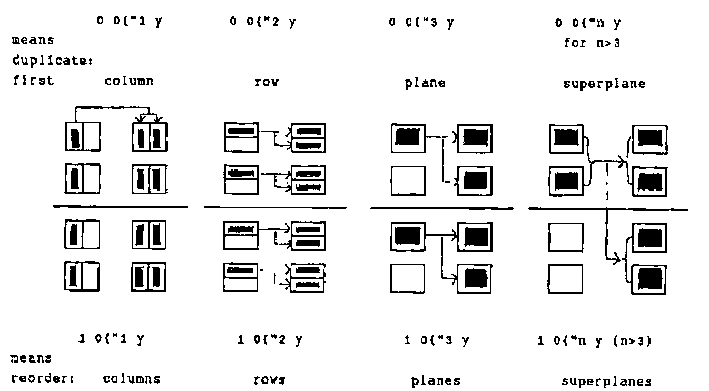
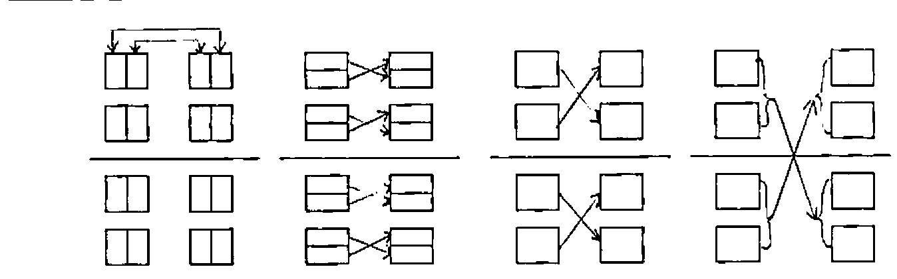
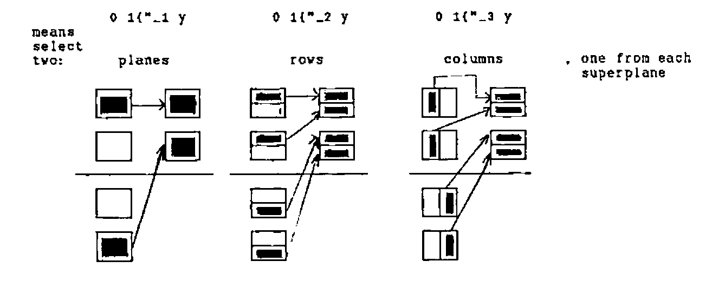

*by Norman Thomson*
{ .byline }

In [1], Chris Burke outlines the concepts of frame and cell which underlie J data construction in general and the J rank conjunction in particular. One possible sub-structuring of `b=.i.2 3 4` is that of six 1-cells laid out in a 2 by 3 frame thus:

```text
┌───────────┬───────────┬───────────┐
│  0  1  2 3│ 4  5  6  7│ 8  9 10 11│
├───────────┼───────────┼───────────┤
│12 13 14 15│16 17 18 19│21 22 23 24│
└───────────┴───────────┴───────────┘
```

The rank conjunction joins a verb and an integer *k*. Applying ravel joined to various rank conjuncts reveals much about the nature of rank in J, as the following table shows:

```text
                                         n=
frame-size  cell-size  b contains   frame-rank   $,"n b
       i.0      2 3 4  1 3-cell          0       2 3 4 1
         2        3 4  2 2-cells         1       2 3 4
       2 3          4  6 1-cells         2       2 12
     2 3 4        i.0  24 0-cells        3       24
```

Chris did not mention that the integer conjunct of rank can be negative, which allows the application of its verb to be thought of in terms of frames. For example `,"_2 b` means "apply ravel to the rank-2 frames", which in the case of a rank-3 object is the same as applying it to the 1-cells. For rank-3 objects such as `b`, a table of equivalences for `,"m b` is as follows:

```text
m in ,"m b    Shape      Notes
 0  _n        2 3 4 1    where n>2
 1  _2        2 3 4      b-:,"1 b  is true for all arrays
 2  _1        2 12       first row is i.12
 3   0        24         same as APL ravel
```

Other monadic verbs behave in ways which now become readily predictable. If `y=.i.2 2 2 2`, `+/"2 y` is equivalent to `+/"_2 y`, and means sum down the columns of the 2-cells, of which the first is the matrix

```text
0 1
2 3
```

In full, `+/"2 y` is

```text
 2  4
10 12

18 20
26 28
```

`+/"_1 y` means take the 1-frames, or equivalently the two 3-cells, each of which is of rank 3, and the first of which is

```text
0 1
2 3

4 5
6 7
```

and add along the first axis. The result of this addition for the first 3-cell is

```text
4  6
8 10
```

and the full result of `+/"_1` is

```text
 4  6
 8 10

20 22
24 26
```

Next, consider the rank conjunction applied to from (`{`). Ringing changes on the indices can be used as a means of replicating or re-ordering the various dimensions. This is described more easily in diagrams than in words. In each sub-diagram the original matrix is shown on the left.



`1 0{"1 y`, `1 0{"2 y`, `1 0{"3 y` and `1 0{"n y (n>3)` mean reorder columns, rows, planes and superplanes:



Frame-based indexing is a little different, since it has the effect of rank reduction, and also, unlike the cell-based index vectors which may be of any length, the length of the indices for negative rank conjuncts must now match the length of the first axis.

`0 1{"_1 y`, `0 1{"_2 y` and `0 1{"_3 y` mean select two planes, rows and columns, one from each superplane:



There are interesting relations with "squad" indexing in zero origin in APL2. These are given in the following table of equivalences:

```text
                                            duplicates first:
               y     0 0{"0 y
( ⊂0 0) ⌷[3] y       0 0{"1 y              columns
( ⊂0 0) ⌷[2] y       0 0{"2 y              rows
( ⊂0 0) ⌷[1] y       0 0{"3 y              planes
( ⊂0 0) ⌷[0] y       0 0{"n y              superplane

                     where n>3 including _ (infinity)
```

Note: For the case `{"0 a`, `0` and `(#a)$0` are the only valid indices.

APL2 axis qualification is frame- rather than cell-oriented in the sense that axes are counted from major to minor, whereas cells are reckoned in a bottom-up fashion.

For negative rank conjuncts, the situation is a little different, and is best illustrated by changing the data to an array in which all the dimensions are of different magnititude. Setting `z=.i.2 3 4 5`, we have

```text
                                     with the same selection in
                                     each superplane, select two:
( ⊃( ⊂4 5)⍴¨⊂2 1) ⌷¨⊂[1]z    2 1{"_1 z      planes
( ⊃( ⊂3 5)⍴¨⊂3 3) ⌷¨⊂[2]z    3 3{"_2 z      rows
( ⊃( ⊂3 4)⍴¨⊂4 3) ⌷¨⊂[3]z    4 3{"_3 z      columns
                         z    0 0{"_n z

                     where n<_3 including __ is equivalent to
                     0 0{"0 - see note below previous table.
```

The indices 2 1, 3 3 and 4 3 above are abitrary, but they must be valid so as not to create index errors. It looks as though the above series might be extended upwards so that for example `( ⊃( ⊂4 5)⍴¨⊂1 0 1) ⌷¨⊂[0]z`, which constructs a single super-plane with a mixture of planes (1 0 1) from each of the superplanes of `z`, might have an equivalent using `{"0`, but this is not the case. To achieve this in J, it is necessary to index superplanes explicitly using a more general scattering indexing technique:

```text
(1 0 1,&.>0 1 2){"4 z
```

## Reference

[1] *APL and J(1) – Function Rank*, Chris Burke, Vector Vol.13, No. 1 pp.96-101
