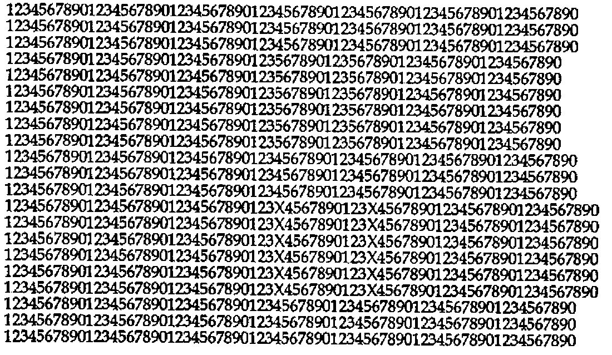
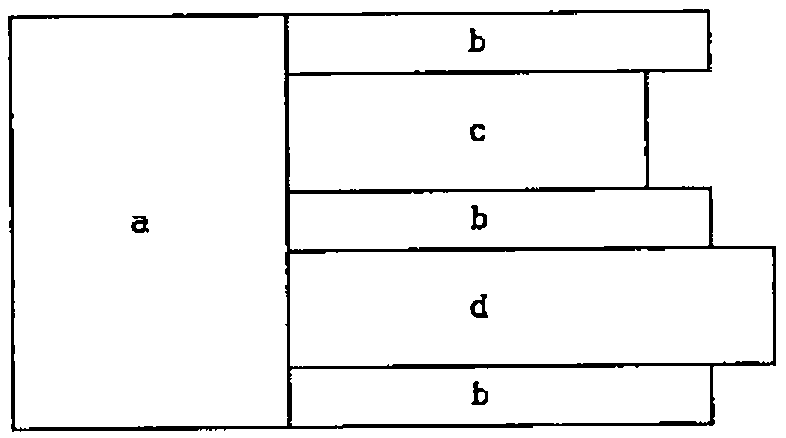
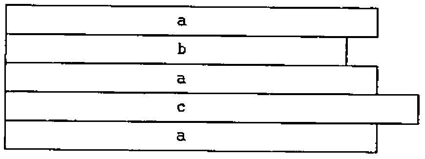

by Norman Thomson
{ .byline }

The essence of all computing is data *transformation*. Array languages allow the user to economise on the number of data transformations by perceptive pre-structuring of data. Of course such pre-structuring is itself data transformation, and an assessment of what J provides should make a distinction between *data structuring* transformations as opposed to *operational* transformations. It is convenient to think of the first of these as being about *data craftsmanship*. I would not of course dispute that data-base specialists are data craftsmen in their own right, rather I argue that in array languages, and J in particular, the art of data craftsmanship comes closer to the user than elsewhere in computing.

The J data craftsman has three primary adhesion tools, namely a joiner, a stitcher and a laminator, the flexibility of each of which can be increased by using the rank conjunction attachment. In addition, the joiner and the laminator possess an automatic squaring-off component which ensures that their output is always perfectly rectangular. The versatility of all of these is increased by the addition of two further tools, the boxer and the opener, which allow the craftsman to work on objects either as wholes or as sums of parts.

Like all good craftsmen, the good *data* craftsman is the one who can instinctively assesses the right tool to apply in each workshop contingency. I make no claims to be an expert data craftsman, nevertheless I would like to introduce you to my available tools, my hammers, saws and chisels as it were, and by showing you some of my rough-hewn efforts, invite you, the reader, to contemplate how you yourself might employ them with greater dexterity. Unlike items in a physical workshop, the end result should be the same whether produced by the good or the bad workman, the skill lies in the grace and beauty with which the tools are wielded, and the extent to which this leads to greater versatility in their future use.

Part of the difficulty of comprehending and appreciating the tools is the variety of possible ways in which the same end effect can be achieved once adjuncts such as the rank conjunction and box/open are taken into account. In order to simplify comprehension problems, box/open are not considered in this elementary review.

The tools in the APL data craftsman’s kit differ from those of the J craftsman (see J-ottings 5, Vector, vol. 11 no. 4 for details). When the APL craftsman sees

```
abc
def
```

he sees a 2 by 3 character matrix. By contrast the J data craftsman sees a sequence (or list) of two 3 character sequences. To pursue the workshop analogy, the former sees a rectangular block of wood, the latter some sliced contiguous planks. Thus when such an object is constructed using `⍴` or `$`, the APL craftsman says to himself “a 2 by 3 matrix using as data …”, whereas the J craftsman says “a list of two 3-item lists using as data …”.

Allow me then to take you on a tour of my carpentry shop. I use the joiner when I already have a pile of planks and I want to stack a second pile on top of it. I do not need to worry about imbalance due to non-matching widths of planks since my joiner automatically squares things up, and ensures that the resultant pile has a nice rectangular cross-section. Next my stitcher (`,.`). I use this when I stack two piles side by side, and then join plank to plank in matching pairs. Naturally the stitcher only works when the numbers of planks in the two piles are equal. Finally the laminator (symbol `,:`) starts a new pile from two existing piles. The shape verb `$` starts its work as a laminator, and continues as a joiner. In this sense the laminator is one of the lowest level (most primitive) operators in the overall J tool kit, and thus one of the most pervasive verbs even although its *explicit* usage is relatively small.



Now I want to take you through a real job. I count myself amongst the enthusiasts for stereograms, an invention which Eddie Clough described aptly as one of life’s minor miracles (see again Vector, vol.11 no. 4 for details). In a recent and fascinating book entitled “How the Mind Works” by the American psychologist Steven Pinker, the above pattern is given as a diagram used to explain how autostereograms are constructed (it is in itself a convincing autostereogram — try it!).

The basis of the diagram is that in the short lines two 4s have been removed; in the long lines two Xs have been inserted between 3 and 4. Look at these two areas and use stereogram viewing techniques to observe a lifted and a recessed rectangular block respectively. Viewed as a problem for the data craftsman, here is a possible working plan for joining and stitching:



and here are some possible intermediate stages in its construction:

```
t=.'123X4567890'
u=.t-.'X'                 NB. -. means "less" ..
v=.u-.'4'                 NB. .. so v is '123567890'
a=.21 30$u                NB. leftmost 30 columns
b=.3 40$u                 NB. to stitch onto 1st 3 rows of a
c=.(6 18$v),.6 20$u       NB. stitch short line blocks
d=.(6 22$t),.6 20$u       NB. stitch long line blocks
```

(`-.` is one of my minor tools, a gouge!)

The diagram is then given using the combination of the joiner and stitcher as:

```
a,.b,c,b,d,b
```

I find the temptation to abridge the component definitions using `each=.&>` and box(`<`) is irresistible:

```
'tuv'=.  (<'123X4567890')-.each '';'X';'X4'
'abw'=.  (21 30;3 40;6 20)$each <u
'cd'=.   ((6 18$v);6 22$t),.each <w
```

An alternative way of stitching and joining has the following plan:



and is obtained by replacing the last two J lines above with:

```
'awx'=.  (3 70;6 30;6 20)$each <u
'bc'=.  (<v),.each((6 18$v);6 22$t),.each <x    NB. stitch here
```

The Pinker diagram is now given as

```
a,b,a,c,a
```

Of course what I have shown is the two dimensional side of my workshop. In reality it is a *multi*-dimensional carpentry shop in which the upward transitions to higher dimensions are so smooth as to require no further explanation once the two-dimensional ones are understood.

Next, a peep at rank conjunction. Every woodworker needs an accountant, and it is no coincidence that mine is also a compulsive joiner and stitcher. When he sees something like this:

```
1 7 4
5 2 0
```

he immediately and instinctively recognises it as a *table* (shadows of the APL data-craftsman!) Not so a J-educated person, to whom it is a list of lists as described above. The column sums are attached by a join hooked with addition:

```
csum=. ,+/
```

and the row sums by a stitch hooked with addition at rank 1 (rows):

```
rsum=. ,.+/"1
```

To attach both column and row sums, sit one atop the other (either way round will do):

```
tots=. csum @ rsum     or     tots=. rsum @ csum
```

To transform each row into proportions of its row total construct another hook:

```
rpro=. %+/"1
```

following which you might suppose that column proportions are given by `cpro=.%+/` . This formula is dangerously wrong. If you are lucky, you might get a length error to stop you in your tracks, but if the argument happens to be square, the result (transliterated into fractions in order to demonstrate where the figures come from) is:

```
   cpro i. 3 3              NB. column totals are 9 12 15
   0    1/9   2/9
 3/12  4/12  5/12
 6/15  7/15  8/15
```

The correct `cpro` is

```
   cpro=.%"1 +/
   cpro i. 3 3
   0    1/12  2/15
 3/9   4/12  5/15
 6/9   7/12  8/15
```

A final word — much of the above consists of analogies; as soon as these have served their purpose for *you*, I urge you to destroy the images, and revert to the proper J vocabulary, without which exact communication can be greatly impeded.
