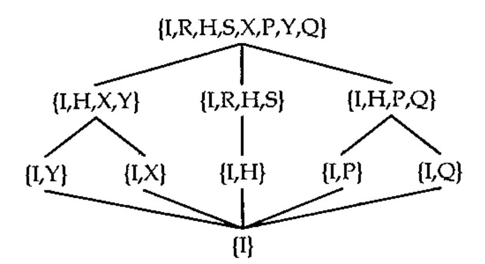

*by Norman Thomson*
{ .byline }

The other day I came on my four year old grandson at play with J — no, not checking out Gene McDonnell, that would be having too many of the good things in life too early — what I mean is that while playing with large plastic letters of the alphabet, I found him busy fitting and refitting J into a square frame by turning it round through right angles, picking it up, turning it over and so on. So we got together and while he reflected with J, I too reflected with J. The grandfatherly view of J, by the way, is

```j
   ]J=.4 4 $'   *   **  * **'
   *
   *
*  *
 **
```

We started by turning J around its horizontal middle line:

```j
   (X=:|.)J
 **
*  *
   *
   *
```

`X` means reflect in the x axis. In J vocabulary `|.` is called *reverse*, which is just what happened, that is a stack of four character vectors was reversed.

Next we turned J about the North-west/South-east axis:

```j
   (Q=:|:)J
  *
   *
   *
***
```

Now what would happen if we did an `X` and then a `Q`, (or as Grandad says a `Q` with an `X`) ?

```j
   (S=:Q&X)J
 *
*
*
 ***
```

... or for that matter a `Q` and then an `X` :

```j
   (R=:X&Q)J
***
   *
   *
  *
```

(At this point I noticed that grandson had turned J within the frame by 90 degrees, first clockwise, and then anti-clockwise.) Only a few more tricks left:

```j
   ((Y=:X&.Q)`(P=:Q&.X))/.  J
*
*
*  *
 **

 ***
*
*
 *
```

Just two things left now to complete the repertoire. First a half turn, for which either `R` or `S` could be applied twice (e.g. `H=:R^:2`), or `X` and `Q` can be continued with as atomic items

```j
   (H=:X&.Q&X)J
 **
*  *
*
*
```

... and secondly a “do nothing” operation `I=:[` or `I=:]` .

There are many alternative ways of defining these eight verbs. For example, using the rank conjunction, reverse “at rank 1” means at vector level so that each member of the stack of four vectors is separately reversed instead of the stack as a whole, which results in a `Y` reflection. The full set of eight transformations are given in the table below with some of the many possible variants which include the equivalence of `&` and `@` in this context.

```text
             alternative   meaning                   algebra
I=:  [       NB. ]         identity
H=:  X&.Q&X  NB. X"1@X     half-turn                 H=YX=XY
X=:  |.      NB.           refln in Ox               X=QS=YH
Y=:  X&.Q    NB. X"1       refln in Oy               Y=QR=XH
S=:  Q&X     NB. X"1@Q     rotn pi%2 clockwise       S=QX=YQ
R=:  X&Q     NB. Q@X"1     rotn pi%2 a-clockwise     R=XQ=QY
P=:  Q&.X    NB. X&R       rotn in x=y               P=XS=YR
Q=:  |:      NB.           rotn in x=-y              Q=YS=XR
```

The column headed “algebra” contains some equivalences in which the conjunction `&` has been elided. A full composition table for the conjunction `&` applied to the eight verbs is

```text
    I R H S X P Y Q

I   I R H S X P Y Q
R   R H S I P Y Q X
H   H S I R Y Q X P
S   S I R H Q X P Y
X   X Q Y P I S H R
P   P X Q Y R I S H
Y   Y P X Q H R I S
Q   Q Y P X S H R I
```

At this point I left grandson experimenting with other fascinating objects such as A and K, while I perused the above composition table for inherent structures.

First it is an example of something which mathematicians call a *group*, or more fully a group of order eight since the body of the table contains just the basic eight distinct elements (this is called “closure”). But let’s cut the technicalities and look for structures within the structure. To start with, the first four rows and columns themselves form a group of order four, which is structurally identical (isomorphic) to the addition table for addition in arithmetic modulo 4 (clock arithmetic to those of you youngsters who aren’t in bed yet!). This table is:

```j
      c=:| +/~@i.  NB. Cyclic group of order y.
   c 4
0 1 2 3
1 2 3 0
2 3 0 1
3 0 1 2
```

which can be transcribed into subsets of the 8 by 8 table by

```j
   (c 4)&{ each 'IRHS';'XPYQ'
┌────┬────┐
│IRHS│XPYQ│
│RHSI│PYQX│
│HSIR│YQXP│
│SIRH│QXPY│
└────┴────┘
```

The first of these is a subgroup of the full table but the second is not a subgroup because it has no identity element (that is an element with the property that Ia = aI = a for all elements of the subgroup). The two bottom quadrants have row shifts which go in the opposite direction to `c 4` . A general algorithm for this uses the “minus” table for `i.n` , two hooks, and modulo n arithmetic:

```j
      ac=:|(+-/~@i.) NB. Anti-cyclic table of order y.
   ac 4
0 3 2 1
1 0 3 2
2 1 0 3
3 2 1 0
```

`(ac 4){'XPYQ'` gives the bottom left hand quadrant of the table, and `(ac 4){'IRHS'` gives the bottom right hand quadrant. These two expressions can be merged as `(4+ac 4){'IRHSXPYQ'` , and the indices in the string `'IRHSXPYQ'` of the cells in the four quadrants are, in clockwise order, `(c 4)`, `(4+c 4)`, `(ac 4)` and `(4+c 4)` . These define the non-symmetric group which is known as the dihedral group of order 4. An adverb based on a hook which adds the “tally” of a matrix to itself (“tally” for a matrix is simply the number of rows) leads to the following general definition of dihedral groups:

```j
   a2n=:(+#)@                      NB. adverb : adding 2 to the power n
   di=:(c,.c a2n),((ac a2n),.ac)   NB. Dihedral group of order n
      di 4
0 1 2 3 4 5 6 7
1 2 3 0 5 6 7 4
2 3 0 1 6 7 4 5
3 0 1 2 7 4 5 6
4 7 6 5 0 3 2 1
5 4 7 6 1 0 3 2
6 5 4 7 2 1 0 3
7 6 5 4 3 2 1 0
```

and `(di 4){'IRHSXPYQ'` generates the 8 by 8 composition table given above.

The table of `I`, `H`, `X` and `Y` rotations only is simply the dihedral group of order 2 (D2).

```j
   (di 2){'IHXY'
IHXY
HIYX
XYIH
YXHI
```

and the set of all possible subgroups is exhibited in the following lattice diagram in which a connecting line indicates that the lower node is a subgroup of the higher one.



In general the dihedral group Dn describes the symmetries of an n-sided regular polygon. For example

```j
   di 3
0 1 2 3 4 5
1 2 0 5 3 4
2 0 1 4 5 3
3 4 5 0 1 2
4 5 3 2 0 1
5 3 4 1 2 0
```

gives the non-symmetrical group of symmetries of the equilateral triangle. 0 1 and 2 correspond to rotations by 0, π/3 and 2π/3, and 3, 4 and 5 to reflections in the three perpendicular bisectors of the sides.

Relationships exist between the grade operations, `/:` and `\:` applied to permutation vectors and the transformations `IHXYRSPQ`.

To demonstrate this here are two verbs which convert permutation vectors to matrices and vice versa:

```j
   pmfrom=:=/~ i.@#        NB. Transforms permutation vector to matrix
   pmfrom 1 3 2 0
0 0 0 1
1 0 0 0
0 0 1 0
0 1 0 0

   pvfrom=:+/ .*~i.@#      NB. Transforms permutation matrix to vector
   pvfrom pmfrom 1 3 2 0
1 3 2 0
```

A dihedral composition table for grade verbs can be constructed with names for the operations on permutation vectors matching exactly the one for the analogous matrix transformations, that is if `pv` is a permutation vector then `q pv` is equivalent to `pvfrom Q pmfrom pv`, and similarly for the other seven verb pairs. It turns out that it is `s` and `q` which are primitives under this scheme, and also for permutation vectors, `y` is equivalent to `|.` .

```text
                          with           some
                      grade verbs    alternatives

i=:  [        NB.
h=:  s^:2     NB.     \:&\:          y&x
x=:  q&s      NB.     /:&\:          x&h
y=:  s&q      NB.     \:&/:          |.
s=:  \:       NB.     \:             y&q
r=:  s&.q     NB.     \:&\:&\:       q&y
p=:  q&.s     NB.     /:&\:&\:       s&y
q=:  /:       NB.     /:             y&s
```

I trust that I have managed to affirm my belief that *Vector* should be committed to including something for even the youngest reader. And now it’s off to Mothercare to buy a set of these plastic letters ....
