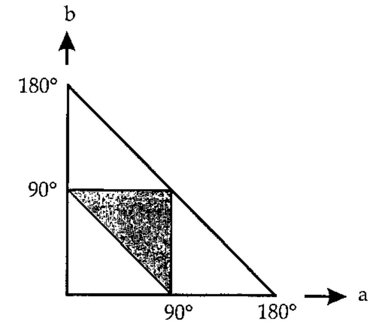

*asks Norman Thomson*
{ .byline }

In the world, that is. Lots, I know, but let me be more precise and ask what **proportion** of all triangles in the world are obtuse-angled? You might suggest that since only two of the angles, say *a* and *b*, of a triangle can be determined independently, the set of all possible triangles is denumerable with points contained within the large right-angled triangle in the diagram below



and further, since the acute-angled ones are denumerable with the points within the shaded triangle, it follows that 75% of all triangles are obtuse-angled. Well, let’s ask J and see whether he/she/it (as far as I am aware J has not yet been honoured with an official gender) agrees.

Assume first that a point is represented by a 2-list of numbers such as `4 7`. The verb `py` calculates the square of the distance between two such points :

```j
   py=.(+/@:*:@:-/)"2  NB. square of dist btwn 2 points
   py 4 7,:1 3         NB. py applied to a 3,4,5 triangle
25
```

A triangle is a 3-list of 2-lists (points). To calculate the squares of the three sides first select the points in pairs, and then apply `py`, :

```j
   sides =.(0 1;1 2;0 2)&({&>)@< NB. select point pairs
   ]t=.3 2$_3 _2 _1 6 0 2        NB. specimen triangle
_3 _2
_1  6
 0  2
   sides t
_3 _2
_1  6

_1  6
 0  2

_3 _2
 0  2

   py sides t          NB. squares of three sides of triangle
68 17 25
```

A triangle is obtuse if the square of the largest side exceeds the sum of the squares of the other two, so define `ifbig1` to test whether the largest of a set of numbers is greater than the sum of all the others :

```j
   ifbig1=.({.>+/@}.)@\:~   NB. 1 if biggest > +/rest
   ifbig1 49 43 100
1
```

This leads naturally to

```j
   obtest=.ifbig1@:py@sides NB. 1 if obtuse, 0 if not
   obtest t
1
```

To generate random triangles centred on the origin, construct lists like `t` using an integer which determines the coordinate resolution. This should be big enough to minimise the inaccuracy arising from the fact that `?` returns integers :

```j
   rt1=.-~ ?@>:@+:@(3 2&$)NB. rand trngle,coords in[-y.,y.]
   rt1 100
_94  16
 36 _68
 _6 _14
```

Everything is now in place to test a single random triangle with given resolution :

```j
   trial1=.obtest@rt1  NB. 1 if rand trngle is obtuse
   trial1 100
0
```

so this particular triangle was acute-angled. Here are a thousand trials at a higher resolution :

```j
   +/trial1&>1000$10000      NB. test 1,000 random triangles
747
```

and a few more :

```j
   +/trial1&>1000$10000
721
   +/trial1&>1000$10000
738
   +/trial1&>10000$10000   NB. increase the number of trials
7251
```

By now you should be getting a feel for where the true value lies, namely somewhere between 72 and 73 per cent. Here is a summary of the J verbs used in this simulation :

```j
py=.(+/@:*:@:-/)"2             NB. sq of dist btwn 2 points
sides=.(0 1;1 2;0 2)&({&>)@<   NB. 3 sides each a pt.pair
ifbig1=.({.>+/@}.)@\:~         NB. 1 if biggest > +/rest
obtest=.ifbig1@:py@sides       NB. 1 if obtuse, 0 if not
rt1=.-~ ?@>:@+:@(3 2&$)        NB. rand trngle in[-y.,y.]
trial1=.obtest@rt1             NB. obtuseness test
```

Another way to conduct the simulation is to generate random angles rather than random sides. Start by writing a verb which generates a number of random values (angles) between 0 and 2π:

```j
   rnd=.(%~?)@(1e9&(#~))       NB. y.random uniform (0,1) s
   pi2=.o.2                    NB. pi/2 = 6.28319
   ra=.*&pi2@rnd               NB. y. random angles in (0,pi2)
   ra 6
4.97256 1.18961 0.688103 3.88122 5.97772 5.69835
```

The sines and cosines of each angle generate a point within the unit circle, and so random angles can be transformed to random points within the unit circle by :

```j
   cs=.o.~/&2 1@ra     NB. cos/sine s of y. random angles
   cs 3
_0.0880986  0.996112
  _0.23431 _0.972162
 _0.772602  _0.63489
```

and then to random triangles in a circle with radius `y.` by

```j
   rt2=.3 :'y.*cs 3'   NB. rand trgle in circle radius y.
   rt2 100
 37.8875  92.5448
_48.1939  87.6205
 71.0356 _70.3843
```

The apparatus is already in place for determining whether these triangles are obtuse or not, and for doing some more experiments :

```j
   trial2=.obtest@:rt2
   +/trial2&>10000$10000
7555

   +/trial2&>10000$10000
7518
```

A little bit higher than our previous estimate, but close to the theoretical 75%. Maybe sampling from a square frame includes disproportionately many ‘skinny’ acute angled triangles which have one vertex tucked into one of the far corners. To test this conjecture, sample the co-ordinates within a square but accept only those triangles all of whose points lie inside the largest inscribed circle. The final line of `rt3` embodies recursively the "accept-reject" technique which is common in simulation practice :

```j
   ssq=.+/@:*:     NB. sum of squares
rt3=.3 :0      NB. reject if one pt. between circle and square
r=.rt1 y.
while. +./(*:y.)<ssq"1 r do.r=.rt3 y.end.
)
```

As before, everything else is already in place for the next experiment :

```j
   trial3=.obtest@rt3
   +/trial3&>10000$10000
7306

   +/trial3&>10000$10000
7255
```

Not much different from trial1 – ah well, that’s one conjecture gone for a bang!

Another accept-reject technique for random triangles consists of generating the values of three random sides in order, and rejecting the result if the sides fail to form a triangle because one of them is bigger than the sum of the other two :

```j
rt4=.3 :0      NB. reject if one side > sum of other 2
r=.>:?3$y.  NB. select three random sides in [1,y.]
while.ifbig1 r do. r=.rt4 y. end.
)
```

Since `rt4` returns **lengths** of sides, the obtuseness test is simply `ifbig1` applied to the squares of the sides :

```j
   trial4=.ifbig1@:*:@rt4
   +/trial4&>10000$10000
5675

   +/trial4&>10000$10000
5694
```

Seems I’ve mislaid nearly 20% of the world’s obtuse angled triangles (careless of me!).Another possibility based on sides is to choose two sides at random, say these were 6 and 10. The range of acceptable values for a third side is then from 10-6 to 10+6, or more generally from *m-n* to *m+n* where *m* and *n* are the lengths of the sides in decreasing order. The third side can then be taken as (*m-n*) plus a number drawn at random from 0 to 2n :

```j
   choose2=.\:~@(?,?)    NB. two sides chosen at random
   third=., -/+?@>:@+:@{:    NB. join feasible random 3rd side
   rt5=.third@:choose2  NB. random triangle
   trial5=.ifbig1@:*:@rt5    NB. test for obtuse
   +/trial5&>10000$10000
7263

   +/trial5&>10000$10000
7324
```

That’s better – but let’s get back to the question. How many obtuse-angled triangles did I say there were…..?
