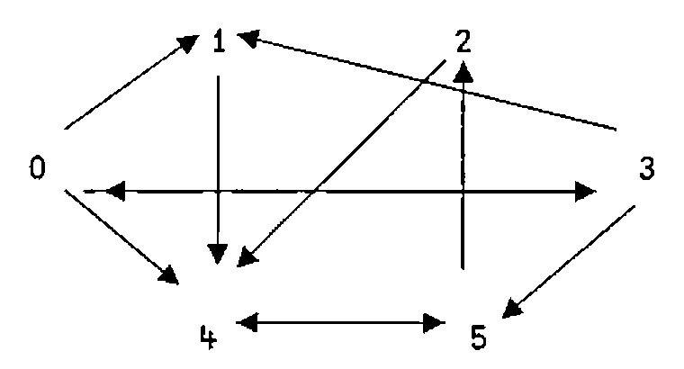

by Norman Thomson
{ .byline }

Coincidentally, Eugene MacDonnell and I were simultaneously and independently thinking about shortest path algorithms. Eugene’s interest was as a step in finding word ladders; mine in generalised joining verbs such as `JE` (Join Each) - see J-ottings 40 - which is a key component of the verbs `extend` and `slack` below. `JE` performs scalarised joins, that is, it is a derivative of append which behaves like a scalar verb with a result which is always a boxed list or a list of boxed lists.

```
box=.]`<@.(-:>)     NB. boxes if unboxed, else do nothing
EACH=.&.>       NB. adverb
JE=.,EACH&box   NB. scalarised join, results boxed
```

The following examples demonstrate how `JE` works:

```
   1 2 JE 3 4 5               NB. append and box two lists
+---------+
|1 2 3 4 5|
+---------+
   (1 2;4 5 6) JE 7 8 9         NB. cf. 1 2 + 3
+---------+-----------+
|1 2 7 8 9|4 5 6 7 8 9|
+---------+-----------+
   (1 2;2 4 6) JE 4 5;7 8 9 NB. cf. 1 2 + 3 4
+-------+-----------+
|1 2 4 5|2 4 6 7 8 9|
+-------+-----------+
```

To begin the search for shortest paths, it helps to be specific by using a network in the form of a directed graph such as the following:



There are three reasonably obvious ways in which such a network can be represented. First it can be represented as a list of 2-lists each of which is a directed arc

```
arcs=.0 1;0 3;0 4;1 4;2 4;3 0;3 1;3 5;4 5;5 2;5 4
```

or this can be compacted into a list of n “nearest neighbour” lists where n is the number of nodes:

```
nl=.1 3 4;4;4;0 1 5;5;2 4
```

or thirdly, it can be represented as a matrix in which unconnected nodes are represented by `_` :

```
   ]g1=.1(arcs)}6 6$_         NB. amend replacing _ with weights
_ 1 _ 1 1 _
_ _ _ _ 1 _
_ _ _ _ 1 _
1 1 _ _ _ 1
_ _ _ _ _ 1
_ _ 1 _ 1 _
```

The matrix in which unconnected nodes are represented by 0s is simply `%g1`, and the nearest neighbour form can be recovered from the matrix form by

```
   btoi=.# i.@#              NB. binary list to list of 1-positions
   mton=.(btoi@:%)EACH@<"1  NB. matrix to neighbour representation
   mton g1
+-----+-+-+-----+-+---+
|1 3 4|4|4|0 1 5|5|2 4|
+-----+-+-+-----+-+---+
```

The reverse transformation to `mton` is :

```
   ntom=.monad :'1(;(i.n),EACH EACH y.)}(n,n=.#y.)$_'
           NB. neighbour to matrix representation
```

The rationale for using `_` to represent unconnected nodes is partly visual, but more importantly, the shortest path matrix (that is, the matrix whose values are the lengths of the shortest paths between all pairs of nodes) can be obtained by using the ‘minimum-dot-plus’ inner product applied using the power conjunction as many times as there are nodes in the graph.

```
   spm=.monad : '<./y.(<./ .+)^:(i.#y.)y.'
   spm g1                       NB. all shortest paths (non-weighted)
2 1 3 1 1 2
_ _ 3 _ 1 2
_ _ 3 _ 1 2
1 1 2 2 2 1
_ _ 2 _ 2 1
_ _ 1 _ 1 2
```

`spm` has the merit of working equally well for weighted graphs, that is if the non-infinity values in the base matrix are path-lengths rather than just ones.

```
   wts=.2 7 6 1 5 7 6 1 4 8 4
   ]h1=.wts(arcs)}6 6$_         NB. amend replacing _ with weights
_ 2 _ 7 6 _
_ _ _ _ 1 _
_ _ _ _ 5 _
7 6 _ _ _ 1
_ _ _ _ _ 4
_ _ 8 _ 4 _

   spm h1                       NB. all shortest paths (weighted)
14 2 15  7 3 7
 _ _ 13  _ 1 5
 _ _ 17  _ 5 9
 7 6  9 14 5 1
 _ _ 12  _ 8 4
 _ _  8  _ 4 8
```

For testing purposes, a random network `y.` square with a density `x.` is obtainable by:

```
   randg=.dyad : '%(100*x.)>?(y.,y.)$100'
```

a random weighted matrix with weights in the range 1 to 100 by

```
   randh=.dyad : '(>:?(y.,y.)$100)(*&.%)x.randg y.'
   0.25 randh 8         NB. 25% of paths valid in 8 by 8 matrix
 _  _  1  _  _  _  _  _
 _  _  _  _  _ 46  _  _
 _  _  _ 37 93 96  _  7
12  _  _ 51  _  _  _ 42
 _ 71 57  _  _  _  _  _
 _  _  _  _  _  _ 24  8
42  _  _  _  _ 80 52  _
86  _ 71 26  _  8  _  _
```

To generate a symmetrical matrix using the values above the leading diagonal use

```
   mksym=.(+|:)@(*</~@(i.@#))    NB. make symmetrical
   %mksym%0.6 randh 4         NB. symmetrical weighted matrix
 _ 79 23 11
79  _ 25  _
23 25  _ 68
11  _ 68  _
```

So far the discussion has focussed on the *lengths* of the shortest paths. `SP` below returns the actual shortest path between any single pair of vertices of an unweighted graph:

```
 SP=:4 : 0
r=.{.y. [ tgt=.{:y.
while.(-.tgt e.tails r)do. r=.r extend x.addnodes r end.
r=.>(tgt=tails r)#r
)
   tails=.{:&>                     NB. tails of list of lists
   addnodes=.<@[rtoi EACH tails@] NB. new nodes now reachable
     rtoi=.btoi@:(%@{~)            NB. btoi after making _s into 0s
   extend=.;@:(JE"1 0 EACH)        NB. add new nodes to curr. paths

   g1 SP 0 2                       NB. shortest path(s) from 0 to 2
0 3 5 2
0 4 5 2
```

Next here is an algorithm which returns all paths between a pair of nodes for an <u>unweighted</u> matrix:

```
AP=.4 : 0                           NB. All Paths
p=.i.0 [ r=.{.y. [ 'src tgt'=.y.   NB. initialise loop
while.(0~:#r)do.                        NB. r = incomplete paths
  r=.r-.p [ p=.p,((tails r)e.tgt)#r     NB. p = complete paths
  r=.r extend x.addnodes r          NB. add one node to each r path
  r=.(#~((=&#~.)&>))r               NB. remove loops
end. p
)

   g1 AP 0 2                NB. all path(s) from 0 to 2
+-------+-------+---------+-----------+
|0 3 5 2|0 4 5 2|0 1 4 5 2|0 3 1 4 5 2|
+-------+-------+---------+-----------+
```

In the case of a weighted matrix it may not be the case that the path with the smallest number of steps is the one with the lowest weighted value. To calculate the weighted value of a path use

```
   steps=.<"(1)@(2&(,/\))   NB. boxed list of node-pairs
   values=.+/@:([{~steps@]) NB. sum of step values from wtd matrix
   h1 values 0 3 5 2        NB. sum of (0 3;3 5;5 2){h1
16
```

To find the critical path in a network, find the minimum value path from all paths:

```
   >(<h1) values EACH g1 AP 0 2
16 18 15 26
   ((=<./)>(<h1) values EACH t)#t=.g1 AP 0 2
+---------+
|0 1 4 5 2|
+---------+
```

To build this into a critical path verb with a single argument `h1`, observe that a weighted matrix is converted into an unweighted (that is 1 or `_`) form by `unweight=.%@<&_`

```
CP=:4 :0                    NB. critical path
t=.(unweight x.) AP y.      NB. all paths
v=.>(<x.) values EACH t        NB. all paths evaluated
(((=<./)v)#t),<<./v         NB. minimum value path selected
)
   h1 CP 0 2              NB. critical path and value
+---------+--+
|0 1 4 5 2|15|
+---------+--+
```

If there is more than one critical path, all are reported, together with their common value. For a list of slack values associated with each path, only a slight modification to `CP` is needed, together with a further application of `JE` :

```
   slack=.-~ >./
SLACKS=.4 :0
t=.(%x.<_) AP y.
t JE EACH slack >(<x.) values EACH t
)

   h1 SLACKS 0 2
+------------+-----------+-------------+---------------+
|+----------+|+---------+|+-----------+|+-------------+|
||0 3 5 2 10|||0 4 5 2 8|||0 1 4 5 2 11|||0 3 1 4 5 2 0||
|+----------+|+---------+|+-----------+|+-------------+|
+------------+-----------+-------------+---------------+
```

Next here is a transliteration of Eugene’s shortest path algorithm FL adapted to accept a weighted matrix as argument and with the value of the shortest paths attached. I have also lengthened the noun names to help exposition. The algorithm is virtually self-describing, and it is also quite hard to spot the primitive J verbs, indicating how much of the work has already been embodied in the J interpreter.

```
FL=.4 :0
'src tgt'=.y.
pathssofar=.,.src [ oldnodes=.newnodes=.,src
while. -. tgt e. newnodes do.
 newnodelist=.(btoi EACH<"(1) _~:newnodes{x.)-.EACH<oldnodes
 newnodes=.;newnodelist
 if. '' -: newnodes do. _1 return. end.
oldnodes=.~.oldnodes,newnodes
pathssofar=.((#&>newnodelist)#pathssofar),.newnodes  end.
r=.pathssofar#~tgt=newnodes
r,.;(<x.)value EACH<"1 r
)
   h1 FL 0 2                NB. shortest path(s) from 0 to 2 plus lengths
0 3 5 2 16
0 4 5 2 18
```

Eugene’s algorithm is a great deal faster than `SP` , the only disadvantage is that, as far as I can see, it is not easy to adapt it to find all paths and critical paths because the paths are homogeneous at all stages, and the program stops whenever an occurrence of the target node is detected.

Now that shortest paths, all paths and critical paths are available, a great variety of other possible results can be obtained. For example, returning to the unweighted case, the connectivity matrix is simply the shortest path matrix with 1s indicating non-infinity entries. An entry of 1 on the leading diagonal means that there is an outward path from the corresponding node which leads back to it, otherwise the entry is 0.

```
   connected=.~:&_@spm
   connected h1   NB. connectivity matrix
1 1 1 1 1 1
0 0 1 0 1 1
0 0 1 0 1 1
1 1 1 1 1 1
0 0 1 0 1 1
0 0 1 0 1 1
```

The list of lists of reachable nodes from each node as starting point is given by

```
   reachable=.btoi EACH@<"1@connected
   ]u=.reachable h1
+-----------+-----+-----+-----------+-----+-----+
|0 1 2 3 4 5|2 4 5|2 4 5|0 1 2 3 4 5|2 4 5|2 4 5|
+-----------+-----+-----+-----------+-----+-----+
```

and a list of all pairs of nodes between which a path exists is given by

```
   arclist=.;@:((i.@#)(,EACH EACH)reachable)
   12{.arclist h1      NB. first 12 items in arclist
+---+---+---+---+---+---+---+---+---+---+---+---+
|0 0|0 1|0 2|0 3|0 4|0 5|1 2|1 4|1 5|2 2|2 4|2 5|
+---+---+---+---+---+---+---+---+---+---+---+---+
```

---

## Footnote

It seems that everybody is thinking about graphs these days! Following John Scholes “A Note on Graphs” in Vol. 20 No. 4 here is an equivalent breadth-first search algorithm using the apparatus described above.

```
bf=.4 :0
r=.y.
while.(0 e.(i.#x.)e.~.r)do.r=.~.r,;x. addnodes r end.
)
   sg        NB. John's first graph in my notation
_ 1 1 _ _
_ _ 1 _ _
_ 1 _ 1 _
1 _ _ _ 1
_ _ 1 _ _
   sg bf 4
4 2 1 3 0
```

Spanning trees are a little more complicated as John’s APL function demonstrates. Also for the general sort of networks which we both allow, it may not always be the case that a spanning tree exists starting from a given root. The principle of the spanning tree algorithm below is to use arrays to advance on a broad front in the while loop, and then prune the paths once all vertices have been visited.

This does not in general produce a *minimum* spanning tree, but neither I think does John’s algorithm.

```
st=.4 : 0          NB. syntax is <graph> st <root node>
r=.y. [ v=.i.#x.   NB. v = nodes still to visit
while.(0<#v)do.
  v=.(i.#x.)-.;r [ r=.r extend remdn(x. addnodes r) end.
rems rdup~.EACH y.,EACH r-. EACH <y.  NB. prune tree

remdn=.3 :0        NB. remove duplicate newnodes
r=.y. [ s=.~.>i{y. [ i=.0
while.(i<<:#y.)do.
  s=.s,~.>i{r [ r=.(<(>i{r)-.s)i}r [ i=.i+1 end. r

iss=.[-:(#@[){.]                        NB. is-suffix
  rems=.monad : '(1=+/"1 iss&>/~y.)#y.'    NB. remove suffix
rdup=.#~i.~=i.@#       NB. remove duplicate nodes in path

   sg st 0
+-------+-----+-------+
|0 1 2 3|0 2 1|0 2 3 4|
+-------+-----+-------+
```

All of which goes to prove along with the song that anything APL can do, J … oops, can’t remember how the words go after that ….
