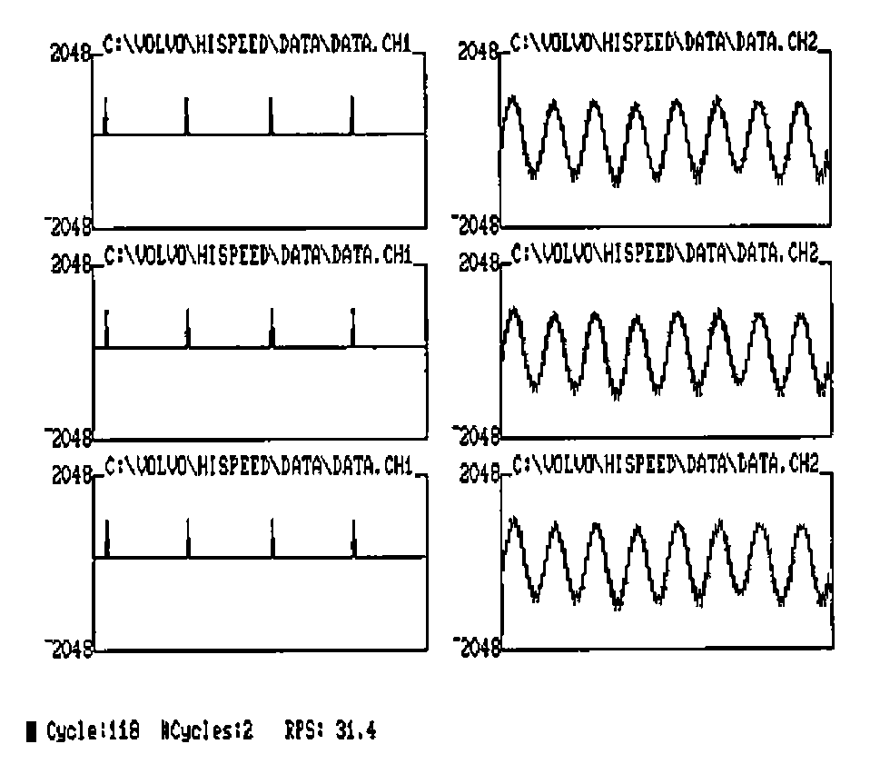
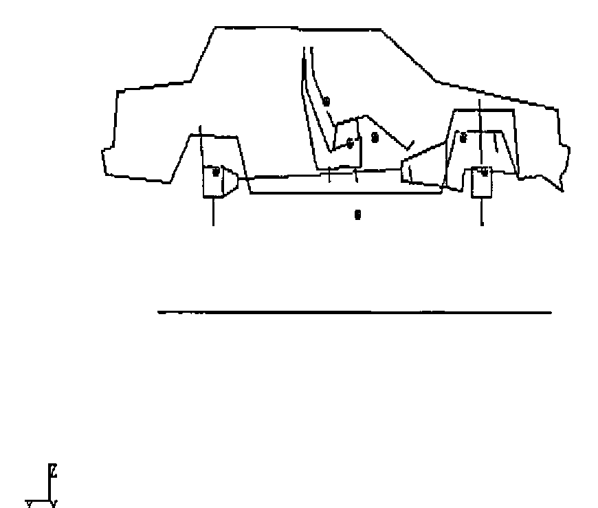

by David Toop
{ .byline }

## Introduction

The transfer of data between the mainframe and PC APL environments can be greatly speeded up by using Assembler functions at each end to encode and decode the data. This article describes such a method and describes the type of application for which the programs are used.

The programs described will be made generally available, hopefully through the BAA software library.

## Environment

We had a mainframe running APL2 under VM/CMS with AFM Shared File System and numerous PC/ATs, Clones etc. running APL\*PLUS/PC Version 6.4. The PCs were fitted with FORTEGRAPH 3279 Terminal Emulator cards (see Adrian Smith VECTOR 4.1 pages 31-33 for a fuller description of the facilities available with this card).

The low level file transfer software was FORTE-NET, a mainframe product available from FORTE (Now DCA – the IRMA people). This software is resident on the mainframe; it starts and controls the data transfer. The software has an ‘ASIS’ binary transfer facility which performs no translation. It is also extremely fast with transfer speeds in excess of 2 Kilobytes per second being possible.

## The Problem

A large amount of data gathered by PCs was to be transmitted to the mainframe for analysis; the transformed data would then be returned to the PC for subsequent display and further manipulation. Component files in excess of 1 Megabyte were not uncommon.

The data in both environments was to be in the form of APL component files. The prime consideration was that after transfer the destination environment should contain an identical component file to that at the source.

The files were of a very simple format – the first component being a character matrix containing a list of object names, the object type and a pointer to the component containing the object. Most of the data would be floating point numeric matrices.

## First Attempt

Easy we thought! We will use an ASCII to EBCDIC translation table for characters, format and execute for numerics. It worked but was extremely slow, particularly format on the PC, a 64 x 64 floating point array (quite small for some of the data arrays we were using) taking 90 seconds to format on an AT running at 6MHz. Furthermore, execute on the PC is only able to handle character vectors of less than 32K characters – hardly sufficient. Also with ⎕PP set to 16 there was a large overhead in extra characters.

## Think Again

We then looked at the APL2 supplied functions ATR and RTA (see David Piper VECTOR 3.4 pages 123-128). These assembler functions were extremely fast, using a pattern to perform the conversion of a string of bytes to an APL data object (or vice versa).

It was decided that we would use this pattern as the basis of a standard transfer format for data objects. Variables would be sent as bytes in internal APL2 format.

Three data types were to be considered:

<p style="margin-left: 2em">Characters<br>Short Integers (16 Bits)<br>Floating Point (8 Bytes)</p>

The data was always to be in simple arrays although it could be complex (in which case we would extend the rank of the object by 1 and the first dimension would contain the real and imaginary parts).

## Data Formats: Variables

Figure 1 shows the structure of a typical transfer data object. The first portion is the pattern as defined for ATR and RTA, the pattern delimited from the data by a NULL character (quadAV[quadIO] on both systems).

```text
┌──────────────────┐   ─┬─   ┌──────────────────────────────┐
│     PATTERN      │    0    │ Data in APL2 Internal Format │
└──────────────────┘   ─┴─   └──────────────────────────────┘
                        │
                    Delimiter
                    ⎕AV[⎕IO]
                 on both Systems
```

*Figure 1: Variable format.*
{ .caption }

The data is held in APL2/S370 format as are the patterns which are therefore in EBCDIC characters.

## Files

The transfer file format is shown in Figure 2. The first 15 bytes are reserved for the directory length, the individual data objects follow and finally a directory of the start positions for each object is at the end of the file.

```text
┌──────────────────┬─ ─ ─ ─ ─ ─ ─ ─┬───────────────────────────┐
│ Directory Length │  Data Objects  │ Directory of Object Starts│
└──────────────────┴─ ─ ─ ─ ─ ─ ─ ─┴───────────────────────────┘
   (15 Bytes)                                              End
                                                            of
                                                          File
```

*Figure 2: Transfer File Structure*
{ .caption }

All objects including the length and the directory are encoded as per the standard format.

## Data Conversion Strategy

Characters: conversion of characters from ASCII to EBCDIC and vice versa is performed using translation tables. Maintaining our own control of translation enabled us to attempt some enhancements:

- Special APL characters (e.g. Diamond) could be treated separately.
- National Language Characters could be translated accurately.
- We could intelligently convert lower case ALPHAs, graphics and box drawing characters.

Short Integers: these are two bytes on both machines except that the high and low bytes are reversed. The byte reversal necessary for converting from one format to the other is extremely fast.

Floating Point: the conversion technique for floating point numbers was considerably more complex than the other data formats. On the mainframe real numbers are held in 8 bytes as floating point base 16 with a single byte exponent and 7 byte mantissa. On the PC real numbers are also held in 8 bytes but in base 2 with twelve bits exponent and 52 bits mantissa. Furthermore, the byte order of the two formats is reversed.

It is interesting to note that because of the normalisation process there is very little difference in the accuracy of the two systems, although the PC can represent a larger number range.

We evolved some quite complex algorithms involving byte reversal, shifts and bit twiddling to convert between the two formats. APL was used to prototype and test these algorithms which proved to be particularly useful in some of the boundary conditions. At this point I had hoped to show our prototype function, but it appears to have gone the route of all good prototypes and been consigned to the rubbish bin! However, we used page 224 of Gilman and Rose as a starting point for the mainframe to PC algorithms.

## Using the Transfer Programs

The user is provided with four top-level functions, two for the mainframe and two for the PC. These functions are named FVSEND and FVRECV. To illustrate the mechanism of the transfer the chain of events which occurs when sending a file to the Mainframe is as follows:

- The user first establishes an APL session on both of the machines and switches to the PC APL session.
- He types FVSEND 'FILENAME' where FILENAME is the name of the file he wishes to send to the mainframe. The FVSEND(PC) function then builds the native Transmit file on the PC using the machine code function outlined above.
- He then ‘Hot Keys’ to the APL2 session and types: FVRECV 'FILENAME' Where FILENAME is the destination filename. The FVRECV(MF) then invokes the forte transfer software using AP100. The transfer file (now resident on the mainframe) is processed using the file facilities of AP110 and the supplied assembler function RTA.

The user finishes with an APL component file identical to the one on the PC.

## Speeds

As a comparison of speed, our test variable of 64 x 64 floating point numbers takes approximately 0.5 seconds to convert (which is a factor of 180 improvement over format). The conversion of two byte integers is improved by a factor of 15.

The major bottleneck in the whole system is now the transmission time which accounts for approximately 95% of the total transfer time. Overall it takes approximately 10 minutes to transfer a 1 Megabyte component file between the two environments.

## Typical Application: Vibration Analysis

The application which I have chosen to demonstrate the use of this facility is in the analysis of the vibration in cars. Data from a test car or component is gathered from either road measurements or a test rig. The data acquisition is controlled by a PC which allows excellent facilities for the control of the measuring instruments and interactive examination of the data.

An extremely large amount of data can be obtained from a single measurement. Figure 3 is a typical display from the data acquisition facilities:



*Figure 3: Typical Data Collection and Manipulation Screen*
{ .caption }

When the operator is satisfied with the data, it can be quickly transferred to the mainframe where it can be processed using the greater speed, workspace size and facilities of APL2. Typically such operations involve the identification of vibration modes, frequencies and amplitudes. The transformed data can then be transmitted back to the PC.

Other programs can now use the superior real time graphics and interactive response of the PC to animate the test results producing a display such as:



*Figure 4: Animation Type Display on the PC, produced after Mainframe Calculations.*
{ .caption }

## Conclusions

The use of both mainframe and PC for the tasks at which they are best has proved to be very effective, and whilst the system is still undergoing development the results from users have been very encouraging.

The use of APL as a ‘glue’ to hold both systems together and provide a common user interface has proved to be one of the major benefits of the system.

The calling of assembler functions from both environments to do highly specialised yet well defined tasks has not hampered the natural flow of APL programs. In many cases, it has meant the difference between success and failure of the application. Furthermore, identifying small specific tasks to be written in assembler does not add significantly to the overall development cost, especially when APL can be used to prototype these modules.
