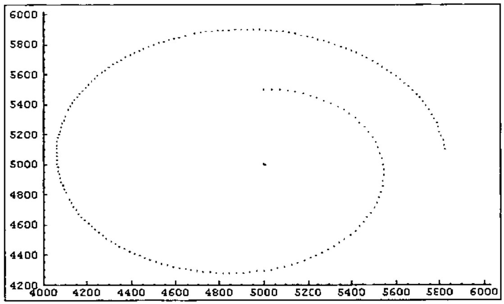
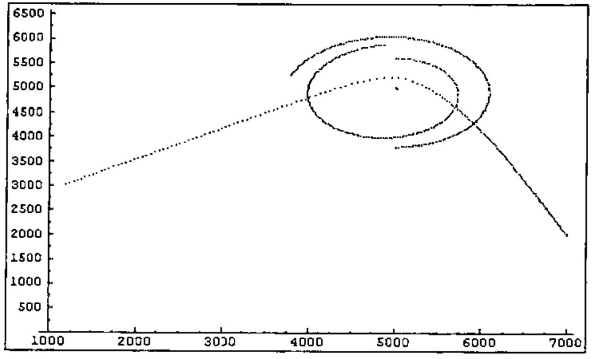

*by Andrew Towers*
{ .byline }

## Abstract

This paper presents a method of approximating the celestial n-body using the J programming language. The physics involved in this problem are introduced, and some examples given. General code for reading data files is also given.

## Introduction

The *problem of two bodies* and the *problem of three or more bodies* are well known problems in the field of Celestial Mechanics. These problems involve projecting the gravitational effects of celestial bodies on each other over a period of time, in order to determine their resulting positions.

In this paper, a method of approximating this calculation through the use of simulation is given, based on the Newtonian law of general gravitation:

> "Two bodies attract each other with a force that is proportional to the mass of each body and is inversely proportional to the square of their distance apart."[1]

Mathematically, this translates to the following formula:

> *F* = *k* *m*<sub>1</sub>*m*<sub>2</sub> / *r*<sup>2</sup>

This formula is herein expressed in the form of J functions, allowing a data file containing values for a number of celestial bodies to be simulated, and the results presented in graphical format.

## Structuring the Data

In order to perform a simulation over a number of time units, the data must be structured in an appropriate way. Therefore, the first task was to create an appropriate data structure for the problem. While initially this was going to be a 2-body simulation, it was decided that, in keeping with the array penchant of J, an n-body solution would be more appropriate, and likely as easy to create.

Each of the bodies in the simulation consists of three attributes; a current location in absolute space, an absolute velocity and an absolute mass. For convenience of processing, these are grouped into three arrays; the current position of each body, the current velocity of each body, and the current mass of each body. These three arrays are boxed, forming a single value.

Also for convenience, both the current position of each body and the velocity vector for each body are represented as imaginary numbers. This allows for easy manipulation of data in two-dimensional space. The mass of each velocity is represented as a real number.

During the simulation, a new array of body positions will be generated for each time unit. To accommodate this, the positions form a matrix, each row of which represents the body positions for an instant in time. As the simulation progresses, this matrix is extended by appending the array of new positions.

The initial state of the simulation is read from a data file, the name of which is specified when the simulation is started.

```text
5000j5000 5000j5600 5000j3800 7000j2000
0j0 35j0 22j0 _8j19
100000 100 400 1
```

This example shows the format of the data file for the four-body simulation shown later in the paper. The first line represents the initial positions of each of the four bodies, the second line represents their initial velocities, while the final line contains the mass of each body. These values are expressed in arbitrary units.

## Breakdown of the Simulation Code

### Performing the Simulation

An entire simulation is performed through the use of the *simulate* function. This function is applied to the name of a data file, and results in the display of a graph showing the outcome of the simulation. Note that the graph is a side effect of the function; no result is produced, therefore this is not strictly a function at all.

```text
simulate =: display @ (process ^: 200) @ getdata
```

The *getdata* function constructs a boxed list from the data file named by its argument. This boxed list is passed to the *process* function, which will perform a simulation for one unit of time. This function, raised to power 200, causes its initial result to be re-processed a further 199 times. Finally, the *display* function causes a plot of the resulting 200 sets of points. This arbitrary figure was chosen as it allows a reasonable simulation to be performed without taking an inordinate amount of time.

```text
process =: (pos , newpoint) ; newvel ; mass
```

The *process* function is a monadic double-fork. Its single argument, a boxed list representing the current state of the simulation, is passed to each of the three monadic functions. Each of these produces a new value for the appropriate position in the boxed list. These results are subsequently boxed up to form the new state of the simulation. The *pos* and *mass* functions simply un-box the appropriate array out of the boxed argument.

```text
newpoint =: last @ pos + vel
```

The new position of each body is the result of summing the current position with the current velocity of each body. As these are both arrays of imaginary numbers and of the same length, it is trivial to perform this calculation. The *last* function isolates the last row of the matrix passed to it, reshaping it into an array. As for *pos* and *mass*, the *vel* function isolates the appropriate array from its boxed argument.

```text
newvel =: vel + totalforces % mass
totalforces =: +/ @ forcevecs
```

The new velocity of each body is the most complex calculation. Like process, this function is a monadic double-fork. The new velocity of each body is calculated by adding an acceleration to its velocity, where acceleration is determined by the total effect of all forces acting on a body, divided by its mass. Once again the boxed list is passed to each of the three functions intact.

The total effect of all forces acting on a body can be calculated by summing all the forces acting on that body. The *forcevecs* function takes the boxed list and calculates a matrix of forces between each pair of bodies in the simulation.

```text
unitvecs =: lastpos *@-/ lastpos
forcevecs =: forces * unitvecs
```

The *forcevecs* function combines the matrix of unit vectors generated by *unitvecs*, with the matrix of force strengths generated by the *forces* function. Each body has a unit vector of 0j0 in the direction of itself, neatly masking off any effects that a body may erroneously have on itself as a result of the *forces* calculation. The unit vector between any pair of bodies indicates the direction of the force that the second exerts on the first.

```text
ugc =: 6.67 & *
masses =: mass */ mass
forces =: masses ugc @ * scaledists
```

The matrix of force strengths between each pair of bodies is a result of multiplying the mass products of each pair of bodies by the scaled distances between each pair of bodies. Each resulting force is then multiplied by a gravitational constant appropriate to the units in which the input data is expressed. In this case the constant 6.67 has been used, as it relates to the gravitational constant used with real-world gravitation calculations.

```text
scale =: % @ *:
distances =: lastpos | @ -/ lastpos
incmask =: lastpos -. @ * @ | @ -/ lastpos
scaledists =: incmask scale @ + distances
```

The matrix of scaled distances is a result of applying the *scale* function to the matrix of distances between bodies. The *scale* function implements the inverse-square law of diminishing effect.

The only catch here is that the *scale* function takes the reciprocal of its argument. As the distance of any body from itself is zero, this will result in a scaled distance of infinity. These unwanted effects would be nicely masked by later multiplication with a vector of length zero, except that zero times infinity yields an indeterminate result.

Because of this, an increment mask is added to the distances matrix before this scaling calculation is applied. The increment mask forms a matrix containing the value 1 in each cell for which the distance between two bodies is zero, and a zero in every other cell. These erroneous calculations will be later masked by zero-length unit vectors.

### Reading the Data

The starting state of the simulation is read from a data file, the name of which is the only argument to the *simulation* function. This function makes use of the *getdata* function to read the data file.

```text
reshape =: $~ 1 & , @ #
shapepos =: reshape @ pos ; }.
getdata =: shapepos @ readfile
```

The *getdata* function makes use of the *readfile* function, which is a general purpose function for reading a file and boxing the results of executing each line. The *shapepos* function is used to reshape the positions array of the result, to form a matrix of 1 row, and preserving the number of columns.

```text
read =: 1!:1@<
dethirteen =: #~ (13 { a.) & ~:
readfile =: split @ dethirteen @ read
```

The foreign conjunction `1!:1` is used to read the textual content of the data file. This is valid in version 3.04d of J for Windows 95. This text is the processed by the *dethirteen* function, which removes all the carriage return characters. This is done because these characters interfere with the execution of lines using the do (`".`) function.

```text
prepnl =: (10 { a.) & ,
parse =: < @ ".
cut =: parse ;. _2
split =: }. @ cut @ prepnl
```

The *split* function first prepends the text with a newline character, so as to make use of the cut (`;.`) function of the J language. This function splits the text according to a delimiter, which must be the first character of the text. At each split, the *parse* function is applied to the isolated segment. This function boxes the result of executing the isolated line of text. The *split* function must also behead the result, to remove the empty box that results from the prepended newline.

### Displaying the Results

To display the result of the simulation, the J *plot* module is used. This module is provided with version 3.04d of J for Windows 95, and may be unavailable on other platforms or in other versions.

```text
display =: 'type dot;backcolor white;title n Bodies' & plot @ preproc
```

The monadic display function takes as its argument the boxed list of values resulting from the process function. The *plot* function; the interface to the plot module, is used dyadically. Its left argument is a set-up string, specifying the type of graph to be plotted. The right argument, for a dot graph, must consist of a two-box value.

```text
xcoords =: {. @ +. @ ,
ycoords =: {: @ +. @ ,
coords =: xcoords ; ycoords
preproc =: coords @ pos
```

The *preproc* function performs the necessary pre-processing to format the result of the simulation for the *plot* function. A two-box value is constructed; the first box must contain an array of x co-ordinates, the second box an identical length array of y co-ordinates.

## Examples

The following graph shows the result of the simulation of a two body problem.



This graph shows a body with relatively small mass orbiting a large mass. As this illustrates, the cumulative inaccuracy introduced by the step-by-step approach prevents a true orbit. Adjustments of initial position, velocity or mass result in either direction result a wider arc.



This graph shows the result of simulation of a four body problem. In this simulation, a second "planet" has been added, and a "comet". The comet shows the sling-shot effect of passing a low-mass body close by a high-mass body at relatively high speed. On approach, the comet accelerates toward the high-mass body. This accelerated velocity enables it to escape the gravitational pull of the high-mass body.

## Conclusion

As these examples show, this cumulative approach introduces significant error into the calculations. Alternate methods could be used to calculate the force between objects, resulting in more accurate results.

## Reference

1. Max Born 1965, *Einstein’s Theory of Relativity*, Dover Publications Inc., New York.

## Appendix 1 – Code

```text
NB. fetch the plotting routines
load 'plot'

NB. read in a data file and box up the result of each line
NB. the parse function executes each line using ".
read =: 1!:1@<
dethirteen =: #~ (13 { a.) & ~:
prepnl =: (10 { a.) & ,
parse =: < @ ".
cut =: parse ;. _2
split =: }. @ cut @ prepnl
readfile =: split @ dethirteen @ read

NB. read in the file and reshape the pos array to form a matrix
reshape =: $~ 1 & , @ #
shapepos =: reshape @ pos ; }.
getdata =: shapepos @ readfile

NB. unbox the relevant array
pos =: > @ {.
vel =: > @ {. @ }.
mass =: > @ {. @ }. @ }.

NB. take last row of matrix and ravel
last =: , @ }.~ _1 & + @ #
lastpos =: last @ pos

NB. force of attraction proportional to mass of each body and
NB. inversely proportional to the square of their distance
ugc =: 6.67 & *
masses =: mass */ mass
distances =: lastpos | @ -/ lastpos
incmask =: lastpos -. @ * @ | @ -/ lastpos
scale =: % @ *:
scaledists =: incmask scale @ + distances
forces =: masses ugc @ * scaledists
unitvecs =: lastpos * @ -/ lastpos
forcevecs =: forces * unitvecs
totalforces =: +/"1 @ forcevecs

NB. run the simulation for one time unit
newpoint =: last @ pos + vel
newvel =: vel - totalforces % mass
process =: (pos , newpoint) ; newvel ; mass

NB. box up the positions as x coords ; y coords
xcoords =: {. @ +. @ ,
ycoords =: {: @ +. @ ,
coords =: xcoords ; ycoords
preproc =: coords @ pos
display =: 'type dot;backcolor white;title n Bodies' & plot @ preproc

NB. display the result of processing the input data
simulate =: display @ (process ^: 200) @ getdata
```

## Appendix 2 – Data

### Two-body problem

```text
5000j5000 5000j5500
0j0 36j0
100000 100
```

### Four-body problem

```text
5000j5000 5000j5600 5000j3800 7000j2000
0j0 35j0 22j0 _8j19
100000 100 400 1
```
