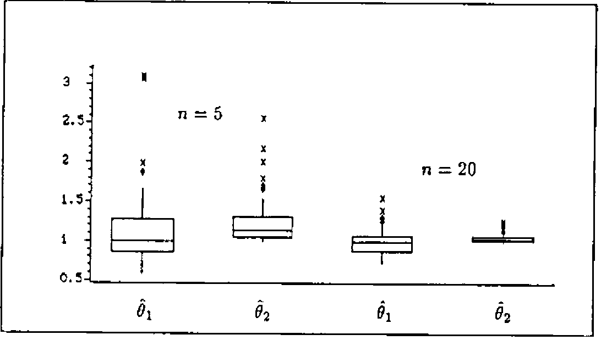
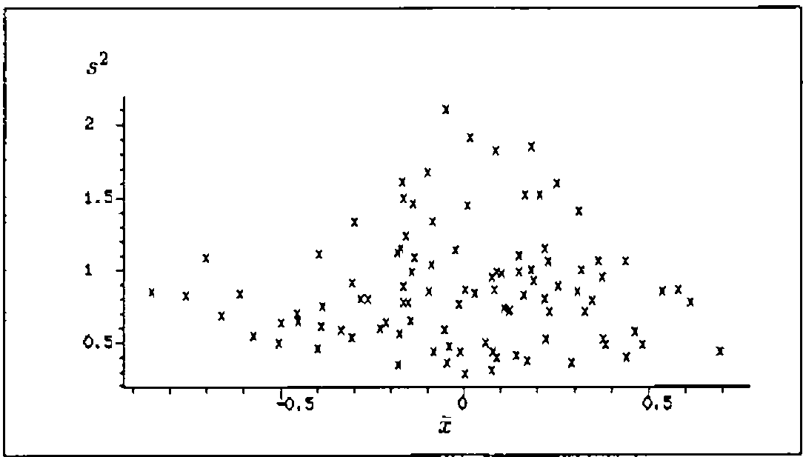
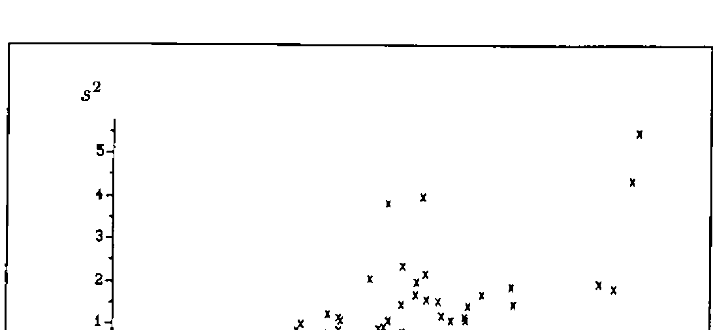

*by Dietrich Trenkler, University of Osnabrück, Germany*
{ .byline }

This paper aims at giving some impressions of the power of an innocent looking *APL*-function called `STATISTICS` which has been written to help in clarifying difficult facts from the realm of theoretical Statistics. I will exemplify its usefulness in the context of two topics covered in most introductory text books such as [1].

## Two Problems

Most students of the Economics department of our university hate Mathematics. So an instructor is well advised not to turn his back to write down a proof.<sup>1</sup> So why not take a simulation approach?

For instance, understanding the concepts of point estimation definitely is a goal but they are best understood by *seeing* them in action. To be specific we ask two questions:

(i) How can we get an idea of the concept of (un)biasedness or efficiency of point-estimators?

(ii) A well-known theorem of Mathematical Statistics states that X̄ = Σ<sub>i=1</sub><sup>n</sup> X<sub>i</sub> and S<sup>2</sup> = (1/n) Σ<sub>i=1</sub><sup>n</sup> (X<sub>i</sub> − X̄)<sup>2</sup> are independent if and only if the X<sub>i</sub> are normally distributed, [1], p. 243. How can we get conceivable evidence of this fact without clinging to (incomplete) stringent proofs?

<sup>1</sup> For me the word *proof* is tantamount to *turmoil*.
{ .note }

## The Simulation Approach

All the students have to comprehend is how to generate random numbers from a specified distribution. I favor the table-look-up method for discrete distributions and the inversion method for continous distributions, [2]. Both can be implemented in *APL* quite easily if

- there is a function `UNIFORM` to generate uniformly distributed random numbers from (0,1).
- there is a function to compute values F(x) = P(X ≤ x) of the distribution function of a discrete distribution.
- there is a function to compute F<sup>−1</sup>(u) where F(x) = P(X ≤ x) is the distribution function of a continous distribution.

For instance, let `DISTRBINOM` compute F(x) for a binomial distribution B(n,p). Then

```apl
50 TABLELOOKUP X,[1.1] 20 0.3 DISTRBINOM X←0,⍳20
```

will generate 50 random numbers from a B(20,0.3)-distribution. Here is a listing of `TABLELOOKUP`.

```apl
∇R←N TABLELOOKUP XP
[1] R←(⌽XP[;1])[+⌿(⌽XP[;2])∘.≥UNIFORM N]
∇
```

On the other hand, let `IEXP` compute F<sup>−1</sup>(u) for an exponential distribution E(λ):

```apl
∇R←L IEXP U;X;P
[1] R←-(÷L)×⍟1-U
∇
```

Then

```apl
2 IEXP UNIFORM 100
```

generates 100 random numbers from an E(2)-distribution. `UNIFORM` looks as follows:

```apl
∇R←AB UNIFORM N
[1] ⍎(0=⎕NC 'AB')/'AB←0 1'
[2] R←AB[1]+(-/⌽AB)×(?N⍴¯2+R)÷¯1+R←2*31
∇
```

These are the main ingredients to realize the simulation approach for one or several statistics. The argument of the monadic function `STATISTICS` consists of essentially three parts:

- The first part describes how to generate samples of size *n*.
- The second part determines the number *M* of samples and the sizes *n* thereof.
- The rest describes the way(s) how to compute *k* statistic(s) from the samples.

```apl
∇R←STATISTICS par;n;m;i;j;stat;sp;nv;distr;nnv
[1] par←box par
[2] distr←par[1;]
[3] nnv←⍴nv←⍎par[2;]
[4] m←1↑⍴stat←2 0 ↓par
[5] R←⍳0 ⋄ ⍴i←1
[6] M1:n←nv[i] ⋄ sp←⍎distr ⋄ j←1
[7] M2:R←R,⍎stat[j;] ⋄ →(m≥j←j+1)/M2
[8] →(nnv≥i←i+1)/M1
[9] R←((⍴nv),(⍴R)÷⍴nv)⍴R
∇
```

Its output is an *(M,k)*-matrix where row *i* is the result of the *k* statistics administered to sample *i*. `box` should be familiar to readers of *VECTOR*. It is modified version of `BOX` taken from [4] to allow for a left argument describing the selector.

```apl
∇R←S box X;I;J;K;M;REP
[1] ⍎(2≠⎕NC 'S')/'S←''⋄'''
[2] I←(X=¯1↑X)/⍳⍴X←X,S
[3] X[I]←' '
[4] J←¯1+I-0,¯1↓I
[5] K←(M←⌈/J)-J
[6] REP←(⍴X)⍴1
[7] REP[I]←K
[8] R←((⍴I),M)⍴REP/X
∇
```

## Conducting the Simulations

Let us return to the problems mentioned above.

(i) Assume that a population is distributed according to the density

> f(x) = θ/x<sup>2</sup> for θ ≤ x, 0 else,

and let X<sub>1</sub>, …, X<sub>n</sub> be a random sample from that distribution. It is not hard to see that

- the maximum-likelihood estimator of θ is

    > θ̂<sub>1</sub> := min{X<sub>1</sub>, …, X<sub>n</sub>}.

- an estimator for θ based on the method of moments is

    > θ̂<sub>2</sub> = 1 / ((2/n) Σ<sub>i=1</sub><sup>n</sup> 1/X<sub>i</sub>).

    This estimator is constructed from E[1/X] = 1/(2θ).

Now that there are two estimators for θ which is the one to be preferred? To get an insight into their distributional properties a simulation seems appropriate. For θ = 1 note that F<sup>−1</sup>(u) = 1/(1 − u). Accordingly

```apl
DIS←'÷1- UNIFORM n ⋄'
SMPL←'(100⍴5),100⍴20 ⋄'
STATS←'÷2×MEAN ÷sp ⋄ ⌊/sp'
ST←STATISTICS DIS,SMPL,STATS
BOXANDWHISKER (100 2↑ST),100 0↓ST
```



**Figure 1:** Comparing the performances of θ̂<sub>1</sub> and θ̂<sub>2</sub> for n = 5 and n = 20.
{ .caption }

Figure 1 displays the result of the comparing box-and-whisker plots. Several aspects of point estimation can now be faced:

- θ̂<sub>2</sub> is unbiased while θ̂<sub>1</sub> is not. Of course, since E[θ̂<sub>1</sub>] = n/(n − 1) > 1 there is an obvious modification of θ̂<sub>1</sub> to θ̂<sub>3</sub> = (n − 1)θ̂<sub>1</sub>/n to yield a second unbiased estimator.
- θ̂<sub>2</sub> reveals more variability than θ̂<sub>1</sub>. This is measured from the widths of the boxes. Alternatively one could display box-and-whisker plots of |1 − θ̂<sub>j</sub>| or (1 − θ̂<sub>j</sub>)<sup>2</sup> by

    ```apl
    BOXANDWHISKER |1-(100 2↑ST),100 0↓ST
    BOXANDWHISKER (1-(100 2↑ST),100 0↓ST)*2
    ```

    to introduce the concepts of mean absolute error and mean square error.

- The performances of both estimators become better by increasing the sample sizes from n = 5 to n = 20.

(ii) Simulating to convey what this theorem says is now straightforward:



**Figure 2:** Scatter plot of s<sup>2</sup> versus x̄ based on 100 samples of size n = 10 from an N(0,1)-distribution. Is there any visible relationship between s<sup>2</sup> and x̄?
{ .caption }

```apl
ST ←STATISTICS 'BOXMUL n ⋄ 100⍴10 ⋄ MEAN sp ⋄ S2 sp'
```

`BOXMUL` uses the well-known algorithm to generate independent random numbers from a standard normal distribution, [2], p. 235. Figure 2 displays a scatter plot of `ST[;2]` versus `ST[;1]`. What happens if we assume that the population is exponentially distributed with λ = 1?

```apl
ST ←STATISTICS '1 IEXP n ⋄ 100⍴10 ⋄ MEAN sp ⋄ S2 sp'
```

Figure 3 displays a scatter plot of `ST[;2]` versus `ST[;1]`. This experiment has also been described in [3].



**Figure 3:** Scatter plot of s<sup>2</sup> versus x̄ based on 100 samples of size n = 10 from an exponential distribution with λ = 1. Is assuming independence appropriate?
{ .caption }

## Concluding Remarks

The versatility of this approach is amazing. Now it takes only a few keystrokes to grasp the meaning of the Central Limit Theorem. Even the ideas of jackknifing or the bootstrap can be learned from simulation experiments. Generalizing `STATISTICS` to cover simulations in the context of regression models should be obvious. With this program questions concerning the robustness or resistance of ordinary least squares estimation can be tackled.

Once again, it is the ease of answering *What if*-questions that glorifies enlistment in the *APL*-navy.

## References

[1] Mood, A.M., Graybill, F. A, Boes, D.C. (1974): *Introduction to the Theory of Statistics*, 3<sup>rd</sup> edition, McGraw-Hill, New York.

[2] Morgan, B.J.T. (1984): *Elements of Simulation*, Chapman and Hall, London and New York.

[3] Naeve, P., Trenkler, D., Wolf, P. (1991): *Making the Teaching of Statistics Roar*, Computational Statistics Quarterly 4, 325-353.

[4] Sykes, A. (1990): *Doing Useful Things with Strings*, *VECTOR* 6(4), 24-29.
