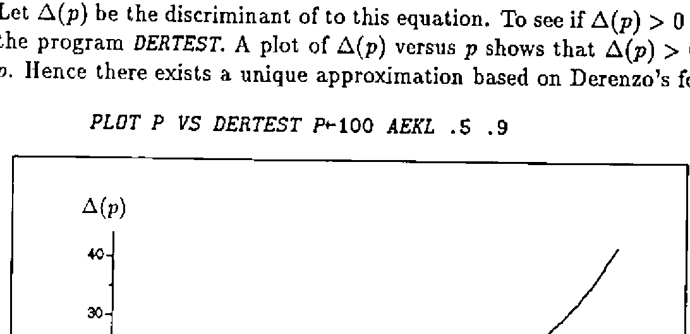

*by Dietrich Trenkler, University of Osnabrück, Germany*
{ .byline }

## A cubic equation with derived forms

Let us be given the equation

> Ax<sup>3</sup> + Bx<sup>2</sup> + Cx + D = 0,  A ≠ 0.

Dividing by A leads to its *normal form*

> x<sup>3</sup> + ax<sup>2</sup> + bx + c = 0,

where

> a = B/A,  b = C/A,  c = D/A.

Substituting x = y − a/3 finally renders the *reduced form*

> y<sup>3</sup> + py + q = 0

where

> p = b − a<sup>2</sup>/3

and

> q = c + (2a<sup>3</sup> − 9ab)/27.

## Cardano’s rule

Define the *discriminant* by

> Δ = (q/2)<sup>2</sup> + (p/3)<sup>3</sup>.

Further let

> u = ∛(−q/2 + √Δ)

and

> v = ∛(−q/2 − √Δ).

Depending on the sign of Δ *Cardano’s rule* distinguishes three cases to solve the reduced form, [1].

- Δ < 0 (*casus irreducibilis*): The three real solutions are

    > y<sub>1</sub> = 2√(|p|/3) cos(φ/3)<br>
    > y<sub>2</sub> = −2√(|p|/3) cos((φ − π)/3)<br>
    > y<sub>3</sub> = −2√(|p|/3) cos((φ + π)/3)

    where

    > φ = arccos( (−q/2) / √((|p|/3)<sup>3</sup>) )

- Δ = 0: There are three real solutions, two of them being identical. They are given by

    > y<sub>1</sub> = u + v<br>
    > y<sub>2,3</sub> = −(u + v)/2

- Δ > 0: There is one real solution and two complex ones. They are given by

    > y<sub>1</sub> = u + v<br>
    > y<sub>2</sub> = −(u + v)/2 + (√3/2)(u − v)i<br>
    > y<sub>3</sub> = −(u + v)/2 − (√3/2)(u − v)i

The program `CARDANO` can be used to get the solutions of any cubic equation.

## Approximating Φ<sup>−1</sup>(p)

Let Φ be the distribution function of a standard normal distribution, i.e.

> Φ(z) = ∫<sub>−∞</sub><sup>z</sup> (1/√(2π)) e<sup>−t²/2</sup> dt.

Recently, Derenzo [2] and Lin [3] considered approximations to Φ(z). Derenzo established the approximation

> Φ(z) ≈ ½e<sup>−p<sub>D</sub>(−z)</sup> for z ≤ 0; 1 − ½e<sup>−p<sub>D</sub>(z)</sup> for z > 0

where

> p<sub>D</sub>(t) = (83t<sup>3</sup> + 351t<sup>2</sup> + 562t) / (165t + 703),

see also [4].

Lin’s method amounts to

> Φ(z) ≈ ½e<sup>−p<sub>L</sub>(−z)</sup> for z ≤ 0; 1 − ½e<sup>−p<sub>L</sub>(z)</sup> for z > 0

with

> p<sub>L</sub>(t) = 0.717t + 0.416t<sup>2</sup>.

Its advantage is the fact that a simple formula is available to approximate z<sub>p</sub> with Φ(z<sub>p</sub>) = p. It is given by

> z<sub>p</sub> ≈ (−0.717 + √(0.514089 + 1.644a(p))) / 0.832 = z<sub>pL</sub>

where a(p) = −ln(2(1 − p)).

Inverting Derenzo’s formula is not so obvious, since for p > 0.5 we have to solve

> 83x<sup>3</sup> + 351x<sup>2</sup> + (562 − 165a(p))x − 703a(p) = 0.

Let Δ(p) be the discriminant of to this equation. To see if Δ(p) > 0 we used the program `DERTEST`. A plot of Δ(p) versus p shows that Δ(p) > 0 for all p. Hence there exists a unique approximation based on Derenzo’s formula.

```apl
PLOT P VS DERTEST P←100 AEKL .5 .9
```



The program `IDERENZO` computes the approximation z<sub>pD</sub> for a vector of values p ∈ (0,1).

Although inserting Derenzo’s values in Cardano’s rule leads to a very clumsy formula its implementation is straightforward and yields excellent results as can be seen by comparing it to Lin’s method. The following table corresponds to that in [3] although values p greater than .9995 have been taken into account. It reveals the fact that the absolute relative error rz of the new approximation is never greater than 0.34% for all values of p.

| p | z<sub>p</sub> | z<sub>pD</sub> | z<sub>pL</sub> | rz<sub>D</sub> (%) | rz<sub>L</sub> (%) |
|---:|---:|---:|---:|---:|---:|
| 0.500000 | 0.000000 | 0.000000 | 0.000000 | 0.000000 | 0.000000 |
| 0.600000 | 0.253347 | 0.253261 | 0.269179 | 0.033907 | 6.249075 |
| 0.700000 | 0.524401 | 0.524515 | 0.542005 | 0.021740 | 3.357063 |
| 0.800000 | 0.841621 | 0.841877 | 0.854404 | 0.030447 | 1.518867 |
| 0.900000 | 1.281552 | 1.281774 | 1.285662 | 0.017374 | 0.320770 |
| 0.950000 | 1.644854 | 1.644962 | 1.643760 | 0.006618 | 0.066510 |
| 0.975000 | 1.959964 | 1.959978 | 1.956721 | 0.000701 | 0.165453 |
| 0.990000 | 2.326348 | 2.326287 | 2.323588 | 0.002614 | 0.118620 |
| 0.995000 | 2.575829 | 2.575744 | 2.575194 | 0.003311 | 0.024658 |
| 0.997500 | 2.807034 | 2.806943 | 2.809597 | 0.003233 | 0.091325 |
| 0.999500 | 3.290527 | 3.290463 | 3.303295 | 0.001931 | 0.388044 |
| 0.999750 | 3.480756 | 3.480712 | 3.498733 | 0.001275 | 0.516455 |
| 0.999900 | 3.719016 | 3.718998 | 3.744378 | 0.000496 | 0.681953 |
| 0.999950 | 3.890592 | 3.890592 | 3.921829 | 0.000010 | 0.802889 |
| 0.999975 | 4.055627 | 4.055642 | 4.092928 | 0.000374 | 0.919743 |
| 0.999995 | 4.417173 | 4.417211 | 4.469071 | 0.000858 | 1.174914 |

## References

[1] Bartsch, H.J. (1971) *Mathematische Formeln*, Buch- und Zeit-Verlagsgesellschaft mbH, Köln.

[2] Derenzo, S.E. (1977) *Approximations for Hand Calculators Using Small Integer Coefficients*, Mathematics of Computation **31**, 214-225.

[3] Lin, Jinn-Tyan (1989) *Approximating the Normal Probability and its Inverse for Use on a Pocket Calculator*, Appl. Statist. **38**, 69-70.

[4] Velleman, P.F and Hoaglin, D.C. (1981) *Applications, Basics, and Computing of Exploratory Data Analysis*, Duxbury Press, Boston.

## Appendix: The Programs

```apl
∇Δ←DERTEST p;AP;A;B;C;D;P;Q;a;b;c;Δ
[1] AP←-⍟2×1-p
[2] A←83 ⋄ B←351 ⋄ C←562-165×AP ⋄ D←¯703×AP
[3] a←B÷A ⋄ b←C÷A ⋄ c←D÷A
[4] P←b-a×a÷3 ⋄ Q←c+(÷27)×(2×a*3)-9×a×b
[5] Δ←((Q÷2)*2)+(P÷3)*3
∇

∇R←IDERENZO p;a;b;c;p;q;D;u;v;A
[1] A←-⍟2×1-p
[2] a←351÷83 ⋄ b←(562-165×A)÷83 ⋄ c←¯703×A÷83
[3] p←b-(a×a)÷3
[4] q←c+((2×a*3)-9×a×b)÷27
[5] D←(0.25×q×q)+(p÷3)*3
[6] u←(×u)×(|u←(¯0.5×q)+D*0.5)*÷3
[7] v←(×-v)×(|v←(0.5×q)+D*0.5)*÷3
[8] R←u+v-a÷3
∇

∇R←CARDANO ABCD;a;b;c;p;q;D;u;v;f
[1] a←ABCD[2]÷ABCD[1]
[2] b←ABCD[3]÷ABCD[1]
[3] c←ABCD[4]÷ABCD[1]
[4] p←b-(a×a)÷3
[5] q←c+((2×a*3)-9×a×b)÷27
[6] a←-a÷3
[7] →( ¯1 0 1=×D←(0.25×q×q)+(p÷3)*3)/DS0,DE0,DG0
[8] DS0:'Three real solutions:'
[9] R←2○f←(¯2○(¯0.5×q)×((|p÷3)*3)*¯0.5)÷3
[10] R←a+(2×(|p÷3)*0.5)×R,-2○f+ ¯1 1 ×○÷3
[11] →0
[12] DE0:'Three real solutions (two identical):'
[13] R←a+(-u+u),R,R←u←(0.5×q)*÷3
[14] →0
[15] DG0:'Two conjugate complex and one real solution:'
[16] u←(×u)×(|u←(¯0.5×q)+D*0.5)*÷3
[17] v←(×-v)×(|v←(0.5×q)+D*0.5)*÷3
[18] R←u+v+a
[19] (⍕a-0.5×u+v),' + ',(⍕(0.5×3*0.5)×u-v),'i'
[20] (⍕a-0.5×u+v),' - ',(⍕(0.5×3*0.5)×u-v),'i'
∇
```
