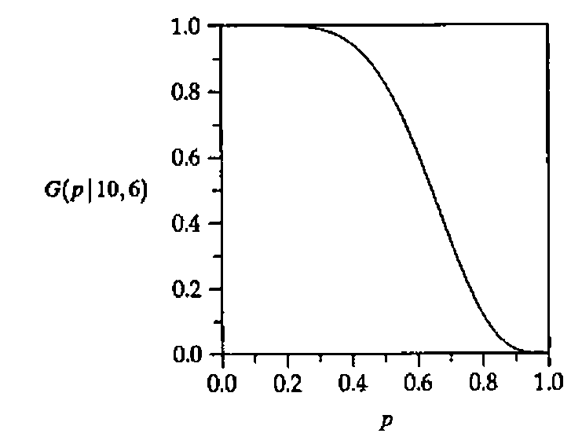
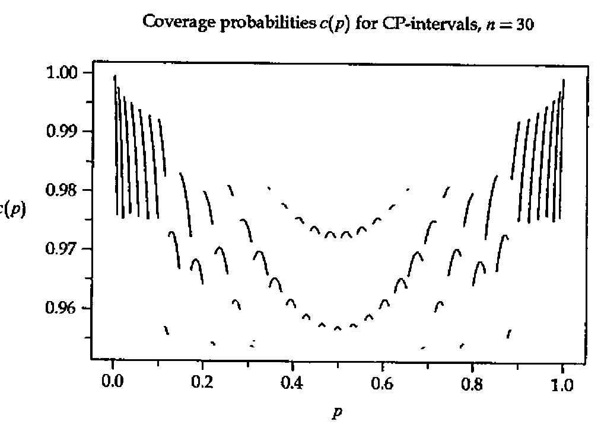

*by Dietrich Trenkler (University of Osnabrück)*
{ .byline }

## Introduction

The method of Clopper/Pearson [2] to construct confidence bounds for a probability *p* is covered in several text books, see e.g. Bickel/Doksum [1] or Mood/Graybill/Boes [4]. Explicit formulas exist only for marginal cases and their graphical determination from charts as the ones published in Pearson/Hartley [5] is very cumbersome and imprecise. Furthermore, well-known approximations based on the normal distribution may lead to unreliable results especially when the sample size is small.

In this note we present programs written in APL to compute these intervals. The first one, called *ILLINOIS*, has proven to be efficient in those cases where the determination of a solution of an equation *f*(*x*) = 0 is desired without the use of its derivative *f*′. As the construction of the Clopper-Pearson intervals amounts to solving such an equation and the derivative of the function involved is complicated we resort to this method.

## The Method and the Program

Let us start with a description of our goals. A Bernoulli trial is an experiment which can end in exactly two outcomes *F* (failure) or *S* (success). It is assumed that these Bernoulli trials are independently performed *n* times (the sample size) such that the number *X* of successes follows a Binomial distribution with probability function

*P*(*X* = *x*) = (*n* over *x*) *p*<sup>x</sup>(1 − *p*)<sup>n−x</sup>, *x* = 0,1,2,…,*n*

where *p* = *P*(*S*) is the probabilty of *S*. It is intended to use the observation (*X* = *x*) to construct a confidence interval [*p̂*<sub>l</sub>,*p̂*<sub>u</sub>] = [*p̂*<sub>l</sub>(*X*),*p̂*<sub>u</sub>(*X*)] for *p* such that

*P*(*p̂*<sub>l</sub> ≤ *p* ≤ *p̂*<sub>u</sub>) ≥ 1 − α &emsp; (1)

where 1 − α is a confidence level chosen in advance, usually 0.95 or 0.99. Note that *p̂*<sub>l</sub>(*X*) and *p̂*<sub>u</sub>(*X*) have a discrete distribution as they depend on *X*. This means that one can compute *n* + 1 pairs of confidence limits for a given sample size *n*.

If *n* is large and *p* not too small we can use a normal approximation and compute well-known confidence intervals from

*I* = *p̂* ± *z*√(*p̂*(1 − *p̂*)/*n*)

with *p̂* = *X*/*n* and *z* is the α/2 quantile of the standard normal distribution. This interval is not exact as it can happen that *P*(*p* ∈ *I*) < 1 − α for certain values of *p* which is especially true when *n* is small or *p* ≈ 0 or *p* ≈ 1. On the other hand, it can be shown that inequality (1) holds whenever *p̂*<sub>l</sub> is chosen as the solution of

*G*(*p* | *n*,*x* − 1) = 1 − α/2, 0 < *x* ≤ *n* &emsp; (2)

where

*G*(*p* | *n*,*x*) = *P*(*X* ≤ *x*) = ∑<sub>i=0</sub><sup>x</sup> (*n* over *i*) *p*<sup>i</sup>(1 − *p*)<sup>n−i</sup>. &emsp; (3)

Analogously, *p̂*<sub>u</sub> solves

*G*(*p* | *n*,*x*) = α/2, 0 ≤ *x* < *n*, &emsp; (4)

cf. Bickel/Doksum [1], pp. 180–2. An explicit solution exists in exactly two cases: If *x* = *n* we have *G*(*p* | *n*,*n* − 1) = 1 − *p*<sup>n</sup> = 1 − α/2 and consequently the confidence interval [*p̂*<sub>l</sub>,1] = [(α/2)<sup>1/n</sup>,1]. The case *x* = 0 yields the confidence interval [0,*p̂*<sub>u</sub>] = [0,1 − (α/2)<sup>1/n</sup>]. All other cases call for application of numerical methods.

To solve the equations (2) and (4) we could resort to Newton-Raphson iteration which however makes it necessary to program the derivative of the function under consideration. Instead, we use the Illinois method which is a modification of *regula falsi*, see Ralston/Rabinowitz [6], pp. 338–41. Assume that *f* is a continuous function defined on an interval [*x*<sub>1</sub>,*x*<sub>2</sub>] such that *f*(*x*<sub>1</sub>)*f*(*x*<sub>2</sub>) < 0. By the intermediate value theorem of calculus there exists an *x*<sub>0</sub> ∈ (*x*<sub>1</sub>,*x*<sub>2</sub>) such that *f*(*x*<sub>0</sub>) = 0. This value is unique if *f* is strictly increasing or decreasing. Regula falsi is a sequence (*x*<sub>i</sub>) of values defined by

*x*<sub>i</sub> = *x*<sub>i−2</sub> − *y*<sub>i−2</sub>(*x*<sub>i−1</sub> − *x*<sub>i−2</sub>)/(*y*<sub>i−1</sub> − *y*<sub>i−2</sub>), &ensp; *i* = 3,4,5,… &emsp; (5)

where *y*<sub>i</sub> = *f*(*x*<sub>i</sub>). Notice that *x*<sub>i+1</sub> is computed from (*x*<sub>i</sub>,*x*<sub>i−1</sub>) if *y*<sub>i</sub>*y*<sub>i−1</sub> < 0 otherwise it is computed from (*x*<sub>i</sub>,*x*<sub>i−2</sub>). This latter case can cause poor convergence and the Illinois method is a modification of this procedure by replacing (*x*<sub>i−2</sub>,*y*<sub>i−2</sub>) for (*x*<sub>i−3</sub>,*y*<sub>i−3</sub>/2) in (5) whenever *y*<sub>i</sub>*y*<sub>i−1</sub> > 0. This algorithm is implemented in the function `∆x∆←∆a∆ ILLINOIS ∆f∆` where `∆a∆` ↔ *x*<sub>1</sub>,*x*<sub>2</sub> and `∆f∆` is string describing *f*(*x*) in terms of `X` ↔ *x*. The local `∆eps∆` controls the accuracy of `∆x∆` and can be modified as desired.

```apl
    ∇∆x∆←∆a∆ ILLINOIS ∆f∆;X;∆y∆;∆eps∆
[1]  ∆eps∆←0.00001
[2]  X←∆a∆[1] ⋄ ∆x∆←⍎∆f∆
[3]  X←∆a∆[2] ⋄ ∆x∆←∆x∆,⍎∆f∆
[4]
[5]  REGFA:
[6]  →(∆eps∆>|∆x∆[2])/STOP
[7]  X←∆a∆[1]-∆x∆[1]×(-/∆a∆)÷-/∆x∆
[8]  →(0<∆x∆[2]×∆y∆←⍎∆f∆)/ILLI
[9]  ∆a∆←∆a∆[2],X ⋄ ∆x∆←∆x∆[2],∆y∆
[10] →REGFA
[11]
[12] ILLI:
[13] ∆a∆←∆a∆[1],X
[14] ∆x∆←(0.5×∆x∆[1]),∆y∆
[15] →REGFA
[16]
[17] STOP:∆x∆←¯1↑X
    ∇
```

## Examples

Example 1. (Ralston/Rabinowitz [6], Ex. 8.3.7(a), p. 401) Compute the root of *f*(*x*) = cos*x* − *xe*<sup>x</sup>. Using `∆eps∆←1E¯10` and `⎕←` in line `ILLINOIS[7]` we get

```apl
      ⎕PP←10 ⋄ X0←0 1 ILLINOIS '(2○X)-X×*X'
0.3146653378
0.4467281446
0.5338558719
0.5167740785
0.5177442058
0.5177701487
0.5177573635
0.5177573637
      (2○X0)-X0×*X0
4.440892099E¯15
```

Example 2. Arguing for *p̂*<sub>u</sub> it is not hard to see that *G*(*p* | *n*,*x*) is strictly monotonically decreasing in *p* for 0 < *x* < *n* and that *G*(0 | *n*,*x*) = 1 and *G*(1 | *n*,*x*) = 0. Hence there exists a unique solution of (4), that is *G*(*p* | *n*,*x*) = α/2. The following expressions illustrate the combination (*n*,*x*) = (10,6):

```apl
      P←0.01×0,⍳100 ⋄ COEFF←(I←0,⍳6)!10
      PLOT P,[1.1] ((P∘.*I)×(1-P)∘.*10-I)+.×COEFF
```



Equipped with the function *ILLINOIS* we have a tool to compute Clopper-Pearson intervals. All it takes is to compute *G*(*p* | *n*,*x*) from equation (3). This is done in the function *G_BINOM* which makes use of the recursion *P*(*X* = 0) = (1 − *p*)<sup>n</sup> and

*P*(*X* = *x*) = ((*n* − *x* + 1)*p* / *x*(1 − *p*)) × *P*(*X* = *x* − 1), &ensp; *x* = 1,2,…,*n*.

```apl
    ∇R←NX G_BINOM P;N;X;Q
[1]  N←NX[1] ⋄ X←⍳NX[2] ⋄ Q←1-P
[2]  ⍎(P=1)/'R←0 ⋄ →0'
[3]  R←+/×\(Q*N),(P×N+1-X)÷Q×X
    ∇
```

Example 3. The data matrix *WEIGHTS* contains weights before – after (in kg) of young girls receiving a treatment (family therapy) for anorexia. These are taken from Hand et al. [3], p. 229. Notice that the unit kilogram is presumably incorrect because otherwise these data are more typical for girls suffering from *obesity*. Adrian Smith commented that the unit *lbs* seems more appropriate. Nevertheless, we use them to illustrate the application of the Clopper-Pearson method. Let *p* be the probability that the therapy is a success which means that it will lead to a weight increase. If we assume independence then the number *X* of successes follows a Binomial distribution with *n* = 17 ↔ `1↑⍴WEIGHTS`. From the following expression we see that there have been 13 weight increases so that (*X* = 13).

```apl
      WEIGHTS,(--/WEIGHTS),[1.1]0>-/WEIGHTS
83.8  95.2 11.4 1
83.3  94.3 11   1
86    91.5  5.5 1
82.5  91.9  9.4 1
86.7 100.3 13.6 1
79.6  76.7 ¯2.9 0
76.9  76.8 ¯0.1 0
94.2 101.6  7.4 1
73.4  94.9 21.5 1
80.5  75.2 ¯5.3 0
81.6  77.8 ¯3.8 0
82.1  95.5 13.4 1
77.6  90.7 13.1 1
83.5  92.5  9   1
89.9  93.8  3.9 1
86    91.7  5.7 1
87.3  98   10.7 1
```

To compute a 95% confidence interval for *p* enter

```apl
      0 1 ILLINOIS'0.975-17 12 G_BINOM X'
0.50101
      0 1 ILLINOIS'0.025-17 13 G_BINOM X'
0.93189
```

Hence the Clopper-Pearson interval is [0.501,0.932] and we conclude that the therapy is effective.

Example 4. Suppose we want to compute *all* confidence intervals [*p̂*<sub>l</sub>(*x*),*p̂*<sub>u</sub>(*x*)] for *x* = 0,1,2,…,*n* for a given *n*. Then it is only necessary to compute the first *m* = 1 + [*n*/2] intervals [*p̂*<sub>l</sub>(*x*),*p̂*<sub>u</sub>(*x*)], *x* = 0,1,2,…,*m*. Roughly speaking this is because the first intervals for *p* ≤ 0.5 can be regarded as a reflection of those for *p* ≥ 0.5 To illustrate this point we consider the case `N` ↔ *n* = 10 and 1 − α = 0.95. The variable *HALF* consists of the first *m* = 1 + [*n*/2] = 1 + [10/2] = 6 Clopper-Pearson intervals. The rest is computed as follows:

```apl
      (0,⍳N),FULL←HALF,[1]1-⊖⌽((⌈0.5×N),2)↑HALF
 0 0         0.3085
 1 0.0025286 0.44502
 2 0.02521   0.5561
 3 0.066739  0.65245
 4 0.12155   0.73762
 5 0.18709   0.81291
 6 0.26238   0.87845
 7 0.34755   0.93326
 8 0.4439    0.97479
 9 0.55498   0.99747
10 0.6915    1
```

Example 5. To demonstrate formula (1) suppose we take *n* = 30 and 1 − α = 0.95. After having computed all 31 intervals [*p̂*<sub>l</sub>,*p̂*<sub>u</sub>] it is relatively easy to compute the coverage probability *c*(*p*) := *P*(*p̂*<sub>l</sub> ≤ *p* ≤ *p̂*<sub>u</sub>) using a program *COVERAGES_BINOM* (not displayed here). Its output can be used to plot *c*(*p*) against *p*. Notice that *c*(*p*) ≥ 0.95 holds throughout:



## Concluding Remarks

Using the Illinois method it is easy to compute all Clopper-Pearson intervals for the parameter *p* of a Bernoulli distribution as no derivatives have to be computed. In this way one avoids the tedious and inexact task of estimating the bounds from charts. For large sample sizes one can resort to an approximation using deMoivre-Laplace’s version of the Central Limit Theorem.

Notice that formulas (2) and (4) can be applied to compute lower or upper bounds for *p* if one replaces α/2 by α. For instance, for the data from Example 3 to compute a 95% lower bound for *p* enter

```apl
      0 1 ILLINOIS '0.95-17 12 G_BINOM X'
0.53945
```

Finally, it should be obvious that the approach can be easily extended to other discrete distributions such as the Poisson or negative binomial.

## Acknowledgement

I would like to thank Bernhard Strohmeier who helped in LaTeXing this paper.

## References

[1] Bickel, P.J./Doksum, K. (1977). *Mathematical Statistics: Basic Ideas and Selected Topics*, Holden-Day, San Francisco.

[2] Clopper, C.J. / Pearson, E.S. (1934). "The Use of Confidence or Fiducial Limits Illustrated in the Case of the Binomial", *Biometrika* 26, 404–413.

[3] Hand, D.J. / Daly, F. / Lunn, A.D. / McConway, K.J. / Ostrowski, E. (1994). *A Handbook of Small Data Sets*, Chapman & Hall, London.

[4] Mood, A.M. / Graybill, F.A. / Boes, D.C. (1974). *Introduction to the Theory of Statistics*, 3rd edition, McGraw-Hill, New York.

[5] Pearson, E.S. / Hartley, H.O. (1963). *Biometrika Tables for Statisticians*, volume 1, 2nd edition, Cambridge University Press, Cambridge, England.

[6] Ralston, A. / Rabinowitz, P. (1978). *A First Course in Numerical Analysis*, 2nd edition, McGraw-Hill, Tokyo.
