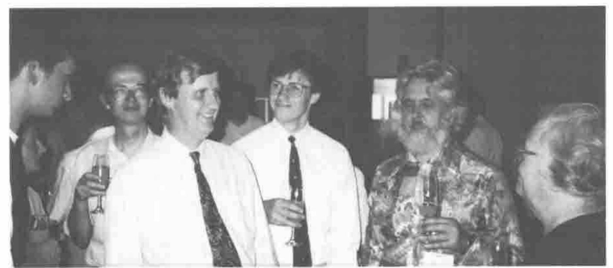
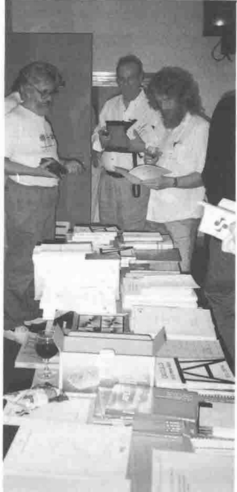
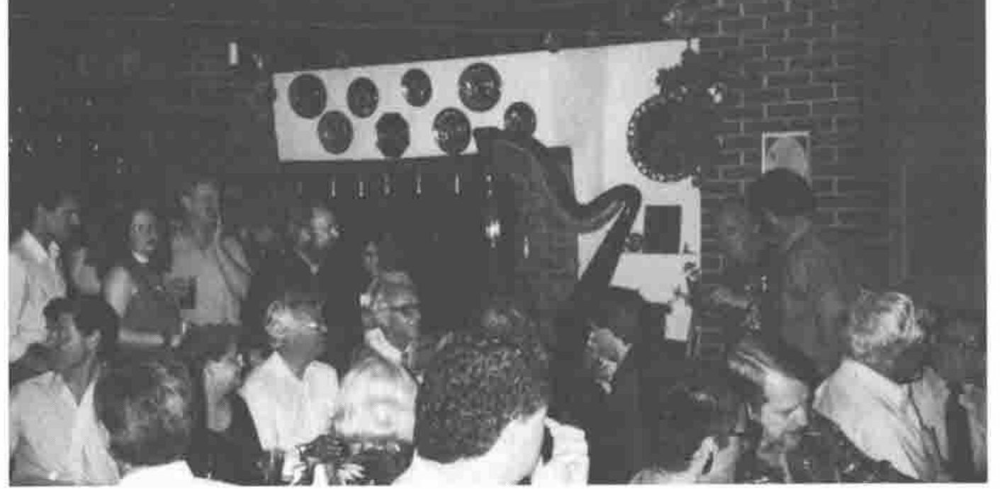

*reflections by Diane Whitehouse*
{ .byline }

Over fifty attendees came to Wales to *APL in Business* from ten countries.

While the agenda was a serious one, uppermost in delegates’ minds was that, as one self-proclaimed "hacker" said: "APL is fun and APLers are … also fun …." Here are some of the delegates’ more weighty reasons for attending the conference: "I’d like to test fly some GUI ideas"; "I want to expose Causeway to some hard core techies and encourage them to break it"; "I’m starting from ground zero"; "I’m at Swansea because I’m being forced very reluctantly into this Windows thing"; "I know nothing so that’s why I’m here"; "I want to turn my head around"; and "I’m hoping to acquire a set of relevant tools." Less seriously, perhaps, one veteran APLer commented, "I’m here to learn something about GUIs to support (my husband’s) lifestyle."

Jon Sandles, Adrian Smith, Alan Mayer, Duncan Pearson, Anthony Camacho (asleep?), and Sylvia Camacho
{ .caption }

While this was a very intensive and exciting three-day conference, there was also plenty of opportunity for discussion, dialogue, and socializing. Following on from many of the papers and computer lab sessions, strenuous debate continued long into the night over pints of beer. Devotees extolled the virtue of local bitters at the local Rat and Carrot or the "Pub by the Pond" for just 89p a pint. (Forecasting presentations by both Andy Pole and Gareth Brentnall partly used beer consumption as models. In Gareth’s case, he also referred to bulk paracetamol because "those of you who were in the bar late last night probably needed Paracetamol Bulk this morning.")

## The Street Market

A more sober event was the APL street market, located on "EBMS Street". Among other items, there were on display plenty of British APL Association materials, a cunning APL *vade mecum*, and an excess of Toronto-based *Gimme Arrays!* In attendance, huddled over their portables, were Jon Sandles, Ellis Morgan, and Morten Kromberg offering previews of their wares (to be introduced in more detail later in the week). Some of the juiciest conversations centred on what is happening now in the various APL companies. And some of my personal favourites involved swapping local news and ideas with Danish, German, and Finnish APL newsletter editors.

The Bookstall at the Street Market: Anthony Camacho, Jim Ryan, Phil Last
{ .caption }

At the street market, I spent some time with Jon Sandles of Rowntree Nestlé. Using Adrian Smith and Duncan Pearson’s Causeway, Jon has developed a program called BLOCKBUSTER. It calculates how to distribute pallets across the floor of the new product warehouse to minimize loading stresses on the floor. In an influx of (presumably) Smith humour, "Holler" is the naming convention for notification of excess weight differential on any section of the warehouse floor.

Many other discussions took place on long strolls on the glorious Swansea Bay beach, around the newly-gentrified Swansea Docks, or along the seashore to the quaint village of Mumbles. Short car journeys into the surrounding hills brought a climate so pure that Putney’s Kew Gardens are considering relocating their bedding grounds to this south coast idyll. We were lucky enough to share in, what was referred to as, the best summer weather in Wales since 1976…

Music was a great source of delight during the week. One colleague said how much he enjoyed the whistled baroque melodies, courtesy of Phil Last, every morning bright and early which were a pleasant reminder of Radio 3’s morning programme, Aubade. Italian and Spanish discos abounded on campus. And Saturday night carousing in Swansea produced the most melodic, harmonious, but drunken, serenades: at 2am in the city’s high streets, men’s choirs competed with women’s.

Part of the Crowd at Hwyrnos
{ .caption }

Among the more formal social occasions organized at *APL in Business* was a dinner with speaker, Canon Don Lewis, who captured the spirit of the Welsh valleys with his stories of four-times married Welsh women. A Welsh eating, singing, and clog-dancing evening — a *hwyrnos* — added to the week’s enjoyment, and brought out celebrity style in APL delegates from as far away as Finland and Russia. While we didn’t have to wear leeks to get through the pub door, we almost all emphatically adopted local Welsh accents. Enamoured by the lilting refrains of local players reciting from Dylan Thomas’s "Under Milkwood", we were, by the end of the week, greeting conference stalwarts, Haydn and Pam Williams, with the familiar, "And how are you today, my lovelies?" The answer is that we were all fine. The week was a great social, and intellectual, success. *APL in Business* was one of the most educational — and enjoyable — working conferences this delegate has attended in some years.

*Diane Whitehouse was taking her mind off the more serious business of PhD-writing and newsletter production by reviewing the social aspects of APL conference attendance in Wales.*
