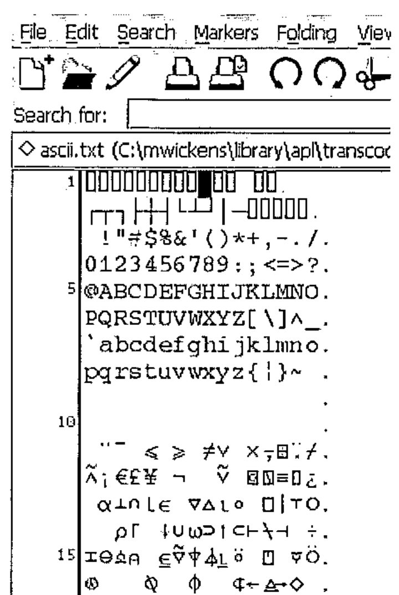
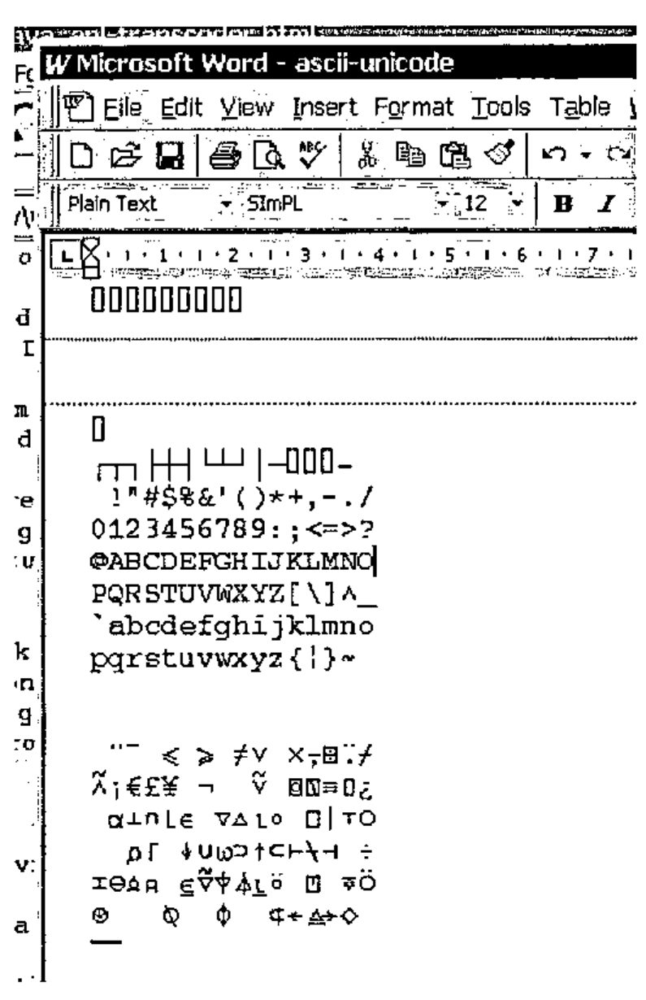

*by Mark Wickens*
{ .byline }

## Summary

A method for translating between vendor-specific APL source files and Unicode files is presented. This allows APL source files to be viewed, edited, printed and shared by any Unicode-compatible application, and between APL applications.

## The Problem

One of the problems with APL is that it uses a custom character set. This presents an additional hurdle for the potential user in that any APL installation must install a set of custom fonts for the APL application to use. As font-handling is still fairly operating-system dependent installation problems are common. Further, as most APL systems are ‘mature’ their font handling has not benefited from the standardization effort for font encoding that is Unicode. Finally, as APL source files are vendor-specific they are not compatible between different APL systems.

Various APL implementations have solved the font encoding problem in much the same way. They have taken the standard ASCII (or EBCDIC) character set and extended it to 8-bits (standard ASCII only defines the meaning of the first 7-bits) then used the additional 128 characters to encode the custom APL symbols. Whilst within the APL application environment the encoding mechanism is transparent and therefore does not present a problem. However, any attempt to view, edit, or print APL files outside the APL environment is made difficult by the fact that the viewer, editor or print utility must take into account the special font required to view the APL symbols. Sharing or publishing of APL documents is even more difficult because the recipient must have the APL font installed on their system and an application configured to use the font before they can view the APL source file contents correctly.

## Unicode

A concise definition of Unicode is: Unicode provides a unique number for every character, no matter what the platform, no matter what the program, no matter what the language.

The result of Unicode is a database of characters together with their corresponding description and unique number. The unique number is 16-bits long, so there can be a maximum of 65,535 (2^16-1) characters. The Unicode standard is realised on any particular computing platform by the integration of three key elements:

- A font-engine supporting Unicode fonts. There are two main font engines in use at the moment that support scalable fonts: TrueType and PostScript.
- A font containing glyphs (the definition of how each character should be drawn by the font-engine) for each of the Unicode characters.
- An application supporting the display of characters contained within the Unicode font, and some method of loading and storing files containing Unicode characters,

The Unicode standard includes a section that defines a unique number for each of the symbols defined within the APL language. It is therefore possible to describe any APL source file using Unicode characters[^7].

Any APL system that uses an 8-bit font encoding mechanism is not Unicode-compatible. The problem is therefore how to translate the vendor-specific APL files into Unicode-compatible files and visa-versa.

## Java and Unicode

Java was designed to support the Unicode standard from the ground up. The primitive type ‘char’ in the java language is defined to be 16-bits and can therefore contain a unique number for each of the 65,535 possible characters that can be defined within Unicode.

Java uses a set of character transcoders to translate between the internal Unicode representation of characters and other encoding mechanisms such as ASCII. The standard Java runtime contains encoders and decoders for the following standards:

```text
ASCII       - 7-bit encoding
Cp1252      - 8-bit extension of ASCII used on Windows computers
ISO8859_1   - 8-bit extension of ASCII used on Unix computers
MacRoman    - 8-bit extension of ASCII used on Mac computers
UTF8        - Compressed format for Unicode
Unicode     - 16-bit Unicode characters
```

There are many more character transcoders supported within java for translating between foreign language encodings and Unicode. The standard transcoders are defined within the package `sun.io` and the classes are contained within the runtime archive `rt.jar`. For international version of the java run-time environment, an additional archive `charsets.jar` contains additional foreign language transcoders.

### Java Character Encoder/Decoder Service Provider Mechanism

Java 1.4 contains a mechanism by which custom character encoders and decoders can be seamlessly integrated into the java runtime and made available to applications transparently. The mechanism is called a *Service-Provider Interface* and is defined within the java package `java.nio.charset.spi`.

## Unicode Fonts Defining the APL Symbols

At present I know of only one Unicode font that defines all the APL symbols contained within the Unicode standard, together with a standard set of normal characters. This is Phil Chastney’s SImPL truetype font[^8]. The font is described in his article An APL Unicode Font[^9].

## Downloading, installing and using the APL Transcoders

**NOTE: you must have version 1.4 or higher of the java runtime/SDK to use the transcoders.**

The transcoders are contained in the java archive file `apl-transcoding.jar`. This file must be installed on the java CLASSPATH so that the java runtime has access to it. The easiest way to do this is to copy it into the java runtime library extensions directory. If you have installed the java runtime in the default location, the library extensions directory is located at `C:\Program Files\Java\jre1.4.2\lib\ext` (your specific version number may differ). If, alternatively you are using the Java System Development Kit (SDK) then the directory will be `C:\j2sdk1.4.2\jre\lib\ext`.

Once the transcoding file is located within the library extensions directory, it will be automatically loaded whenever a java application is run. If your application supports the selection of file encodings when loading a file, you should be able to select one of the supported APL file types. Note that the transcoding mechanism does not provide a way for the application to query the available transcodings, so you are likely to have to supply a custom encoding name. The currently supported APL encodings are:

```text
ENCODING NAME    APL SYSTEM FILE FORMAT
-------------    ----------------------
SOLITON-APL      Soliton Associates' SHARP APL for Linux
```

The open-source editor jEdit[^10] is an excellent example of an editor that utilises the flexibility of the java character transcoding mechanisms for supporting numerous native file formats.

As an example, if you use jEdit then you can load a SHARP APL encoded file by:

- Selecting the `File->Open` menu item `(Ctrl-O)`.
- Right clicking on the SHARP APL file and selecting the option menu item `Encoding->Other...`
- Entering a value of `SOLITON-APL` in the `Character Encoding to Use` text field.

Once a file has been opened, jEdit remembers the last encoding specified, so you only have to perform this operation once for each APL file. Saving the file causes it to be translated back into the SHARP APL format. Any Unicode characters that cannot be translated into a value in the 8-bit SHARP APL character map are stored as spaces.

In order to view the APL symbols correctly you must install a Unicode font that contains definitions for the APL symbols. Such a font is Phil Chastney’s SImPL truetype font. This must be selected as the text editor area font within jEdit (select the `Utilities->Global Options...` menu item, then the `jEdit-Text Area` tree-option then select the `Text Font` option menu. The checkboxes `Smooth Text` and `Fractional Font Metrics` should be highlighted for the best quality display.



An example of the type of display that can be expected is shown here. The example contains a dump of the SOLITON-SHARP encoding scheme.

## Sharing APL Source Code

If you wish to share your APL source files with others the safest way to do so is to save it in one of the Unicode standard formats, either raw Unicode (which makes the file twice the size as the original file because 2-bytes are used for each character) or UTF-8 (which uses less space because commonly used characters only take up 1-byte).

Once saved in a Unicode format, the file can be loaded into a program such as Word for Windows. When the font of the text is set to one containing the APL Unicode characters the APL characters will be displayed correctly.



If you wish you can then specify that the font used should be embedded in the word document – you then have a word document containing APL source code that can be emailed to anyone to be viewed, edited or printed.

## Transferring Source Code between different APL Systems

If you wish to load an APL source file in the native-format of one APL system (for example, Sharp APL) and then save it in the native-format of another system (for example, IBM APL2) then you must set the encoding option for the buffer before saving. This can be done in jEdit by loading the APL source file as described above, then selecting the `Utilities->Buffer Options` menu. You can then enter the encoding format for the file to be saved as (in this case you would enter a character encoding of `IBM-APL2` then save the file using a different name). The file will be encoded in the new format in the saved file. Note, however, that there is no guarantee that the source will run in an alternative system. That is entirely a different problem!

## Java Source for the Transcoding Library

The source code for the transcoding library can be downloaded in the file `apl-transcoding-src.jar`[^11].

[^7]: the fonts supplied with some APL systems may contain additional characters that are not part of the APL language, for example line-drawing characters. For the trancoders supplied, the nearest equivalent character defined within the Unicode standard is used where possible. Where there is no obvious equivalent, the character is mapped to the space character.

[^8]: http://www.vector.org.uk/resource/simpl02.zip

[^9]: http://www.vector.org.uk/v161/phil161.htm

[^10]: http://www.jedit.org

[^11]: http://www.rhodium-consulting.com/apl/apl-transcoding-src.jar
