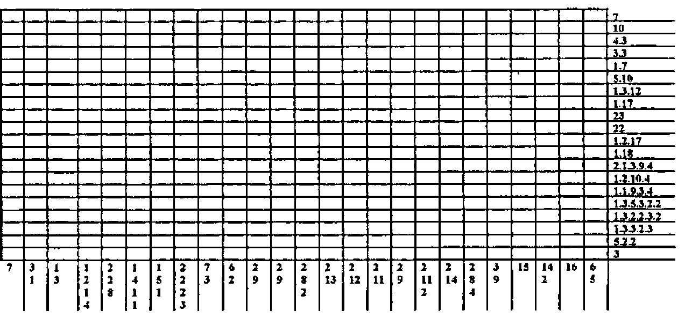
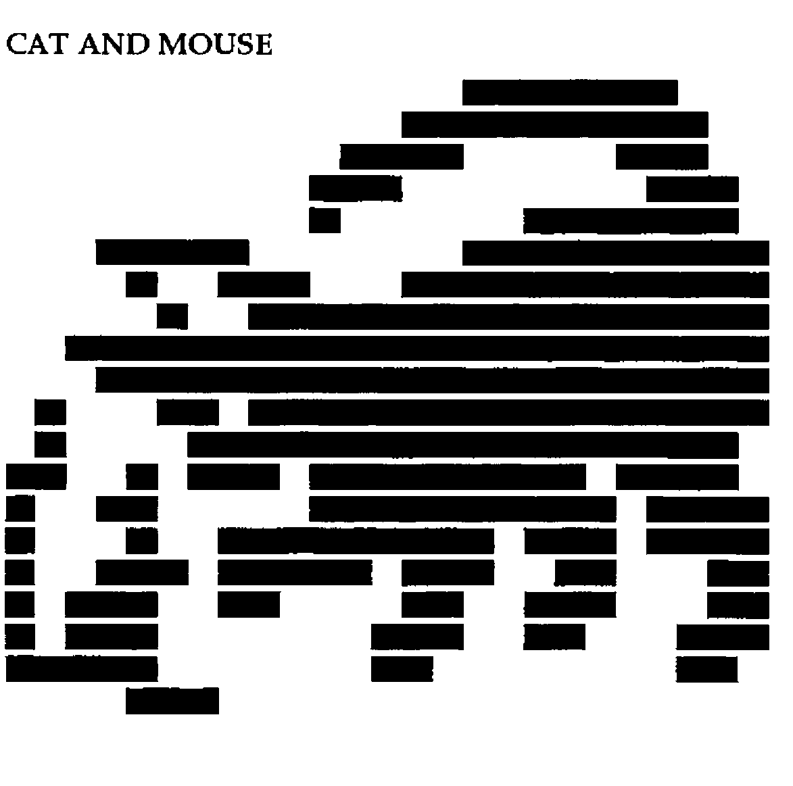
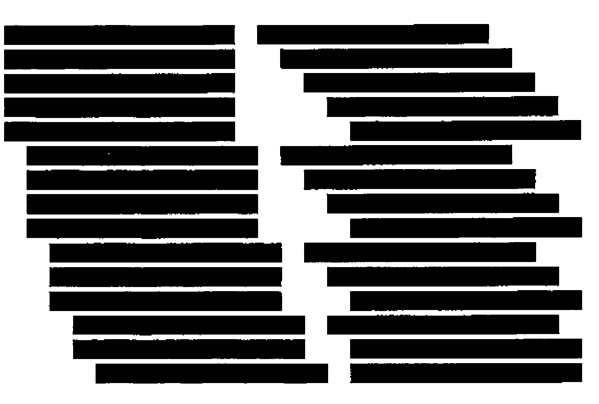

*by Alan J Wilson*
{ .byline }

The *Sunday Telegraph* runs a prize puzzle called *Nonogram* © J Dalgety/Non Isida.

> "Nonograms, which originate from Japan, are solved using number clues to locate solids (filled in squares) and dots (empty squares) to reveal a picture or diagram.
>
> Each column and row in the Nonogram grid has a series of numbers next to it. These refer to the number of adjacent squares that should be filled as solids. If more than one number appears in a column or row then that line will contain more than one block of solids — the block of solids will be separated by one or more dots. The solid blocks must appear in the order that the numbers are printed(left to right or top to bottom).
>
> For example, a row that contains the numbers 11.5 would contain a block of 11 adjacent filled-in squares (solids), then a gap of one or more empty squares (with dots in) and then a block of five adjacent filled-in squares.
>
> Blocks of solid squares can start anywhere in a row or column."

An example of the puzzle is :



Nonograms are fascinating and would appear to have been created for APL.

They can be solved by going systematically through the clues across and then the clues down in turn. Clues with a substantial number of solid squares result in an overlap, for example if the nonogram is 25 across and the clue across is 15 then however the clue is placed, the middle five squares must overlap and be black and can be placed in the solution. This process is continued for the down clues and the presence of existing black squares may well help place squares from certain down clues and possibly in the case of short single clues, some white squares. The initial grey background starts to fill in with black and white squares. The squares resulting from the down clues help fix further squares from the clues across and so on and so on, hopefully until completion. Artistic interpretation seems to have little to do with it.

The problem leads to an APL solution along the following lines.

The clues for the puzzle above are stored as a matrix as follows.

```text
ACROSS                  DOWN
 7  0  0  0  0  0        7  0  0  0  0  0
10  0  0  0  0  0        3  1  0  0  0  0
 4  3  0  0  0  0        1  3  0  0  0  0
 3  3  0  0  0  0        1  2  1  4  0  0
 1  7  0  0  0  0        2  2  8  0  0  0
 5 10  0  0  0  0        1  4  1  1  0  0
 1  3 12  0  0  0        1  5  1  0  0  0
 1 17  0  0  0  0        2  2  2  3  0  0
23  0  0  0  0  0        7  3  0  0  0  0
22  0  0  0  0  0        6  2  0  0  0  0
 1  2 17  0  0  0        2  9  0  0  0  0
 1 18  0  0  0  0        2  8  2  0  0  0
 2  1  3  9  4  0        2 13  0  0  0  0
 1  2 10  4  0  0        2 12  0  0  0  0
 1  1  9  3  4  0        2 11  0  0  0  0
 1  3  5  3  2  2        2  9  0  0  0  0
 1  3  2  2  3  2        2 14  0  0  0  0
 1  3  3  2  3  0        2  8  4  0  0  0
 5  2  2  0  0  0        3  9  0  0  0  0
 3  0  0  0  0  0       15  0  0  0  0  0
                        14  2  0  0  0  0
                        16  0  0  0  0  0
                         6  5  0  0  0  0
```

Rows and columns are padded with zeros to accommodate the width of the longest clue. These arrays are stored in the nested array *TNA3* in `TNA3[num;1]` and `TNA3[num;2]` respectively where num is the position in *GAMES* of the particular problem.

The function *SOLVE* reads in the clues, sets up the array *SOL* and proceeds as follows:

See if any clues cause an overlap (function *OVERLAP*) and enter the result in the solution matrix *SOL*.

See if subsequent to the use of *OVERLAP* any unfinished line in the puzzle must have all unfilled squares as either all black or all white entries. (The function *TOTALS*).

Prior to the use of the different techniques for determining how to attack particular clues calculate how many combinations are possible for every clue and record the relevant statistics. This is the function *SET∆WC* which creates vectors (one position for each clue, so length is A+D where A is across and D is down) as follows:

| | |
|---|---|
| *MSS* | Number of possible combinations for each clue. |
| *WC1* | Clues in increasing order of number of combinations possible |
| *WC2* | Clues that have had a change made to them by *OVERLAP* or *TOTALS* but which are not completely solved. |
| *WC3* | Indicates whether a clue has more or less than 1000 possible solutions. |
| *WC4* | Holds the index to the position in the nested array *TNA* which holds the corresponding matrix of the possible clue combinations(provided it is not too big!). The description of these matrices is set out in the Appendix. |

When clues have a 1000 or more possible combinations they are dealt with in parts, the function *SHRINK* restricts the size of the combination matrix that will be used. Initially it is set to size 200 and this will only be increased (by steps of 400) if there is no other way to solve the nonogram.

The first ten clues, which are those which have the lowest number of possible solutions, and which also have had some entries made, are processed in increasing order of complexity (See line [8] of *SOLVE*), these clue numbers are put in *BUFFER*.

When the clue has been processed the clue change indicator `WC2[NUM]` is set to zero until a further change is made to that clue. *NUM* refers the position of the clue in the array, *num* is the corresponding position in either Clues Across *CLUEA* or Clues Down *CLUED*. If *NUM* = *num* we must be processing an across clue. This test is important in correctly indexing the solution matrix *SOL*

The matrix with two rows [0] Clues Across, [1] Clues Down is called *CLUES*.

The function *CHOOSE* decides how we are to process a particular clue. This is determined by *WC3* which has entries initialised in *SET∆WC*, *WC3* entries however can be changed later.

Possible clue solving approaches are:

| | |
|---|---|
| *C0* | All clues with less than 1000 possible combinations. The Appendix explains how this works. |
| *C1* or *C3* | All clues with 1000 or more possible combinations. |
| *C4* | C0 clues on second and subsequent processing. |
| *C2* | C1 or C3 clues near the end of the problem solving. |

The somewhat illogical naming of the clue solving approaches reflects the different times at which these techniques were devised.

Prior to using *C1* or *C3* the function *REDUCE* is used, this:

1. Removes the second and other contiguous white squares.
2. Chops off completed clues from the left or right edge.

following the use of *REDUCE* it may be possible to fully process the remaining clue and part of the *SOL* matrix in which case *C1* is used or if not the left and right edges are tackled using *C3*.

Eventually, when most (¾) of the solution matrix has been completed a further method is introduced replacing many *C1*/*C3* clues, this is *C2*.

This reflects the fact that at this stage it is usually more fruitful to calculate the possible combinations of all the outstanding squares rather than try to reduce the clue. The nested array *TNA2* is used in conjunction with this and the function *CHANGE∆WC* is the precursor to this.

The process continues with *BUFFER* being refreshed from time to time. If this is not possible at any stage slightly larger numbers of combinations are allowed in solving using *C1* and *C3*.

This approach solves virtually all nonograms. It is possible to use larger matrices than are stored in *TNA*, but to avoid overflowing the workspace these would be written out to file and brought in and out when required.

Other functions listed are:

| | |
|---|---|
| COMB | Combination function.(page 159 of Gilman & Rose, 3rd edition) |
| FAULT | Indicates if an error has occurred when the nonogram is being solved providing the complete solution has been previously stored in TNA[;3], this is very useful when trying out new ideas. |
| INSTALL | Sets up TNA and TNA2. |
| PICTURE | Argument 0 or 1. Shows the nonogram white on black or black on white. |

A typical 25 x 20 nonogram takes about 2 seconds to solve on a 486. Finally ...

## CAT AND MOUSE



## Appendix

The key to the nonogram solving routines is the use of matrices that store all possible ways in which the white squares can be arranged for a given clue.

Thus for a clue, 10,10 in a row of 25 squares the numbers stored would be:

```text
0 1 4        1 1 3        2 2 1
0 2 3        1 2 2        2 3 0
0 3 2        1 3 1        3 1 1
0 4 1        1 4 0        3 2 0
0 5 0        2 1 2        4 1 0
```

The two ten black blocks being inserted between the first and second elements and the second and third elements.

The above matrix is derived from `(2 COMB 6), 6` less `1, 2 COMB 6` where `2 COMB 6` refers to all combinations of two different numbers chosen from the numbers one to six and arranged in ascending order.

```text
((2 COMB 6), 6)     (1, 2 COMB 6)       RESULT

     1 2 6              1 1 2             0 1 4
     1 3 6              1 1 3             0 2 3
     1 4 6              1 1 4             0 3 2
     1 5 6              1 1 5             0 4 1
     1 6 6              1 1 6             0 5 0
     2 3 6              1 2 3             1 1 3
     2 4 6              1 2 4             1 2 2
     2 5 6              1 2 5             1 3 1
     2 6 6              1 2 6             1 4 0
     3 4 6              1 3 4             2 1 2
     3 5 6              1 3 5             2 2 1
     3 6 6              1 3 6             2 3 0
     4 5 6              1 4 5             3 1 1
     4 6 6              1 4 6             3 2 0
     5 6 6              1 5 6             4 1 0
```

This process of differencing combination matrices works for every possible clue, the problem being that they get too big and take too long to process! The matrix of all possible white square positions is interleaved with the clue e.g.

```text
0  10  1  10  4
0  10  2  10  3
  etc. etc.
```

This is then expanded, `¯1` for whites, `1` for blacks to:

```text
1 1 1 1 1 1 1 1 1 1 ¯1   1 1 1 1 1 1 1 1 1 1 ¯1 ¯1 ¯1 ¯1
1 1 1 1 1 1 1 1 1 1 ¯1 ¯1 1 1 1 1 1 1 1 1 1 1  1 ¯1 ¯1 ¯1
```

etc. which looks like :



The solution to date of the clue is compared with every row and those rows that have 1s and ¯1s in the same position are totalled. If *every* entry of a column is 1 or ¯1 then because all possible combinations have been tried any new 1 or ¯1 can be entered into the solution matrix.

```apl
    ∇ C0
[1]   L←1↑⍴M←⊃TNA[WC4[NUM]]
[2]   PROCESS
[3]   →4+NUM≠num
[4]     SOL[num;WP,WM]←×WP,-WM   ⋄→6
[5]   SOL[WP,WM;num]←×WP,-WM
[6]   WC3[NUM]←8 ⋄ MAT[NUM]←⊂M[W;]
    ∇

    ∇ C1
[1]   L←1↑⍴M←⊃TNA[WC4[NUM]]
[2]   PROCESS
[3]   →4+NUM≠num
[4]   SOL[num;MAP[WM]]←¯1 ⋄ SOL[num;MAP[WP]]←1   ⋄→0
[5]   SOL[MAP[WM];num]←¯1 ⋄ SOL[MAP[WP];num]←1
    ∇

    ∇ C2
[1]   BNYD←(+/CLUE)-+/SOLN=1   ⋄NOC←BNYD!NYD←+/SOLN=0
[2]   M←(NOC,⍴SOLN)⍴×1+SOLN
[3]   M[;WHERE SOLN=0]←⊃TNA2[BNYD+40×NYD]
[4]   CLUE←,CLUE,[1.1]×CLUE
[5]   CLUE←¯1↓CLUE/(⍴CLUE)⍴1 0
[6]   M1←,M,9 ⋄M1←9,((M1≠0)∨(1↓M1≠0),1)/M1
[7]    W← +⌿(WHERE M1=9)∘.<WHERE CLUE⍷ M1
[8]   CUM←+⌿M[W;]
[9]   WM←WHERE CUM=0 ⋄ WP←WHERE CUM=⍴W
[10]  →11+NUM≠num
[11]   SOL[num;WP,WM]←×WP,-WM   ⋄→13
[12]    SOL[WP,WM;num]←×WP,-WM
[13]  WC3[NUM]←8 ⋄ MAT[NUM]←⊂ׯ.5+M[W;]
    ∇

    ∇ C3
[1]   COMBINEL
[2]   L←1↑⍴M←⊃TNA[WC4[NUM]]
[3]   PROCESS
[4]   →5+NUM≠num
[5]   SOL[num;MAP[(WM≤LHS)/WM]]←¯1 ⋄ SOL[num;MAP[(WP≤LHS)/WP]]←1   ⋄→7
[6]     SOL[MAP[(WM≤LHS)/WM];num]←¯1 ⋄ SOL[MAP[(WP≤LHS)/WP];num]←1
[7]   COMBINER
[8]   M←⊃TNA[WC4[NUM]]
[9]   PROCESS
[10]    →11+NUM≠num
[11]  SOL[num;MAP[(WM≥I)/WM]]←¯1 ⋄ SOL[num;MAP[(WP≥I)/WP]]←1 ⋄→0
[12]  SOL[MAP[(WM≥I)/WM];num]←¯1 ⋄ SOL[MAP[(WP≥I)/WP];num]←1
    ∇

    ∇ C4
[1]   SOLNNZ←SOLN[NZ←WHERE SOLN]
[2]   M←⊃MAT[NUM]
[3]   W←WHERE,((1↑⍴M),1)↑SOLNNZ⍷M[;NZ]
[4]   CUM←+⌿M[W;]
[5]   WM←WHERE CUM=-⍴W ⋄ WP←WHERE CUM=⍴W
[6]   →7+NUM≠num
[7]   SOL[num;WP,WM]←×WP,-WM    ⋄→9
[8]     SOL[WP,WM;num]←×WP,-WM
[9]   MAT[NUM]←⊂M[W;]
    ∇

    ∇ CHANGE∆WC
[1]   TEMP←WHERE WC3≠8
[2]   BNYD←(+/CLUES)-(+/SOL=1),+⌿SOL=1
[3]   WNYD←((+/SOL=0),+⌿SOL=0)-BNYD
[4]   WC1←(WC1~TEMP),TEMP[⍋NOC←BNYD[TEMP]!(BNYD+WNYD)[TEMP]]
[5]    WC3[TEMP[WHERE (NOC<250 )∧21>(BNYD+WNYD)[TEMP]]]←7
[6]   COUNT←1
    ∇
```

```apl
    ∇ CHOOSE
[1]   →2+14×NUM>num
[2]     OS←SOLN←SOL[num;] ⋄ CLUE←CLUES[NUM;]~0 ⋄→((+/CLUE)=+/SOLN=1)/13
[3]   →((D-+/CLUE)=+/SOLN=¯1)/14
[4]   →WC3[NUM]
[5]   ⍝⍝
[6]   C0 ⋄ →15
[7]   C2 ⋄ →15
[8]   C4 ⋄ →15
[9]   REDUCE
[10]  →12-WC4[NUM]∊TMATRECRED
[11]  C1  ⋄ →15
[12]  C3  ⋄ →15
[13]  SOL[num;]←ׯ.5+SOLN ⋄ →15
[14]  SOL[num;]←×.5+SOLN
[15]  WC2←WC2∨(A⍴0), OS≠SOL[num;]⋄→0
[16]   OS←SOLN←SOL[;num] ⋄ CLUE←CLUES[NUM;]~0
[17]  →((+/CLUE)=+/SOLN=1)/28
[18]  →((A-+/CLUE)=+/SOLN=¯1)/29
[19]  →WC3[NUM]+15
[20]  ⍝⍝
[21]  C0 ⋄ →30
[22]  C2 ⋄ →30
[23]  C4 ⋄ →30
[24]  REDUCE
[25]  →27-WC4[NUM]∊TMATRECRED
[26]  C1  ⋄ →30
[27]  C3  ⋄ →30
[28]  SOL[;num]←ׯ.5+SOLN⋄ →30
[29]  SOL[;num]←×.5+SOLN
[30]  WC2←WC2∨(A+D)↑OS≠SOL[;num]
    ∇

    ∇ R←M COMB N;M;N
[1]   →(M=1,N)/l,r
[2]   R←1+(0,(M-1)COMB N-1),[1]M COMB N-1 ⋄ →0
[3]   l:R←(⍳N)∘.×⍳1 ⋄ →0
[4]   r:R←(⍳1)∘.×⍳N
    ∇

    ∇ COMBINEL
[1]   OLDCLUE←CLUE  ⋄OLDMAP←MAP
[2]   SOLN←(-1+¯1↑CLUE)↓SOLN⋄CLUE←¯1↓CLUE
[3]   WC4[NUM]←((⍴SOLN)-+/CLUE)+50ׯ1+⍴CLUE
[4]   →(~WC4[NUM]∊TMATRECRED)/2
[5]   LHS←+/CLUE+1 ⋄SOLN[LHS↓⍳⍴SOLN]←0  ⋄ MAP←(⍴SOLN)↑MAP
    ∇
```

```apl
    ∇ COMBINER
[1]   CLUE←(-⍴CLUE)↑OLDCLUE
[2]   SOLN←((+/OLDCLUE+1)-+/CLUE+1)↓OS[OLDMAP]
[3]   RHS←+/CLUE+1   ⋄ MAP←(-⍴SOLN)↑OLDMAP
[4]     SOLN[⍳(⍴SOLN)-RHS]←0 ⋄ I←1+(⍴SOLN)-RHS
    ∇

    ∇ R←FAULT
[1]   ⍝ RETURNS 1 IF WRONG
[2]   R←0∊SOL+⊃TNA3[n;3]
    ∇

    ∇ R←N FROM M;N;M
[1]   R←(PM,M+1)-1,PM←N COMB M+1
    ∇

    ∇ INSTALL
[1]   TNA←520⍴0     ⋄M←1
[2]    (TNA[M])←⊂1 FROM M ⋄→(50≥M←M+1)/⎕LC  ⋄M←1
[3]    (TNA[50+M])←⊂2 FROM M ⋄→(44≥M←M+1)/⎕LC  ⋄M←2
[4]    (TNA[100+M])←⊂3 FROM M ⋄→(18≥M←M+1)/⎕LC  ⋄M←3
[5]   (TNA[150+M])←⊂4 FROM M ⋄→(12≥M←M+1)/⎕LC  ⋄M←4
[6]    (TNA[200+M])←⊂5 FROM M ⋄→(11≥M←M+1)/⎕LC   ⋄ M←5
[7]    (TNA[250+M])←⊂6 FROM M ⋄→(11≥M←M+1)/⎕LC   ⋄M←6
[8]    (TNA[300+M])←⊂7 FROM M ⋄→(11≥M←M+1)/⎕LC    ⋄M←7
[9]    (TNA[350+M])←⊂8 FROM M ⋄→(11≥M←M+1)/⎕LC    ⋄M←8
[10]    (TNA[400+M])←⊂9 FROM M ⋄→(12≥M←M+1)/⎕LC   ⋄M←9
[11]    (TNA[450+M])←⊂10 FROM M ⋄→(12≥M←M+1)/⎕LC
[12]    ⍝⍝⍝ NOW INSTALL THE BINARY STUFF
[13]   TNA2←1000⍴0  ⋄b←2
[14]  LOOP:INSTALL∆BIN2 b
[15]  →(25>b←b+1)/LOOP
    ∇

    ∇ INSTALL∆BIN2 b;a
[1]   a←1
[2]   LOOP:
[3]   →(1000<a!b)/⎕LC+1⋄(TNA2[a+40×b])←⊂a INSTALL∆BIN3 b
[4]   →(b> a←a+1)/LOOP
    ∇

    ∇ R←a INSTALL∆BIN3 b ;  acb;ab
[1]   acb←a COMB b
[2]   ab←((a!b),b)⍴0
[3]   N←1
[4]   LOOP:
[5]   ab[N;acb[N;]]←1
[6]   →((a!b)≥N←N+1)/LOOP
[7]   R←ab
    ∇
```

```apl
    ∇ R←MATSIZE
[1]     TEMP1←1+((A,D)/D,A)-+/CLUES
[2]   TEMP2←+/×CLUES
[3]   R←TEMP2!TEMP1
    ∇

    ∇ OVERLAP;NUM
[1]   SOL[WHERE 0=+/CLUEA;]←¯1
[2]   NUM←0
[3]   →(A<NUM←NUM+1)/9
[4]   CLUE←CLUEA[NUM;]~0
[5]   →(D≥2×+/CLUE)/3
[6]   L←¯1↓(,CLUE,[1.1](⍴CLUE)⍴1)/(2×⍴CLUE)↑,(⍳12),[1.5]0
[7]    R←(-D)↑L ⋄L←D↑L
[8]   SOLA[NUM;WHERE(L=R)×L≠0]←1 ⋄ →3
[9]   NUM←0
[10]  SOL[;WHERE 0=+/CLUED]←¯1
[11]  →(D<NUM←NUM+1)/17
[12]  CLUE←CLUED[NUM;]~0
[13]  →(A≥2×+/CLUE)/11
[14]  L←¯1↓(,CLUE,[1.1](⍴CLUE)⍴1)/(2×⍴CLUE)↑,(⍳12),[1.5]0
[15]   R←(-A)↑L⋄L←A↑L
[16]  SOLD[WHERE(L=R)×L≠0;NUM]←1 ⋄ →11
[17]  SOL←SOLD∨SOLA ⋄ SOLD←⍉SOLD
    ∇

    ∇ PICTURE INDIC
[1]   2/⎕AV[33 178 220][⎕IO+1+SOL××INDIC-.5]
    ∇
```

*PICTURE is not suitable for APL\*PLUS III as its atomic vector does not have the grey scale characters.*

```apl
    ∇ PROCESS
[1]   WM←WP←⍳0
[2]   SOLNNZ←SOLN[NZ←WHERE SOLN] ⋄→(0=⍴SOLNNZ)/E
[3]   M←(,M),[1.1],(⍴M)⍴CLUE,0
[4]   M←(L,⍴SOLN)⍴(,M)/(×/⍴M)⍴¯1,1
[5]   W←WHERE,(L,1)↑SOLNNZ⍷M[;NZ]
[6]   CUM←+⌿M[W;]
[7]   WM←WHERE CUM=-⍴W ⋄ WP←WHERE CUM=⍴W  ⋄→0
[8]   E:→((⍴SOLN)≥2×+/CLUE)/0
[9]   Le←¯1↓(,CLUE,[1.1](⍴CLUE)⍴1)/(2×⍴CLUE)↑,(⍳12),[1.5]0
[10]  R←(-⍴SOLN)↑Le⋄Le←(⍴SOLN)↑Le
[11]  WP←WHERE Le×Le=R
    ∇
```

```apl
    ∇ REDUCE
[1]   MAP←WHERE  ~(¯1,¯1) ⍷ SOLN
[2]   SOLN←SOLN[MAP]
[3]   BW←WHERE (1,¯1) ⍷ SOLN⋄ WB←WHERE (¯1,1) ⍷ SOLN ⋄G←WHERE 0=SOLN
[4]   BW←(0,BW)[1+¯1↑WHERE BW<1↑G] ⋄ WB←((1↑⍴SOLN),WB)[1+1↑WHERE WB>¯1↑G]
[5]   MAP←BW↓WB↑MAP
[6]   BW←+/1=BW↑SOLN ⋄ WB←+/1=WB↓SOLN
[7]   BW←1↑WHERE BW=+\CLUE ⋄ WB←1↑WHERE WB=+\⌽CLUE
[8]   CLUE←BW↓(-WB)↓CLUE ⋄ SOLN←OS[MAP]
[9]   WC4[NUM]←((⍴SOLN)-+/CLUE)+50ׯ1+⍴CLUE
    ∇

    ∇ SET∆WC
[1]   CLUES←CLUEA,[1]CLUED
[2]   WC1←⍋MSS←MATSIZE
[3]   WC2←×(+/SOLA≠SOL),+⌿SOLD≠⍉SOL
[4]   WC2[W2,A+W4]←0
[5]   WC3←6+3×MSS>1000
[6]   WC4←¯51+TEMP1+50×TEMP2 ⍝ CALCS IN MATSIZE
    ∇

    ∇ SHRINK ZZ
[1]   TMATRECRED←TMATREC[WHERE TMATREC[;2]<TRED←ZZ;][;1]
    ∇

    ∇ SOLVE  GAME
[1]    →2+TRED=200
[2]     SHRINK 200
[3]   START⋄SET∆WC   ⋄→8
[4]   →(1∊WC2)/7+COUNT ⋄ SHRINK TRED←TRED+400
[5]   WG←WHERE (MSS>1000)×WC3≠8 ⍝NUMBER C0 CRITERIA SET TO
[6]   WC2[WG[WHERE WG∊(WHERE~0∧.=⍉SOL),A+WHERE~0∧.=SOL]]←1 ⍝C1'S, C3'S
[7]   →(QUARTER≤+/+/SOL=0)/⎕LC+1⋄ CHANGE∆WC
[8]   BUFFER←⌽(10↑(WC1×WC2[WC1])~0)~0 ⋄nb←BUFFER-A×A<BUFFER⋄→19-⍴BUFFER
[9]     NUM←BUFFER[10]⋄ num←nb[10]⋄WC2[NUM]←0⋄CHOOSE
[10]     NUM←BUFFER[9]⋄ num←nb[9] ⋄WC2[NUM]←0⋄CHOOSE
[11]     NUM←BUFFER[8]⋄ num←nb[8] ⋄WC2[NUM]←0⋄CHOOSE
[12]     NUM←BUFFER[7]⋄ num←nb[7] ⋄WC2[NUM]←0⋄CHOOSE
[13]     NUM←BUFFER[6]⋄ num←nb[6] ⋄WC2[NUM]←0⋄CHOOSE
[14]     NUM←BUFFER[5]⋄ num←nb[5] ⋄WC2[NUM]←0⋄CHOOSE
[15]     NUM←BUFFER[4]⋄ num←nb[4] ⋄WC2[NUM]←0⋄CHOOSE
[16]     NUM←BUFFER[3]⋄ num←nb[3] ⋄WC2[NUM]←0⋄CHOOSE
[17]     NUM←BUFFER[2]⋄ num←nb[2] ⋄WC2[NUM]←0⋄CHOOSE
[18]     NUM←BUFFER[1]⋄ num←nb[1] ⋄WC2[NUM]←0⋄CHOOSE
[19]   →4×0∊SOL
    ∇
```

```apl
    ∇ START
[1]   MAT←130⍴0
[2]    n←⍬⍴(11+WHERE (,GAMES) ⎕SS 12↑,GAME)÷12
[3]   A←⍬⍴1↑⍴CLUEA←⊃TNA3[n;1]⋄D←⍬⍴1↑⍴CLUED←⊃TNA3[n;2]
[4]   SOL←SOLA←SOLD←(A,D)⍴COUNT←0 ⋄QUARTER←A×D÷4
[5]   OVERLAP
[6]   TOTALS
    ∇

    ∇ TOTALS
[1]   W2←WHERE(+/CLUEA)=+/SOL=1
[2]   W4←WHERE(+/CLUED)=+/[1]SOL=1
[3]   →(0=⍴W2,W4)/0
[4]   SOL[W2;]←×SOL[W2;]-0.5
[5]   SOL[;W4]←×SOL[;W4]-0.5
    ∇

    ∇ R← WHERE vec
[1]   R←(×|vec)/⍳⍴vec
    ∇
```
