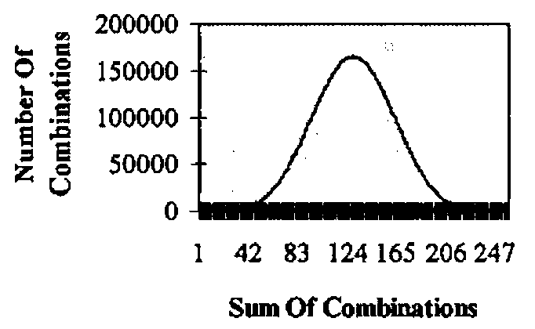

*by Alan Wilson*
{ .byline }

## Background

The UK National Lottery draw holds the attention of most ticket holders for the few moments the actual draw takes. For APL programmers this fascination can last a little longer. The draw picks six numbers plus a bonus number from all numbers in the range 1 to 49 inclusive and allocates prizes. The number of winning tickets assuming that each of the possible combinations is bought *once* is shown below.

| Tickets Matching | Winning Tickets | Prize Allocated |
|---|--:|---|
| All six numbers | 1 | First prize |
| Any five numbers plus the bonus number | 6 | Second Prize |
| Any five numbers | 258 | Third Prize |
| Any four numbers | 13545 | Fourth Prize |
| Any three numbers | 246820 | £10 prize per ticket. \* |

\* There is a provision for reducing this prize but in the 115 draws to 25 January 1997 it has not been and is unlikely to be in future.

Each ticket costs £1.00 and has six numbers. Should there be no tickets claiming the first prize (a roll-over draw), the prize is accumulated with the following draw’s prize money.

The number of winning tickets, assuming only unique combinations are sold, is arrived at as follows:

```apl
      ⌽¯4↑(6!49) × ODDS6
    ∇ R←ODDS6
[1]   ⍝ Probability of picking n matching numbers in 6!49
[2]   R←(×\1,⌽⍳6)×(⌽×\1,⌽37+⍳6)×((0,⍳6)!6)÷×/43+⍳6
    ∇
```

The number for five numbers plus the bonus number, i.e. 6 reflects the fact that the one winning line of 6 can have each of the 6 numbers replaced by the bonus number.

In practice any combination can be sold any number of times, including not being sold at all.

## Some Lottery Statistics To 25/01/1997

| | |
|---|---|
| Number of roll-over draws | 19 |
| Largest first prize per ticket | £22,590,829 |
| Smallest first prize per ticket | £122,510 |

Further statistics are available on the internet at http://lottery.merseyworld.com

## Lottery Arithmetic

The probabilities of choosing the *n* numbers drawn are:

```apl
7⍕1↓(×\1,⌽⍳6)×(⌽×\1,⌽37+⍳6)×((0,⍳6)!6)÷×/43+⍳6 ⋄ ⍝ ⎕IO is 1
```

| 1 | 2 | 3 | 4 | 5 | 6 |
|---|---|---|---|---|---|
| 0.4130195 | 0.1323780 | 0.0176504 | 0.0009686 | 0.0000184 | 0.0000001 |

The odds on winning a prize are:

```apl
⌊0.5+÷ 1↓(×\1,⌽⍳6)×(⌽×\1,⌽37+⍳6)×((0,⍳6)!6)÷×/43+⍳6 ⋄ ⍝ ⎕IO is 1
```

| | | 3 | 4 | 5 | 6 |
|---|---|---|---|---|---|
| | | 57 | 1032 | 54201 | 13983816 |

This confirms the quoted odds: 57:1 for the smallest prize, 14m:1 for the first prize.

## Which Combination?

If all combinations are sorted in ascending order,

```text
 1  2  3  4  5  6  is combination number 1
44 45 46 47 48 49  is combination number 13,983,816
```

What about 7 9 11 13 15 17?

The function *COMBNUMBER* can compute the cardinal order of any combination. Its left hand argument (*LHA*) is the specific combination and the right hand argument (*RHA*) is the maximum possible value, for example 49. This function will work with any combination in the form *n*`!`*m*, for example 6 from 49, 4 from 60 etc.

```apl
      7 9 11 13 15 17  COMBNUMBER 49
7998474

    ∇ Z←L COMBNUMBER R;a;N;b;l;TOT
[1]   ⍝ Return combination corresponding to a cardinal number (range 1,6!49)
[2]   a←⍴L ⋄ N←0 ⋄ b←R ⋄ l←L
[3]   TOT←(0,+\⌽(a-1)!(a-2)+⍳1+(b-a))[l[1]]
[4]   L0:a←a-1 ⋄ N←N+1
[5]   TOT←TOT+(0,+\⌽(a-1)!(a-2)+⍳1+(b-a)-l[N])[l[N+1]-l[N]]
[6]   →(a>1)/L0
[7]   Z←TOT+1
    ∇
```

Is there a link between combinations, their cardinal number and the number of winners? Here is a sample to investigate:

| Combinations | | | | | | Number Of Winners | Date |
|--:|--:|--:|--:|--:|--:|--:|---|
| 2 | 12 | 19 | 28 | 38 | 48 | 57 | 16/03/1996 |
| 7 | 17 | 23 | 32 | 38 | 42 | 133 | 14/01/1995 |
| 5 | 23 | 25 | 30 | 33 | 37 | 0 | 20/01/1996 |
| 21 | 29 | 31 | 32 | 34 | 48 | 0 | 13/01/1996 |

The reverse problem: given `6!49`, that is, 13,983,816 combinations, what is the 10,000,000th?

The function *NUMBERCOMB* will find the answer. The *LHA* is the length of the combination (6), the *RHA* is the maximum possible value (49) and the cardinal number of a combination(10,000,000).

```apl
      6 NUMBERCOMB 49,10000000
9 19 32 34 35 45

    ∇ Z←L NUMBERCOMB R;a;b;NUM;STORE1;COMBS;STORE2
[1]   ⍝ Return the cardinal number of a combination
[2]   a←L ⋄ b←R[1] ⋄ NUM←R[2]
[3]   STORE1←+\⌽(a-1)!(a-2)+⍳1+(b-a)
[4]   COMBS←0,1++/NUM>STORE1
[5]   L0:STORE1←+\⌽(a-1)!(a-2)+⍳1+(b-a)-¯1↑¯1↓COMBS
[6]   a←a-1
[7]   STORE2←+\⌽(a-1)!(a-2)+⍳1+(b-a)-¯1↑COMBS
[8]   NUM←NUM-(0,STORE1)[(¯1↑COMBS)-¯1↑¯1↓COMBS]
[9]   COMBS←COMBS,1+(¯1↑COMBS)++/NUM>STORE2
[10]  →(L≥⍴COMBS)/L0
[11]  Z←1↓COMBS
    ∇
```

## All `6!49` Combinations

Generating all `6!49` combinations can be problematic for two reasons: it can take too long and, more than likely, it will create *WS FULL* error. If the sum of the first combination (1 2 3 4 5 6 ) is 21 and that of the last (44 45 46 47 48 49) is 279 , how many combinations add up to the numbers between 21 and 279 inclusive?

The brilliant *COMB* function (Gilman & Rose p159) fails to compute `6 COMB 49`, generating *WS FULL*.

```apl
    ∇ Z←L COMB R
[1]   ⍝ Return combinations of L numbers from all numbers to R
[2]   ⍝ See Gilman & Rose page 159
[3]   →(L=1,R)/L0,L1
[4]   Z←1+(0,(L-1)COMB R-1),[1]L COMB R-1 ⋄ →0
[5]   L0:Z←(⍳R)∘.×⍳1 ⋄ →0
[6]   L1:Z←(⍳1)∘.×⍳R
    ∇
```

An alternative strategy is called for, one which deals with the 6!49 combinations in manageable chunks. This can be done as follows:

1. Create the combinations `3 COMB 49`.
2. For every *n* between 3 and 46 determine
    a) every combination given by `3 COMB 49` ending with *n* (call this the first half, *FH*)
    b) every combination given by `3 COMB 49` whose first entry is *n*+1 or higher (call this the second half *SH*)
3. Combine all of a) with all of b). This is done by the function *EVERY*.

```apl
    ∇ R←L EVERY R
[1]   ⍝ Replicate every row of L with all rows of R, both rank
2 or less
[2]   R←(¯2↑1 1,⍴R)⍴R
[3]   L←(¯2↑1 1,⍴L)⍴L
[4]   R←((1↑⍴R)⌿L),(((1↑⍴L)×1↑⍴R),0⊥⍴R)⍴R
    ∇
```

This third process may well overflow a typical workspace.

However, the two sub combinations, *FH* and *SH* can be used to obtain information about the full set of combinations `6 COMB 49` without using *EVERY*. By using `∘.=` and `+.×`, the function *TOTALS* will produce the sum of all 6!49 combinations which range between 21 (`+/1 2 3 4 5 6`) and 279 (`+/44 45 46 47 48 49`).

```apl
    ∇ Z←TOTALS;N;COMB349;FH;n1;t1;SH;N1;T1;TT;NN
[1]   ⍝ Return frequency of sum of each row of 6!49
[2]   N←3 ⋄ Z←279⍴0 ⋄ COMB349←3 COMB 49
[3]   L0:FH←COMB349[WHERE N=COMB349[;3];]
[4]   n1←+/[1](+/FH)∘.=⍳144 ⋄ t1←WHERE n1 ⋄ n1←n1~0
[5]   SH←COMB349[WHERE COMB349[;1]>N;]
[6]   N1←+/[1](+/SH)∘.=⍳144 ⋄ T1←WHERE N1 ⋄ N1←N1~0
[7]   TT←(,t1∘.+T1)∘.=⍳(⌈/T1)+⌈/t1 ⋄ NN←,n1∘.×N1
[8]   Z←Z+279↑NN+.×TT
[9]   →(46≥N←N+1)/L0
    ∇
```

The function *TOTALS* takes 25 seconds on a Pentium 133mhz Pc. The function *WHERE* makes *TOTALS* more readable.

```apl
    ∇ R←WHERE R
[1]   ⍝ Return indices of R where elements are non zero
[2]   R←,R
[3]   R←(R≠0)/⍳⍴R
    ∇
```

The number of combinations for each sum 21 to 279 would appear to be normally distributed.



Distribution of Combinations
{ .caption }

## A Guaranteed Lottery Win?

How many combinations are needed to guarantee at least three numbers in any draw?

My correspondence with the magazine The Actuary prompted some discussion on this point. The minimum number of tickets to guarantee 3 numbers (£10) is not more than 174. The method for generating these numbers is as follows.

> “Group A consists of 22 numbers consisting of 18 in sub-group D and 4 in sub-group E.
>
> Group B consists of 22 numbers.
>
> Group C consists of the remaining 5 numbers.
>
> The lines are set out in 4 sections:
>
> Section 1 consists of 77 lines using only the numbers in Group A.
>
> Section 2 consists of 77 lines using only the numbers in Group B.
>
> Section 3 consists of 18 lines with each containing all 5 numbers from Group C plus 1 of the numbers from sub-group D.
>
> Section 4 consists of 2 lines with each containing the 4 numbers from sub-group E plus 2 of the numbers from Group C.
>
> If any of groups A,B or C contains 3 or more selected numbers then a winning line will arise in section 1,2 or 3. If all 3 groups contain 2 of the selected numbers then section 3 will give a wining line if any of the 18 numbers from sub-group D were selected.
>
> The only other possibility is that the 4 numbers in sub-group E include 2 numbers. These 4 numbers are used in both lines in section 4. Since the 2 lines in section 4 between them use 4 of the numbers from group C, we must have used at least 1 of the selected numbers from group C in section 4 and so would have a winning line.”

*The Actuary pages 33/34, January/February 1996.*

The function *ALL∆THREES* produces the required 77 lines. It is not robust. The second group of 77 lines just need 22 to be added to each entry in the first group. This can be used to verify that 3 numbers can be matched from any draw.

```apl
    ∇ R←ALL∆THREES;n;MAT3∆22;LAST;NEXT;FH;SH
[1]
[2]   R←1 6⍴⍳6 ⋄ n←1 ⋄ MAT3∆22←3 COMB 22
[3]   L0: LAST←¯1 6↑R
[4]   NEXT←WHERE,(LAST[;⍳3] ⍷ MAT3∆22 )[;1]
[5]   L1:NEXT←NEXT+1 ⋄ →(3 ∊ (,MAT3∆22[NEXT;]) +.∊ ⍉R)↑L1
[6]   L2:FH←,MAT3∆22[NEXT;]
[7]   L3:SH←,MAT3∆22[NEXT←NEXT+1;]
[8]   →(1∊FH∊SH)/L3
[9]   →((FH,SH) TEST R)/L3
[10]  R←R,[1]FH,SH
[11]  →(77>1↑⍴R)/L0
    ∇
```

Unfortunately, £174 to win £10 means I won’t be giving up my day time job just yet.

Finally, a one-liner — how does an APLer check his winnings.

| | |
|---|---|
| *WL* | shape 6, the winning numbers |
| *CARD* | shape n 6, the weekly selection |

```apl
CARD+.∊WL
```

Good Luck!
