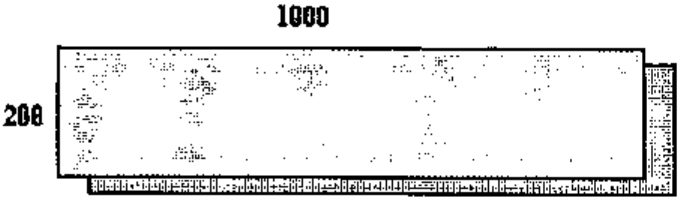

*by Alan J. Wilson*
{ .byline }

The following is a good example of the awesome problem solving power of APL.

## The Problem

Suppose you have 200 positive integers and want to find out quickly whether any subset of them adds up to 1000.

## The Solution

We create an array of zeros of size 200 by 1000.

We enter the first of the 200 numbers in the first row in the column corresponding to its size, e.g. if it was 23 we would put 1 in row 1 column 23.

We then take a second number and displace the original array as follows:



The displacement is one down and then across by the amount of the second number. We chop off the overhang which is shaded in, pad out the top row and left hand gap with zeros and add together the displaced row with its undisplaced self. APL does this in one line of code, see line 5 of `CREATE_MAT` below.

Finally we enter a 1 in the top row in the column in a position corresponding to the size of the second number. The total of the entries in the array is now 3 (unless some have dropped off the edge).

We repeat this process for each number, the total number of entries after the n<sup>th</sup> number is processed is a maximum of 2<sup>n</sup> − 1. If a particular number is greater than 1000 we reject it, see line 2 of `CREATE_MAT`.

We continue this process until either we have an entry in column 1000 or we have used all the numbers up. The function listed in fact processes all the numbers and gives distributions of all the totals from all possible subsets, subject to a limit of the array size.

An entry in column 1000 implies a subset of the numbers used to date adds up to 1000. We can determine when the entry first appeared, hence the last number used is in the required subset. We can use this to establish the last of a set of numbers which add up to a reduced target by solving the problem with target 1000 − the last number. By repeating the process we finally obtain the required set of numbers.

A useful test of the function is to use the numbers 1 to 49. The function produces in the sixth row of M totals of 21 to 279, when run as follows:

```apl
(⍳49)  CREATE_MAT  6,279
```

The total of the numbers in the row is 13,983,816 which is the number of ways we can select 6 numbers from 49, i.e. `6!49`. `M[6;]` is the distribution of totals of all possible sets of lottery numbers.

Many types of dynamic programming problems can be solved by this technique and variations of it.

```apl
    ∇ lhs CREATE_MAT  rhs ;N
[1]   M←rhs⍴0  ⋄ N←1
[2]   lhs←lhs[(lhs≤rhs[2])/⍳⍴lhs]
[3]   M[1;lhs[1]]←1
[4]       :while (⍴lhs)≥N←N+1
[5]         M←M+rhs↑0,[1]((rhs[1],lhs[N])⍴0),M
[6]         M[1;lhs[N]]←1+M[1;lhs[N]]
[7]       :endwhile
    ∇
```
