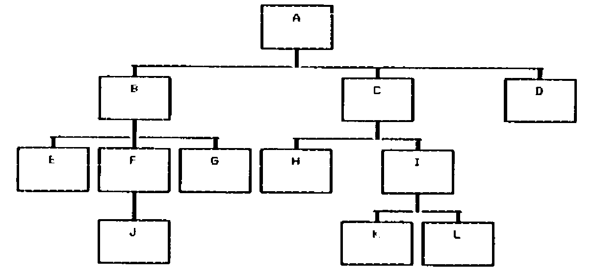

by Anne D Wilson
{ .byline }

## Incredulity

One occasionally comes across a method of solving a problem that is so simple that one’s first reaction is that of incredulity. However, if one pursues the subject the explanation is usually obvious; the data is held in a form that is ideally suited to the questions being asked of it. For example if I want to find which Wilsons have a telephone I look up a telephone directory, not an electoral roll; but the electoral roll would be better if I was looking for all the Robsons in a particular road.

I have written several programs in PL/I and Basic to process data describing trees; there the use of linked lists yielded reasonable algorithms. But when using tree data in APL it was necessary to find another method of storing the data, one that would use the vector processing capabilities of APL. When I stored the data in the way described below as “traipze order”, both storing the data initially and processing it brought forth the incredulity mentioned above.

The processes performed on the data include finding the size of a “subtree”, copying subtrees, removing subtrees, cutting and pasting subtrees, finding the ancestors of a “node” and finding which nodes are on the same level. Only one of these requires more than three APL statements.

## Why Trees

Trees used in computing come in two forms. This article is not about binary trees; they are simpler to process than non-binary trees and are widely used when studying efficiency in storing and accessing data. The trees under discussion here are non-binary ones; they are used to represent program code, description of programs and systems, and real world data. They are used in hierarchical decomposition, that is starting with something large and subdividing it, then subdividing it again, and again . . . . . . . ; this is how most people manage to address large problems without being lost in a welter of facts.

Any reader familiar with the programming methodologies of Warnier or Jackson will be accustomed to describing programs and data in tree format. With industrial processes where materials are composed of other materials, which in turn are composed of others, trees are a natural way of describing the components. It is possible for a recursive situation to arise when a material contains itself, for example waste paper and waste glass are recycled; compositions of this type can be highly complex. Questions may be asked about the derivation of materials, the components which are “elementary” (that is have no components themselves), and the quantities of these; tree processing programs are used to provide these answers.

## Nomenclature

Most people are familiar with the terminology used to describe trees, it is a mixture of biological, genealogical and mathematical terms.

| | |
| --- | --- |
| Node | – shown as a box in diagrams |
| Branches | – lines joining nodes |
| Terminal node | – node with no children |
| Root node | – the original node, one and only one always exists |
| Selecting node | – chooses one of its children |
| Iterated node | – is repeated |
| Ancestor | – as in a family tree |
| Child | – as in a family tree |
| Parent | – as in a family tree |
| Subtree | – part of a tree considered on its own, it behaves like a complete tree |
| Subroot | – the root of a subtree |



*A Typical Tree*
{ .caption }

## Traversing Trees

Traversing is the word used to describe a logical method of picking some, or all the nodes of the tree, in a predetermined order. The three methods that are used in my tree processing programs are:

<p style="margin-left: 2em">level by level<br>bubble up<br>traipze order.</p>

**Level by level** picks out all the nodes on the same level, e.g. E-F-G-H-I are at level 3. This method of traversal is used for printing tree diagrams. Level numbers are transitory, in that the removal or addition of a node affects the level numbers of all nodes in its subtree, so that nodes originally on the same level do not necessarily remain so. It picks out a subset of the nodes.

**Bubble up** starts with a node and picks out its ancestors, e.g. K-I-C-A and F-B-A. This is used when the derivation of a node is required. It picks out a subset of the nodes.

**Traipze order** picks all the nodes. Each node is first picked before the nodes in its subtree and before its brother nodes on the right; if it has a non empty subtree it is picked again immediately after the nodes on its subtree, e.g. A-B-E-F-J-(F)-G-(B)-C-H-I-K-L-(I)-(C)-D-(A). This is the order used when moving chronologically through program code, or sequentially through data on a file. It must start with the root node (because the subtree of the root is the entire tree).

## Input and Storage of Data

In my APL system I have stored the data in traipze order, with repeated nodes stored once only. Without any loss of generality the data may be considered to be a vector of keys for the purpose of the following discussion. In addition a second vector of LEVEL NUMBERS is kept. As mentioned above the level numbers are transitory, however they can easily be updated, cf the COPY and CUT and PASTE functions given below. The repetition of nodes, such as F and B is not required because their existence is implied by the level numbers, see “size of a subroot”.

The input of data in traipze order is very simple. It is assumed that for every node there is a record containing its children; this may be null. Two pairs of vectors are set up:

| | |
| --- | --- |
| IDI | – data read but not yet processed |
| LEVI | – level numbers for data held in IDI |
| IDX | – data store |
| LEVX | – level numbers for data held in IDX |

Storage algorithm

```text
1. Set IDX, LEVX as empty vectors
2. IDI = root node (A)
3. LEVI = 1
4. Move first element from IDI to end of IDX
5. Move first element from LEVI to end of LEVX (value L)
6. Read data for the element just moved, if empty go to 9
7. Store the data at start of IDI
8. Add an equal number of elements to start of LEVI, value (L+1)
9. If IDI is non empty go to 4.
```

```text
IDI        LEVI        IDX                       LEVX
A          1
B C D      2 2 2       A                         1
E F G C D  3 3 3 2 2   A B                       1 2
F G C D    3 3 2 2     A B E                     1 2 3
J G C D    4 3 2 2     A B E F                   1 2 3 3
G C D      3 2 2       A B E F J                 1 2 3 3 4
C D        2 2         A B E F J G               1 2 3 3 4 3
H I D      3 3 2       A B E F J G C             1 2 3 3 4 3 2
I D        3 2         A B E F J G C H           1 2 3 3 4 3 2 3
K L D      4 4 2       A B E F J G C H I         1 2 3 3 4 3 2 3 3
L D        4 2         A B E F J G C H I K       1 2 3 3 4 3 2 3 3 4
D          2           A B E F J G C H I K L     1 2 3 3 4 3 2 3 3 4 4
                       A B E F J G C H I K L D   1 2 3 3 4 3 2 3 3 4 4 2
```

*Building up the Data on Input*
{ .caption }

## Alternate Definitions

The simplicity of the functions required to perform the tree processing is explained by the alternate definitions given below, these interpret the functions in terms of the order of the nodes and their level values.

Level by level – all nodes in the tree with the same level number.

Size of a subtree – all the nodes whose level number is greater than that of the subroot, and follow the subroot until terminated by a brother or uncle of the subroot, whose level will either be equal or greater than that of the subroot.

Ancestors of a node – the last occurrence of each level number for the nodes which precede that particular node.

CUT off a subtree – remove all reference to the nodes belonging to that subtree, as defined under ‘size of a subtree’.

COPY a subtree to a new node – take the nodes ‘cut off’ as described above and insert them after the new node, so that they are added as the first part of its subtree.

CUT and PASTE a subtree – a combination of CUT and COPY, leaving the original subtree unaltered.

Sometimes the subroot is treated as part of the subtree; this depends on the actual problem being solved. The difference can be seen in the functions CUT, where it is left, and COPY where it is moved with the the subtree.

FIG1
{ .caption }

```apl
    SIZE←SUBTREE∆SIZE N
    -------------------

[1]  ⍝ LOOK ONLY AT THE LEVEL OF RECORDS AFTER THE SUBROOT.
[2]  ⍝ TAKE ALL THOSE UNTIL LEVEL IS EQUAL TO (BROTHER)
[3]  ⍝          OR LESS THAN (UNCLE) THAT OF THE SUBROOT.
[4]  ⍝

[5]   SIZE←+/∧\LEVX[N]<N↓LEVX
    ∇

    ANC←ANCESTORS N
    ---------------

[1]  ⍝ FIND THE INDEX VALUE OF ALL NODES WHICH ARE ANCESTORS OF THE NODE
[2]  ⍝     WITH INDEX VALUE N (INCLUDING ITSELF).
[3]  ⍝ ONLY THE LAST INSTANCE OF EACH LEVEL BELONGS TO AN ANCESTOR.
[4]  ⍝ LOOK ONLY AT THE LEVEL OF RECORDS BEFORE THE SUBROOT.
[5]  ⍝ THE ⌽ IS TO PROCESS THE DATA FROM RIGHT TO LEFT.
[6]  ⍝ THE ⌊ GIVES TO ALL THE NODES OF EARLIER SUBTREES, WHOSE SUBROOT
[7]  ⍝     IS AN UNCLE OF N, THE LEVEL VALUE OF THEIR SUBROOT.
[8]  ⍝

[9]   ANC←(X<¯1↓999,X←⌊\LEVX[⌽⍳N])/⌽⍳N
    ∇

    RC←LEVEL∆BY∆LEVEL L
    -------------------

[1]  ⍝ PICK OUT ALL RECORDS WITH THE LEVEL L.
[2]  ⍝

[3]   RC←(LEVX=L)/⍳1↑⍴LEVX
    ∇

    CUT N;SIZE
    ----------

[1]  ⍝ CUT OUT THE SUBTREE OF THE NODE WITH INDEX N, BUT LEAVE N IN.
[2]  ⍝ FIRSTLY FIND THE SIZE OF THE SUBTREE OF NODE WITH INDEX N.
[3]  ⍝

[4]   SIZE←SUBTREE∆SIZE N
[5]   'NEW IDS ARE ',(N↑IDX),(N+SIZE)↓IDX
[6]   'NEW LEVELS ARE ',⍕(N↑LEVX),(N+SIZE)↓LEVX
    ∇

    M COPY N;SIZE
    -------------

[1]  ⍝ COPY THE SUBTREE OF THE NODE WITH INDEX VALUE N, INCLUDING N,
[2]  ⍝     SO THAT N IS THE FIRST CHILD OF THE NODE WITH INDEX VALUE M.
[3]  ⍝ FIRSTLY FIND THE SIZE OF THE SUBTREE OF NODE WITH INDEX N.
[4]  ⍝

[5]   SIZE←SUBTREE∆SIZE N

[6]  ⍝

[7]   'NEW IDS ARE ',(M↑IDX),IDX[N,N+⍳SIZE],(M↓IDX)

[8]  ⍝
[9]  ⍝ ADJUST THE LEVELS OF THE COPIED NODES.

[10]  'NEW LEVELS ARE ',⍕(M↑LEVX),(LEVX[N,N+⍳SIZE]+1+LEVX[M]-LEVX[N]),(M↓LEVX)
    ∇

    M CUT∆AND∆PASTE N;LEVDIFF;NEWIND;NEWLEV;SIZE;X
    ----------------------------------------------

[1]     ⍝ COPY THE SUBTREE OF THE NODE WITH INDEX VALUE N, INCLUDING N,
[2]     ⍝     SO THAT N IS THE FIRST CHILD OF THE NODE WITH INDEX VALUE M.
[3]     ⍝ CUT OUT THE SUBTREE OF THE NODE WITH INDEX N, INCLUDING N.
[4]     ⍝ FIRSTLY FIND THE SIZE OF THE SUBTREE OF NODE WITH INDEX N.
[5]     ⍝ AND CHECK THAT IT IS NOT PASTED INTO ITSELF.
[6]     ⍝

[7]      SIZE←SUBTREE∆SIZE N
[8]      →(~M∊N+⍳SIZE)/L10
[9]      'CANNOT CUT AND THEN PASTE INTO THE VOID'
[10]     →0
[11] L10: ⍝ N ITSELF IS TO BE MOVED, SO ADD 1 TO ITS SUBTREE SIZE.

[12]    ⍝ CALCULATE THE AMOUNT TO ALTER THE LEVEL NUMBERS.

[13]     LEVDIFF←1+LEVX[M]-LEVX[N]

[14]    ⍝
[15]    ⍝ BUILD UP THE INDEX IN NEWIND, REFERRING TO THE OLD TREE.

[16]     NEWIND←(⍳N-1),(N+SIZE)↓⍳⍴LEVX

[17]    ⍝
[18]    ⍝ FIND WHERE M OCCURS IN THE NEW INDEX.

[19]     X←NEWIND⍳M

[20]    ⍝
[21]    ⍝ INSERT N AND ITS SUBTREE AS MS FIRST CHILD.

[22]     NEWIND←(X↑NEWIND),(N,N+⍳SIZE),X↓NEWIND
[23]     'NEW IDS ARE ',IDX[NEWIND]

[24]    ⍝
[25]    ⍝ SIMILARILY BUILD UP THE NEW LEVEL NUMBERS, ADJUSTING FOR NS SUBTREE

[26]     NEWLEV←LEVX[NEWIND]
[27]     NEWLEV[X+⍳1+SIZE]←NEWLEV[X+⍳1+SIZE]+LEVDIFF
[28]     'NEW LEVELS ARE ',⍕NEWLEV
    ∇
```

FIG2
{ .caption }

```text
SIZE OF SUBTREE:-
-----------------
     of A - 11
     of B - 4
     of E - 0
     of F - 1
     of J - 0
     of G - 0
     of C - 4
     of H - 0
     of I - 2
     of K - 0
     of L - 0
     of D - 0
```

FIG3
{ .caption }

```text
NODES ON:-
----------
     level 1 - A
     level 2 - BCD
     level 3 - EFGHI
     level 4 - JKL
```

FIG4
{ .caption }

```text
ANCESTORS:-
-----------
     of A - A
     of B - BA
     of E - EBA
     of F - FBA
     of J - JFBA
     of G - GBA
     of C - CA
     of H - HCA
     of I - ICA
     of K - KICA
     of L - LICA
     of D - DA
```

FIG5
{ .caption }

```text
CUT SUBTREE:-
-------------
  remove subtree of A -
       New ids are A
       New levels are 1
  remove subtree of B -
       New ids are ABCHIKLD
       New levels are 1 2 2 3 3 4 4 2
  remove subtree of E -
       New ids are ABEFJGCHIKLD
       New levels are 1 2 3 3 4 3 2 3 3 4 4 2
  remove subtree of F -
       New ids are ABEFGCHIKLD
       New levels are 1 2 3 3 3 2 3 3 4 4 2
  remove subtree of J -
       New ids are ABEFJGCHIKLD
       New levels are 1 2 3 3 4 3 2 3 3 4 4 2
  remove subtree of G -
       New ids are ABEFJGCHIKLD
       New levels are 1 2 3 3 4 3 2 3 3 4 4 2
  remove subtree of C -
       New ids are ABEFJGCD
       New levels are 1 2 3 3 4 3 2 2
  remove subtree of H -
       New ids are ABEFJGCHIKLD
       New levels are 1 2 3 3 4 3 2 3 3 4 4 2
  remove subtree of I -
       New ids are ABEFJGCHID
       New levels are 1 2 3 3 4 3 2 3 3 2
  remove subtree of K -
       New ids are ABEFJGCHIKLD
       New levels are 1 2 3 3 4 3 2 3 3 4 4 2
  remove subtree of L -
       New ids are ABEFJGCHIKLD
       New levels are 1 2 3 3 4 3 2 3 3 4 4 2
  remove subtree of D -
       New ids are ABEFJGCHIKLD
       New levels are 1 2 3 3 4 3 2 3 3 4 4 2
```

FIG6
{ .caption }

```text
COPY:-
------
  copy from A to D -
       New ids are ABEFJGCHIKLDABEFJGCHIKLD
       New levels are 1 2 3 3 4 3 2 3 3 4 4 2 3 4 5 5 6 5 4 5 5 6 6 4
  copy from B to L -
       New ids are ABEFJGCHIKLBEFJGD
       New levels are 1 2 3 3 4 3 2 3 3 4 4 5 6 6 7 6 2
  copy from E to K -
       New ids are ABEFJGCHIKELD
       New levels are 1 2 3 3 4 3 2 3 3 4 5 4 2
  copy from F to I -
       New ids are ABEFJGCHIFJKLD
       New levels are 1 2 3 3 4 3 2 3 3 4 5 4 4 2
  copy from J to H -
       New ids are ABEFJGCHJIKLD
       New levels are 1 2 3 3 4 3 2 3 4 3 4 4 2
  copy from G to C -
       New ids are ABEFJGCGHIKLD
       New levels are 1 2 3 3 4 3 2 3 3 3 4 4 2
  copy from C to G -
       New ids are ABEFJGCHIKLCHIKLD
       New levels are 1 2 3 3 4 3 4 5 5 6 6 2 3 3 4 4 2
  copy from H to J -
       New ids are ABEFJHGCHIKLD
       New levels are 1 2 3 3 4 5 3 2 3 3 4 4 2
  copy from I to F -
       New ids are ABEFIKLJGCHIKLD
       New levels are 1 2 3 3 4 5 5 4 3 2 3 3 4 4 2
  copy from K to E -
       New ids are ABEKFJGCHIKLD
       New levels are 1 2 3 4 3 4 3 2 3 3 4 4 2
  copy from L to B -
       New ids are ABLEFJGCHIKLD
       New levels are 1 2 3 3 3 4 3 2 3 3 4 4 2
  copy from D to A -
       New ids are ADBEFJGCHIKLD
       New levels are 1 2 2 3 3 4 3 2 3 3 4 4 2
```

FIG7
{ .caption }

```text
CUT AND PASTE :-
----------------
  cut A and paste on D -
       Cannot cut and then paste into the void
  cut B and paste on L -
       New ids are ACHIKLBEFJGD
       New levels are 1 2 3 3 4 4 5 6 6 7 6 2
  cut E and paste on K -
       New ids are ABFJGCHIKELD
       New levels are 1 2 3 4 3 2 3 3 4 5 4 2
  cut F and paste on I -
       New ids are ABEGCHIFJKLD
       New levels are 1 2 3 3 2 3 3 4 5 4 4 2
  cut J and paste on H -
       New ids are ABEFGCHJIKLD
       New levels are 1 2 3 3 3 2 3 4 3 4 4 2
  cut G and paste on C -
       New ids are ABEFJCGHIKLD
       New levels are 1 2 3 3 4 2 3 3 3 4 4 2
  cut C and paste on G -
       New ids are ABEFJGCHIKLD
       New levels are 1 2 3 3 4 3 4 5 5 6 6 2
  cut H and paste on J -
       New ids are ABEFJHGCIKLD
       New levels are 1 2 3 3 4 5 3 2 3 4 4 2
  cut I and paste on F -
       New ids are ABEFIKLJGCHD
       New levels are 1 2 3 3 4 5 5 4 3 2 3 2
  cut K and paste on E -
       New ids are ABEKFJGCHILD
       New levels are 1 2 3 4 3 4 3 2 3 3 4 2
  cut L and paste on B -
       New ids are ABLEFJGCHIKD
       New levels are 1 2 3 3 3 4 3 2 3 3 4 2
  cut D and paste on A -
       New ids are ADBEFJGCHIKL
       New levels are 1 2 2 3 3 4 3 2 3 3 4 4
```
