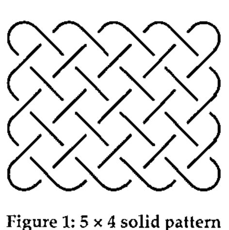
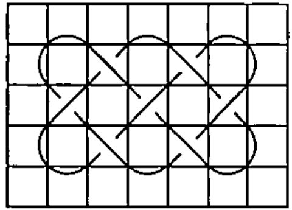
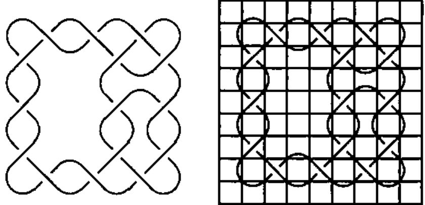
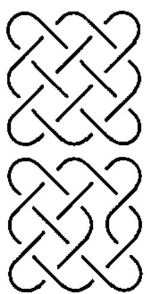
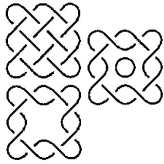

*by Anne D. Wilson*
{ .byline }

## Introduction

Like many mathematicians I am intrigued with pattern, and the weaving of Celtic designs has been a favourite of mine since I was a child. So when recently the words "computer" and "Celtic design" were uttered together it triggered an urge to write my own system.

Most published work describes existing patterns, but does not give methods of drawing patterns. However, George Bain [1] attacked it from the artist’s viewpoint in the mid 20th century. Later his son, Iain Bain [2], described and extended his father’s work in a more scientific manner. Although their method produces correct patterns the procedures followed are more complicated than is appropriate for the complexity of the problem.

Thus I felt free to follow my own path to simplicity. And so I started drawing simple patterns over every spare piece of paper – over and under, over and under – until the algorithm emerged.

In this article I first describe Celtic patterns, then enumerate rules for defining *rectangular* patterns. Comments on evolving the design of programs show why I work as I do. Next I describe the construction I place over a Celtic pattern to enable me to describe an entire design in a simple matrix. Then the ways of proceeding from a solid mass of pattern to a designed Celtic pattern, and a method of separating into *bands*. Lastly, but not crucial to this article, I indicate how I have developed this as an APL system.

## Subsets of Celtic Patterns

There are several different types of Celtic design. This article describes the easiest which are the **rectangular** patterns. **Circular** patterns share many of the same characteristics, and will be described in a later article. **Zoomorphics** are composed of intertwined birds, beasts and reptiles.

### What is a Celtic pattern?

Two rules are sufficient to describe Celtic patterns, *viz.*

> **Rule 1**  Celtic patterns are composed of closed lines (curves) known as bands
>
> **Rule 2**  Lines which cross alternately weave over and under

These rules apply to all Celtic patterns except zoomorphics.

With such simple rules the algorithm required to draw Celtic patterns should be simple, for no algorithm should be more complicated than the problem it solves.

## Simple Programs

The process of developing algorithms intrigues me. Why is one approach better or worse than another? How do some programmers produce short, efficient and correct programs with ease, while others produce long, slow and difficult to maintain ones? The intelligent fly on the wall will notice that the good programs are those where characteristics of the problem become the characteristics of the program. It will also notice that the bad programs are usually overly complicated and the good ones relatively simple.

What are these characteristics? Whole methodologies have been devised in the nineteen seventies which concentrate on different aspects [4]): Grindley [5] time stamps every piece of data; Jackson [6] makes tree structures of input and output data, and combines these to form the program structure; Myers [7] and Constantine [8] look at the in-transform-out flow of data; no one apparently starts with the problem being solved.

The intelligent fly on the wall also notices that a macro methodology would guide the developer to see which aspect should be considered, *viz.* data structure, data flow or the problem itself. The fly will realise that no program should be more complex than the problem it is solving [8], and that the most crucial time in any system development is spent in describing data and problem in different ways until the simplest solution emerges. Complexity in a system should be the result of a real unresolvable complexity in the problem.

The method devised by the Bains [1] [2], and used by Glassner [9], involves two sets of grid lines. The intersections occur on the points in the grid (see below for my intersections). The resulting process is more complex than mine.

## Defining A Celtic Pattern

Starting with a rectangular solidly filled pattern the shape is described as *m* × *n* where there are *m* cusps at the top (and bottom) and *n* cusps along each side. An arbitrary decision is made whether the top crossing row is right over left or left over right. Note the irrelevant fact that we are into the realms of reef knots and macramé!



**Figure 1: 5 × 4 solid pattern**

Interestingly in alternate rows the lines go from (top) left over right on one row and right over left on the next; the columns alternate in the same way.

This follows from the Rule 2, that lines alternately go over and under. I will not give the proof here, but it is an elementary topology.

## The Grid

Many pieces of paper passed under my pencil before it emerged that the following method of describing a pattern yields a simple method of describing the data, and allows easy manipulation when developing patterns.



**Figure 2: 3 × 2 solid pattern with grid overlaid**

With an *m* × *n* pattern the grid is composed of (2*m*+1) × (2*n*+1) cells. It is therefore a sparse matrix, and these initially empty cells always remain empty; justification for their existence is that they simplify the processes of drawing and manipulating patterns.

### Rules of the grid:

1. Lines enter cells at corners (never cutting the sides)
2. Lines go diagonally through corners of cells
3. Either 0 or 1 line goes through a corner
4. Each cell contains 0, 1 or 2 lines
5. Lines enter and leave a cell at either adjacent or opposite corners
6. Intersections occur inside cells

Several of these rules can be deduced.

Rule 2 follows from the sparsity of the cells, as only diagonally adjacent cells can be non-empty.

Rule 4 follows because the curves are closed (definition of Celtic patterns) combined with grid rule 3.

Rule 5 follows from grid rule 3.

Rule 6 follows from grid rules 3 and 4.

## The Cell-trix Matrix

The data is now ready for processing, and the next step is to devise a method of representing it. The method seemed so obvious that only my subconscious can claim credit for it!



```text
.T.T.T.T.
L.X.X.X.R
.Y.B.Y.Y.
L.R.L.C.R
.Y...Y.Y.
L.R.L.D.R
.Y.T.Y.Y.
L.X.X.X.R
.B.B.B.B.
```

**Figure 3a: pattern grid  3b: same pattern with grid  3c: the cell-trix matrix**

When considering the lines contained within a cell there are very few cell types, and to each I assign a letter, as in Figure 3:

| | |
|---|---|
| empty | blank |
| T | top cusp of band |
| B | bottom cusp of band |
| L | left cusp of band |
| R | right cusp of band |
| X | intersection – left over right |
| Y | intersection – right over left |
| C | across – composite T + B |
| D | down – composite L + R |
| I | needed for splitting into individual bands – line from top right to bottom left |
| J | needed for splitting into individual bands – line from top left to bottom right |

The matrix describing the 4 × 4 pattern in Figure 3a is the 9 × 9 matrix in Figure 3c. And that is all that is needed to reproduce the pattern. Simple!

The decision to have both X and Y cells is an important design consideration. They both represent an intersecting pair of lines, so could be represented by a single cell, say Z. But do they represent 2 lines or 3 lines (one diagonal and 2 shortened halves)? They contain more information than Z would, for they say which line goes on top. If Z were used this data would have to be held separately. The design decision was to hold all the data in the one matrix, and keep this extra information within the cell type – a principal behind object oriented design.

I pondered long over the need for I and J types. They do not have a similar relationship to X or Y that T and B have to C, because they lose the left over right information.

I use the words cross and uncross to describe these operations performed on intersections. The Bains [1] [2] [9] use breaklines. Their grids are drawn through points where intersections can occur, so that their breaklines are along edges of the grid cells. These differences arise from our different descriptions of the data, and makes comparison of methods difficult.

## Start with the Solid Pattern

There are at least two approaches to starting – everything or nothing. Intuitively I found it easier to start with everything and remove bits. The steps in producing the cell-trix matrix for an *m* × *n* pattern are:

| | | | |
|---|---|---|---|
| [1] | Create a ( 2*m* + 1 ) by ( 2*n* + 1 ) matrix of blanks | | |
| [2] | Put T in columns | 2 4 6 ... ( 2*m* ) | in row 1 |
| [3] | Put B in columns | 2 4 6 ... ( 2*m* ) | in row ( 2*n*+1 ) |
| [4] | Put L in rows | 2 4 6 ... ( 2*n* ) | in column 1 |
| [5] | Put R in rows | 2 4 6 ... ( 2*n* ) | in column ( 2*m*+1 ) |
| [6] | Put X in columns | 3 5 7 ... ( 2*m*-1 ) | in rows 2 4 6.. ( 2*n* ) |
| [7] | Put Y in columns | 2 4 6 ... ( 2*m* ) | in rows 3 5 7.. ( 2*n*-1 ) |

This process is obviously stored in a subroutine, and invoked with parameters *m* and *n*. What could be simpler?

## Next Comes an Interesting Pattern

Figure 3 shows the result of the 2 design processes I have included in my system. **Uncross** – changes an intersection into a pair of non-intersecting lines. **Hole** – removes lines to create a space in the centre of the design. These operations can be reversed. Disclaimer – these are not necessarily exclusive.

### Process 1 – Uncross

In Figure 3 there are 2 examples of this, replacing X’s with C and with D

either X or Y is replaced by:

either
:   C – split across into a composite T and B

or
:   D – split downwards into a composite L and R

Why can this be done? Do Rules 1 and 2 of the Celtic pattern still hold?

**Rule 1**  All lines entering and leaving the cell are continuous, the lines are cut and spliced.

**Rule 2**  I will illustrate this by the example of a line entering an X cell from the top left corner with a LoverR, i.e. it is in an over state. See Figure 4.



**Figure 4: "Over" line is still over after removing intersection**

> The line must therefore go over at its next intersection.<br>
> Having changed direction it will enter the next cell from the top right.<br>
> Having changed rows it is now in a Y row, so it will become RoverL.

Thus there are 2 changes due to its change in direction and of row, which (binary) process brings the line back to its correct over state. This reasoning can be repeated for the other 3 cases or extended into a proof.



```text
Before      Inter       After
.T.T.T.     .T.T.T.     .T.T.T.
L.X.X.R     D.X.X.R     L.X.X.R
.Y.Y.Y.     .Y.C.Y.     .Y.B.Y.
L.X.X.R     D.D.D.R     L.R.L.R
.Y.Y.Y.     .Y.C.Y.     .Y.T.Y.
L.X.X.R     D.X.X.R     L.X.X.R
.B.B.B.     .B.B.B.     .B.B.B.
```

**Figure 5: Pattern before, after and partly processed with cell-matrix at each stage**

### Process 2 – Make a Hole

When making a hole in the pattern I am always surprised at the space resulting from an apparently small alteration.

> A hole is centred on an empty cell, in figure 5 this is at position (4,4).
>
> Any surrounding X and Y are uncrossed. At this stage a circle is centred on the cell. This circle is then removed and hey presto the space is empty.
>
> The hole can only be made if the circle can be drawn.

Do Rules 1 and 2 of the Celtic Pattern still hold? The processing to produce the circle obeys the rules of uncrossing, so at this stage the rules have not been violated, and we only need consider the removal of the circle itself.

> **Rule 1**  One closed line is removed, but all other lines are unaltered and therefore remain closed.
>
> **Rule 2**  There is no weaving with the circle, and therefore all intersections remain unaltered.

## Bands

Perhaps because I use a black and white printer the necessity to show different bands is of low priority in my system. It is, however, a useful tool when investigating the geometry of bands in a Celtic pattern. Iain Bains reputedly states that in a solid pattern of shape *m* × *n* there is one band if m and n are prime to each other, otherwise there is more than one band. This seems intuitively correct, and is true for all the examples I have looked at, but...? When the pattern is altered in any way the number of bands may well change radically.

When working on this algorithm I decided to split up the pattern cell-trix into a set of band cell-trices, one for each band. This keeps the consistency of the data formats and does not introduce any new concepts. Combined together the band cell-trices gives the complete pattern; except for the over-under information, which is only available from the pattern cell-trix.

Glassner’s method [9], based on the Bain’s [1] [2] ideas is band oriented, with plenty of looping. In APL using a frontal approach on all the data can reduce looping. However, I do find it easier to loop through the consecutive nodes on each band or part band, (see below). I may rewrite it later and choose a different approach without loops? Because bands are closed lines they must contain at least one each of top, bottom, left and right cusps, or else they would escape like a molecule out of a gas. I use this fact to give an initial, maximum, estimate of the number of bands i.e. equal to the number of T cells.

Data held in cell-trix format contains information about the position of the lines, including their behaviour at intersections. But when splitting the pattern into bands we need to separate out individual lines in a cell as they may belong to different bands. At this stage we drop the over-under property in the band cell-trix. Now we need to use the I and J type cells.

To recap, and expand:

> input to this part of the system is the pattern cell-trix;<br>
> output is a set of identically shaped cell-trices, one per band;<br>
> each T cusp is used as a starting place for a band;<br>
> the band is completely "visited" when the next cell is its starting cell;<br>
> if the next cell is the starting point of another band the two bands are combined;<br>
> when all the bands are complete every line of the pattern will have been incorporated into bands;<br>
> over-under characteristics are still available from the program cell-trix.

The steps in producing the band matrices are:

[1]
:   Find all T cells. To each assign a band number and set up an empty cell-trix the size of the pattern cell-trix. Keep a last-cell-visited value which is artificially set as a sentinel for the first cell.

[2]
:   Copy the cell type letter to the band matrix. This will result in a composite X, Y, C or D if the cell has previously had a value assigned.

[3]
:   Move to the next cell for the band, which is determined from the cell type and the last-cell-visited, and loop to [3] until another T is visited.

[4]
:   This new T is either the start of this band, signalling that this band cell-trix is complete, or

[5]
:   the start of another band; that is actually another part of this band. Combine the two part bands, by "adding" the band information in the two band cell-trices. Replace starting reference to the second part band with that of the first. Remove all references to the first part band.

[6]
:   If the bands are processed sequentially return to [3] until all bands are processed.

[7]
:   Each of these bands is a stand alone cell-trix, but does not hold all the over-under information.

The problem, encountered here, of not attaching over-under information to the band cell-trix is the price paid for simplicity in the rest of the system. It is a small price to pay when compared.

## Double and Skew

Celtic patterns are often used as borders, or repeated with rotation through 90 or 180 degrees. The program has facilities to perform these operations, which it does by manipulating the cell-trix with a suitable translation of cell types.

While the current program only understands a square grid it is but a simple step to include rotation and translation at the display/printing step.

## The Program

Eventually it all has to come out, and the program is the proof of the pudding. I have written this as a Windows program in APL, using the same infrastructure as my other systems for use in craft design. The user can set up, and keep, their own environment, including line width, gap size at intersections; scaling for printed outputs, headings for prints.

There are filing facilities for saving the program cell-trices and retrieving them. The cell pattern can be output as a printed pattern, scaled to a requested size. It can be output as a metafile or sent (as another metafile) to the clipboard, with or without grid lines shown. Using the "RealSize" property ensures it is a sensible size to use in a Word program, as I have done in this article.

The code consists of two parts; firstly maintaining and manipulating the data, and secondly presenting the output efficiently. To start the user either picks an existing pattern, or selects the size of a new pattern using spinner objects. To manipulate the data the user clicks the place on the pattern where he wants alterations made, and then selects the type of alteration from a drop down menu. The code consists of checking that the requested alteration is valid for the clicked point, followed by really noddy, and rather boring, alterations to the cell-trix.

Displaying the pattern is simple in principal, but oh I wish I found putting data into nested arrays more intuitive. The centre of each cell uses its row and column values as its co-ordinates. The straight lines, from X, Y, I and J cells have their end points calculated, noting that intersected lines are actually composed of two lines. Some optimising is performed to combine straight runs of lines into single lines. If the grid lines are required their endpoints are calculated and appended. Offsets and scaling are calculated for the particular output and size required, and applied. The lines are then all combined into a single nested array.

I have used two methods to display the curves for T, B, L, R, C and D cells – simple arcs of circles and Bezier curves. It is important that the join of line and curve should be seamless, which necessitates having the same gradient; in Bezier curves the starting gradient is specified by the user, so can be the same as the line to which it is attached. The same condition is met with segments of circles if the radius is the length of the diagonal of a cell and the centre is the midpoint of the opposite edge of the adjacent cell, so that the arc subtends 90 degrees at the centre.

A run of T and B, or L and R give a wavy surface, which could/should be replaced by straight lines. In Celtic designs corners can be treated in various ways, and options should be given to do this. But these are all cosmetic changes with subjective decisions.

## In Conclusion

The representation of Celtic patterns is very simple using the cell-trix matrix. Describing the data in this way leads to simple processing both for data manipulation and pictorial output. Complex patterns and designs can be quickly produced, and a record stored for future use. There is scope for prettifying the designs, but that is subjective and complicated to code; if the patterns are to be used by craftsmen they will make changes anyway.

Future developments include rotation and transformation in a non-linear way to give non-rectangular shapes. The analysis of circular patterns requires further investigation, and may require a different algorithm and method of storing the data.

## Bibliography

1. Bain, George: *Celtic Knotwork*. Wllm.McLellan. 1951
2. Bain, Iain: *Celtic Knotwork*. Constable & Co., 1986
3. Wilson, A D: *Tree Algorithms* (D Phil thesis). York University, 1986
4. Grindley, K: *Systematics*. McGraw Hill, 1975
5. Jackson: *Principles of Program Design*. Academic Press, 1975
6. Myers, G J: *Reliable Software Through Composite Design*. Petrocelli/Charter, 1975
7. Constantine, L L: *Fundamentals of Program Design*. Yourdon Press, 1974
8. Wilson, A D: *"Mix and Match"*. Datalink, 20/11/1978
9. Andrew Glassner: "A.G.’s Notebook". Graphics and Applications. IEEE Computer, Sept.1999
