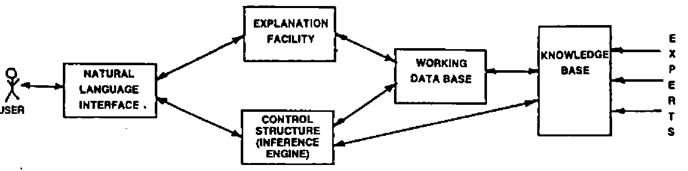
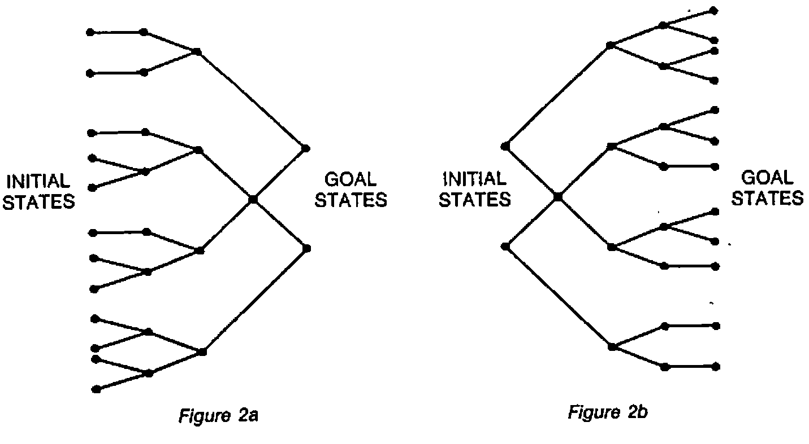

by M.J. Winfield
{ .byline }

## Introduction

Expert Systems were first devised in the mid 1960’s by the Artificial Intelligence (A.I.) community and may be considered as one of the areas of applied A.I. More specifically they are a sub-group of the more general class of Knowledge Based System (K.B.S.).

The use of these expert systems has opened up radically new application disciplines for using the computer. They are problem solving programs that solve problems generally considered to be difficult and requiring expertise, and that will operate at the expert’s level. Unfortunately many of the Expert Systems are very domain specific but this is likely to change over the coming years.

## What is an Expert System?

Before we can define what an Expert System is, we need to look at the broader set of K.B.S. A K.B.S. is a system which represents ‘knowledge’ in a formal scheme so that a computer can manipulate it to perform a task or tasks. An important point to note is that the ‘knowledge’ is a quite separate entity from either the program or any input data. The knowledge is symbolic data which is highly structured and is used to model the relationships between the data items and the way they can be used. There are many different data structures which are used for representing knowledge in a computer. The most common method in use at the moment is ‘Production Rules’, but more about knowledge representation later.

As we said earlier, Expert Systems are a sub-group of the more general class of K.B.S. This new technology is being used at the present time to construct fairly simple Human-Computer Systems which, none the less, work within a particular domain, at a level of competence comparable or better than a human expert. Considerable research is being undertaken to investigate methods and techniques for building more complex Human-Computer Systems.

Expert Systems are expected to behave as intelligent systems; that is they are said to perform reasoning by matching and manipulating symbols, grasp the fundamental principles of the application domain, solve problems which we consider to be complex and interact with the user in an intelligent way. It is now possible to look at a formal definition of an Expert System.

An Expert System is a computing system which uses knowledge of a problem domain in such a way as to enable it to perform as a skilful and cost-effective consultant and to produce, on demand, explanations of the reasoning processes it used.

## How Do We Recognise an Expert System from a Conventional Non-Expert One?

For a system to be considered expert it must perform a task which requires the knowledge and skill of an expert in order to perform it; for example to perform an analysis on the potential of a site for finding ore deposits requires the skill of an expert geologist whereas the solution of large matrices is mundane and can be performed by rote rather than needing expert knowledge. An Expert System should have a good user interface, allowing communication to be natural for the user. The format and language used should be one which the user is familiar with and happy to be using with the problem domain; this means that a full natural language interpreter will not be available, but communication will more likely take place via a problem domain oriented language. The system, on demand, should also be capable of giving explanations of the reasoning processes it used.

## Constituent Parts of an Expert System

Although all Expert Systems vary in the actual way thay are constructed, they all use a number of generic parts. The differences are really associated with the way the parts are built. The way the individual parts are linked together to form an Expert System is shown in Figure 1.



*Figure 1*

It is worth examining each of these parts separately in order to understand their function.

### Knowledge Base

This is where the domain specific knowledge is stored in symbolic form, according to some data structure. The knowledge takes the form of facts about the task domain and heuristics that guide the system in the use of the knowledge for solving problems within the domain. The knowledge base is built by using the knowledge gleaned from a domain expert. In most Expert Systems a uniform representation is used for the knowledge but it would appear that as the knowledge base becomes larger this may lead to a problem regarding efficiency. Consequently increasing attention is being given to the use of non-uniform representations for increasingly large knowledge bases.

### Working Data Base (Blackboard, STM)

Most problems cannot be solved in one step. Consequently the way an Expert System solves a particular problem is to break it down into a number of smaller problems. The important point to remember about an Expert System is that it does not have to be told the steps that the problem has to go through in order to solve it. The system will work out the sequence for itself. The working data base is used to hold the current status of the problem being solved. That is to say it should maintain a record of all the data items supplied by the user and those the system has inferred for itself. All Expert Systems use some type of intermediate decision representation although its actual structure will vary from system to system.

### The Inference Engine

The inference engine is an interpreter which has two very important features, a powerful pattern matcher and a control regime. The inference engine drives its way through the knowledge base until it finds a data structure which matches with the data in the working data base, i.e. matches with the current step in the problem situation. Once a match is found the data structure is fired or instantiated and used for drawing inferences for the next stage in the problem situation. The control regime determines how the interpreter looks for the data structures (i.e. a search problem), and how any fired data structures should be handled (i.e. irrevocably or tentatively). (See Ref 2 for a good exposition of control regimes.)

When an irrevocable control regime is used, the knowledge from the fired data structure is applied and once it has been applied there is no way of returning to the original state. This is not normally an acceptable situation and consequently it is usual for Expert Systems to use a tentative method. Such a scheme enables the data structure to fire, but if at a later date it is realised that the line of reasoning being pursued is false or not leading anywhere, then it is possible to revert to an earlier state by back-tracking up the solution tree.

The search problem is common to most A.I. programs, and is one which is well understood and documented. Search in Expert Systems is generally accomplished by using a depth first method with back-tracking around an AND/OR tree which is generated as the problem solution is developed.

If a rule based Expert System is used then it may run as a forward driven system, a backward driven system or a combination of both. A forward driven system means that the rules are fired by matching the attributes on the ‘situation’ or ‘IF’ side of the rule. (See Figure 2a). Once all of the attributes of a rule are satisfied, that rule will fire, and the ‘actions’ or ‘THEN’ side of the rule will be performed. However if a system is running as a backward driven one, then a hypothesis is put forward and a search is made of the ‘action’ side of the rules to find a rule(s) which matches the hypothesis (see Figure 2b). Any rules established as being candidates are looked at and an attempt is made to prove the hypothesis by satisfying the ‘situation’ side of the rule.



*Figure 2a, Figure 2b*

### Natural Language Interface

In order to allow the user and Expert System to communicate with each other an interface is needed. Although it would be nice to have a full-blown natural language interface this is not possible with the current state of the art. Communication generally takes place using a problem-oriented language, usually a restricted version of English. The interface should take care of parsing and interpreting users’ questions and commands, as well as formatting information generated by the system including explanations and answers to questions.

### Explanation Facility

The explanation facility is used to give, on demand, an explanation of the reasoning used by the system in solving a particular problem. This normally requires the sequence of knowledge items used to be recorded. In many current Expert Systems a tree structure is built as the problem solution unfolds, and this is then used during the explanation process. Because Expert Systems are working in complex domains it is important for them to possess an explanation capability, since it will:

- help the expert and knowledge engineer to refine and improve the system;
- give the user more confidence in the recommendations or problem solutions given by the system.

It is worth remembering that explanations given by most human experts are generally tailored to the level of their audience; that is, a much more simplistic view can be used for naive users than for expert users. To do this requires a level of intelligence far greater than that possessed by any current Expert System.

## Knowledge Representation

As we have already mentioned Expert Systems are very dependent upon the knowledge base if they are to operate at an expert level. Such systems, unlike conventional data base systems, require a knowledge base with divers kinds of knowledge. These include, but are certainly not limited to, knowledge about objects, processes and very hard to represent commonsense knowledge about goals and actions. How this knowledge is represented in a knowledge base is an important consideration for any Expert Systems builder. The three most popular methods used in Expert Systems are Production Rules, Logic and Frames. It is worth looking at each of these very briefly.

### Production Systems

The idea of a Production System as we know it today was proposed by A. Newell (9) as a model of human reasoning, although the original idea of production systems was first proposed in the 1940’s. The knowledge is represented as Production Rules which consist of two parts, a situation recognition part (i.e. a pattern) and an action part, see Figure 3 for an example of a rule from the Expert System XCON.

| SITUATION | ACTION |
|---|---|
| (List of things to look for - pattern) | (List of things to do) |

The rule will only fire, that is the actions will only be performed, when a complete match is found to all conditions on the situation side. The conditions are matched from the items of information held in the working data base. Once a rule has fired, the data base is updated and the cycle repeated until a goal is found.

```
VERIFY-SBI-AND-MB-DEVICE-ADEQUACY-3

IF:     THE MOST CURRENT ACTIVE CONTEXT IS VERIFYING SBI AND
        MASSBUS DEVICE ADEQUACY
AND     THERE ARE MORE THAN TWO MEMORY CONTROLLERS ON THE
        ORDER

THEN:   MARK THE EXTRA CONTROLLERS AS UNSUPPORTED (i.e. NOT TO
        BE CONFIGURED).
AND     MAKE A NOTE TO THE SALES PERSON THAT ONLY TWO MEMORY
        CONTROLLERS ARE PERMITTED PER SYSTEM
```

*Figure 3*

This method has proved a very natural way for both extracting and encoding knowledge in many Expert System applications.

### Logic Systems

First-order logic started to show its usefulness for representing knowledge in the 1960’s, as a result of research in mechanical theorem proving. Since then research has looked at logic formalisms with a view to putting them into a more conventionally oriented framework, particularly via PROLOG where all knowledge is reduced to a collection of Horn clauses.

### Frame Systems

Frames were first postulated by Minsky (10) as being a way of handling stereotyped situations. Much of their power relies on the inclusion of expectations and other kinds of prescriptions.

A frame represents an entity and contains a number of slots. Each slot will have a name and may be empty, contain things relevant to the frame entity, or specify a further frame (Figure 4). It is possible for slots to have default values which will automatically be used when the frame is instantiated, unless new items are known which fit the situations better, in which case the default values can be overridden.

Frames are commonly used in a number of applications like computer vision, natural language understanding and speech recognition.

They have also been used in Expert Systems, one in particular being NUDGE (11) which is used for scheduling events. This system takes incomplete requests for events to be scheduled and transforms them into more complete requests by filling in any missing information which humans often take for granted.

Although we have very briefly considered three methods of representing knowledge there are many more, some of which relate to the above methods, others which do not. Knowledge representation is an increasingly important part of A.I. and has a very active research community. For a good resume on knowledge representation, readers are referred to (12).

## Reasoning with Uncertainty

Under many circumstances the expert is expected to come to a decision or offer advice when the information about the problem situation is uncertain or incomplete. If experts are expected to work under these constraints then Expert Systems, working in similar situations, should also be expected to do so.

One of the earliest Expert Systems to perform reasoning with uncertainty was MYCIN, which was expected to represent judgmental reasoning of the type ‘A suggests B’ and ‘D and E tend to F’. Numbers, known as certainty factors, were used to indicate the strength of a rule. Using these certainty factors, MYCIN allows evidence confirming the hypothesis to be collected separately from that disconfirming the hypothesis. The ‘truth’ of a hypothesis, at any particular time is the algebraic sum of the evidence confirming it. When the premise of a rule is evaluated, each predicate returns a number in the range − 1 to 1. MYCIN works on the basis that an ‘AND’ performs minimisation while ‘OR’ performs maximisation of the arguments. Providing the result’s premise value is greater than an empirical value of 0.2, then the conclusion is presented with a certainty of:

> Premise value \* Certainty Factor (13)

Although the MYCIN certainty factors were derived from probabilities there are distinct differences. Some criticism has been levelled at the MYCIN method, arguing that it is an ad hoc approach and could have been replaced by a more thoroughly studied approach based upon Bayes Rule. Some Expert Systems, particularly PROSPECTOR, use Bayes Rule for calculating uncertainty. The major problem with this approach is the large amount of data needed to determine the conditional probabilities which are used in the formula. Often conditional independence is assumed, owing to the very large quantities of data needed for determining the independence. This has led to arguments that such assumptions on independence undermine the rigorous statistical model.

An approach which is being looked at in some detail is the idea of fuzzy logic as discussed by Zadeh (14) and others. Using fuzzy logic, a statement like ‘X is a tall building’ is interpreted as having an imprecise denotation which may be characterised by a fuzzy set. This is shown as:

| | |
|---|---|
| Fuzzy Proposition | ‘X is a tall building’. |
| Fuzzy set | (X (20,40), 0.1)<br>(X (40,100), 0.3)<br>({X > 100}, 0.7) |

Fuzzy logic details the laws of inference for fuzzy sets. We can expect to hear much more about fuzzy systems in the future.

## Knowledge Engineering

One of the major tasks in constructing an Expert System is the implementation of the knowledge base. It is now recognised that the power of an Expert System comes from the knowledge it has, not its inference engine. Therefore the collection of the knowledge and the structure of the knowledge base are very critical operations. The above tasks become the responsibility of the knowledge engineer (K.E.). He will normally collect the knowledge about a particular domain by interviewing one or more humans considered to be experts in their field, although other useful sources of knowledge may be books, journals, etc. The domain knowledge will include facts, beliefs and heuristics together with rules of inference which will guide the use of the knowledge. The need for heuristics is very important since the problems faced by an expert often do not have an easily formalised or algorithmic solution. The ideas which underlie an approach to expert problem solving are shown in Table 1.

```
KNOWLEDGE = FACTS + BELIEFS + HEURISTICS

EXPERT SYSTEM = (KNOWLEDGE + INFERENCE RULES). INFERENCE ENGINE
   SOLUTION

                                     + EXPLANATION
```

*Table 1*

Having collected the knowledge, the next task of the K.E. is to decide upon a suitable knowledge representation structure for the knowledge base. Once complete it is important and necessary to perform some testing, since a number of difficulties may arise in acquiring the knowledge for an Expert System . The main difficulties are the human ability to express knowledge, and the difference between the way the human expert states knowledge and the way it is represented in the knowledge base. Other difficulties include the limits of Expert Systems technology, the complexity of testing and refining Expert Systems, and the disagreements between experts (3).

As a rule of thumb the collection of 75% of the knowledge will generally be completed in about 25% of the time it takes to collect all of the knowledge, but it should be borne in mind that the collection process is very time consuming and tedious, especially for large problem domains. Methods and techniques for automating the collection process would prove very useful, and considerable research is being pursued in this direction. Although some techniques and tools have been developed, it must be said that any significant progress will be a major advance in A.I. The need for good knowledge engineering cannot be stressed too strongly. Unfortunately the number of good, experienced, knowledge engineers is very limited, although growing all the time. This state of affairs does place a major constraint on the exploitation of Expert Systems.

## Suitability of a Task for Use in an Expert System

A number of principles may be considered when deciding the suitability of a task for use with an Expert System. In many cases the principles are very similar to those which would be used by a designer when building traditional type software. The important principles are outlined below:

### Select a Task which a Human Expert would not consider to be Trivial nor too Difficult

The problem is how do we define trivial or too difficult? It has been suggested that, using current techniques, trivial may be solved within minutes and too difficult would take months. This may mean that it would not be realistic to look at a complete domain, but rather look at a specific group of tasks within a particular domain.

### Obtain the Help of a Human Expert who is Committed

Unless the knowledge engineer has a committed expert on whom he can rely and use regularly there is very little chance of success. Without an expert there is unlikely to be any way of obtaining sufficient knowledge required for a task. Without a strong commitment from an expert it will become very difficult to obtain the depth of knowledge and heuristics required to build an acceptable Expert System.

### The Task Must be Defined Clearly

It is necessary to be able to specify the inputs and outputs with some precision. The expert should be in a position to outline the important concepts and relations, and the knowledge engineer should have access to a number of examples of problems and solutions.

### Beware of Tasks Which Involve a Lot of Commonsense Knowledge

Commonsense reasoning is not easy to handle in present day systems. Attempting to build an Expert System which has expertise of several domains and is expected to use commonsense knowledge to go between them is difficult, mainly due to different paradigms and formalisms being involved.

In addition to the above principles it is also recommended that the following items of advice should be considered.

### Have a Familiarity with a Number of Expert Systems

This will enable the knowledge engineer to be in a position to try and match the task to an appropriate architecture. Using an inappropriate architecture may make it more difficult to actually build the system, and may lead to efficiency problems at a later stage.

### Final Acceptance May be Very Dependent Upon the User Interface

Any interface which is difficult to use or does not give explanations in a user desired format (structure and wording) is likely to make the use of the Expert System undesirable.

## Uses of Expert Systems

Early Expert Systems were confined to academic research departments, and it is only since 1980 that Expert Systems have been used commercially. The first Expert System was DENDRAL (4) which works in the field of chemistry and is still used extensively. DENDRAL applies the rules of spectroscopy to spectrographs in an attempt to identify organic compounds. The rules are applied in much the same way that a human would apply them. Probably the best known Expert System is MYCIN (400 rules) which was developed at Stanford University by Shortliffe (15). It works in the field of medicine and in particular the area of diagnosis and treatment of meningitis. Several other early systems have been developed in the domains of chemistry and medicine.

Since 1980 the application areas have broadened. Two currently very important Expert Systems are PROSPECTOR and XCON (800 rules approx.). PROSPECTOR works in the domain of geology and is considered to be a specialist geologist in the identification and evaluation of mineral sites. Two important features of PROSPECTOR are the KAS knowledge acquisition system and its use of probabilistic reasoning under uncertainty.

DEC, the computer manufacturer, now use an Expert System called XCON. Their customer order department use XCON for checking VAX-II configurations. There are so many options available for configuring VAX-II systems that almost every one is unique. Prior to XCON being implemented it took approximately 2 man-days to check each configuration. The type of checking which has to be performed includes:

- checking power supplies are adequate;
- ensuring equipment will fit into racks;
- working out cable runs etc.

The same work is now carried out by XCON in about 7 minutes and DEC have admitted they are now dependent upon XCON.

A number of generic categories of knowledge engineering applications have been identified by Hayes-Roth, Waterman and Lenat (6) which are shown in Table 2.

| *Category* | *Problem Addressed* |
|---|---|
| Interpretation | Inferring situation descriptions from sensor data |
| Prediction | Inferring likely consequences of given situations |
| Diagnosis | Inferring system malfunctions from observations |
| Design | Configuring objects under constraints |
| Planning | Designing Actions |
| Monitoring | Comparing observations to plan vulnerabilities |
| Debugging | Prescribing remedies to malfunctions |
| Repair | Exercising a plan to administer a prescribed remedy |
| Instruction | Diagnosing, debugging and repairing student behaviour |
| Control | Interpreting, predicting, repairing, and monitoring system behaviour |

*Table 2*

## What Does the Future Hold and Do We Need Expert Systems?

Expert Systems offer potentially significant increases in the development of user friendly computer systems. They are capable of explaining their actions to naive computer users, have the ability to learn from themselves or from teachers and generally to act more ‘intelligently’ than current systems.

With the current level of research being attached to 5th generation computers, which is all geared towards computers working as Expert Systems from the hardware, it becomes even more important to give Expert Systems some careful consideration. The plans of the Japanese 5th Generation Project indicate that the capabilities of these systems will be very impressive, particularly in understanding natural language and speech, and for being capable of performing new tasks either from plans generated by themselves or by being taught. The predictions are that these computers will be cheap and therefore available in large numbers. There is currently some debate taking place as to whether the Japanese will accomplish all of their aims set out at the beginning of the project. However, they have made sufficient progress to change the style of computing in the 90’s from what we know it to be today.

Feigenbaum and McCormick in their book ‘The Fifth Generation’ (7) make a point which is worth noting: ‘We do not know whether, even given the same heuristics that humans use, a system that can think faster and deeper will necessarily think down the same avenues that humans do. If it should go elsewhere, we do not know what lies at the end of such different avenues.’

What is also unknown is whether a machine can discover new knowledge, although the indications in this area are very favourable, particularly work being being done by Doug Lenat at Stanford (8). Again where this will lead is uncertain.

A number of important points make an Expert System potentially useful, including:

- Unlike a human who is mortal, an Expert System never dies, retires or leaves the company;
- The knowledge base may be expanded infinitely (theoretically, e.g. XCON now has 2,500 rules);
- Knowledge can be changed and updated regularly;
- An Expert System should be capable of explaining how it obtained a result - a human cannot always do this.

Consequently if you have any long term development plans for systems which are likely to be running in the late 80’s and 90’s, then you should be investigating Expert Systems.

## References and Suggested Further Reading

| | | |
|---|---|---|
| 1 | BRAMER, M.A., 1983 | ‘A Survey and Critical Review of Expert Systems Research’, in Introductory Readings in Expert Systems. D. MICHIE (Ed). Gordon & Breach. |
| 2 | NILSSON, N.J., 1982 | Principles of Artificial Intelligence. Springer-Verlag. |
| 3 | BUCHANAN, B.G. et al 1983 | ‘Constructing an Expert System’, in Building Expert Systems, Hayes-Roth et al (Eds). Addison-Wesley |
| 4 | BUCHANAN, B.G. & FEIGENBAUM, E.A., 1978 | DENDRAL and META-DENDRAL: Their applications dimension. Artificial Intelligence 11, pp 5-24 |
| 5 | SHORTLIFFE, E.H., 1976 | Computer-based medical consultation: MYCIN. New York: American Elsevier |
| 6 | HAYES-ROTH, F. et al, 1983 | ‘An Overview of Expert Systems’, in Building Expert Systems, Hayes-Roth, et al (Eds). Adison-Wesley |
| 7 | FEIGENBAUM, E.A. & McCORMICK, P., 1984 | The Fifth Generation. Michael Joseph, London |
| 8 | LENAT, D.B., 1982 | The Nature of Heuristics. Artificial Intelligence 19, pp 189-249 |
| 9 | NEWELL, A., 1973 | ‘Production Systems: Models of Control Structures’, Visual Information Processing, Chase W.G. (Ed) Academic Press, New York. |
| 10 | MINSKY, M., 1975 | A Framework for Representative Knowledge. The Psychology of Computer Vision |
| 11 | GOLDSTEIN, I.P., and ROBERT, B., 1979 | Using Frames in Scheduling, Artificial Intelligence: An MIT perspective 1, Winston & Brown (Eds), MIT Press |
| 12 | McCALLA, G. and CERCONE, N., 1983 | Knowledge Representation. Computer, IEEE, October 1983. |
| 13 | SHORTLIFFE, E.H. and BUCHANAN, B.G., 1975 | A Model of Inexact Reasoning in Medicine. Mathematical Bioscience 23, pp 351-379. |
| 14 | ZADEH, L.A., 1979 | A Theory of Approximate Reasoning. In Machine Intelligence, Vol. 9, J.E. Haynes et al. (Eds) John Wiley & Sons. |

*M.J. Winfield, City of Birmingham Polytechnic Computer Centre*
