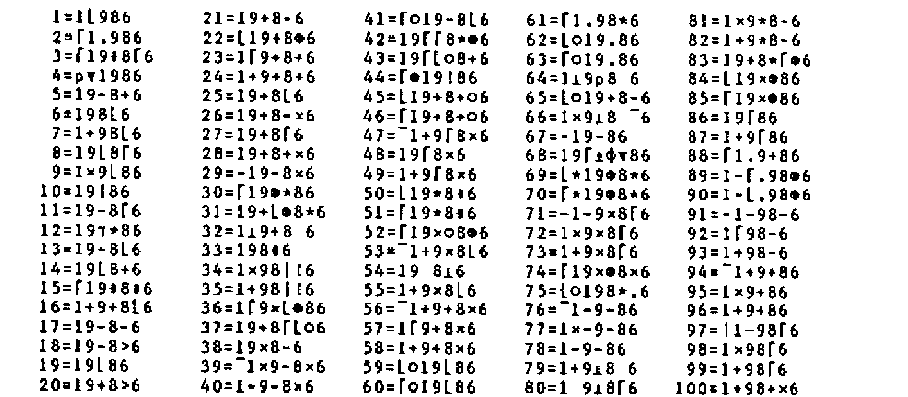
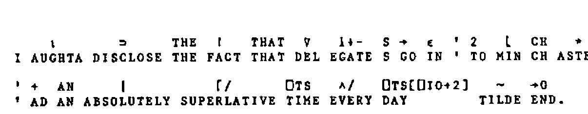

by Dave Ziemann
{ .byline }

APL86 was specied by a number of puzzles and competitions the winners of which received prizes kindly donated by the Sustaining Members of the BAA. For those of you not fortunate enough to attend the conference, these pages constitute a round-up of the competitions, their results and their winners.

## APL86 Competition: Identify the Photographs

A montage of sixteen photographs taken at the last five APL conferences was posted on the notice board for delegates to identify. Space prohibits their reproduction here, but suffice it to say that were quite difficult – only two people correctly identified all sixteen photos; Gerard Langlet and Ludmila Lemagnen, both from France.

## APL86 Competition: What is APL?

Competitors were asked to supply five alternative and original acronyms to those familiar three letters ‘APL’. Among the individual entries that amused the judging panel most were:

| | |
| --- | --- |
| Aristoteles Programmed Less | Rudolf Freihalter |
| Another Performance Lag | David Laur |
| A Perverse Love | Michael Rys |
| Above Prior Limits | Kim Andreasen |
| APL Provides Liberty (recursive!) | Kim Andreasen |
| Alters Programmer’s Life | Banek Traude |
| Assistance Provided Later | Banek Traude |
| A People’s Language | Frederick Macaskill |
| Artistic People’s Lingo | Chester Holmes |
| A Pub Lunch | Chester Holmes |
| Avoids Professional Lunacy | Andre Bairamjan |
| Advocates People Laziness | Andre Bairamjan |
| All Purpose Laboratory | Howard Peelle |
| A Political Liability | Howard Peelle |

Most poignant, that last one. The rules did not insist on the English language, and so we have:

| | |
| --- | --- |
| Amere Pilule Laxative | Gerard Langlet (French for ‘Bitter Laxative Pill’) |
| A Prower Lie | Kim Andreasen (Danish dialect for ‘I’ll Just Try’) |
| A Processer Langsomt | Kim Andreasen (Danish dialect for ‘I Process Slowly’) |
| Amicitia Patria Lex | Rudolf Freihalter (Latin for ??????????????????????) |

Denis Samson felt that ‘APL’ are the initials of the unknown muse and inspiration of APL: Alice Pleasance Liddel.

Charles Winton produced the following five entries:

| | | |
| --- | --- | --- |
| Allows | Programmers | Leisure |
| Arrays | Plus | Lovers |
| Absolutely | Precision | Like |
| Always | Practically | Learned |
| Almost | Perfect | Language |

which have the amazing property of reading down the columns as well as across the rows!

There were many clever individual entries, but the two winners were selected on the strength of all five of their expansions. Yap Chua came second with:

> All Purpose Language  
> Amazingly Practical Language  
> Accurate, Precise, Logical  
> Almost Perfect Language  
> A Pun-y Language

First prize went to Les Hollingbery who gave us the following five consistently excellent expansions for ‘APL’:

> Acronyms Puzzle Learners  
> All Pervading Language  
> Always Pressing Limits  
> Always Proceed Leftwards  
> Any Problems Left?

## APL86 Competition: Test Your Mental Flexibility

*Delegates were asked to determine what the initial letters stand for in the following set of phrases, where each phrase is associated with a whole number. The phrases are:*

1. 26 = L of the A
2. 7 = W of the A W
3. 1001 = A N
4. 12 = S of the Z
5. 54 = C in a D (with the J)
6. 9 = P in the S S
7. 88 = P K
8. 13 = S on the A F
9. 32 = D F at which W F
10. 18 = H on a G C
11. 90 = D in a R A
12. 200 = P for P G in M
13. 8 = S on a S S
14. 3 = B M (S H T R)
15. 4 = Q in a C
16. 24 = H in a D
17. 1 = W on a U
18. 5 = D in a Z C
19. 57 = H V
20. 1000 = W that a P P
21. 11 = P in a F T
22. 29 = D in F in a L Y
23. 64 = S on a C
24. 40 = D and N of the G F
25. 40 = W
26. 26 = Q in this C

For example, 16 = O in a P would be 16 = Ounces in a Pound. In case you would like to try it yourself, the answers are printed later in this issue. The prize winners at APL86 were Andre Bairamjan, Paul Chapman and Fergal Golding.

## APL86 Competition: Matrix Rotation

Consider a matrix as composed of concentric rectangle-shaped layers. The problem was to write a dyadic function \<MATROT\> which rotates each layer a given number of positions about an axis perpendicular to the plane of the matrix and centred at the centre of the matrix. For example:

```apl
      M
 1  2  3  4
 5  6  7  8
 9 10 11 12
13 14 15 16
      3 MATROT M
 4  8 12 16
 3 10  6 15
 2 11  7 14
 1  5  9 13
```

A positive left argument causes rotation in an anti-clockwise direction. Solutions were judged on their clarity, robustness and generality.

Each entry was classified into one of three types; there were 9 recursive solutions, 4 looping entries and 3 ‘direct’ answers (no recursion or looping). Robustness and generality were tested by executing each function with prepared sets of arguments and ensuring that no errors occurred and that the result in each case was correct. The tests applied were:

1. Non-square matrix
2. Matrix with one row and one column
3. Character matrix
4. Empty matrix
5. Index origin independence
6. Zero left argument
7. Negative left argument
8. Vector left argument

Number 8 was a test for generality – did the function use successive elements of a vector left argument to rotate successively deeper layers of the matrix? This test was created in case a tie-break was needed. In the event two function passed the first seven tests, and only one passed all eight. The tests which defeated most entries were numbers 1 and 5. Only four solutions were independent of the global index-origin.

The recursive solution was probably best expressed by Kim Andreasen who took second prize. Kim’s entry passed the first seven tests and was a model of well-commdened clarity, incorporating excellent error-checking. Here it is:

```apl
    ∇ Z←N MATROT2 M;R;C;I;⎕IO
[1]   ⍝ APL86 'MATROT' competition entry from Kim S. Andreasen, Denmark.
[2]   ⍝ Uses recursive technique to rotate matrix 'M' 'N' positions.
[3]   ⍝ Works with any size of 'M' and independent of global ⎕IO.
[4]   ⍝ 1. Errormsg. if 'M' is not matrix or if 'N' is not an integer singleton
[5]   ⍝ 2. Returns 'M' unchanged if 0∊⍴M
[6]   ⍝ 3. If only one row in 'M', rotates it leftwards if 'N' is positive.
[7]   ⍝ 4. If only one column in 'M', rotates it downwards if 'N' is positive.
[8]   ⍝ 5. If at least 2 rows and 2 columns in 'M': Rotates the outer layer and
[9]   ⍝    exit if 'M' has no inner layers (2=⌈/⍴M). Otherwise, fills the inner
[10]  ⍝    matrix with the result of 'MATROT' applied to that inner matrix.
[11]   Z←M ⋄ ⎕IO←1 ⋄ R←1↑⍴M ⋄ C←1↓⍴M
[12]  ⍝ Error checking as described above:
[13]   →(0≠1↑0⍴N)⍴ERR1
[14]   →((1≠⍴,N)∨0≠1|''⍴N)⍴ERR1
[15]   →(2≠⍴⍴M)⍴ERR2
[16]  ⍝ Nothing to do if 'M' is empty:
[17]   →(0∊⍴M)⍴0
[18]   N←''⍴N
[19]  ⍝ Special case if 'M' has a dimension of 1:
[20]   →(1∊⍴M)⍴L1
[21]   Z←,M
[22]  ⍝ Find index in ravelled 'M' of the outer layer:
[23]   I←(⍳C),(C+C×⍳R-2),(⌽(C×R-1)+⍳C),⌽1+C×⍳R-2
[24]  ⍝ Do the rotate and reshape:
[25]   Z[I]←N⌽Z[I] ⋄ Z←(⍴M)⍴Z
[26]  ⍝ Finish if no inner layers:
[27]   →(2=⌈/⍴M)⍴0
[28]  ⍝ Do the same with the inner layers:
[29]   Z[1+⍳R-2;1+⍳C-2]←N MATROT2 M[1+⍳R-2;1+⍳C-2]
[30]   →0
[31]  ⍝ Special case of one row or one column:
[32]  L1:Z←(⍴M)⍴(N××C-R)⌽,M
[33]   →0
[34]  ⍝ Error handling:
[35]  ERR1:→0,⍴⎕←'>> ERROR: ERROR IN COUNT ARGUMENT'
[36]  ERR2:'>> ERROR: NOT A MATRIX ARGUMENT'
    ∇
```

The competition winner was Morten Kromberg from Denmark, whose entry passed all eight tests and used no recursion, looping or even branching. Morten’s function included a comment that directed the reader to a one-page explanation of how the function works. Here is the function, followed by Morten’s description:

```apl
    ∇ R←FACTORS MATROT1 MATRIX;⎕IO;SHAPE;N;DIM;REP;LENGTHS;INDICES;PIOTA;OFFSET
[1]   ⍝ MORTEN KROMBERG. SEE  DESCRIBE  FOR COMMENTS
[2]    ⎕IO←1
[3]    N←⌈0.5×⌊/SHAPE←¯2↑ 1 1 ,⍴MATRIX
[4]    DIM←(¯2ׯ1+⍳N)∘.+⌽SHAPE
[5]    REP←(DIM,DIM)-(1 2 ×⍴DIM)⍴ 0 1 1 2
[6]    LENGTHS←+/REP←REP×∧\REP>0
[7]   ⍝
[8]    INDICES←+\(,REP)/(×/⍴REP)⍴ 1 ¯1 ∘.×1,1↓SHAPE
[9]    PIOTA←(⍳⍴INDICES)-OFFSET←LENGTHS/+\¯1↓1,LENGTHS
[10]   PIOTA←OFFSET+(LENGTHS/LENGTHS)|PIOTA+LENGTHS/N⍴FACTORS
[11]  ⍝
[12]   R←,MATRIX
[13]   R[INDICES]←R[INDICES[PIOTA]]
[14]   R←(⍴MATRIX)⍴R
    ∇
```

The function takes a matrix and rotates the concentric layers according to the left argument, which may have one or more elements. (They are repeated as many times as necessary). For example:

```apl
      1 ¯1 MATROT1 3 5⍴⍳15
2  3  4  5 10
1  9  7  8 15
6 11 12 13 14
```

If the innermost layer has only one row or column (as in the example above), it is reversed along the last or first axis respectively. The function will also handle vectors and even scalars, treating them in the same manner.

The principle is to generate the indices of a spiral which starts at the top left, and spirals through all the layers. Once this is done, a partitioned rotation is done on the elements corresponding to each layer. Finally, the elements are put back into their new positions.

The algorithm used to generate the spiral works because one can calculate the indices of a layer with a sum scan of the differences between the indices of each element and the next. To go round the outermost (r by c) layer, one must step:

| | | | |
| --- | --- | --- | --- |
| 1. | r | times to the right | (index increases by 1) |
| 2. | c-1 | times down | (index increases by c) |
| 3. | r-1 | times to the left | (index decreases by 1) |
| 4. | c-2 | times up | (index decreases by c) |

This steeping calculation is repeated for all the layers. This is what happens in the function:

Line Comment

3
:   N is the number of layers, SHAPE is corrected in case the argument rank is less then 2.

4
:   DIM is now the shapes of each of the layers, each one 2 rows and 2 columns smaller than the previous one.

5
:   REP is the number of repetitions of the four steps described above, one row per layer of the matrix.

6
:   REP must be adjusted for layers with only one row or column, to avoid negative steps and other nasties.

8
:   We do the replication and sum scan, and get our spiral.

9
:   PIOTA is a partitioned iota, going from 0 to LENGTH[I] for each layer.

10
:   We do a partitioned rotation, by adding the rotational factors, and wrapping around by taking the RESIDUE with the numbers of elements in each layer (LENGTHS). Then add the offset for each layer.

12
:   Ready to go – prepare a result with enough elements.

13
:   Move each element into its new position.

14
:   Restore original shape.

## APL86 Competition Result: Test Your Mental Flexibility

The answers to the questions are:

1. 26 = Letters of the Alphabet
2. 7 = Wonders of the Ancient World
3. 1001 = Arabian Nights
4. 12 = Signs of the Zodiac
5. 54 = Cards in a Deck (with the Jokers)
6. 9 = Planets in the Solar System
7. 88 = Piano Keys
8. 13 = Stripes on the American Flag
9. 32 = Degrees Fahrenheit at which Water Freezes
10. 18 = Holes on a Golf Course
11. 90 = Degrees in a Right Angle
12. 200 = Pounds for Passing Go in Monopoly
13. 8 = Sides on a Stop Sign
14. 3 = Blind Mice (See How They Run)
15. 4 = Quadrants in a Circle
16. 24 = Hours in a Day
17. 1 = Wheel on a Unicycle
18. 5 = Digits in a Zip Code
19. 57 = Heinz Varieties
20. 1000 = Words that a Picture Paints
21. 11 = Players in a Football Team
22. 29 = Days in February in a Leap Year
23. 64 = Squares on a Chessboard
24. 40 = Days and Nights of the Great Flood
25. 40 = Winks
26. 26 = Questions in this Competition

Apologies to those not familiar with Stop Signs, Zip Codes or Heinz Varieties.

## APL86 Competition: Where am I Running?

Competitors were asked to produce an APL function \<WHEREAMI\> that returns a number indicating the APL system upon which it is run. The following table of interpreters and corresponding numbers was given:

> 10 – VS APL  
> 20 – APL2  
> 30 – APL\*PLUS PC  
> 40 – APL\*PLUS mainframe  
> 50 – Sharp APL  
> 60 – Dyalog APL  
> 70 – APL.68000

We expected this to be quite tough, and indeed no-one supplied a complete solution. Claude Henriod of Switzerland came closest with this partial solution:

```apl
    ∇ WAI←WHEREAMI;DT;DELTA;OVER;MINIM;BITS;INTG2;INTG4;⎕PP;⎕IO
[1]   ⍝ APL86 competition, by Claude Henriod
[2]   ⍝
[3]   ⍝ Not all the systems will be avialable at the conference, so
[4]   ⍝ I present a generalised approach which must be completed
[5]   ⍝ and/or simplified.
[6]    ⎕PP←4+⎕IO←0
[7]    WAI←'NB←DT NR    NR←32⍴NR    NB←⎕WA-12   NR←NR,NR     '
[8]    WAI←⎕FX 6 11 ⍴WAI,'NB←NB-⎕WA   NB←1⌈⌈NB÷32'
[9]    DELTA←⎕AV[91 187 145 . 112 64 123]='∆'
[10]   OVER←⎕AV[190 239 244 . 77 205 25]='⍕'
[11]  ⍝ ⍕ can be replaced by another overstruck character
[12]   MINIM←(, 2 10 ⍴'¯7.237E75 '),'¯1.798E308           ¯7.237E75 '
[13]   MINIM← 7 10 ⍴MINIM,'¯1.798E308¯3.595E308'
[14]   MINIM←MINIM∧.=10↑⍕⌊/⍳0
[15]   BITS← 1 1 2 . 1 1 1 =DT 1
[16]   INTG2← 4 4 2 . 4 2 4 =DT 30000
[17]   INTG4← 4 4 8 . 4 4 4 =DT 60000
[18]   WAI←(DELTA∧OVER∧MINIM∧BITS∧INTG2∧INTG4)/10×1+⍳7
    ∇
```

The dots on lines 9, 10, 15, 16 and 17 represent missing values corresponding to the APL\* PLUS mainframe APL, and would need to be replaced by the appropriate values for the function to work.

The principle of the function is to create a binary matrix where each column corresponds to one interpreter and each row is a specific test, such that on any given system only one column will be all ones.

The first part of Claude’s solution checks the position in the atomic vector of the ‘delta’ and ‘format’ characters. The second part checks the lowest representable number. Note that the character form of this number is tested so that the number -3.595E308 does not blow systems that cannot represent it. (This may in fact be more of a test of the host machine than the interpreter itself . . . ). The third part of the function analyses the word-length used for booleans, small integers and large integers. \<DT\> is an inner subfunction that attempts to determine the storage required for each element of its argument.

Interestingly, Claude’s function appears to be ISO standard conforming. Can anyone complete or improve upon \<WHEREAMI\>?

## APL86 Competition: APL86 Yeargame

Although this is an old favourite it nevertheless atrracted many entries. The idea is to use the digits 1,9,8 and 6 to create as many of the whole numbers from 1 to 100 as possible. The digits must be used once only and in the correct order. No other constants may be used, but any APL primitives can be included. For example, the number 21 can be formed most succinctly by the expression 19-8-6, which is a 6 character solution.



If expression 12 really does produce a result of 12, it is a spurious answer given by the particular APL interpreter used, and not a mathematically correct expression. Therefore it should probably be replaced by a more suitable expression, eg 1+9+8-6. Expression 4 is also out on a limb, in that it returns a one-element vector result rather than a scalar.

The behaviour of some of the less often used primitives can be clarified by studying this table. For example, note numbers 32, 34, 44, 54, 64, 66, 68 and 80.

Any improvements on this answer will of course be received with interest and published.

## APL86 Competition: An APL Story

This one proved a welcome break from the rigours of matrix rotation and the 1986 yeargame. Write a story in ‘APLese’ was the simple instruction. For example:


Which translates to: ‘Once upon a time Mork and Mindy decided to go rowing.’ Phil Last came second with the following groan-inducing sentence:



The labours of Mark Wolfson and Eileen Keating proved unbeatable however. They produced a complete APLese story – with a title, beginning, middle and of course a happy ending. Here it is:

![“The ρρ of ⌊chest∨ / The rose of Manchester”, by Mark Wolfson and Eileen Keating: an APLese story, each line with its English translation beneath: “Without style or one iota of effort, he picked the roses and handed them to her. She took out the first rose, wheeled and said: I’m delighted – but you just do not make the grade. I’ve a match already – Max. You are powerless over me! Oh my God he exclaimed. He took the box and closed it. A love divided is nothing. Now our union is reduced to a minute shape. I remember when it was wunderbar (for he was German). Tomorrow I will drown my sorrows. Each time you see a rose remember me and dash to Dallas in ’87.”](art10011070/story-rose-of-manchester.png)

## APL86 Competition: Defined Operators

Dyadic Systems ran a competition for the best user-defined operator to be entered onto Dyalog APL on their stand. The first prize was one hundred pounds in cash or an evening out with John Scholes, the implementor of Dyalog APL. (There were some nasty rumours going around that the second prize was one hundred pounds in cash *and* an evening out with John Scholes, but this proved to be unfounded).

Anyway, the winner was Ray Cannon who supplied the operator \<DUAL\>, possibly as a nod in the direction of Ken Iverson’s Core APL:

```apl
    ∇ R←{A}(F DUAL G)B;⎕IO
[1]   ⍝ OPERATOR DUAL
[2]    →MON×⍳0=⎕NC 'A' ⍝ IF CALLED MONADICALLY
[3]    R←G INV(G A)F G B
[4]    →END
[5]   MON:
[6]    R←G INV F G B
[7]   END:
    ∇

    ∇ R←{A}(F INV)B;⎕IO;FN;IFN
[1]   ⍝ OPERATOR INVERSE
[2]   ⍝ PERFORMS THE INVERSE OF FUNCTION F ON ARGS A AND B
[3]   ⍝ EG  6 ×INV 3  IS THE SAME AS  6 ÷ 3
[4]    ⎕IO←1
[5]    FN←'+×∨∧<≤=⌈⍕⊂⍟↑'
[6]    IFN←'-÷⍱⍲≥>≠⌊⍎⊃*↓'
[7]    →ERR×⍳~(⎕CR 'F')∊FN,IFN
[8]    R←(FN,IFN)⍳,⎕CR 'F'
[9]    →MON×⍳0=⎕NC 'A' ⍝ IF CALLED MONADICALLY
[10]   R←⍎'A',(IFN,FN)[R],'B'
[11]   →END
[12]  MON:
[13]   R←⍎(IFN,FN)[R],' B'
[14]   →END
[15]  ERR:'SORRY INVERSE NOT KNOWN'
[16]   →
[17]  END:
    ∇
```

As you can see from the example, the operator applies its right operand to each argument, applies its left operand between these results, and then applies the inverse of the right operand to produce the answer. The inverse is produced, where possible, by the associated operator \<INV\>.

An arguably less useful contribution was the \<PERHAPS\> operator, which may or may not apply its function operand, according to whim:

```apl
    ∇ R←(F PERHAPS)B
[1]   ⍎(2|?2)/'R←F B'
    ∇
```

## APL86 Competition: Win an ATARI 520 STM with APL.68000

The grand prize of APL86 was undoubtedly microAPL’s Atari computer with APL.68000 bundled in. Contestants were asked to rank ten features of an APL system according to importance, and to complete a tie-break slogan, before stuffing their entries into the bulging box on MicroAPL’s stand. The lucky winner was Jonny Osterman, who can be seen receiving his prize in the photographic review section in this issue.
