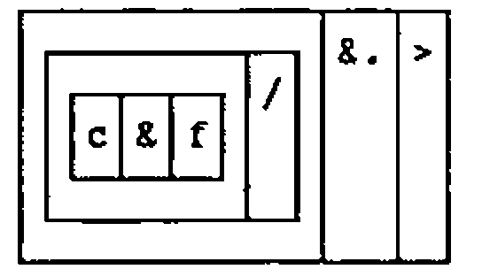
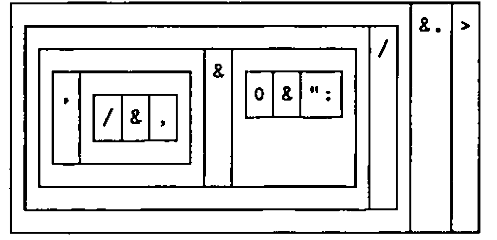
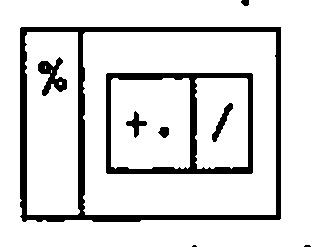

*by Dave Ziemann*
{ .byline }

## Introduction

This idea was conceived when I started to learn Smalltalk/V Windows, the object-oriented programming language and environment. I wanted to find a small programming problem that I could use as a learning exercise. It had to be something well-defined, and preferably without any complicated inputs or outputs (I didn’t want to get embroiled in user-interfaces quite this early), just something pure and algorithmic. I was also looking for a problem that would suggest the use of a distinctive feature of the language.

For some reason, I think someone was talking about them in the office, Hilbert Matrices sprung to my mind. I’m no mathematician, but I remembered that they were something to do with fractions, and that there are people who think that they are very useful. A Hilbert Matrix is a symmetrical matrix of fractions, each with a unit numerator. An order three Hilbert Matrix looks like this:

```text
1/1  1/2  1/3
1/2  1/3  1/4
1/3  1/4  1/5
```

My problem would be to write a Smalltalk program to find the determinant of a Hilbert Matrix.

After solving this problem, which did help me to start learning Smalltalk, I wondered how easy it would be to do the same thing in APL. After I’d coded the problem in APL\*PLUS II, my favourite symbolic dialect of that particular language, a further thought arose. Surely this problem could also be expressed very naturally in J, Ken Iverson’s ASCII based rationalisation and extension of APL.

This article documents a solution of the Hilbert Matrix problem in those three languages, and makes some comparative observations. In each case the code is written in a manner appropriate to the particular language and environment being used.

The text of this article is written in a tutorial style for the benefit of those who are not familiar with Smalltalk or J.

## The Smalltalk Program

It would have been possible to program a quick-and-dirty solution, just to get the job done, but I wanted a solution that would do reasonable justice to the object-oriented paradigm in general, and the Smalltalk/V Windows class hierarchy in particular. Furthermore, I resolved to find out about inheritance, polymorphism and encapsulation.

Let us look at a few examples of Smalltalk syntax:

```text
42 sign
2 + 3
2 raisedToInteger: 3
chars at: 3 put: 'a'
```

In the first example we say that the "message" "sign" is sent to the number 42, the "receiver" of the message. The result will be 1 because 42 is positive. In the second example we would say that the message "+" is sent to the number 2, with an argument of 3. The result, or as they say in Smalltalk, the "answer", is 5. The third example shows a "keyword" message, which always contains a colon. Again the argument is 3 and the "receiver" of the message is 2. In the last example a keyword message is sent to a named object. This time the message is the `at:put:` message, which takes two arguments, one per colon. Any number of arguments can be passed into an appropriately named keyword message.

The three possible message types are known as unary, binary and keyword messages. Smalltalk expressions are executed left to right, but with unary messages taking precedence over binary, which in turn take precedence over keyword messages.

Smalltalk code is partitioned into "classes" which are distributed within a hierarchical structure, a small part of which follows:

```text
Object
 Magnitude
  Character
  Date
  Number
   Float
   Fraction
   Integer
    LargeNegativeInteger
    LargePositiveInteger
    SmallInteger
```

Smalltalk provides a Fraction class, which directly supports operations on fractions, such as 3/4, which are represented as pairs of integers.

A class is a template for creating objects, and each object is an instance of a class. The class "Object" sits at the top of the Smalltalk class hierarchy — all other classes being subordinate to it. As an example, we can say that the number 42 is an "instance" of the class SmallInteger, which is a subclass of Integer, which in turn is a subclass of Number, and so on.

A class whose name appears indented is a subclass of a less indented class higher up in the list. Each class in the hierarchy has a private collection of functions, or "methods" as they are called in Smalltalk. When a message is sent to an object the code that is executed depends upon the class of the object.

So when we sent the message "+" to the object 2, which is a SmallInteger, the system looked for a method called + in the SmallInteger class. In fact there is no such method in this class, so Smalltalk searches up the class hierarchy until it finds one. If it doesn’t find one, then an error occurs. In our example a + method is found in the Integer class, and it is this code which is executed when the statement 2+3 is evaluated.

In effect, the subclass inherits all of the methods in its superclass. This is an example of what is meant by inheritance. It is also possible to shadow a superclass method by redefining the method in a subclass. An example of this can be seen in the Fraction class, a subclass of Number, which has its own definition of the + method. This is a very powerful idea. It means that objects of different class can respond to the same message in different ways. This behaviour is known as polymorphism.

In Smalltalk, integer arithmetic is performed to arbitrary precision, so for example, a one-hundred digit number formed by successive multiplications is represented exactly. This precision is automatically extended to fractions, because the methods used in the class Fraction are themselves defined using integer arithmetic.

The Fraction class supports exact fractional arithmetic using a similar set of messages to that used by the Number class. Consider the following two statements:

```text
        2 + 3
5
        1/3 + (1/6)
1/2
```

In the first case the + message is sent to the SmallInteger 2 so the + method in class Integer is executed, performing a simple integer addition. In the second example the + message is sent to 1/3, an instance of class Fraction. The Fraction class has its own definition of the + method, which knows how to add fractions. In a similar way the other common numerical operations have been subclassed in Fraction.

Smalltalk’s direct support for the Fraction class will prove useful for the Hilbert Matrix problem. All we need to do is to create a matrix of Fractions. Well almost, except that Smalltalk doesn’t know what a matrix is. So we need to tell it.

Let’s look at another part of the class hierarchy:

```text
Object
 Collection
  Bag
  IndexedCollection
   FixedSizeCollection
    Array
    String
   OrderedCollection
```

An Array is a kind of FixedSizeCollection which is a kind of Collection, which in turn is a kind of Object, as everything eventually is in Smalltalk. Instances of the Array class therefore inherit the properties and methods of its superclasses. Thus a Smalltalk array is a fixed length, one-dimensional structure that can contain other Smalltalk objects.

Many of the methods in the superclasses of Array will be useful to us, but the Array class as it stands is not convenient for our purpose. Rather than attempt to modify the Array methods to meet our needs, we will add a new subclass to Array. In fact we will add three new classes to Smalltalk, as indicated by the bold class names in the following:

<pre><code>Object
 Collection
  Bag
  IndexedCollection
   FixedSizeCollection
    Array
     <b>Matrix</b>
      <b>SquareMatrix</b>
       <b>HilbertMatrix</b>
    String
   OrderedCollection
</code></pre>

The new classes can be defined in Smalltalk/V Windows either by writing program code to do it, or more easily, by using the mouse. If the mouse is used, all you have to type is the new class name.

The new structure recognises the fact that a Hilbert matrix is indeed a kind of square matrix, which in turn is a kind of matrix. Each class can be defined to include a number of "instance variables", variables which will be associated with all instances of that class. We will define Matrix to have two instance variables, called ‘rows’ and ‘columns’, to represent the number of rows and columns in the matrix. The SquareMatrix class will have an instance variable called ‘order’, which will represent both the number of rows and columns, the order of the square matrix. Finally, class HilbertMatrix will have no additional instance variables, but will support methods for initialising and displaying Hilbert matrices.

The use of three distinct new classes allows us to distribute code to those classes where it most naturally resides. For example, a method to index elements of a Hilbert matrix can be written for the class Matrix instead of the class HilbertMatrix, so that all types of matrix can use it. The code for calculating the determinant of a matrix can be placed into the SquareMatrix class, so that all square matrices, not just Hilbert matrices can understand the "determinant" message. (Actually one could define determinant for any shape matrix, but this is an additional generalisation that has not been made here.)

Let’s look at the code for the class Matrix.

```text
new: row by: column
        "Answer a new instance of Matrix with size row by column"
    ^(super new: row*column) rows: row; columns: column
```

This is called a "class" method because the `new:by:` message is sent not to an instance of the class Matrix, but to the class itself, in order to create and initialise a new Matrix. The semicolon is a shorthand for sending another message to the same receiver object. We use this method to create a new 3 by 3 Matrix as follows:

```text
M33:=Matrix new: 3 by: 3
```

The `new:by:` method in turn uses a superclass `new:` method, which is used to create an Array of appropriate length. A Smalltalk Array is a linear structure analogous to the APL vector. The circumflex indicates the result to be answered. We also define the methods `rows:` and `columns:` in the Matrix class in order to specify the number of matrix rows and columns:

```text
rows: anInteger
        "Set the number of rows in the receiver Matrix"
    rows:=anInteger.

columns: anInteger
        "Set the number of columns in the receiver Matrix"
    columns:=anInteger.
```

In this way the instance variables `rows` and `columns` are defined for an instance of the class Matrix. There is no problem using method names that are the same as instance variable names. The next step is to provide access methods for these two instance variables, which are simply:

```text
rows
        "Answer the number of rows in receiver matrix"
    ^rows
columns
        "Answer the number of columns in the receiver matrix"
    ^columns
```

Matrix elements can be indexed by the `at:at:` method, which takes the row number and column number as arguments:

```text
at: i at: j
        "Answer receiver Matrix element i,j"
  | index |
  (i<1 or: [i>self rows] ) ifTrue: [^self error:'INDEX ERROR'].
  (j<1 or: [j>self columns]) ifTrue: [^self error:'INDEX ERROR'].
  index:=self loc: i with: j.
  ^self at: index
```

To make us feel at home, the method reports an APL-like error message when an index is out of range. The word `self` refers to the receiver of the message, in this case the instance of the class Matrix being indexed. The square brackets `[]` group blocks of Smalltalk code which are used here as arguments to messages such as `or:` and `ifTrue:`.

The `loc:with:` method converts the row number and column number pair into a single index value which is used to index the linear Array which represents the matrix. The method uses the existing `at:` method inherited all the way from the class Object.

```text
loc: i with: j
        "Locate the Array index of receiver Matrix element i,j"
    ^(i - 1)*self columns+j
```

The specification of matrix elements is achieved with the `at:at:put:` method, which employs the existing `at:put:` method from the Object superclass.

```text
at: i at: j put: data
        "Put data into receiver Matrix at element i,j"
    ^self at: (self loc: i with: j) put: data.
```

These methods define the message interface by which a Matrix object can be accessed. This "encapsulation" protects the instance variables of an object from access by the outside world.

Finally, although not strictly necessary for the problem, we will be polite and provide Smalltalk with a method to display matrices. When Smalltalk tries to display something, it looks for a method named `printOn:` in the class of the object to be displayed. We will see this method in action later:

```text
printOn: aStream
        "Send formatted Matrix to aStream"
    1 to: self rows do: [:i|
        aStream nextPut: $(.
        1 to: (self columns)- 1 do: [:j|
            aStream nextPutAll:
            (self at: i at: j) printString,' , '].
        aStream nextPutAll:
        (self at: i at: self columns) printString,')' ;cr].
```

Now for the code in the class SquareMatrix. An instance of this class is created by sending the message `new:` to the class itself, in a manner similar to the creation of a Matrix used above:

```text
new: size
        "Create new SquareMatrix of order size"
    ^(super new: size by: size) order: size
order: anInt
        "Set the order of the receiver SquareMatrix"
    order:=anInt.
order
        "Answer the order of the receiver SquareMatrix"
    ^order
```

The `order:` method establishes the order instance variable, which is used to track the order of a SquareMatrix, i.e. the number of rows and columns. The heart of the algorithm is the following three methods, which calculate the determinant of a SquareMatrix by recursively computing the determinants of the imbedded minor matrices, until a 2 by 2 matrix is obtained, when the determinant is directly found:

```text
determinant
        "Answer determinant of receiver SquareMatrix"
    self order=2 ifTrue: [^self determinant2by2].
    ^(1 to: self order) inject: 0 into: [:answer :j|
        j odd
        ifTrue: [answer+
            ((self at: 1 at: j) * (self minor: j)determinant)]
        ifFalse: [answer-
            ((self at: 1 at: j) * (self minor: j)determinant)]].
determinant2by2
     "Answer the determinant of the receiver 2 by 2 SquareMatrix"
   ^((self at: 1 ) * (self at: 4)) - ((self at: 2) * (self at: 3))

minor: anInteger
        "Answer a minor matrix in the receiver formed by deleting
        row 1 and column anInteger"
    | result ir |
    result:=self class new: order - 1.
    ir:=1.
    order+1 to: order*order do: [:is|
        (is- 1\\order)=(anInteger- 1)
            ifFalse: [result at: ir put: (self at: is).
            ir:=ir+1]].
    ^result
```

The polymorphic nature of the arithmetical messages such as `*` will apply integer arithmetic to integers, and fractional arithmetic to fractions.

Finally the code for the class HilbertMatrix. Again, we have a class method which is used to instantiate a HilbertMatrix, and an `initialize` method to populate the matrix with fractions:

```text
new: size
        "Create new HilbertMatrix of order size"
    ^(super new: size) initialize
initialize
        "Initialize the receiver HilbertMatrix"
    1 to: self order do: [:i|
        1 to: self order do: [:j|
            self at: i at: j put: (1/(i+j- 1))]].
    ^self
```

Smalltalk is largely written in Smalltalk, which is great because it means you can see how it works, learn how to program, and re-use existing code. It also means that you are bound into the North American spelling system, as indicated by the above method name. Of course you can stand firm and spell "initialise" with an "s", but unfortunately this inevitably leads to confusion and error.

We can write another HilbertMatrix class method to produce a report, which will be run in a few moments:

```text
reportMany: orders
        "Show a report of the order and determinant for
        Hilbert matrices of order orders"
    | report det |
    report:=WriteStream on: String new.
    report nextPutAll: 'Order   Determinant' ; cr.
    orders do: [:order|
        det:=(HilbertMatrix new: order) determinant.
        order printOn: report.
        report nextPutAll: '       '.
        det printOn: report.
        report cr].
    Transcript nextPutAll: report contents.
```

Interestingly, the HilbertMatrix class itself has very little code in it. As you can see from this design, most of the code is utility code, useful in a more general context than just for finding the determinant of a Hilbert matrix.

We are ready to create a Hilbert Matrix and find the determinant:

```text
      HilbertMatrix new: 3
 (1 , 1/2 , 1/3)
(1/2 , 1/3 , 1/4)
(1/3 , 1/4 , 1/5)

      (HilbertMatrix new: 3) determinant
 1/2160
```

Notice how the `printOn:` method, defined in the Matrix class, is inherited by its subclasses, and quite happily displays a HilbertMatrix. The Fraction class also has its own `printOn:` method, which knows how to display the fractions themselves.

Let’s now run the `reportMany:` class method, to produce a list of Hilbert Matrix determinants:

```text
      HilbertMatrix reportMany: (1 to: 7)
Order   Determinant
1       1
2       1/12
3       1/2160
4       1/6048000
5       1/266716800000
6       1/186313420339200000
7       1/2067909047925770649600000
```

The arbitrary precision arithmetic has done its stuff — the determinants are exact. This is not something we can expect to happen in APL or J.

## The APL Program

The APL version was written in the second-generation APL\*PLUS II system, using a direct definition handler that I wrote some years ago, just for this kind of development. Index origin zero is used throughout.

APL has no special datatype for fractions, so we will have to use an existing data structure to represent a fraction. A vector of fractions could reasonably be represented by a 2-column matrix, the first column for the numerators and the second for the denominators. In general an array of fractions would then always have an additional trailing dimension of length 2.

But I have chosen to represent an array of fractions as an array of enclosed integer pairs, because it makes the application of certain operations simpler, it results in an array whose shape does not artificially include a 2, and because the default display of such arrays will always juxtapose the numerator and denominator in each fraction.

A 2-element integer vector is used to represent the numerator and denominator of the fraction. The function `fraction` is used to form vectors of enclosed fractions as follows:

```apl
      fraction: ⍺,¨⍵

      2 fraction 3
2 3
      1 fraction 2 3
 1 2  1 3
```

A fraction formatter will also be useful. Here it is:

```apl
    fmt: fmt¨⍵ : 1=≡⍵ : (⍕1↑⍵),'/',(⍕1↓⍵)
    fmt 2 3
2/3
    fmt 1 fraction 2 3
 1/2 1/3
```

The `fmt` function uses the three-segment form of direct definition, where if the middle segment evaluates to 0 then the left segment is executed, otherwise if the middle segment evaluates to 1, then the right segment is executed. The recursive definition extends the domain of the function to arrays of enclosed fractions.

A Hilbert matrix of any order can then be generated by using the function HM, which is defined as follows:

```apl
      HM:HM: 1 fraction (⍳⍵)∘.+1+⍳⍵

      HM 3
 1 1  1 2  1 3
 1 2  1 3  1 4
 1 3  1 4  1 5
      fmt HM 3
 1/1 1/2 1/3
 1/2 1/3 1/4
 1/3 1/4 1/5
```

Now that we can represent fractions in APL we also need to be able to take their product and difference, in order to compute determinants. The product of a pair of fractions is just the product of their corresponding denominators and numerators. But we will also need to simplify the resulting fraction, which may not be in its reduced form. So we have:

```apl
      times: simplify ⍺×⍵
      simplify: ⌊⍵÷GCD/⍵
      GCD: z : 0≠v←|⍵ ⍙ z←|⍺ : v GCD v|z
      ⍙: ⍺

      2 3×3 4
6 12
      simplify 2 3×3 4
1 2
      2 3 times 3 4
1 2
```

The `simplify` function works by dividing the numerator and the denominator by the Greatest Common Divisor of the two. A reduction is performed on the integer pair using the recursive `GCD` function. (The direct definition handler automatically localises the variable `v` to the function `GCD` because it is assigned therein.) `⍙` is a statement separator utility.

Fraction subtraction and addition are analogously defined as follows:

```apl
      minus: simplify(-/⍺×⌽⍵),(1⊃⍺)×1⊃⍵
      plus:  simplify(+/⍺×⌽⍵),(1⊃⍺)×1⊃⍵
```

The `plus` function is shown here for interest only — it is not required for our purpose.

As in the Smalltalk solution, the general determinant is found by a recursive application to each of the minor matrices in the argument matrix. A minor matrix is produced by dropping the first row and nth column of its argument, where *n* is the left argument of the function `minor`:

```apl
      minor: 1 0↓(⍺≠⍳1↑⍴⍵)/⍵

      fmt 1 minor HM 3
 1/3 1/4
 1/4 1/5

      minors: (⍳1↑⍴⍵)minor¨⊂⍵
```

where the function `minors` generates every possible minor matrix. So the determinant functions are as follows:

```apl
      determinant: ⊃minus/⍵[0;]times¨determinant¨minors
                 : 2=1↑⍴⍵
                 : determinant2by2 ⍵

      determinant2by2 :⊃minus/times/0 1⊖⍵
```

where the second function produces determinants for matrices of order 2 or less. Let’s try it out now:

```apl
      fmt determinant HM 3
 1/2160
```

Finally we can write a reporting utility as we did in Smalltalk:

```apl
      report: (⍕⍵)(fmt determinant HM ⍵)
      reportMany: 'Order' 'Determinant'⍪↑report¨⍵

      report 3
 3 1/2160

      reportMany 1+⍳7
 Order Determinant
 1      1/1
 2      1/12
 3      1/2160
 4      1/6048000
 5      1/266716800000
 6      0/1
 7      0/1
```

Notice that APL’s 4-byte integer precision is insufficient for the exact computation of Hilbert matrix determinants beyond order 4. The order 5 result is correct "by accident", thanks to the trailing zeros in the result. We can expect to encounter the same behaviour in the J program, to which we now turn our attention.

## The J Program

At first sight one might think that the J version of this problem would be very similar to the APL solution, and in many ways it is.

The representation of a fraction is however, subtly different in J. Instead of a 2-element pair of integers, a *boxed* 2-element pair of integers is used. But isn’t that just the same as enclosing the fraction in APL? Yes, but in the APL solution a fraction was carefully defined as an integer pair, not an enclosed integer pair. A major reason for this decision is that in APL2-type systems, the reduction operator applies the function between the disclosed elements of its argument data and not between the elements themselves. So by defining an APL fraction as an integer pair, we could use reduction to apply functions such as minus and times to vectors of enclosed fractions. The alternative would have been to apply a somewhat artificial enclose-each operation prior to any reduction on vectors of fractions.

J does not perform implicit operations when its analogous insertion operation is performed, so we can represent a fraction as a scalar, a boxed integer pair, which is constructed by the following verb called `fraction`. This verb is defined for clarity in terms of the utility adverb `each`, which is used again later.

```text
      each=. &.>
      fraction=. ,each

      1 fraction 2 3
┌───┬───┐
│1 2│1 3│
└───┴───┘
```

Programming in J encourages an even greater degree of modular decomposition than in APL, particularly if you want to develop code "on the fly", or if you want to be able to read your code later.

The denominators of the fractions in a Hilbert matrix can be generated with the `HMden` verb, which as before builds an addition table. The verb demonstrates the application of the monadic hook `+/>:` in which the verbs `>:` (increment) and `+/` (table) are a monad and a dyad respectively.

```text
      0 1 2 +/ 1 2 3
1 2 3
2 3 4
3 4 5
      (+/>:) 0 1 2
1 2 3
2 3 4
3 4 5

      HMden=. (+/>:)@i.

      HMden 3
1 2 3
2 3 4
3 4 5
```

The Hilbert matrix verb is formed by composing the verbs `fraction` and `HMden`, as follows:

```text
      HM=. 1&fraction@den

      HM 3
┌───┬───┬───┐
│1 1│1 2│1 3│
├───┼───┼───┤
│1 2│1 3│1 4│
├───┼───┼───┤
│1 3│1 4│1 5│
└───┴───┴───┘
```

The J fraction formatter is built from two components, one which formats a number as an integer, and one which sticks a slash between two character vectors, as follows:

```text
      f=. 0&":
      c=. ,'/'&,
      f 2
2
      '2' c '3'
2/3
      2 c&f 3
2/3
      c&f/ 2 3
2/3
```

The dyads `c` and `f` are composed and inserted between the numerator and the denominator of the fraction. But the J fractions are boxed, so the expression must first be modified with the `each` adverb, as follows:

```text
      fmt=. c&f/each

      fmt 1 fraction 2 3
┌───┬───┐
│1/2│1/3│
└───┴───┘
      fmt HM 3
┌───┬───┬───┐
│1/1│1/2│1/3│
├───┼───┼───┤
│1/2│1/3│1/4│
├───┼───┼───┤
│1/3│1/4│1/5│
└───┴───┴───┘
```

The verbs `c` and `f` were used to simplify and clarify the development process, and need not be referenced in the definition of `fmt`. These references can be removed by "fixing" the verb with the `f.` adverb, as follows:

```text
      fmt
```



```text
      fmt=.fmt f.
      fmt
```



The next job is to write the verbs for multiplying and subtracting fractions. A `simplify` verb similar to the APL function is used, but this time we can exploit the fact that J provides us with a primitive GCD operation, the `+.` verb:

```text
      2 6 % +./2 6
1 3

      simplify=. %+./

      simplify
```



```text
      simplify 2 6
1 3
```

The monad `simplify` is a monadic hook, where the GCD-insert prong `+./` is a monad, and the divide prong `%` is a dyad. The `times` verb is formed by composing `simplify` with `multiply`, as follows:

```text
      times=. simplify@:*each
```

Note the use of the `@:` conjunction (at) rather than `@` (atop). The use of `@` would cause the rank of the derived verb to be the same as the rank of multiply, i.e. zero, whereas the infinite-rank `@:` ensures that `simplify` is applied once to the entire argument, in this case a two-item list of numbers, rather than to each of the two scalars. The `each` adverb is used to open the boxes before the operation is applied to the corresponding pairs of boxed fractions.

```text
      fmt (2 fraction 3) times (3 fraction 4)
┌───┐
│1/2│
└───┘
      fmt times/2 3 fraction 3 4
┌───┐
│1/2│
└───┘
```

Subtracting two fractions is a little harder: the resultant numerator is the product of the first numerator and the second denominator, minus the product of the first denominator and the second numerator. Put more concisely, it is the difference of crossed products of pairs, as follows:

```text
      dcp=. -/@(*|.)

      2 3 dcp 3 4
_1
```

The hook `*|.` takes the product of the left argument with the reverse of the right argument. The product of the two denominators yields the denominator of the result, as in the following verb `pot`, product of tails:

```text
      pot=. *&{:
      2 3 pot 3 4
12
```

These two verbs can be composed under the "append items" verb (`,`), using a dyadic fork, as shown in the completed verb `minus`:

```text
      minus=. simplify@(dcp,pot)
```

As before, the analogous verb `plus` is not required here, but is included for interest:

```text
      scp=. +/@(*|.)
      plus=. simplify@(scp,pot)
```

The Dictionary of J reveals that a determinant primitive is provided; the dot conjunction used with `-/` and `*` as follows:

```text
      i.2 2
0 1
2 3
      -/ . * i.2 2
_2
```

This being J of course, we can substitute our defined verbs `minus` and `times` for the primitives in the above definition. Furthermore, the J primitive is already defined recursively for higher order matrices. So we can say:

```text
      determinant=. (minus each) / . (times each)
      fmt determinant HM 3
┌──────┐
│1/2160│
└──────┘
```

Again, the verbs are modified with the `each` adverb in order to open the boxed pairs before applying the operation, and to box them again afterwards. Finally we can write the reporting utilities:

```text
      report=. ;fmt@determinant@HM
      reportMany=. ('Order';'Determinant')&(,report"0)

      report 3
┌─┬──────┐
│3│1/2160│
└─┴──────┘
      reportMany >:i.7
┌─────┬───────────────────────────┐
│Order│Determinant                │
├─────┼───────────────────────────┤
│1    │1/1                        │
├─────┼───────────────────────────┤
│2    │1/12                       │
├─────┼───────────────────────────┤
│3    │1/2160                     │
├─────┼───────────────────────────┤
│4    │1/6048000                  │
├─────┼───────────────────────────┤
│5    │1/266716800000             │
├─────┼───────────────────────────┤
│6    │1/186313420308152800       │
├─────┼───────────────────────────┤
│7    │1/2067909088097816940000000│
└─────┴───────────────────────────┘
```

As with the APL solution, the order 6 and 7 results are not correct, as can be verified by comparing them with the exact Smalltalk answers.

## Comparing the Solutions

### Development

It is difficult for me to estimate objectively the development time for each program; the Smalltalk code was produced while on a relatively steep part of a learning curve, as was the J code, to a lesser extent.

Furthermore, the development time would depend on how much of the utility code already exists in each case. In the case of J, it was not necessary to code some of the hard algorithmic parts (GCD, determinant) because they are primitives in the language. With Smalltalk, a lot of useful code becomes naturally available via inheritance when the new classes are inserted at an appropriate place in the class hierarchy.

In any event, the problem bears little resemblance to a typical commercial program, where a large proportion of the effort is normally associated with user input, output and data validation issues.

Nevertheless, I was impressed by the short time it took to get the Smalltalk solution working; although there is a larger code volume it was straightforward and quick to write, and the testing and debugging facilities are a dream compared with either APL or J.

### Execution Speed

The following table summarises comparative execution speeds. Each entry is the time in seconds to generate a Hilbert Matrix and find its determinant (but not to output the result).

| order | Smalltalk | APL | J |
|--:|--:|--:|--:|
| 1 | 0.0 | 0.0 | 0.01 |
| 2 | 0.0 | 0.03 | 0.04 |
| 3 | 0.01 | 0.13 | 0.14 |
| 4 | 0.05 | 0.60 | 0.55 |
| 5 | 0.25 | 3.1 | 2.7 |
| 6 | 1.7 | 19.7 | 16.5 |
| 7 | 13.4 | 142 | 114 |

We must be careful not to infer generalisations from these timings; for example, the highly modular APL model is certainly not optimal as far as execution speed is concerned. Nevertheless, the Smalltalk timings were a pleasant surprise, particularly when you remember that it is performing arbitrary precision arithmetic.

The use of the `f.` "fix verb" primitive did not result in a significant performance improvement to the J `determinant` verb.

### Code Re-use

It is interesting to review the situation from the point of code re-use. There are two aspects to this: first, how much code can be raided from existing sources in order to develop the application; and second, how much code which might be re-used elsewhere did the development generate.

This was my first excursion with Smalltalk. Although I had no existing code to raid, inserting the new classes beneath the Array class meant I inherited all of the superclass code for free. In APL I was able to raid the `GCD` function and the trivial `⍙` statement separator utility. In J, only the `each` adverb was needed.

What about the prospects for re-using any of the Hilbert Matrix code? We can attempt a crude re-usability metric by scoring each module as follows:

> 0 — module is specific to this application<br>
> 1 — module could be re-used in a similar application<br>
> 2 — module could be re-used in any application

In Smalltalk, we might expect the module re-usability index to increase as we climb higher up the class hierarchy, as the classes become more and more general. In this application however, I have rated the 9 methods in the Matrix class and the 6 methods in the SquareMatrix classes at 1, as I feel that the difference in usability between the two classes is slight. The 3 HilbertMatrix methods get a score of 0, producing an index of 15 for a total of 18 modules.

It’s interesting to see what a small fraction of the Smalltalk code is specific to this problem; it implies that levels of re-use will be particularly high when raiding code for the development of similar applications, something that is not necessarily the case in APL or J, where stronger programmer discipline is required to generate re-usable code. (Modifying a copy of a function is a very poor form of code re-use.)

I rate the APL function `⍙` at 2 points, the functions `HM`, `determinant`, `determinant2by2`, `report` and `reportMany` at 0, and the remainder at 1, giving a re-usability index total of 10 for 14 modules.

I rate the J `each` adverb as 2, the verbs `HM`, `HMden`, `determinant`, `determinant2by2`, `report` and `reportMany` at 0, and the remainder at 1, giving a total of 9 for 13 modules.

Dividing through gives a code re-use index per module of .8, .7 and .7 for the Smalltalk, APL and J solutions respectively. I’m not sure how meaningful this is for such a small application, or even if this is an appropriate scoring method for comparison across languages and environments. Perhaps further studies will reveal if Smalltalk’s claim for high re-use can be supported.

## Configuration

The developments and timings were made using an Olympic 486 33Mhz machine, running Windows 3.1. The application software was Smalltalk V/Windows version 1.1, APL\*PLUS II/386 version 4.0 and J PC version 5, all running under Windows. The original of this document was created using Windows Write, and Adrian Smith’s TrueType APL font. Thanks to Jonathan Barman and Richard Green for feedback during the preparation of this article.

## References

[1] *Smalltalk V/Windows Tutorial and Programming Handbook*, Digitalk, 1991

[2] *There & Back Again — A Quick Trip To ObjectLand*, Gene Korienek & Tom Wrench, Artifact Inc, 1991

[3] *ISI Dictionary of J*, Kenneth E. Iverson, Iverson Software Inc., 1991

[4] *An Introduction to J*, Kenneth E. Iverson, Iverson Software Inc., 1992
