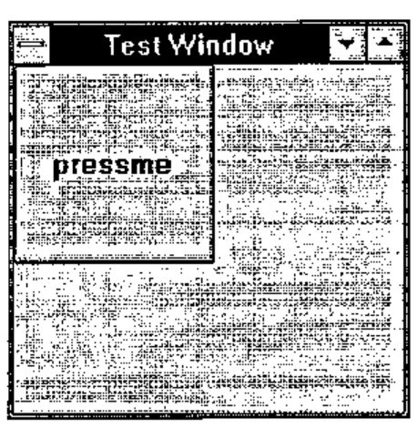
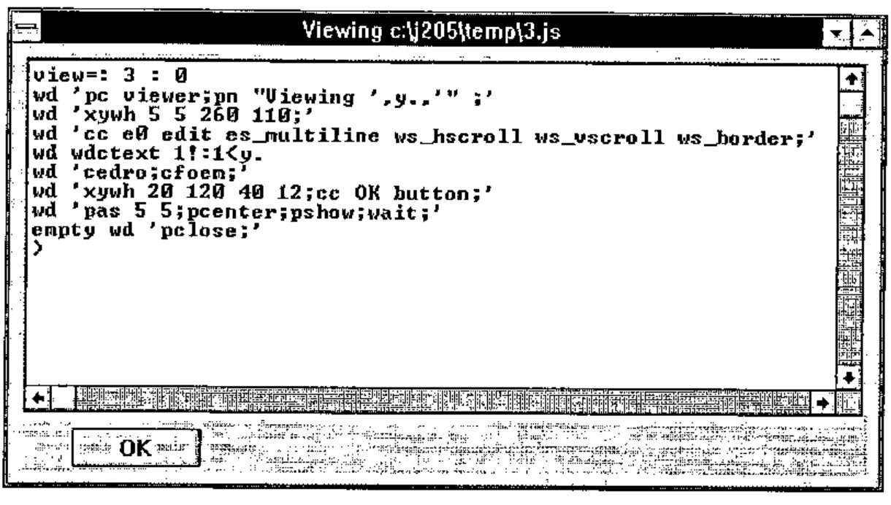
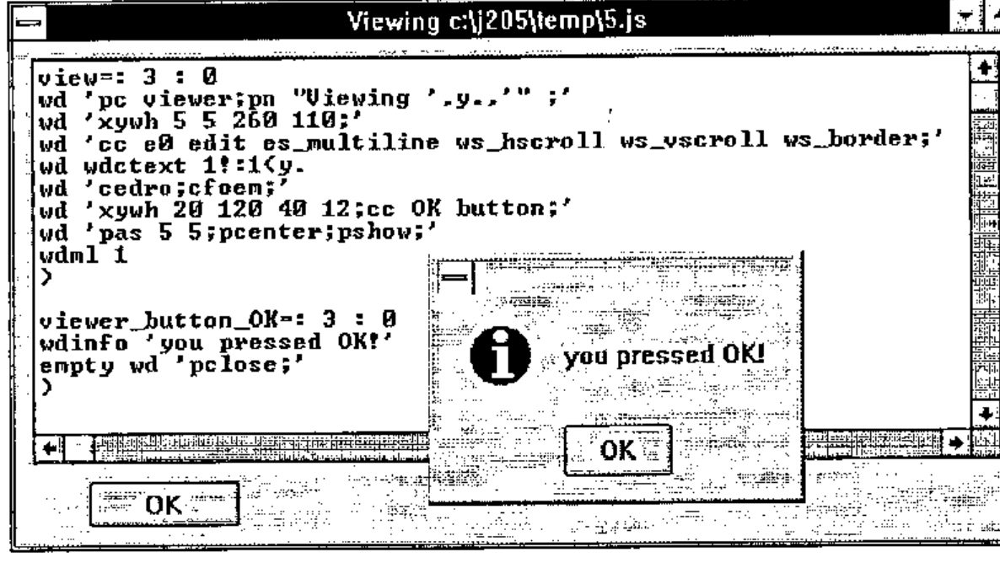
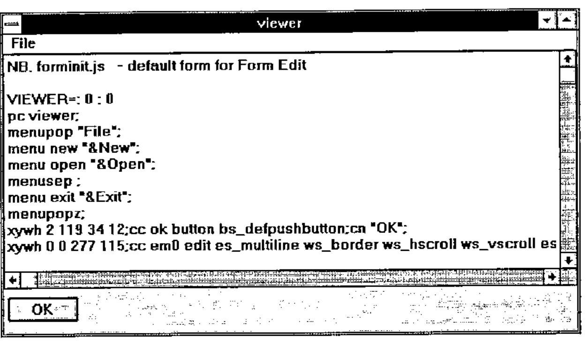

*reviewed by Dave Ziemann*
{ .byline }

## Introduction

Release 2.05 of J is a significant new version of the product. This review will focus on the J environment, Windows programming, DDE and J runtime. It does not cover the J language itself, the Open Database Connectivity (ODBC) interface (which allows J to access data from a DBMS via SQL), or the J component filing system.

I received release 2.04 of the Professional Edition of J via s-mail (the "s" stands for snail) from Strand Software Systems, the Canadian distributor. The package consisted of two glue-bound manuals, and five diskettes. Needless to say, the moment the package arrived, it was out of date. This gave me the opportunity to try out my new fast modem, and I arranged with Eric Iverson to download the latest release, 2.05 from his World Wide Web page. This is a more straightforward but less usual software distribution method than FTP, but it works just fine provided the host isn’t too heavily loaded, which is wasn’t at 7:30am UK time.

## The Documentation

There are two manuals. The *"Introduction and Dictionary"*, written by Ken Iverson, will be familiar to J users. This is fundamentally a reference work, although it also contains introductory tutorials. It has the J vocabulary printed right there on the outside back cover of the manual, where you need it.

The *"User Manual"* is written by Chris Burke of Strand Software, and is in sharp and welcome contrast to the Introduction and Dictionary. Although both weigh in at 200 pages, the User Manual is informal in style, and contains explanatory text and practical examples. It does not concern itself with the core language, but concentrates on the environment, utilities, windows programming and database access.

These topics are covered in chapters entitled Session Manager, Writing J Programs, Application Development Environment, Standard Utilities, Window Driver, DDE and OLE, VBX Controls, ODBC Data Driver, and Packages and Examples.

One appendix contains a complete listing of the commands that can be used in the Window Driver scripting language, the heart of windows programming in J. Another appendix contains, perhaps surprisingly, a summary of the base ODBC SQL language and function calls. As you can see, the emphasis here is on the practical side of application development. I wish they had also printed the J vocabulary on the back of the User Guide.

## Installation

Installation is straightforward; the "J setup" disk is the main one, and the "VBX and SQL ODBC Setup" disk is good for many of the User Manual examples. The other two disks are for ODBC setup, and can be installed as and when needed. The Professional Edition also includes a J Runtime Setup disk.

Installation results in a single Program Group icon. No uninstall icon is provided. The idea of removing J from a machine may surprise some people, but I believe that all professional Windows products should nowadays come with a comprehensive uninstall facility.

## J Application Development Environment

The J development environment is a tidy admixture of utilities, scripts and locales, sitting underneath the J MDI session manager. The session manager has been described in a previous product review, so I won’t dwell on it here, other than to suggest that it could be improved by enabling right mouse-button clicks, in particular for Windows *cut*, *copy* and *paste* operations.

Although the workspace appears to be initially empty, objects defined in utility script files inhabit the j and z locales, and are available for use. Locales are J’s answer to the namespace problem so familiar to APL developers.

If a name cannot be resolved in the base local, where we normally work, the z locale is searched. In this way you can treat common objects as system global, even though they don’t impact the namespace of the base locale. For example, if you go into J and immediately type `nl 3` you get an empty list. This is because although the verb `nl` is defined in the z locale, you are running it in the base locale, where there are no current definitions.

The z locale is populated with general purpose utilities and windows programming tools. For example, it contains the wonderfully useful utility `edit` which allows you to edit by name any definition that has been loaded in a J script file. You can type:

```text
   edit 'list'
```

and a window will open up on the script file that contains the definition of the verb `list`, with the definition scrolled to the top of the screen. This works because J now keeps a record of all the script files that have been loaded, and also remembers the names of the objects they defined.

In addition to useful utilities, there are a number of common nouns in the z locale, such as `CR`, `LF` and `TAB`, as well as a host of convenient nouns for use in Windows programming.

## Windows Programming

If the authors of J were once language mavens, then the balance has been redressed. The important application areas appear to be solidly covered, particularly the Windows programming environment. So just how easy is it to do Windows programming? You can start doing Windows programming as soon as you load J. The core utility is the Window Driver verb `wd` which is already loaded into the z locale.

To query the name of the active session window, you can use:

```text
   wd 'qsmact;'
┌───────┬─────────────────┐
│*type  │10 result        │
├───────┼─────────────────┤
│*parent│sysresult        │
├───────┼─────────────────┤
│*data  │c:\j205\temp\2.jx│
└───────┴─────────────────┘
```

This is not particularly interesting in itself; the purpose of the example is to show that the result is a 2-column matrix. Column 1 contains identifiers, and column 2 the corresponding data. Typically there are several rows. The first indicates the type of the response, in this case a Windows result. Often the most useful item is the data corresponding to the `*data` identifier.

The verb `wddata` sucks this data out of the box, e.g.:

```text
   wddata 'qsmact;'
c:\j205\temp\2.jx
```

The universe of `*type` responses from `wd` (e.g. `10 result`) can be shown by using the `qt` command in conjunction with the list utility:

```text
   60 list wddata 'qt;'
 0 ?          1 error      2 nowait     3 fkey
 4 menu       5 button     6 close      7 enter
 8 cancel     9 break     10 result    11 ddepoke
12 ddeex     13 ddereq    14 ddeadvise 15 ddestart
16 smbreak   17 timer     18 vbxn
```

What you type inside the quotes must conform to the rules of the Windows scripting language developed by Eric Iverson. If the last command is "wait" then a result is only returned after the user has taken some action. Since several windows may be active at any time, the response may indicate an action in any of these windows. For example:



```text
   t=.'pc mywin;pn "Test Window";'
   t=.t,'cc pressme button;pshow;wait;'
   wd t
```

creates a window mywin (`pc`=parent create) with title "Test Window" (`pn`=parent name), and then adds to it a push button called pressme (`cc`=child create). The window is then displayed (`pshow`) and a wait actioned.

In the absence of sizing and positioning information appropriate assumptions are made. The window remains active until explicitly closed by a `wd'pclose;'` command. When you press the push button, J gets the result:

```text
┌───────┬──────────────────────────────────┐
│*type  │ 5 button                         │
├───────┼──────────────────────────────────┤
│*parent│mywin                             │
├───────┼──────────────────────────────────┤
│*id    │pressme                           │
├───────┼──────────────────────────────────┤
│*pinfo │1 0 0 200 200 192 173 800 600     │
└───────┴──────────────────────────────────┘
```

Window Driver commands can be used with the `wd` verb to build a simple file viewer in a few lines of code. I saved the definition of a verb named `view` in a J script file called c:\j205\temp\3.js and then ran the script and the viewer as follows:

```text
   0!:0<'c:\j205\temp\3.js'   NB. run the script
   view 'c:\j205\temp\3.js'   NB. run the viewer
```



The argument `y.` is the file name. The `1!:1` verb reads the file as a character vector, and the utility `wdctext` constructs a `ctext` command from its argument. The `ctext` command writes the text into the listbox child. The `pas` command adjusts the size of the parent window, `pshow` shows the window and `wait` causes the wait for user input. The `empty` verb merely discards the explicit result of the `pclose` when the OK button is pressed.

In general we want to set up a "message loop" where we wait for the user to do something, respond to the resulting Windows message, take an appropriate action and then re-issue the wait command. This is handled in J by using the standard verb `wdml`.

How do we catch and respond to Windows events? You need to know three things to do this: the `*parent`, `*type` and `*id` of the Windows result. The `wdml` verb looks for a handler function whose name is formed from these three parts, i.e. a function of the form `parent_type_id`. The argument to this function is the result from Windows. So if we wanted to handle the event resulting from pressing the OK button in the above example, we must define a handler verb `viewer_button_OK`.

I did this in the script that defined the view verb, and this is what happened when I clicked the OK button:



I removed the `wait` command and put in a call to `wdml`. The button handler uses the `wdinfo` utility to display a simple dialog box to test the approach. This is a major improvement over earlier versions of J, where a single handler verb was used for each parent window, leaving you the work of identifying and actioning each control event. Now the program code for a single control event is expressed within a single verb, the handler verb for the particular control event.

## The Form Editor

No Windows-based product is nowadays complete without a window builder or form editor to do the work of building windows for you. J’s answer to this is the new "form editor".

As a simple experiment, I thought I’d recreate the hand coded file viewer using the form editor. I opened a new script window and selected the "Form Edit" option which is installed as standard on J’s "Edit" menu. I was then prompted to name the form in my mini-application. As soon as I entered "viewer" and pressed enter, the form editor immediately starting writing code, and put it into my new script window. This code creates standard **OK** and **Cancel** buttons, and builds a standard "File" menu option with "New", "Open" and "Exit" options already present. This is code that you would otherwise have to write by hand. It also builds a stub verb which you can use to initialise the controls prior to the window being opened.

The system then runs this code, which displays a skeleton form, and presents you with the form editor Design window, from which the form construction process is driven. This is what I got:


You can then use the Design window to select from a list of Windows controls and position them on the form. The grid of square buttons in the design window is used for accurate positioning of controls in the form. The number in the middle is the number of pixels the control moves with each click. It can be toggled between 1 and 4.

By double-clicking a control in the form, you open up a window that lets you edit its attributes. For example, I selected a multi-line edit control, and specified that it should be read-only and permit horizontal and vertical scrolling. I also deleted the Cancel button, because it’s not required for this simple viewer.

As you design the form, the underlying script is modified, building the code which defines the layout you want. At any time you can test the form to see what it looks like. Particularly useful is the ability to select a control in your form, and then go directly to the script code which handles that control. So you can write the code that handles a control event as soon as you put the control on the screen.

The only coding I had to do myself was to pass the file name argument from the calling verb down into the initialisation verb, and to initialise the edit control with the file contents. This is what I got when I ran it:

```text
   viewer_run'c:\j205\temp\10.js'
```



The form editor is simple to use and makes the process of window construction a lot easier. This is not a sophisticated editor, for example it won’t allow you to define resizing rules for individual form controls, and it doesn’t let you drag-drop controls. On the other hand, it does give you a lot of good strong functionality, such as a VBX control, which you just define in your form like any other control, double-click it, and hook into your favourite VBX.

## Dynamic Data Exchange (DDE)

The depth of the window driver scripting language is impressive; I counted over 180 window driver commands in the User Manual appendix, covering not only window programming calls, but also graphics, Windows program execution and DDE and OLE (not OLE 2 yet). I could not find a way of making an arbitrary Windows API call.

The User Manual describes how to do DDE cold and hot links, and there are sample scripts to try, including hot and cold J to J links and cold Word for Windows to J links. The documentation did not make it clear that the WordBasic macros are for Word for Windows 6, and do not work for version 2.

I decided to try a DDE example. What I wanted was something that would be relevant to the preparation of this review. I got fed up alt-Tabbing out of my Word session into J, where I would type in an expression, execute it, select the expression and its result, copy them, alt-Tab back to Word, paste the text, and then finally re-select it all and set the appropriate ISIJ font and size.

What if I could get J and Word to do it for me? The first step is to write a WordBasic macro to take the currently selected text, push it into J via DDE, get the result back from J, and insert it after the selected text, as a new paragraph with the font set to 13 point ISIJ. WordBasic macros are very boring, but the salient DDE lines are:

```text
cn = DDEInitiate("jserver", "mytopic")
DDEPoke cn, "myitem", Selection$()
ans$ = DDERequest$(cn, "myitem")
```

The code assumes that the J DDE server will establish a link with name "jserver", and that the DDE topic and items names are "mytopic" and "myitem". The variable `cn` holds the DDE channel number. In a cold link the client has to explicitly request the data from the server, which is shown in the last line above

The next step is to establish the DDE cold link between J and Microsoft Word for Windows. I was able to modify an example J script to do this. The script establishes the DDE server name and then waits for the DDE client to do something:

```text
   wd 'ddename jserver;'
   ...
   wd'wait;'
┌───────┬──────────┐
│*type  │11 ddepoke│
├───────┼──────────┤
│*parent│sysddepoke│
├───────┼──────────┤
│*topic │mytopic   │
├───────┼──────────┤
│*item  │myitem    │
├───────┼──────────┤
│*data  │i.2 8     │
└───────┴──────────┘
```

This result is returned when the client macro executes. It contains the expression to be executed alongside the `*data` identifier. The script then formats the result, turns it into a character vector and returns it to the client as follows:

```text
   wd 'ddereqd ',charvec,';'
```

The character vector appears as the `ans$` variable in the WordBasic macro, which then continues with code to insert, select and set the J font for the result text. The final step was to add a "J" option to the bottom of my Word for Windows "Tools" menu, which runs the stored J macro. The experiment seemed to work quite well, although the cold link technique is timing sensitive, so that problems can arise if J isn’t ready with the result when WordBasic asks for it. I only got one GPF during the whole business, and I’m not at all sure J was to blame.

## J Runtime

J Professional includes a runtime facility. Installing the separate runtime disk creates a new directory containing the runtime J execution program jrt.exe. I then used J Windows Help to learn how to build my runtime. I wanted to try and runtime the J server application I had just built. Conveniently (but strangely) you use the window driver to convert the application script file into a special kind of encoded runtime script file, as follows:

```text
   wd 'makejr c:\jrt2\jsr.js jsr.jr;'
```

Then all you do then is execute the runtime program jrt.exe with the jr file name as its parameter. And it worked first time when I tried it. Now I can just double-click a Program Manager icon, and my J server starts up, ready to accept DDE requests from my Word session. The jr file was just slightly larger than the source script file, about 4kb. The jrt.exe and j387.dll files are about 360kb apiece.

For a really professional look you can package your runtime application into a tailored Windows Setup disk which contains everything you need to install the application on another machine.

## The J Product Set and Pricing

J release 2 is available in three forms; the Professional, Personal and Freeware editions. The earlier shareware version is no longer distributed or supported. A Professional licence is required for any work-related use of J, and includes royalty-free runtime, which is not included in the Personal edition. The Freeware edition of J is based on the J2.0 release, and is therefore slower and also lacks DDE, ODBC and DLL support, most VBX support, the GUI form editor, the component filing system, and language enhancements since J2.0. In other respects J Freeware is a full J/Windows system, and is ideal for learning and demonstrating J.

ISI have clearly been concentrating on J for Windows, although the core product is now available on DOS, OS/2, Linux, Mac, RS/6000 and Sparc platforms. At the time of writing (March) the application development environment is not available for these platforms, although new releases which include this feature are expected for the OS/2 and Mac systems later this year.

J Professional is $495 (US Dollars). J Personal (and any system for which the development environment is not available) costs $100. These systems are also available unbundled, i.e. the disks cost $40 and the manuals are $35 apiece. With the full text of both manuals now available as Windows Help, the paper copies are no longer a necessity.

Teachers can install a single Personal system used as part of a course on all computers in the lab, although students needing their own copies will have to buy their own Personal system. The Professional system is available at a 60% education discount.

J is distributed by Strand Software Systems, and authorised dealers. Many J resources are available via anonymous FTP from `watserv1.waterloo.edu`. J Freeware can be found in the directory `languages/j`.

Thanks are due to Chris Burke and Eric Iverson for answering my questions during the preparation of this review, and to Peter Biddlecombe for helping me with WordBasic.
