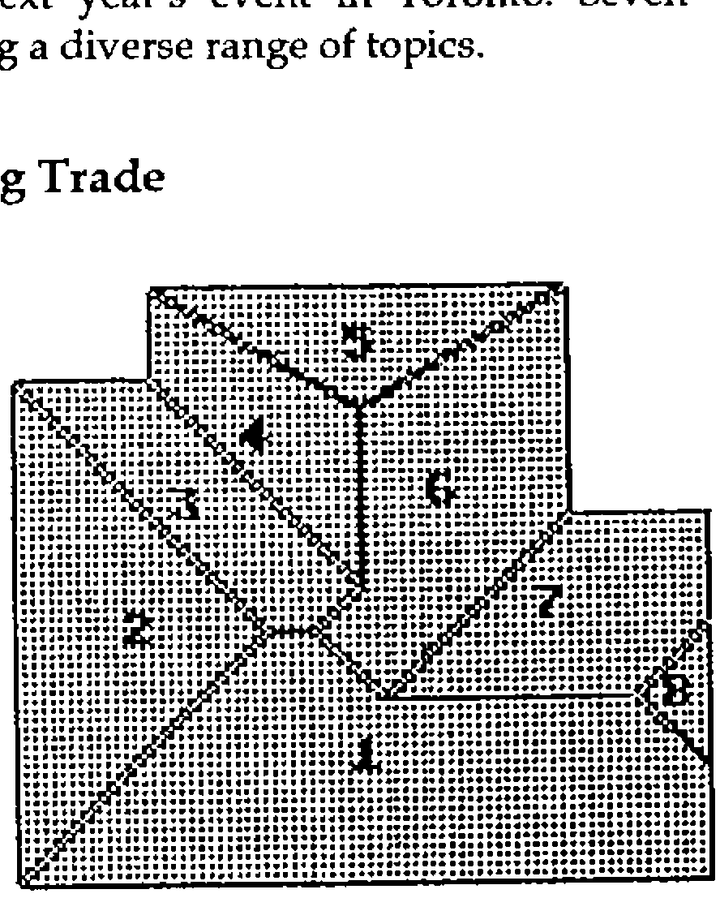
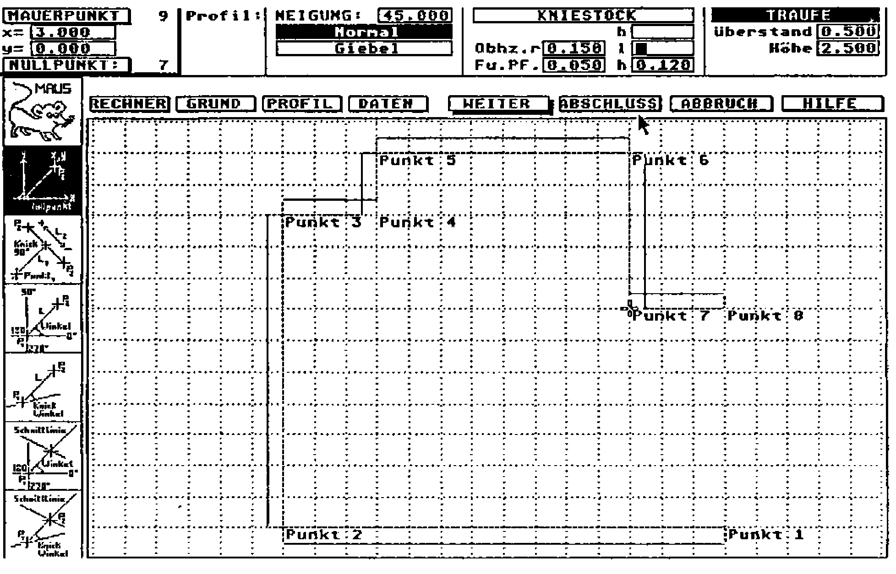
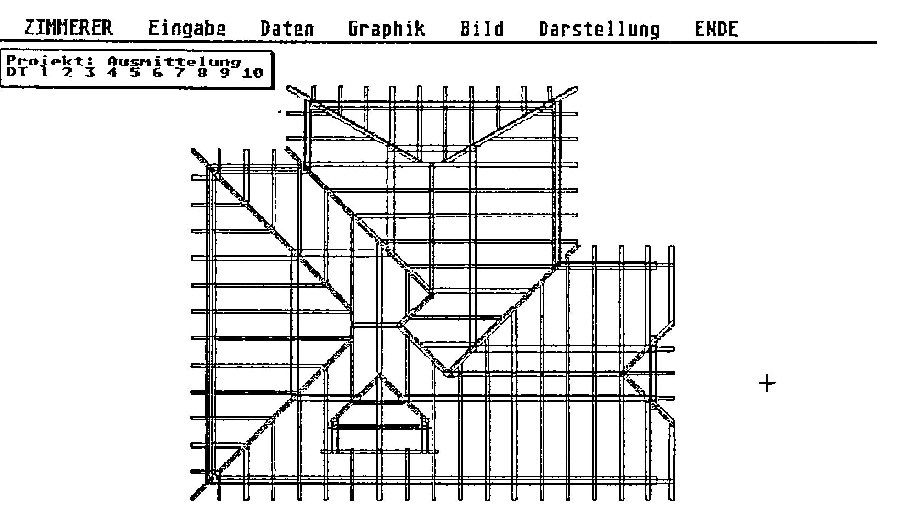
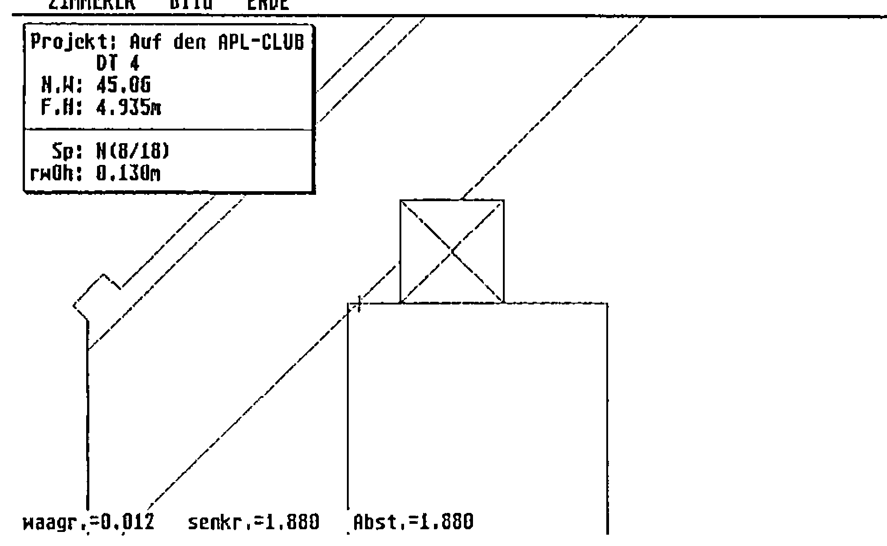

*notes by David Eastwood on a talk by Michael Zippel*
{ .byline }

We began with a talk by Michael Zippel on the application of APL in the roofing trade (using Atari STs). Michael’s Zimmerer package designs roofs, or more correctly generates specifications of the correct positions and connections of all necessary beams in the roof. The software runs either on an Atari ST or on a fairly fast 386 PC, and is designed to help the builder translate an architect’s layout into a detailed set of working plans. The target design is shown opposite, and the diagram overleaf shows the first step — a layout for the supporting walls is entered via a ‘CAD’ screen.

The system will then produce details of the required woodwork taking into account slopes and separations between beams — you will note a window has been added as well:

The final structure can be inspected and rotated and the user can ‘zoom in’ to see details of all the required cuts that have to be made at the various joints — some of these can be extremely complicated when a number of beams meet.

The builder can produce an ordering list together with detailed drawings of individual beams. Michael alternated between the sort of screen picture shown here and photos from a construction site showing the same roof actually being built. This is the second successful APL package I have come across for use in the construction industry and it highlights a somewhat unexpected application area for APL.
