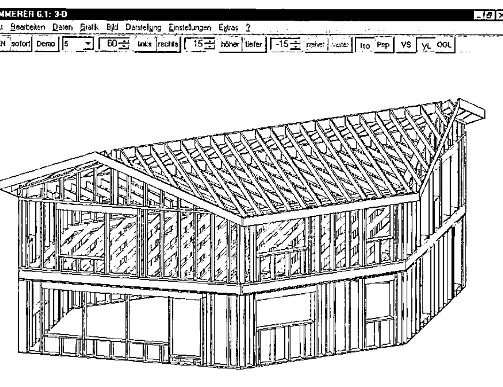
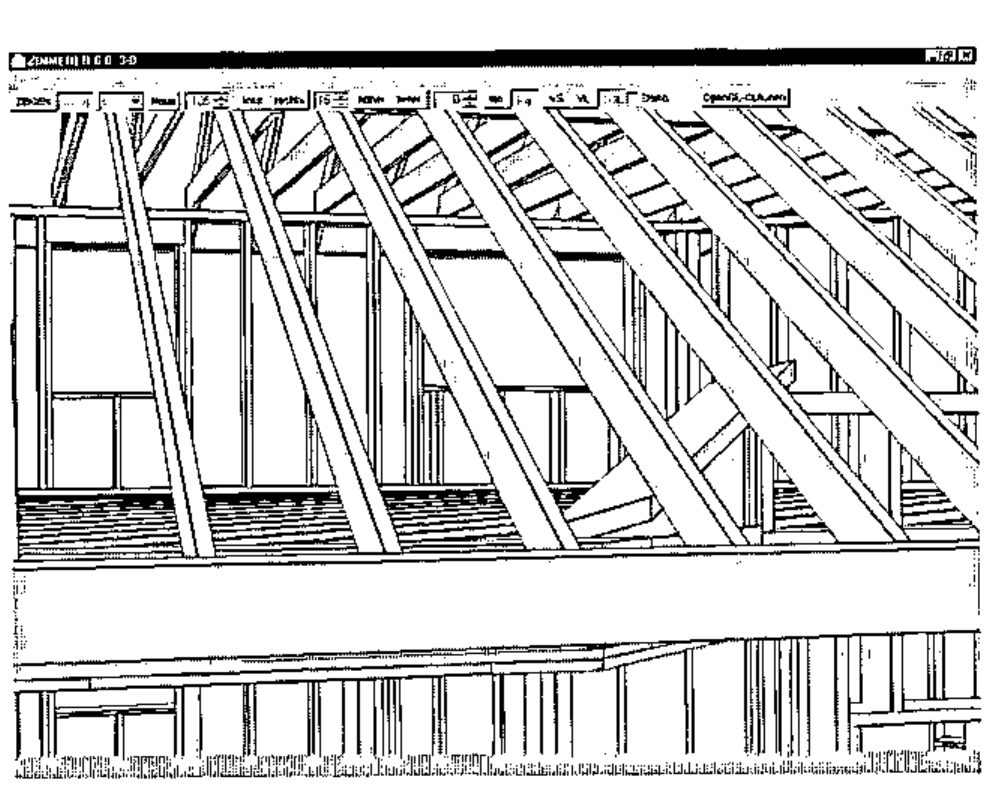

*presented by Michael Zippel (www.zimmerer.de)*
{ .byline }

*ZIMMERER* is tailored for craftsmen (they are called "Zimmermann" or "Zimmerer" in German) building timber frame houses and roofs. The first version was sold in 1988: MicroAPL-based running on Atari Computers (at 8 Mhz!). A Windows Version (DyalogAPL) was introduced in 1993.

*ZIMMERER* attempts to satisfy the software needs of a typical small business, all integrated in one piece of software.

## Tender

- rapid entry of "in-about" construction
- lists of all items required for bidding
- formal printouts

## Construction

- Starting with macros
- "visual" elaboration of details in CAD-style:

    Each individual beam can be modified

    Groups of beams can be modified in a uniform way

    Openings (e.g. for chimneys or windows) can be set in one pass

    Connections between different types of beams and/or different parts of the roof (Lap Joints, Tenon, Mortise, Drillings) can be set

    Colliding beams can be fitted

    The overall Contour can be modified and and beams fit into it
- Produces 10 different technical plans with all required measurements
- 3D-graphics (choice of vector graphics with hidden line detection – ideal for high res printing; or pixel graphics using openGL – ideal for visualisation

- Allows interfacing with other systems, including various brands of CNC-Sawing Machinery (via DXF and custom formats)

## Billing

- provides lists needed for billing: lumber cut and other material
- standard price tables and invoice writing (using RichEdit with RTF-templates)

*ZIMMERER* has a live-update feature included, to download a patch-workspace.
