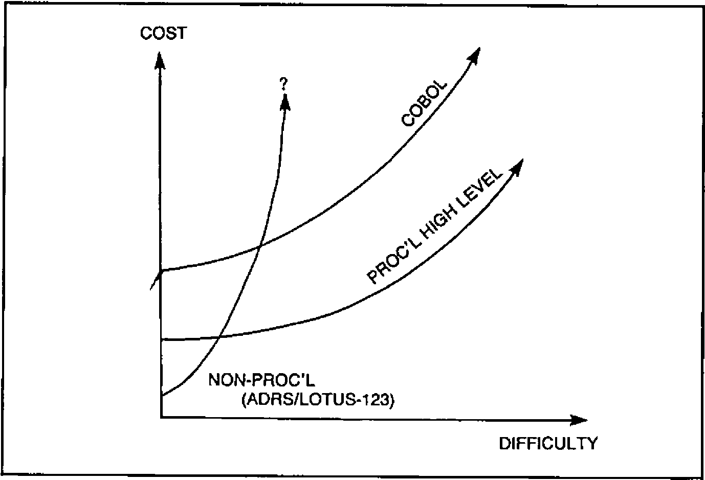
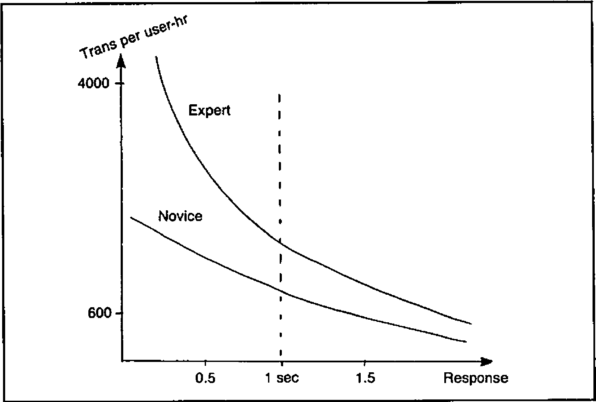
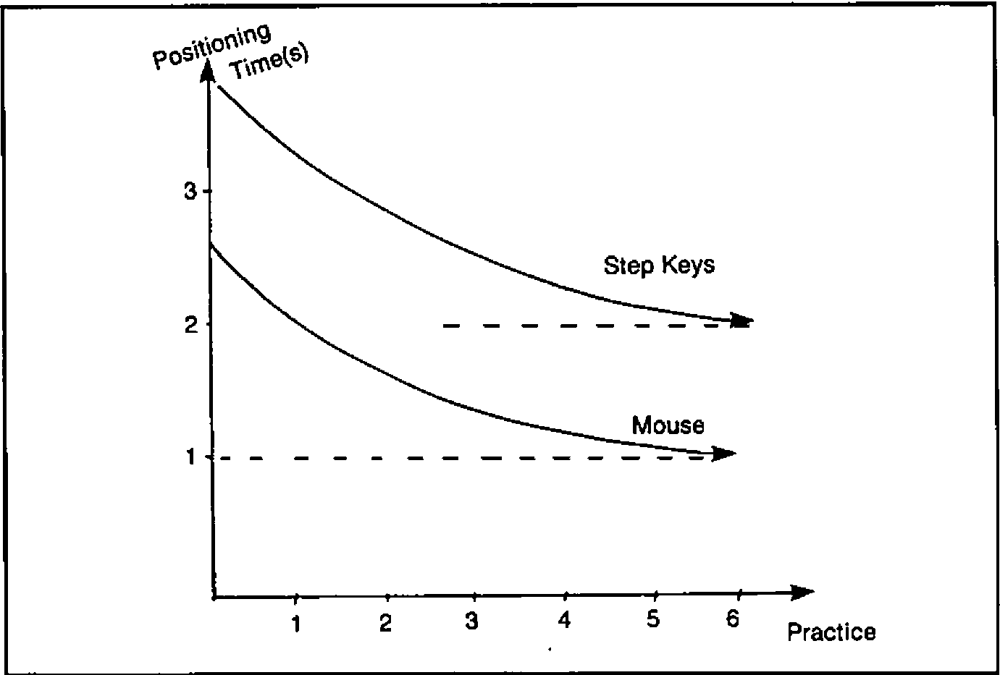

*(The IP Sharp APL Users’ Meeting) 17th - 19th October 1984, Toronto, Ontario*

Notes compiled by Adrian Smith
{ .byline }

## Introduction

By a stroke of good fortune Rowntrees had already asked me to spend some time at our Canadian factory in October, so I was delighted to combine business with business and book a place at my first IPSA international conference. I was even so bold as to offer my services for Ken Iverson’s panel on ‘Mice vs Menus vs Commands’, and was really delighted when he took me up. In all this was a most interesting and enjoyable event, and it was attended by over 320 people from 17 countries. Most of the papers are available in printed form in the conference proceedings, but the contents of both Ken’s panel and a similar discussion on Information Centres will not be published by IPSA. Consequently I will simply give my impressions of the main talks, and will include full details only of such material as would otherwise languish forever in obscurity.

## People of the Global Village

*Jim Cunnie (ITT)*

This was the first of three ‘keynote’ sessions which began the conference. I found it a very frustrating 45 minutes, as the speaker whipped through sheaves of unreadable foils, flinging out unsupported propositions at a rate no-one in the audience could possibly absorb. His basic message seemed to me to be “It’ll be alright on the night!” Never mind the problems of today - population growth is an intrinsically self-regulating system, we are already past the peak growth, and by the mid 21-hundreds the mean GNP per head will settle out at £5,000 - £10,000, with a worldwide population of some 15 billion.

The basic culture will be scientific (with the emphasis increasingly on the ‘analytical’) and will be heavily dependent on telecommunications. The visible processes of government will matter less and less as we move into an age where global ‘face-to-face’ interaction becomes the norm.

Hence the phrase ‘Global Village’. As with all such ‘take it or leave it’ presentations it was impossible to decide whether there really was background research behind the glib facade. I suspect there was, which made it all the more of a pity that no attempt was made to put it across.

## Introducing the Global Information Centre

*Lib Gibson (IPSA)*

The speaker stressed the need for firms to deal with planning problems of worldwide scope on shorter and shorter timescales. In order to ensure the integrity and timeliness of data across the world there is an increasing demand for easy *transparent* telecommunications, and for software which will make amateurs self-sufficient. This must work with data from any source, and must obviously be both responsive and easy to use.

The rest of the talk was really a (wholly excusable) sales pitch, so readers are best directed to the IPSA handouts at this point. I think the answer to your prayers is called ‘Viewpoint’, but you must judge for yourselves!

## Current and Future Technologies

*Mitchell Watson (IBM)*

The speaker is Vice-president of the Systems Products Division, so his words were followed avidly by the professional IBM-watchers present. Unfortunately the rest of us rapidly became bamboozled by a string of acronyms and serial numbers, and it is rather hard for me to report anything useful here.

I believed him to indicate that the emphasis would be increasingly on the world of the PC, but that it would gradually acquire all those letters like SNA and VSAM that have long been familiar on big machines. Basically IBM can’t afford to write off an architecture that has grown up in the world of dumb terminals, so even though the handling of text/graphics/voice will move out to the workstation, old favourites like VM will still matter internally. Interestingly, he was quite clear that the 5-inch floppy is here to stay, although it will soon be complemented by the miniature optical disk. I wonder how supporters of machines like Apricot and Macintosh feel about that?

## User Productivity Tools

*Bob Metzger (IPSA)*

This was one of those sessions which worked far better in the printed version than in the actual talk. In fact I read the paper in the pub (they do rather good draught Bass in the ‘Duke of Richmond’) over lunch, and I found this much more rewarding than listening to Bob’s lecture! Accordingly I am going to forget my rather meagre notes - which clearly fail to do justice to 2 hours of material - and simply attempt to precis the published paper. If you can get hold of a copy of the original, I would strongly recommend it for detailed study.

Bob suggested that two elements of any ‘User-productivity aid’ need careful scrutiny. Firstly it must provide genuinely integrated data, and secondly there must be the possibility of non-procedural processing. The first of these needs little explanation, but the second leads to four further questions which are fundamental to any evaluation.

- Is the processing ‘reactive’ or ‘proactive’?
- Is the user’s view ‘segmented’ or ‘apertural’?
- How is ‘natural language’ handled?
- What about graphics support?

By ‘reactive’ Bob essentially meant menus. The user’s options are limited to selection, asking for help, and backing out. ‘Proactive’ systems are typified by spreadsheets; in Lotus-123 the user can:

- type data into a cell
- type a mnemonic command
- use the cursor and function keys.

… and the spreadsheet will respond. The possibilities are anything but limited, and users brought up on this style of system are unlikely to be very pleased when offered the old-fashioned reactive approach on the mainframe.

Bob’s next distinction was between ‘segmented’ and ‘apertural’ systems. I think that the basic difference is that if the designer fixes the hierarchy of functionality (e.g. by a menu-tree), often embedding artificial distinctions, say between ‘Update’ and ‘Display’, then the system is definitely segmented. By contrast the apertural system makes all commands available all the time, and lets the user say how they are structured. He can likewise scroll at will around his data, slicing and re-ordering as it suits him. Once again the spreadsheet is the archetype.

Bob gave some very clear design principles which we should look for in such systems, and then moved on to discuss the possibilities of natural language processing. He was very much of the view that ‘true’ natural language is rather a pointless quest until we have managed to get voice-recognition to a workable state. Even then it is unlikely to be of much use in the most touted application of today - database query. To get precise answers we unfortunately need to ask precise questions! In conclusion, the ‘English-like’ approach of most of today’s 4GLs is probably quite satisfactory when you are searching for enhanced user-productivity on today’s computers.

In the second half of his talk Bob covered much the same ground from the point of view of ‘how would we do it in APL?’ The section on integrated data was somewhat Sharp-specific, and rather beyond my comprehension. Interested readers should dig up the original, where full function listings are given. Of much more general relevance was the detail on proactive systems; specifically on ways and means of building command languages in APL. Three approaches were given, in increasing order of sophistication :

- Keyword matching. This is the most basic type of language, suitable for jobs like scrolling around your data. You can say things like ‘UP’, ‘DOWN 10’, ‘LEFT 3 PAGES’,’TOP’. Normally such a language would supply sensible defaults, and tolerate unique truncations.
- APL syntax analysis. The logic of this technique is that the APL interpreter is itself a very effective syntax analyser, so it seems daft not to use it. If the commands can be made to look like valid APL expressions such as ‘SHOW DATA WHERE (AGE > 35) AND (SALARY BETWEEN 12000,15000)’ then simply use APL to execute them. Any SYNTAX/VALUE ERRORS can easily be trapped and reported. The functions would probably in fact be dummies, building up an easily executed command string for a master driver to activate.
- Augmented Transition Networks. Enough said. If you want to get that deeply into formal grammars then these are probably what you need - the IPSA proceedings include a lot of helpful functions to get you going.

Finally Bob mentioned that AP124 (along with some helpful utilities) can be effectively used to tackle the apertural approach. This contention had the look of a one-paragraph afterthought, as did the ultimate conclusion that Sharp APL was a ‘very congenial environment’ for implementing apertural/proactive systems. This very minor quibble apart I could hardly agree more with the view that users really do get more productive if they are given integrated data and non-procedural processing. To take best advantage of modern computing we need to move away from the reactive/teletype/segmented approach towards the two qualities Bob dubbed ‘proactive’ and ‘apertural’.

## Mice, Menus and Masters in Application Design

*Panel Discussion chaired by Ken Iverson: Jo Sachs (Morgan Stanley), Gosta Olavi (S E Banken), Adrian Smith (Rowntree Mackintosh), Professor Donald McIntyre (Pomona College)*

The format of the meeting was a series of (more or less) formal talks, followed by questions from the floor. Each of us spoke for about 20 minutes, and there was a marked reluctance to get too deeply involved in any sort of real debate.

Jo Sachs came down on the side of commands, but with the proviso that ‘use once’ systems were obviously better driven by menus. He was perturbed by the tendency of menus to influence the user’s perception of his problems, and also by the lack of ready extensibility in most menu-driven systems.

Gosta Olavi very thoughtfully provided a complete text of his talk, so I shall simply refer readers to our general papers, where it is printed in full. He felt that (contrary to popular opinion) command languages do not in fact stimulate experimentation - users stick rigidly to what they know! He was more in favour of well designed menus where all the options were attractively offered.

Next in the list was your esteemed editor, who (very sneakily I thought) sidestepped the whole issue by declaring that the exact style of dialogue was quite irrelevant - the important thing was its ability to learn from the user. In a total abuse of editorial privilege I am also going to include my own notes under the general papers heading, so I now pass quickly on to the final talk from Professor McIntyre.

He took a very different tack from the rest of us, and started from the basic premise that the spreadsheets (and Lotus-123 in particular) must be doing something right! He drew on some quite detailed experience of Lotus in giving us examples of array handling and table generation. It was fascinating to see the kind of obscure and arcane things people get up to - Lotus macros make APL look almost readable!! It was also slightly disturbing to discover that I found some of the more convoluted bits of spreadsheet manipulation easier to follow than the ‘simple’ APL equivalent. Perhaps I am still a BASIC programmer at heart - awful thought!!

Mice got very little coverage at all in the debate, except for a general view that they simply put a seductive gloss on menu systems. Since menus came out of the session second best, the poor mice had little chance. No-one felt that ‘natural language’ would have any great impact in the near future; in particular Jo Sachs pointed out that it would be of little value without voice input.

I think that that just about wraps it up. Needless to say it is much harder to take proper notes when you are one of the participants, and I am sorry I have been unable to do full justice to a very lively and interesting discussion.

## A James Martin Lecture

*James Martin*

I know this talk had some fancy title (Global Information Centres figured in it I expect) but it was really just another typically Martin tour de force. As an object lesson in holding an audience for over 3 hours it was brilliant; whether it was more than just clever words well assembled you must judge from my notes. I shall try to reproduce as much as I can, but there will inevitably be quite a few inaccuracies in the diagrams - you can only sketch so fast.

The first half hour was devoted to a lightning tour of the latest advances in hardware. Computer-aided design has made it possible to pack more and more components on a chip, and is thus helping to reduce the number of external connections (the expensive bit). Gallium arsenide will speed up processing by a factor of 10, allowing the optic fibre to come into its own at bandwidths in excess of 10 GigaHertz. In fact much of the laboratory stuff looks most at home in the PC, and some form of Personal Satellite Earthstation will soon become a real possibility. The big unsolved problem is in the use of parallel computing; 10 M68000s cost vastly less than the same amount of ‘big machine’ power. If only we knew how to get them to co-operate!

A couple of interesting asides: ‘When men last walked on the moon, we had yet to invent the micro’; ‘There are no micros on Concorde - in fact there would be room for another 10 to 15 passengers in the space taken up by her racks of obsolete computers!’

To sum up the first section; there will be advances in all three key areas of computing technology:

- processing. Reduced instruction sets, and hard coded interpreters (PROLOG-on-a-chip) will speed things up even without co-operative computing.
- communications. Light is currently giving us around 109 bits per second. 1013 is certainly possible quite soon.
- storage. You can get 2 Billion bits on a standard Compact Disk (the shiny sort used for classical music). These cost 25p each to make. Enough said.

Next we come down to Earth with ….. Data Processing. What chance has the revolution when 80% of DP shops are still writing spaghetti COBOL? Why do they still refuse to accept the proven savings of 4th Generation Languages?? In fact why are they so downright irresponsible with their company’s money!? (The speaker got quite warmed up at this point.)

End users are the best hope; it is they who are forcing the pace by demanding computing facilities which get them results with:

- minimum work.
- minimum skill.
- no alien syntax or mnemonics.
- fast prototyping regardless of machine performance.
- ‘up front’ error checking.
- minimum maintenance.

As more and more packages hit this market, it is slowly becoming clear where their relative strengths lie. As systems get harder the cost curves behave somewhat like Figure 1:

*Fig.1*

… but we are really only scratching the surface of true automatic programming, and the use of CAD techniques by systems analysts will begin to eliminate the whole tedious cycle of specification and programming.

In fact the impact of ‘Fourth Generation Languages’ (FOCUS and the like) has been hardly noticeable - that DP backlog is still there, and is likely to remain for as long as managers stay with today’s methodologies. True, the people-cost does come down, but nowhere near as much as it could (Figure 2):

*Fig.2*

The most dramatic gain occurs when the breakthrough to a ‘one-man’ project is made, but even for really big jobs the benefits are there for the taking. On a rough scale where one ‘function point’ is about 100 lines of COBOL, we still find that the picture looks like Figure 3:

*Fig.3*

So much for the DP shop - what about the users? We now had a short interlude on response times, mice and ‘human factors’ in general.

The following two graphs say it all. Faster systems really do matter, and the decay time of the human short-term memory (roughly 2 seconds) is the critical cut-off (Figure 4):

*Fig.4*

In a typical case, average response time was cut from 2.3 sec to 0.84 sec, which gave a 52% increase in productivity, a 113% improvement in ‘function points per error’, and a cut in the cost of programs by 37%. Mice too can be worth the cost, simply by reducing the time it takes humans to position a cursor (Figure 5):

*Fig.5*

The problem is one of getting people started; to work a mouse really fast you do need to practise, and there is quite an initial barrier to be overcome. (Interestingly, this was almost the opposite view to the consensus in Ken’s discussion group. Perhaps I could solicit some letters on this point?)

Onward to Information Centres and some thoughts on where these might be going. The Bank of America suggest the following as the most critical success factors:

- ‘high profile’ top management support.
- ease of use.
- worldwide availability and ready access.
- excellent training and support.

… but there are also some dark clouds on the otherwise rosy horizon:

- in general the DP backlog has not been reduced.
- user-demand was greatly underestimated; controls on growth and on extravagant use of computer resource have often been ‘retro-fitted’ much too late.

However in spite of these worries it looks as if the Information Centre boom is set to continue at an ever increasing pace. There are some 30M ‘knowledge workers’ in the USA, of whom 50% will probably have some form of workstation within the next 3 years. At a conservative ratio of 50:1 that still represents a demand for 300,000 consultants!

If you don’t believe it, just look at these three alternatives, all of roughly equal cost:

- 50 workers.
- 49 workers, each with an IBM PC.
- 48 workers, each with an IBM PC, plus 1 IC consultant.

Faced with that choice, few companies would be daft enough to pick anything other than the third option.

Finally (and I really do mean that) a most invigorating afternoon came to a close with some pertinent comments on AI, and how we might one day make money from it.

Just what are the Japanese driving at with their ‘5th Generation’? Some idea can be gained from a comparison between people (who can manage a paltry 2 Logical Inferences per Second) and the Japanese target of 109 LIPS by 1990. Basically they are going for the mass-market in Expert Systems, which means systems where human expertise can be neatly packaged into consistent rules.

Typically such systems will be used to improve the performance of technicians (e.g. judges), to aid top experts (medical diagnosis), and to take over from people in situations where our speed of response is inadequate (real-time financial trading). They will then move out into the vast untapped home market, probably via those miniature optical disks, to advise us on such vital day-to-day activities as the care of our pot-plants. Sic transit gloria mundi.

## Supporting Information Centre Users

*Lael Kirk (IPSA), Chris Baxter (Midland Bank plc), David Crossley (Canadian Imperial Bank of Commerce), Edward Kohler (Xerox), Gladys Lim Eng Choo (Singapore Airlines)*

And so to Day-3. This was by far the best attended session of the morning, and was again in a Panel Discussion format. Where possible contributions are preceeded by the speaker’s initials, so I hope some consistent threads will emerge from the notes.

*Question:* *How do the panellists go about marketing their respective Information Centres?*

**DC:** Business is mostly by referrals - the IC staff have no real commitment to marketing.

**GL:** Using an in-house magazine, and with regular seminars.

**EK:** In the early stages (8 years ago) it was a matter of knocking on doors, but now a quarterly newsletter is sufficient.

**CB:** Just getting under way, with ‘house calls’ to senior management, and some notes in the head office bulletin. The biggest problem is to back off until capacity can cope.

*Question:* *What kind of newsletters do you all use?*

**DC:** Most articles are by Information Centre staff - it is hard to get users to contribute.

**GL:** Regular feature in an existing house magazine.

**EK:** Some intimidation yields enough articles for a quarterly journal. It helps to have a really professional layout and publishing service available.

*Question:* *Where is the best place to site yourself?*

**CB:** We are lucky enough to have a nice plush demo / walk-in area studded with micros, terminals, plotters and audio-visual equipment. The plushness matters if top management are to feel at home!

**EK:** Much the same idea, but rather plainer. It is vital to pick a site in a ‘high traffic’ area, not tucked away in the depths of DP.

*Question:* *Has anyone done any market surveys?*

**EK:** We support around 5,000 active accounts. A 10% survey got nearly a 70% response, and the overall saving suggested was some $10M p.a.

**DC:** 1,200 people were invited (over 600 actually turned up) to an open-house. N.B. Make sure you get names and phone numbers from as many people as you can!!

*Question:* *Do you do any sort of ‘needs analysis’ when approached?*

**CB:** Top management are usually without any computer support at all. Many jobs turn out to be little more than simple collation and reporting. If a proposal starts to smell like an ‘operational’ system it should be avoided like the plague.

**EK:** ‘What data should we extract’ is usually the first question.

**GL:** ‘Which package, and will we need much one-off APL?’

**DC:** ‘Is it ICU, SAS, EASYTREIVE, …. etc’

*Question:* *Wot about APL then?!*

**DC:** 40% - 50% of their IC users are ‘dependent’, i.e. they draw the line at anything more demanding than pushing PFkeys. 40% - 50% are ‘independent’; they are happy with ICU and the less procedural bits of 4GLs. Maybe 5% are ‘expert’; they will get stuck in to SAS, APL, even PL/1.

**GL:** Nearly all are either independent or expert; certainly the majority write their own APL with little assistance.

**CB:** Moving towards local networks linked to the Information Centre. APL development is often contracted out to recommended consultants. This way the IC doesn’t get lumbered with maintenance.

*Question:* *How much work does the PC handle?*

**DC:** Lotus-123 is very common, but not supported through the IC.

**GL:** VisiON, Execuvision, Symphony are all supported.

**EK:** Lots of Xerox PCs turning up, but no software support through the Information Centre.

**CB:** Out of 8 staff 4 are on the mainframe side, and 4 are dedicated to PC work with MultiPlan, Lotus-123 etc.

*Question:* *How does the Information Centre charge (if at all)?*

**DC:** They don’t.

**GL:** Internal charge on CPU and file space.

**EK:** Nothing for labour, so again all costs are recovered on computer load.

**CB:** ‘We charge for everything!’ PC software is bought at discount and charged at retail!! £2M is a lot to get back, so every penny is welcome.

*Question:* *Can the Information Centre cope with the impact of users doing their own APL?*

**EK:** A (public) list of the top-10 most hated applications works wonders.

**??:** There was once a FOCUS program that ran for 134 hours; it isn’t only APL you need to worry about.

**GL:** Users must return regular status reports. Also the monthly billing is monitored for any oddities.

**DC:** ‘We just let them get on with it’. The biggest user is outside Information Centre control anyway.

**CB:** So far the system has proved largely self-regulating. Monthly billing has a high profile, but the ‘quiet word’ is used as a last resort.

*Question:* *How does the panel help users to cook up benefits cases? (I don’t suppose for a moment that it was really worded like that, but my notes are less than explicit on this point.)*

**DC:** There are some quite elaborate cost/benefit procedures to follow, so the Information Centre staff can be very helpful with the protocols.

**CB:** We estimate the cost, and the user must then justify it. Generally they are not particularly professional about this, so it can often be hard to show concrete benefits for the Information Centre.

**GL:** No charge is made for any of the ‘walk-in’ facilities, but cost/benefit cases are required for any hardware.

*Question:* *Could the panel discuss any problems they have found in getting at corporate data.*

**DC:** Data is generally departmental - there is no comprehensive database. Other problems are the physical transfer of tapes to the IC computer, and red-tape in the systems area.

**GL:** Data can be pulled out from the IMS database, but this needs co-operation and careful organisation.

**EK:** Xerox has many different branches, each with its own database. Data can be shifted around using a fast hardware link, shared disks and purpose-built software. Currently they manage some 6,000 transfers each month.

**CB:** Split sites are again a problem. Data pools (some 8M records) are copied to the IC via overnight export.

*Question:* *What training should the Information Centre offer to users?*

**CB:** Mostly ‘on the job’ with some workshops. However there is an increasing need to teach basic keyboard skills, word-processing etc. Here the IC goes for ‘off-the-shelf’ courses and is looking hard at Computer-aided Instruction.

**EK:** Generally depend on the software vendors, and from then on users increasingly train each other. All trainees get ‘free time’ in which to practise.

**DC:** Classroom courses (up to 3 days) are given by a separate training department. Some self-study (SAS/DCF), but no in-house APL courses due to lack of terminals.

*Question:* *Where do the Information Centre staff come from?*

**CB:** Avoid DP and get good graduates directly. Training stays well away from DP concepts, but includes the IPSA APL course, manning the phones, and generally learning on the job.

**EK:** Mostly they are DP’ers who have seen the light. This helps as they generally know which strings to pull!

**DC:** It is much easier to train a banker about packages than a programmer about banking.

*Question:* *Does the Information Centre do any programming?*

**CB:** ‘No’ to tailor-made systems. ‘Yes’ they will do general-purpose software, but otherwise they use contract programmers only.

**GL:** Users get help with their first application only; from then on they are on their own, but with a good example to follow.

**EK:** ‘It must be going on, but I don’t look too hard’.

**DC:** The original notion was ‘no programming’, but quite a lot of SAS and some APL is now being done. In fact SAS is threatening to turn the whole Information Centre into a programming shop!

*Question:* *Do they run a ‘hotline’ or help desk?*

**All:** Yes, and it pays to log calls and be very conscientious about getting back to the callers.

And so to lunch.

## Closing Remarks

*Ian P Sharp*

You may have noticed that APL has been given rather a low profile in the majority of papers. In fact several delegates were heard to complain in no uncertain terms that they had come for the APL, not for all this guff about users, data, 4GLs and the rest. Ian Sharp’s closing address was in some ways a justification of the (non-APL) theme; yes of course IPSA remained committed to APL, but primarily as a means of making available their databases and the software to access them.

No-one makes money any more simply by selling APL; you must use APL as a means to an end, and the end is best achieved through packages whose APL content is well and truly hidden. That seems to me to have been the outstanding message which emerged (by no means unopposed) from a very stimulating 3 days.
