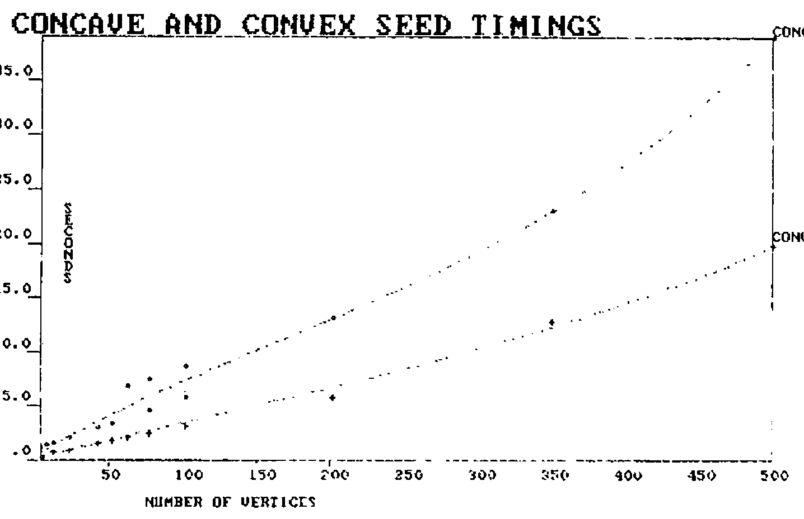

by Dick Bowman
{ .byline }

## How To Survive In NOTXXAPL

People jump to conclusions about what XXAPL really is; there’s no significance whatever to the two X’s save that it makes for a convenient cadence when you say it. We can regard it as a generic term for any APL which doesn’t have the bits you want and may well manifest itself as XXXAPL, XXXXXAPL or even XxxxxxxAPL for the historically minded.

Having been using one particular XXAPL for some years I’ve noticed myself spending a certain amount of effort emulating features in other APLs; ironic now to find myself in possession of an ‘other-brand’ interpreter and a need to emulate things I’d been taking for granted.

A specific instance is the quadEA system function, a sort of dyadic execute (why it wasn’t called that I’d be pleased to find out) which for the benefit of the unendowed has the syntax:

&lt;L quadEA R&gt; which is translated as:

> execute R, but if it fails
>
> execute L, and if this fails as well thanks for spending the CPU cycles

Not all APLs have this feature, and faced with an application using it you need to emulate it. So here I present a first (low-tech) approach using the APL\*PLUS/PC error handling facilities.

```
    ∇ L ∆EA R;⎕ELX
[1]    ⎕ELX←'→LEFT' ⋄ ⍎R ⋄ →0
[2]    LEFT:⎕ELX←'→RIGHT' ⋄ ⍎L ⋄ →0
[3]    RIGHT:⎕ERROR((⎕DM⍳⎕TCNL)-⎕IO)↑⎕DM
    ∇
```

Which seems to work reasonably well; the only case to consistently foul it up is having a branch as one of your arguments (I prefer to avoid this situation). It also gave me a painless insight into using this style of error-handling. An analagous example in SharpAPL is contained on page 143 of the Proceedings of the 1980 Sharp APL Users meeting.

I leave it as an easy exercise for non-Committee members to emulate error-trapping via quadEA.

## Am I In Belgium?

One of the indicators of whether you’re looking at useable graphics hardware is support of polygon filling; what you want to be able to do is to issue a command to draw a shape and have it filled with colour without doing too many mental gymnastics yourself (after all, these boxes cost money). Generalising, you can divide the hardware into three categories:

a)
: the appropriate command is intrinsic (this covers the case of a certain well-known specialist)

b)
: the appropriate command is intrinsic and doesn’t work (I draw a veil over who this might be)

c)
: there’s a command to draw the outline and another which lets you start filling from a specified seed point (a well-known vendor of APL interpreters offers this one)

If your equipment came from the first category you’re home and dry, except that I wager it probably hasn’t got an APL keyboard. If from the second you have an interesting problem on your hands. For the third category I offer some assistance.

As one coming very much from the school of why work it out for yourself when somebody else already did the hard work I acknowledge quite freely that this is a lift from the pages of APL Quote Quad. All I’ve done is to cut out the bits I really don’t need and correct the typos (as an aside, Quote Quad typos are an excellent way of learning APL).

The source from which all flows is the March 1984 issue in which Bastian and Cervini presented a set of functions for hatching polygons; once you get it working you can draw lines across irregular shapes which are visible inside and invisible outside. With the problem of a polygon in one hand and a need to find an internal seed point in the other we can now reduce it to finding the mid-point of any one of the visible line segments which Bastian/Cervini will so prolifically provide. Even the committee can work this one out, especially when they realise that only a single line is needed.

For clarification, I am perverse enough to have persisted in using a polygon definition which is the transpose of everyone else’s (first row is move (0) or draw (1), second is x-coordinates, third is y-coordinates); these functions are restricted to the simple case of a single closed polygon with no invisibility in its border.

```
    ∇ H←SEED POLY;⎕IO
[1]    ⎕IO←1
[2]    H←(RAY⍉POLY)[1 2 ; 2 3]
[3]    H←(⌊⌿H)+0.5×(⌈⌿H)-⌊⌿H
    ∇

    ∇ H←RAY PL;A;B;J
[1]    B←PL[;3]
[2]    B←(⌊/B)+((⌈/B)-⌊/B)÷2
[3]    H←B HACHEL PL[; 2 3]
    ∇

    ∇ H←D HACHEL P;I;J;K;F
[1]    F←P[;2]-D
[2]    F←F,[1.5]1⊖F
[3]    J←∨⌿I←0>×/[2]F+1E¯8×0=F
[4]    F←(P,[1.5]1⊖P),J/F
[5]    K←I⌿F
[6]    K[;2;]←-⌿[2]K
[7]    K←K[;1; 1 2]-K[;2; 1 2]×K[;1; 3 3]÷K[;2; 3 3]
[8]    H←(((1↑⍴K),1)⍴0 1),K[⍋K[;1];]
    ∇
```

I repeat my obligation to Messrs Bastian and Cervini for doing the hard work; I claim only to have simplified their code to achieve a specific objective. The result returned from &lt;SEED&gt; is a two-element vector of x and y coordinate for a seed point; it has been working in practice for a little while but I would be grateful to anyone providing perverse cases. An example:

```
      U←3 9⍴0,(8⍴1),10 60 60 50 50 20 20 10 10 10 10 60 60 20 20 60 60 10
      SEED U
15 35
```

### Postscript 1 — Yankee Imperialism

Perverse cases do indeed exist which can result in a seed point which is considered to be outside the polygon by the graphics hardware; such case being those where the calculated point is very near or even on the border of the polygon. What seems to happen is that the discrete nature of the hardware takes over; finds the point to be on the border and arbitrarily decides that inside is outside.

### Postscript 2 — Its nicer in Wyoming

Some polygons are simpler than others; how much of your time is taken up in drawing triangles, rectangles, minor segments of circles, and other convex objects? The nice thing about these objects being that they have a centre of gravity which is strictly within their boundary. The modified function below determines whether or not the polygon is convex (triangles always are, for others we take a tour of the boundary noting whether the first turning is to left or right - so long as we keep turning the same way we’re going round the outside of a convex polygon). If it’s convex then we can get away with using the centre of gravity as the fill seed.

```
    ∇ H←SEED POLY
[1]    ⎕IO←1
[2]    →(4≥¯1↑⍴POLY)↑L1
[3]    →(CONVEX POLY)↑L1
[4]    H←(RAY⍉POLY)[1 2 ; 2 3]
[5]    H←(⌊⌿H)+ 0.5 0.5 ×(⌈⌿H)-⌊⌿H
[6]    →0
[7]   L1:H←(+/ 1 ¯1 ↓POLY)÷¯1+¯1↑⍴POLY
    ∇

    ∇ Z←CONVEX POLY;M;TH;S;XY
[1]    XY← 0 ¯1 ↓-POLY[2 3 ;]-1⌽POLY[2 3 ;]
[2]    TH←¯1○XY[2;]÷(+⌿XY*2)*0.5
[3]    S←XY[1;]<0
[4]    M←((~S)\(~S)/TH)+S\S/(○1)-TH
[5]    M←(¯1+(M=⌊/M)⍳1)⌽M
[6]    Z←(1↓M)∧.≥¯1↓M
    ∇
```

Timed using APL\*PLUS/PC 3.0 on a PC with Hercules graphics board the saving is around 40% if you’re drawing convex shapes (see figure 1); purists may rightfully point out that it’s only necessary to calculate a seed using three vertices of the original polygon but my excuse is that using all points might lessen the chances of getting too near to the border.

*Fig. 1*



### Postscript 3 — I guess it all depends on what you know

Those in possession of an APL which supports user-defined ambivalent functions might consider a modification allowing the input of a seed point if the application already knows what it is. Thus

```
SEED←(SEED) SOLIDPOLY POLY
```

So that if you know what the seed ought to be you can bypass all of the difficult sums, thereby making things even more economic for circles and so forth.

## FORTRAN - A Popular Language

Some of you may have heard of Fortran; it has been around a while and amongst its other attributes it demonstrates that APL users aren’t the only people who have the arrogance to expect their users to absorb the conventions of the programmer.

In this case the offender is a construct resembling

```
2,3,4*5,6,7*8
```

which means one repetition of each of the numbers 2 and 3, followed by four number 5s, a six and seven 8s. Users of many versions of XXAPL will immediately recognise a mutated form of their own replicate function; if you haven’t followed my gripping prose, the above is Fortran for

```
1 1 4 1 7/2 3 5 6 8
```

Not only can Fortran programmers understand this, they also expect their users to incorporate it into input data; which is just great when it gets read by Fortran programs. If you have to read this gibberish into an APL function you might like to consider &lt;DECODE&gt; below:

```
    ∇ Z←DECODE R;L;M;N;S
[1]    L←', ' SHAPE R
[2]    L←(0 2 ↑⍴L)↓L
[3]    L←(⍴L)↑(2×∨/L∊'*')⌽(((1↑⍴L),2)⍴'1*'),L
[4]    S←,∧\L≠'*'
[5]    M←⍎S\S/,L
[6]    S←,⌽∧\⌽L≠'*'
[7]    N←⍎S\S/,L
[8]    Z←(,M∘.≥⍳⌈/M)/,⍉((⌈/M),⍴N)⍴N
    ∇
```

It’s not very elegant, but it worked for long enough to convince my user that he didn’t like the Fortran program. Incidentally &lt;SHAPE&gt; is just a vector-to-matrix converter, the one below is filched from IBM’s APL Handbook of Techniques.

```
    ∇ ∆A←∆B SHAPE ∆C;∆D
[1]    ∆A←((=\~∆C='''')∧∆C∊∆B)/⍳⍴∆C←∆C,1↑∆B
[2]    ∆D←⌈/∆A←∆A-⎕IO,1+¯1↓∆A
[3]    ∆A←(~0=∆A)⌿ 0 ¯1 ↓((⍴∆A),1+∆D)⍴(,(∆A∘.≥(~⎕IO)+⍳∆D),1)\∆C
    ∇
```

The variable names within &lt;SHAPE&gt; are the result of an encounter with a nameless local variable renamer at an earlier stage in my life when I needed to rationalise local names to a user-inaccessible form.

And for the benefit of anyone who still hasn’t worked out how Fortran came to be so popular with programmers and users alike:

```
      DECODE '2,3,4*5,6,7*8'
2 3 5 5 5 5 6 8 8 8 8 8 8 8
```

Yes, I thought \* was Fortran for multiply as well.
