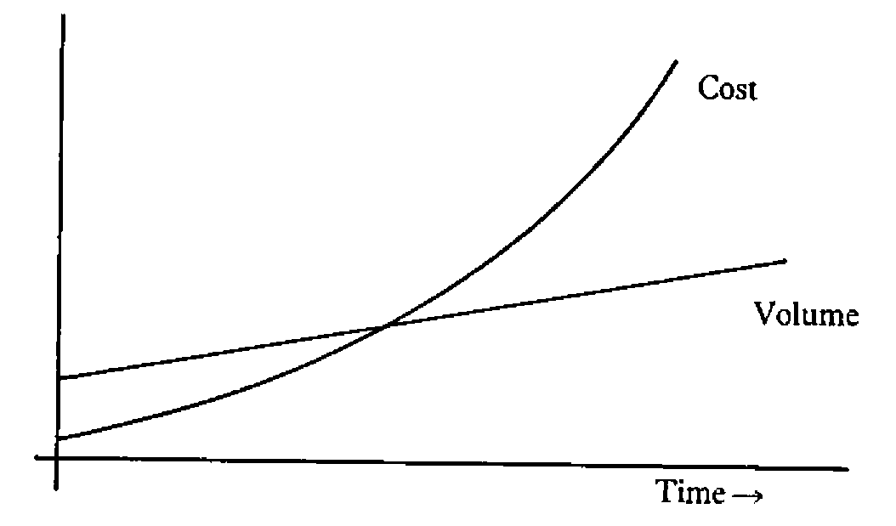
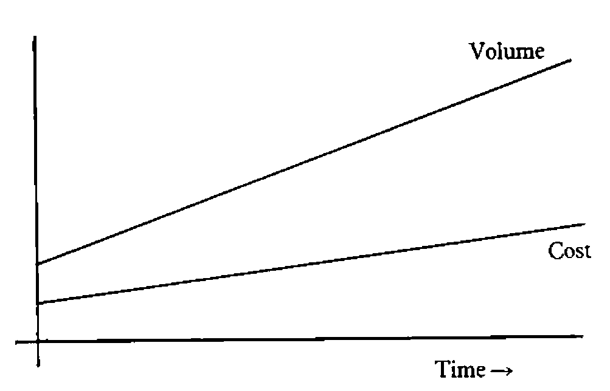

compiled by Adrian Smith
{ .byline }

## Disclaimer

These notes cover the four plenary sessions held at the conference. They are obviously a personal view of what was said, rather than an accurate record. If any of the speakers feel grossly misrepresented, I can only offer my apologies, and suggest that they make use of the letters page to redress the balance.

## General Introduction

If you skim the surface of the notes which follow, I hope you will become aware that there is a common thread running through all four sessions. Put simply, it is the need for vision and genuine strategic thinking, whether in telecoms, personnel management, building a transport network, or just life in general. As you might expect, it was left to Dr David Jenkins (Lord Bishop of Durham) to tackle this last one; the other three speakers were much more specific in the areas they addressed.

Dr Peter Keen was primarily interested in the development of global telecommunications, and the impact of this on people like banks, retailers, airlines and travel agents. For me, the key message of his talk was the need to think 5 – 7 years ahead; it is hard to counter a pre-emptive strike which is based on this kind of technology.

Considerable vision must have been needed to launch a totally new inner-city light railway, just when the motorway boom was at its height. There is no doubt that the Tyne and Wear Metro is an outstanding success, and with hindsight the reasons aren’t hard to see. It is clean and efficient, and above all it is fully integrated with existing public transport.

As a born and bred Wearsider, I obviously have a personal interest in the success of the Nissan car plant at Washington. The final session of the conference described a vision which is yet to be realised; the application of Japanese management to car building in the UK. It will be fascinating to look back on these notes in (say) 10 years time, and see just how close they have come.

## The Planning of Change – any Hope?

*by the Right Revd Dr David Jenkins (Lord Bishop of Durham)*

First some definitions:

“OR – people who make a speciality of analysing what is going on, and helping to manage it better”

“What is going on – the bits of reality you decide to define as real, and promptly make unreal”

“Reality – people tend to define reality as what they see; more often it is what they miss”

“Manage – making things happen on purpose”

I think that sets the scene nicely for Dr Jenkins talk. It was a splendidly entertaining hour, full of memorable epigrams as well as sound practical advice. The four definitions above illustrate his highly recursive style of discourse! Taken as a series of points in order, these notes will make very little sense; taken as an overall nested structure they probably won’t either, unless you did a degree in computer science and can write LISP in your sleep!

“One of the reasons people don’t believe in God is the way people who believe in God carry on!”

Enough said.

### The Value Content of Technical Problems

Suppose you are looking for a simple model as a way of getting a grip on some part of reality. You might start with a premise like “ . . . pragmatically, based on reasonably observable facts, . . . ”. Already you have allowed value judgements to creep in to your model! In fact it is increasingly being recognised (see the conference abstracts) that values come in to the modelling process at a very early stage.

This awareness of the value-content of problems raises some interesting questions:

1. Can OR throw any light on previously assumed ‘value-free’ techniques, which are now recognised as ‘value-full’?
2. How do you get a real discussion of value-full issues?
3. Does God make a difference via ‘values’ and ‘visions’?

In a turbulent world, there is no doubt that a shared set of values is much more important to society than any number of institutions or regulations.

### The Creative Exploitation of Randomness

Of all the phrases used by Dr Jenkins, this is the one most quoted in the bar that evening. To put it in context: the world is a turbulent place where most of the important things happen by accident. The great skill of leadership, management and prophecy lies in the creative exploitation of randomness.

Those who aspire to this skill must know how to leave a system alone for long enough to work out what is going on. They must also pay continual attention; no amount of theorizing will get you anywhere in a stream of truly random events. They should appreciate that there are limits, both to the information which is obtainable, and which is handleable:

“Does the college need a new kitchen?”  
“ . . . waffle . . . waffle . . . rhubarb . . . rhubarb . . . ”  
“If you don’t take a decision today, you won’t get any dinner tomorrow!”

A statement like this radically reduces the amount of information considered relevant to the problem!!

To find out more about our turbulent environment we need plenty of far-out hypotheses and risky experiments. To make it habitable, we need to minimize the perceived randomness (and risk) with a shared set of values; definitely not by regulations and probably not with ‘hard’ OR models.

### OR and Social Problems

Can OR help with the management of social problems? Probably not – we tend to work in clearly defined sub-sub-systems which may themselves be harmful. Maybe we ‘define away’ the real world with models (e.g. cost-benefit analysis) which assume (and depend on) a particular theory of economics.

What about governments? The present one has a pathological dislike of planning, yet is quite willing to regulate for its own benefit! In 1969 there was published a list of “10 critical continous problems”; all 10 of these are still well and truly with us! How can society get out of this if we don’t plan? The Bible is pretty clear on judging societies on what they do to their ‘marginals’.

### Maybe OR Can Help, After All

How? Simply by rehabilitating the idea of planning. Companies appreciate the need for planning and co-ordination; no-one would try and operate a ‘free market’ economy within a group of factories. OR makes its living by building tools to help companies plan better; surely we should be able to hold up the results as a positive reminder that planning and co-ordination are a vital concern of good government.

In summary, the Lord Bishop had these messages for the OR community:

- Whatever you do, be alert to the context of your work. Don’t forget about ‘meta-things’ in your eagerness to crack ‘micro-things’.
- Always be ready to respond creatively to random events.
- Listen to your own sense of values.

If we can discover and build a sufficient concensus about what reality is like, maybe we can help to generate the trust which is needed before people will once again accept the idea of planning.

## Telecommunications and Business Strategy

*by Dr Peter Keen (Managing Director; Infoscope Ltd)*

“What happens when a large part of your future depends on a market that doesn’t exist?”

The meat of Dr Keen’s talk was a series of examples showing the way some US companies have faced up to this question. In particular he focussed the talk around the subsidiary question “What are they doing with Telecoms?”

### Setting up the Infrastructure

The key factor in the new marketplace is the customer access-point; the ‘workstation’ can be a VDU in an office, a bank cashpoint, a supermarket checkout, or an airline reservation desk. This explains why the airlines and the banks have suddenly begun to see each other as competitors! Once you have the workstation established, your next move is to start adding more services to the network.

The reason that the access-point is a key to success is that service is fast becoming the only way to differentiate between commodities (e.g. banking) in the marketplace. Cashpoints could never be ‘cost-justified’ on normal accounting; any bank without them is as good as dead! How do you take that kind of decision?

“American Hospital Supplies” is a pharmaceutical company which used to have around 5% of the US market. It spent 5 – 7 years on the infrastructure; building a network which put terminals into every major American hospital. It now has nearer 55% of the market – why?

Clearly it is marginally easier to buy from AHS than from competitors, but that is not the key reason. More important is the added service that if a hospital buys everything through AHS it gets a free information system, and has all its stock control done for it! By adding the element of feedback into the ordering process (with MIS-type reports on usage of supplies) AHS can exploit its network to provide a unique service.

One of the most important lessons from the AHS experience is the value of a pre-emptive strike. If your strike is based on technology (typically with a 5 year lead time) you have an unassailable lead in the marketplace. This is a far more effective strategy than ‘sales gimmicks’ (free glasses with petrol) where everyone joins in and they all get nowhere. The problem is that most technological decisions are made on a 1 year cycle and are ‘cost-justified’; an effective technological strike is a 5 year venture of faith!

### Getting a Focussed View of your Customers

Once you have a ‘point of sale’ system, you have the potential to find out both who your customers are, and what they are buying. American Airlines used their ‘frequent flyer’ gimmick to pick up just this kind of information! In the same way it probably provides the motivation for the M&S charge-card. Once you know who your customers are, you can start grafting on all sorts of extra services.

Examples include Merrill Lynch in the US; their ‘cash management account’ is precisely the all-in-one for those rich Americans who they already had signed up on their network. Scandinavian Airlines let you book your hotel from the airport desk, and check in your bags from the hotel! Look at Reuters; when everyone else was scrabbling to get terminals into the corporate HQ they already had one!

Moral:
:   Own the infrastructure and the delivery point.  
    Be there when demand takes off!

40% of the US population wanders past a Sears terminal (a department store till) in a typical week. In 10 years time Sears (a retailer) could well be the leading US bank, because they own the network. Similarly AMEX could be the leading travel company, Citibank the leading electronic publisher. If that 5-year lead-time is accurate, it is probably too late to stop them.

### Digression: Whatever Happened to the Electronic Office?

Companies the world over launched enthusiatically into pilot schemes, with networks of communicating PCs handling word processing, email and so on. This was 4 or 5 years ago; why has there been so little follow-up?

The problem is that personal computers are personal. WP may well reduce typing costs by 20%, but how much better to stop all that paper flying around (and then getting archived for 7 years at vast expense). In a typical service industry the interconnections multiply very rapidly as the organisation grows, so you get a cost/volume graph like:

With enough of the right technology, economies of scale are possible, and the two curves come out more like:

For example, transactions that can cost you £2 – 3 in low-tech London might be nearer 15 cents in the US. Little airlines boomed in the late 70s, but the big ones are coming back as they get the benefit of fixed-cost technology.

### The Dynamics of Innovation

Dr Keen concluded his talk with a four-point plan for strategic innovation. He also noted the problems faced by DP, where delegation down to middle-management has tended to be a myopic disaster. In particular the rules of the game have changed; cost displacement was the old yardstick, now technological innovation is much more about cost-avoidance, and this is much harder to quantify and predict.

The requirements for successful strategic innovation in this technological world are:

Vision
:   A clear picture of where you want to be in (say) 15 years time. This is phrased in terms of ‘what market will we be in’, and ‘who will our competitors be’. Forecasts are a total waste of effort on this timescale.

Policy
:   A strong sense of business direction. This is emphatically not planning, which is inevitably based on the status quo. However there is an obvious conflict here: DP have the know-how but lack the authority; few directors (who obviously have the authority) have a strong enough grasp of the technology.

Architecture
:   A blueprint for the evolution of an integrated resource over unknown volumes. Motorways generate traffic-flow, not the other way round!

Mobilization
:   Getting people to go along with the (often unintended) rate of social change. The telephone took 40 years! The users of IT are no longer buffered by the DP department; whereas early DP only disrupted clerical staff, IT will disrupt everyone. What’s more the customers of the future will have a choice (unlike the clerks).

To make it all work, we need a lot more ‘hybrids’. We need people who are literate about computers, and who know about the business. We also need people who have a real feel for computers, but are literate about the business. Any Questions?!

## The Tyne and Wear Metro

*by David Howard (Director-General; Tyne and Wear Transport)*

### Background

In 1969 an integrated authority was set up to co-ordinate transport policy in Newcastle, South Shields and Sunderland. To begin with, this simply ran the buses, but it immediately commissioned an overall transport and land-use study covering an area roughly 20 miles in radius round all the major centres of population.

The emphasis was already beginning to switch from road-building to opening up an under-used railway system (which no longer delivered passengers to the right places); it was quickly becoming clear that all that road construction had done little to ease congestion in the city centres.

This general change in strategy was confirmed by a micro study into the ‘North Tyne Loop’ and its buses. The ‘light railway’ option came top of the list, showing an 11% rate of return over the next best alternative (an improved bus network). The idea of Metro was born.

### Timetable

In 1972-3 Parliament gave outline approval to the entire scheme. The local authority insisted on being fully involved in the planning process, and began by visiting other metro developments overseas. By 1976-7 development was well under way, just in time for a total government moratorium on spending! As the speaker rather delicately put it:

“This does interesting things to your critical path network!”

In tandem with the Metro launch, the bus network was completely re-planned, with a number of strategically sited interchanges to channel traffic flows as efficiently as possible into the new system. Obviously there were extensive surveys, and much vigorous bashing of data, before all the details of this could be worked out.

### Film

Basically this was a well constructed piece of propaganda. It did make the whole process look remarkably trouble-free, in a way which ardent followers of “Look North” well remember it wasn’t! However if it helps Tyneside sell its expertise to a world market, then good luck to them.

### Performance to Date

Typically, inner city public transport is carrying 20 – 25% fewer people than it was 10 years ago. In Tyne and Wear usage has actually grown by 10%, in other words the Metro has boosted the whole public transport system to some 50% above expectation.

This is definitely not a result of absurdly low fares! The key factors are:

- the fully integrated network.
- through ticketing
- aggressive marketing.

The redeployment of buses to support Metro railheads has had other benefits; there are now fewer than 15 buses per hour crossing the Tyne Bridge – there used to be over 100!

As for the future, the Metro may grow some new branches (although the disbanding of the Tyne and Wear authority might confuse the issue), and the existing service will continue to be fine-tuned. One of the great advantages of automatic ticketing is that it allows continuous monitoring of usage, and (to pinch a quote from Peter Keen) it gives you that “focussed view of your customers”.

### Comments from the Floor

As I remember it, there were relatively few genuine questions; what did happen was that a series of people stood up and gave unsolicited testimonials to Metro! Personally, I am planning a trip just north of Newcastle in the near future; I shall look forward with considerable anticipation to my first encounter.

## Nissan – so Far

*by Peter Wickens (Director of Personnel; Nissan UK)*

“The Japanese don’t have a monopoly on good management”

### Introduction

Peter Wickens has a long history of personnel management in the motor industry. His views on the Japanese experience, and the most effective way of applying their ideas in the UK, were lent a great deal of weight by the simple fact that he is the one who carries the can at Nissan UK. If anyone has a strong personal interest in getting it right, Peter Wickens does!

### Working Practices

It is here that we have most to learn from the Japanese, but not everything they do will transfer automatically to Europe. We also need to be very careful in finding out what they really do; the Japanese are very protective of their skills, and academics often only hear and see a carefully circumscribed view! When in doubt talk to the foremen; as well as being the key figures in the Japanese system, they are far less likely to give you the party line.

A good example is the famous 3-minute exercise period. This is led by the foremen in groups of around 15, and has very little to do with physical well-being. The point is much more to build a feeling of teamwork, and to allow the foreman to observe the physical and mental well-being of his working group.

“In Ford we took pride in having no breaks between shifts. Not so at Nissan UK”

### The Japanese Tripod

A key feature of all tripods is that they need all three legs if they are to stand up! The three legs of the Japanese tripod are:

- Teamwork. A few minutes per day when the foreman and his group actually talk together. There is a world of difference between this and ‘briefing groups’ where coded messages are handed down from on high.
- Quality consciousness. If you set up lots of inspection points, the first result is to engender an “Oh, it’ll be picked up” attitude. Often it isn’t. The Japanese take the opposite approach; if quality is suffering the job must be made easier. Quality is built in, not inspected in.
- Flexibility. The team itself is responsible for cleaning up, painting the workstation, improving the process engineering and so on. Often they handle minor breakdowns on their own, and would always help with routine maintenance or major repairs. This all looks so obvious to the Japanese!

None of these elements will have any real effect unsupported. In the UK we hear lots of talk about quality circles; these are total bunk on their own! They fall naturally into place when every individual has a genuine interest in quality; they failed totally at Ford because nothing else was changed.

### Job Structuring at Nissan

For a long time, the best people haven’t gone into production because they don’t enjoy being kicked around. At Nissan the supervision are at the same level as the professional engineers, and terms and conditions are common across all levels. Selecting the 25 key supervisors (from 3,500 applicants) took a long time, but was an essential base for the new approach.

The ‘single union’ deal with the AUEW is also unusual. Nissan rejected the idea of a ‘no union’ site, as it would have lead to several years of unnecessary antagonism; the ‘one union’ deal was the obvious alternative.

At Nissan UK there are just two job titles:

> Technician  
> Manufacturing Staff

This is in remarkable contrast with Ford, where there are some 560 fully described jobs! Similarly there are only two sorts of engineer at Nissan; and there are no job descriptions or job grades. Everyone is on a salary range; progression is on merit, and there are no overlaps between ranges. The only concession to the British way of doing things is a gradual cutover from overtime payments to company cars, there are no other distinctions between process workers and white collar.

### Questions from the Floor

Does Nissan have an OR Department?

“No. Maybe the OR philosophy does not sit comfortably with the Japanese ‘consensus’ style of problem solving”

What about bonus systems, share option schemes and so on?

“A definite ‘no’ to piecework on a day-to-day basis, but a probable ‘yes’ on the broader scale. This sort of thing is still several years down the road, and is a secondary consideration.”

Can the same style of management be introduced anywhere other than on a green-field site (e.g. Fords)? What single change would you make?

“Top level management must strategically plan its employee relations. Where do they want to be in 10 years time? Is harmonization achievable/desirable/inevitable? Let them get a broad consensus with the unions and then start working in a sensible co-ordinated way, not the piecemeal haggling that goes on now. In 10 years time most companies will get there anyway, having paid all the costs and reaped none of the benefits.”

Can Nissan keep to their aims and objectives in times of stress as well as on the ‘upside’?

“The first thing is that all employees should have real information on where the company is. Understanding is always better than ignorance and suspicion. At Nissan there is an agreed 4 weeks notice of termination of the guaranteed week; in virtually all recent cases by the end of 4 weeks the layoff was no longer necessary”

How does the small working group affect job satisfaction?

“In general positively, although the very simplified production might work the other way. As long as you have flexibility, it matters much less that you go for highly automated plant.”

What about component supplies?

“Typically in the UK one supplier supplies all the manufacturers. The Japanese way is to have one supplier per manufacturer, often financially linked. This leads to a long-term relationship, and the manufacturer can insist on quality control and research and development by the suppliers. A pre-requisite of the ‘just in time’ philosophy is that there is no ‘goods inwards’ inspection.”

What about career development and ‘aspirations’ in the very flat job structure?

“The structure does cause problems, but a combination of broad salary ranges and rapid growth (phase-2 will treble output) means that it is a potential problem only! The sort that can be left until 1995”!

### Postscript

Phase-2 of the Nissan development was still to be agreed when Peter Wickens gave his talk. It was formally announced early in November, and the scale of the operation exceeded all expectations.
