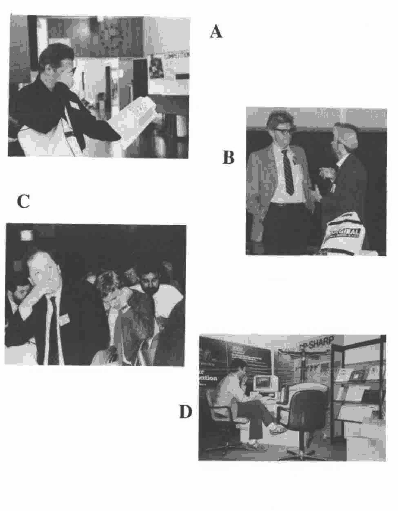

by Dave Ziemann
{ .byline }

The four photographs shown here were all taken at APL86. The competition is to create appropriate or amusing captions for one or more of them. You may submit at most one caption for each photograph. The authors of the two best captions, in the judges’ opinions, will share the equivalent of fifty pounds in prize money. The best captions will be published.

Be sure to label each caption with one of the letters A, B, C or D. Entries received after 31st December 1986 may not be considered eligible.

## Photo Caption Competition

