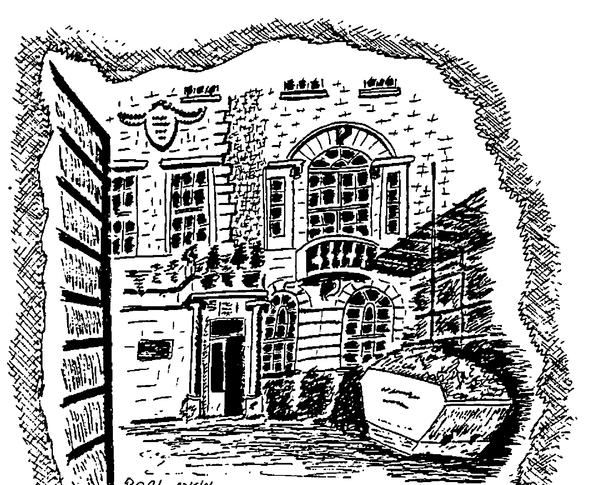

by Adrian Smith
{ .byline }

For once I have had the luxury of being able to use my own notes! The AGM at the Royal Over-Seas League was a stimulating and enjoyable technical meeting, as well as fulfilling its more formal role. In particular we were fortunate to get a pre-run of Ken Iverson’s APL86 talk on ‘The Split in APL’; I am including comprehensive notes on this, because it was in fact a very different (more technical) presentation from his APL86 plenary (for full details see the Tutorial volume of the Conference Proceedings).

